# Project, Part II - Intelligent Storage System

## Cover Page

### University of Costa Rica

* **Technological Infrastructure Integration CI-0138**
* **Project, Part II - Intelligent Storage System**
* **Professor:** Ariel Mora Jiménez
* **Student:** Anderson Vargas Navarro - C28183
* **2nd semester, 2025**
* **Group:** 001

---

## **Project, Part II - Intelligent Storage System**

### General Description

This project consists of defining, provisioning, and configuring the computational, network, and other resources required by a technological infrastructure service, implemented with virtual resources in the Computational Academic Cloud. For the project, open-source software will be used and a basic version (prototype) of a web service will be implemented, in order to validate the established network configuration and the operation of the service.

### General Objective

Build and integrate the computational, network, and other resources required by a
technological infrastructure service implemented in a virtual mini data center.

### Specific Objectives

1. Implement a simple web service through an architecture, to be published on the NAC.
2. Describe the service architecture, taking the ISO/IEC/IEEE42010 standard as reference.
3. Define the topology and appropriate network addressing to host the service.
4. Define an architecture for service security.
5. Define a basic infrastructure for service management, through internal and external communication channels.

### Service Characteristics and Requirements

The service to install is an application for documentation management in a data center infrastructure. There are two options for the service to install in simple version, from which only one must be selected to perform the task:

1. The NetBox application implemented in Python with a PostgreSQL database.
2. The GLPI application implemented in PHP with a MariaDB database.

The following describes the initial requirements for creating the service:

1. *Technological infrastructure*: the service must be implemented entirely using the NAC platform. The virtual machines for the web service and the database must be hosted in the virtual mini data center infrastructure previously built in this course. For virtual machine provisioning, SAN service storage (i.e., iSCSI) must be used. For storing ISO images, installers, and other working files within the hypervisor, NAS-type storage must be used. All infrastructure components, including the mini data center, must have the latest software updates available from the corresponding manufacturer installed.
2. *Base image for servers*: all service servers must be installed from at least one initial installation, which we will call a base image; that is, an installation that will be duplicated to obtain the service servers, using the Rocky Linux 9 distribution or higher. The base image and all servers generated from it must have the latest software updates available from the corresponding manufacturer installed.
3. *Web server*: the web server to use will be Apache or Nginx as the main server or as a reverse proxy. The web server will provide the external or visible layer of the service.
4. *Database*: the database server to use will be PostgreSQL or MariaDB (depending on the selected application to install) in its most current stable version, and a single instance of it will be installed on an independent virtual machine. The database server provides part of the internal layer of the service.
5. *Other components*: the installation of other components must be considered, depending on the application selected, such as cache systems, language-specific tools, etc.

### Architecture, Security, and Management Considerations

During the implementation of the service and for its subsequent operation, management, and monitoring, the following aspects must be considered:

1. *Architecture documentation*: the architecture(s) of the service must be documented, including at least the service servers, security, and management, with a level of detail such that the document can be used by a third party to continue the project.
2. *Network configuration aspects*: the network address assigned to the service publication must be accessible from any point on the UCR internal network. The network address assigned for service management must also be accessible from the UCR internal network, but incorporating additional mechanisms to prevent the entry of non-administrator users. The publication and management network addresses of the service must be different. All network addresses assigned to web and database equipment, for internal communication between services, must be private and not directly accessible from any network other than one internal to the service.
3. *Virtual machine security*: both the base image(s) and the service equipment must be installed by defining security considerations (objectives) and the corresponding controls (hardening) that support the risk analysis.
4. *Network security*: appropriate requirements and controls must be established to regulate network traffic from, to, and between service components.
5. *Database and stored component security*: appropriate requirements and controls must be established for the information contained in the service, whether configuration or information from the service's own operation.
6. *Installation documentation*: the installation and component integration procedures must be documented, with a level of detail such that the document can be used by a third party to reproduce the implementation procedure.
7. *Service management*: the available mechanisms for service management (e.g. SSH) must be separated, at the network interface and data packet level, from the channels through which the service will be provided to users. Considerations must be established to appropriately safeguard the connection to management ports.
8. *Service use*: after installing the application, in either of the two available options, it must be used to implement a digital documentation of the mini data center infrastructure (ESXi, TrueNAS), as well as of the service itself implemented in this task. That is, the task must serve as a tool to document itself.

---

## Service Architecture Description

### General Description of the Service Architecture

#### General Service Description

This section will introductorily address the general characteristics of the application service to be implemented, identifying the stakeholders and their concerns, in order to establish the main elements that make up the service architecture and its relationship with the technological environment.

#### General Service Characteristics

The GLPI (Gestionnaire Libre de Parc Informatique) resource management and technical support service will be implemented as a centralized solution for incident management, inventory, and service requests within the institutional environment.
The service architecture is based on a multi-layer client-server model, consisting of:

* **Presentation layer:** managed by an **Nginx** server configured to offer the GLPI service through the secure **HTTPS** protocol.
* **Application layer:** consisting of the **PHP-FPM** engine, responsible for processing the business logic of the GLPI system.
* **Data layer:** implemented with **MariaDB**, hosted on an independent server, which provides persistent and secure storage for system information.
* **Management and maintenance layer:** accessible only to service administrators through internal management channels protected by authentication mechanisms and a private network.

The service will be implemented on virtual servers using Rocky Linux 9 as the base operating system, with a network environment divided into independent subnets for service publication, internal communication, and administrative management.
The proposed architecture aims to guarantee the availability, integrity, and confidentiality of information, as well as the ease of maintenance and scalability of the system.

#### Stakeholders

At this stage, the main actors directly involved in the implementation, operation, and use of the GLPI service are identified.

* **Developers & Builders:** responsible for the installation, configuration, and deployment of the service. They define the network topology, web services, and database server configuration.
* **Operators & Maintainers:** in charge of the daily administration of the system, access control, monitoring, data backup, and application of updates.
* **End users:** employees or technicians who access the GLPI portal through a web browser to register incidents, consult requests, or manage inventory.

#### Concerns

This section details the specific concerns of the stakeholders.

##### Developers & Builders

* How is it ensured that the *reverse proxy* efficiently manages HTTPS connections, maintaining a balance between security, performance, and service scalability?
* How is secure and efficient communication achieved between the different layers (presentation, application, and data), ensuring network isolation and minimal exposure of internal services?
* What segmentation and traffic control strategies are implemented to restrict communication only to the necessary elements of the service?
* How is the central administration machine on the NAT network configured and protected to manage the other VMs without exposing administration services to the outside?
* How is it ensured that internal VMs maintain Internet access exclusively through NAT translation, avoiding direct or unauthorized connections?
* What authentication, permission, and logging mechanisms are applied to administrative interfaces to prevent improper access or untraceable manipulations?

##### Operators & Maintainers

* How will comprehensive service monitoring be carried out from the central administration VM, supervising the status of the *reverse proxy*, the application server load, and the availability of the database engine?
* What alerting and logging mechanisms will be implemented to detect failures, anomalies, or unauthorized access attempts in any of the system layers?
* How will the update of critical components (Nginx, PHP-FPM, GLPI, MariaDB, and the base operating system) be managed securely, minimizing service downtime?
* How will *log* collection and analysis be done to allow security audits and rapid incident diagnosis?
* How will it be ensured that administrative tasks (backup, restoration, and preventive maintenance) can be performed only from the administration network, without interfering with the application or database networks?

##### End Users

* How is the continuous availability of the GLPI service guaranteed, ensuring that users can access it at all times, even during planned maintenance or updates?
* How is the confidentiality of credentials and personal information protected through encrypted channels (HTTPS) and secure authentication policies?
* How is the consistency and integrity of data stored in the database ensured, avoiding loss or corruption due to network failures or unexpected restarts?
* How is the authentication and authorization of different types of users within the system (administrators, technicians, requesters) managed, ensuring that each role accesses only the information that belongs to them?

#### System Context Diagram (C4 - Level 1)

To represent the high-level architecture of the service, a C4 Diagram – Level 1 (System Context) is used, which shows the main elements and the relationships between them.

##### Main Diagram Components (C4 - Level 1)

1. **End users (Web Clients):** access GLPI through a browser using HTTPS.
2. **Web Server / Proxy:** receives HTTP/HTTPS requests and acts as the presentation layer; may include load balancing or reverse proxy.
3. **Application Server:** processes the system logic, stores configuration information, users, incidents, and inventory.
4. **Public network (Publication Zone):** channel through which users access the service.
5. **Management network (Administration Zone):** used exclusively by operators and administrators for maintenance tasks.

##### Relationships Between Components (C4 - Level 1)

* **End users** send HTTPS requests to the Web Server.
* The **Web Server** forwards processing requests to the Application Server.
* The **Application Server** receives, executes, and returns queries and transactions.
* **Administrators** connect via SSH to the management server for maintenance operations.

.jpg)

---

### Network Topology and Addressing

#### General Topology Description

The GLPI service infrastructure is deployed on a virtualized environment consisting of **four virtual machines**, each with a clearly defined role within the architecture:

1. **Web Server / Reverse Proxy (Nginx)**
    Acts as the service entry point, publishing the GLPI interface to the institutional network using the secure **HTTPS** protocol. It manages incoming connections and redirects traffic to the application server.

2. **Application Server (PHP-FPM + GLPI):**

    Hosts the GLPI processing engine, executing the system logic, handling requests from the reverse proxy and communicating with the database.

3. **Database Server (MariaDB):**

    Responsible for the persistent and secure storage of GLPI system information. This server is isolated on an internal network to reduce the attack surface.

4. **Administration Server (NAT VM):**

  Virtual machine used exclusively for service management and maintenance tasks. Additionally, this *vm* uses a **NAT network**, which allows it to access the Internet to obtain updates without directly exposing the production servers.

#### Networks Defined in the Architecture

##### External Network (External Network)

* **Objective:** allow internal users to access the GLPI service via HTTPS, and allow administrators to SSH into the internal network from the NAT *vm*.
* **Access:** only to the Reverse Proxy and Administration/NAT server.
* **Restrictions:** the application and database are not accessible from this network.
* **Network range:**

  * `172.24.133.216` (Administration) and `172.24.133.218` (Reverse Proxy)

##### Internal Network (Internal Network)

* **Objective:** centralized point to manage all VMs as well as access from internal servers to the internet.
* **Access:**

  * SSH to each server
  * *vms* within the network have controlled Internet access through NAT, enabling secure updates.
  * **Network range:**
  * `192.168.216.0/24`

##### Database Network (DB Network)

* **Objective:** secure connection between the application server and MariaDB.
* **Restrictions:**

  * Only the application server can connect to the database server.
  * It has no direct access from the public network.
  * No port is exposed outside this network.

* **Network range:**

  * `192.168.217.0/24`

##### Application Network (App Network)

* **Objective:** allow communication between the application and the reverse proxy.
* **Access:** Only the application server can connect to the reverse proxy server through this network.
* **Network range:**

  * `192.168.218.0/24`

#### IP Addressing per Virtual Machine

| Server                 | Function       | Public IP        | *Internal Network* IP | *DB Network* IP | *App Network* IP |
| ---------------------- | -------------- | ---------------- | --------------------- | --------------- | ---------------- |
| Administration         | SSH Management | `172.24.133.216` | `192.168.216.1`       | —               | —                |
| Database               | MariaDB        | —                | `192.168.216.2`       | `192.168.217.1` | —                |
| Application Server     | PHP-FPM + GLPI | —                | `192.168.216.3`       | `192.168.217.2` | `192.168.218.2`  |
| Reverse Proxy          | Nginx HTTPS    | `172.24.133.218` | `192.168.216.4`       | —               | `192.168.218.1`  |

#### Firewall Rules

The infrastructure uses *firewalld* with custom zones and specific rules to ensure strictly controlled communication between components. Each server has several interfaces associated with different zones according to their function and level of exposure.

##### Administration/NAT Server

* Zone `external` (*ens160*)

  * Allowed services:
    * `ssh`
  * Additional functions:
    * `forward` enabled
    * `masquerade` enabled (NAT translation for Internet outbound)

* Zone `internal` (*ens224*)

  * Allowed services:
    * `ssh` (internal management to other VMs)

* Policy `internal-external`

  * `ingress-zones`: `internal`
  * `egress-zones`: `external`
  * `masquerade: yes`

##### Database Server

* Zone `internal` (*ens160*)

  * Allowed services:
    * `ssh`

* Zone `database` (*ens224*)

  * *Rich rule*:

```ini
rule family="ipv4" source address="192.168.217.2" service name="mysql" accept
```

##### Application Server

* Zone `internal` (*ens160*)

  * Allowed service:
    * `ssh`

* Zone `database` (*ens224*)

  * *Rich rule*:

```ini
rule family="ipv4" destination address="192.168.217.1" service name="mysql" accept
```

* Zone `application` (*ens256*):

  * *Rich rule*:

```ini
rule family="ipv4" source address="192.168.218.1" service name="http" accept
```

##### Reverse Proxy Server

* Zone `public` (*ens256*)

  * Allowed services:
    * `https`

* Zone `application` (*ens224*)

  * *Rich rule*:

```ini
rule family="ipv4" destination address="192.168.218.2" service name="http" accept
```

* Zone `internal` (*ens160*)

  * Allowed service:
    * `ssh`

#### Switches and Port Groups

The hypervisor has *vSwitches* and *Port Groups* defined that allow logical and physical segmentation of communication between layers. This separation is fundamental for security and the correct operation of the service.

| **vSwitch / Port Group**                | **Description**                                                     | **Connected to**                                                           | **Uplink** |
| --------------------------------------- | ------------------------------------------------------------------- | -------------------------------------------------------------------------- | ---------- |
| **vExternalNetwork / External_Network** | Publication network accessible from the institutional intranet.     | Reverse Proxy (ens256)                                                     | vmnic3     |
| **vInternalNetwork / Internal_Network** | Internal administration network between VMs.                        | Administration (ens224), App (ens160), DB (ens160), Reverse Proxy (ens160) | —          |
| **vDBNetwork / DB_Network**             | Dedicated network for communication between Application ↔ Database. | App (ens224), BD (ens224)                                                  | —          |
| **vAppNetwork / App_Network**           | Network for communication between Reverse Proxy ↔ Application.      | Reverse Proxy (ens224), App (ens256)                                       | —          |
|                                         |                                                                     |                                                                            |            |

#### Physical Topology Diagram (C4 - Level 3)

To represent the physical and logical distribution of the GLPI service infrastructure, a C4 Diagram – Level 3 (Deployment) is used. This diagram shows how the system components are deployed on the virtual machines, how they connect to each other through segmented networks, and which interfaces each node uses.

##### Main Diagram Components (C4 - Level 3)

1. **Reverse Proxy Server (Nginx – HTTPS):**
   * System entry point.
   * Exposes the GLPI service only on the external network via HTTPS.
   * Redirects requests to the application server through the application network.

2. **Application Server (PHP-FPM + GLPI):**
   * Executes the system's business logic.
   * Receives requests from the reverse proxy.
   * Communicates with the database server to perform queries.

3. **Database Server (MariaDB):**
   * Hosts the persistent information of the GLPI system.
   * Only accepts internal connections from the application server.
   * Does not expose services on external networks.

4. **Administration Server (NAT VM):**
   * Used exclusively for management, monitoring, and maintenance tasks.
   * Accesses other servers via the internal network through SSH.
   * Its NAT interface allows Internet access for updates without exposing services.

5. **vExternalNetwork (external vSwitch):**

   * Connected to the uplink (vmnic3) towards the public network.
   * Carries HTTPS traffic to/from the Internet.
   * Connected only to the Reverse Proxy.

6. **vInternalNetwork:**
   * Internal administration network.
   * Used for SSH access between servers.
   * Connected to the Proxy, Application, Database, and Administration/NAT.

7. **vDBNetwork:**
   * Network dedicated exclusively to database traffic.
   * Connects the Application Server with the Database Server.

8. **vAppNetwork:**
   * Internal network where the Reverse Proxy communicates with the Application Server.
   * Connects **Reverse Proxy** and **Application Server**.

##### Relationships Between Components (C4 - Level 3)

* The **Reverse Proxy**:

  * Receives HTTPS requests from the **External Network**.
  * Forwards HTTP traffic to the **Application Server** through the **App Network**.

* The **Application Server**:

  * Processes requests from the Reverse Proxy.
  * Makes SQL queries to the **Database Server** through the **DB Network**.

* The **Database Server**:

  * Only accepts connections from the Application Server's IP.
  * Does not interact with the external or application network.

* The **Administration VM**:

  * Connects via SSH to other servers through the **Internal Network**.
  * Provides Internet access via NAT for updates.
  * Does not participate in the GLPI service request flow.

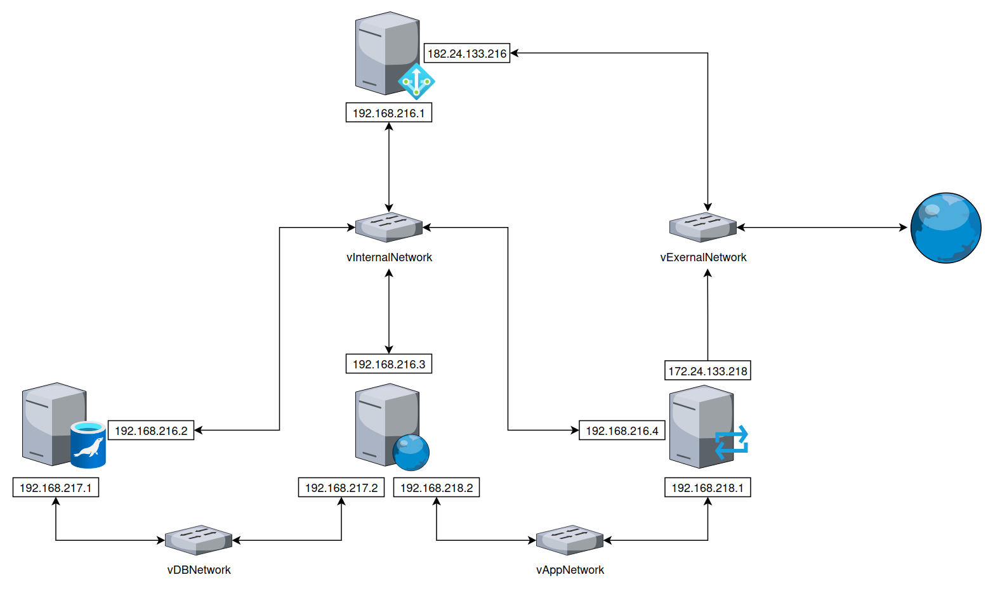

---

### Service Security Architecture

The security architecture implemented for the GLPI service is based on the principles of segmentation, least privilege, end-to-end encryption, and hardening of all nodes. The main objective is to reduce the attack surface and guarantee the availability, integrity, and confidentiality of the data handled by the platform.

#### Operating System Security

All virtual machines are deployed on **Rocky Linux 9** as the base operating system, applying the following measures:

* **Updated system:** `dnf update` is run before configuring any service to ensure the installation of recent security patches.
* **System hardening:**

  * Removal of unnecessary packages and unused services.
  * Strict configuration of `firewalld` with zones separated by function.
  * Implementation of **Fail2ban** to protect exposed services such as SSH.
  * **SELinux** in *enforcing* mode with policies adjusted to each service.

* **Controlled privileged access:**

  * Only SSH access with keys is allowed.
  * Root login via SSH is disabled.

#### Network Security

Network security is based on zone isolation and granular traffic control.

##### Network Segmentation

Different virtual networks are used to separate critical functions:

* **Public network:** used exclusively by the Reverse Proxy.
* **Application network:** internal communication between Proxy and application server.
* **Database network:** exclusive for MySQL queries.
* **Administration network:** internal network for SSH and maintenance.

##### Implemented Controls

* **Mandatory HTTPS encryption** at the entry point (Nginx).
* **Zone-based firewall**, so that each interface belongs to a zone according to its role.
* **Rich rules** applied to:

  * Allow only HTTP/HTTPS traffic from external zones to the Proxy.
  * Restrict MySQL so that only the Application Server can connect.
  * Block lateral traffic between servers that do not require it.

#### Database Security

The database server (MariaDB) runs in isolation and with specific controls:

* **Listens on an exclusive private interface**, avoiding public exposure.
* **Dedicated user for GLPI**, with minimum permissions.
* **Access restriction** to a single authorized IP.
* **Strong password policies**.

---

## Implementation


---

### Network Address Translation (NAT) Configuration

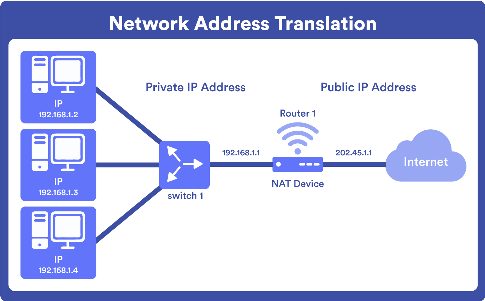

#### Exporting the *golden image* to *ESXi*

This section will export the *golden image* created in a previous lab; to do this, a version compatible with the *ESXi* hypervisor will be exported from *VMWare Workstation* in the *ovf* format, subsequently using the *OVF Tool* as a resource.

##### Exporting in *OVF* Format

1. In the *VM > Manage > Change Hardware Compatibility Wizard* section.

    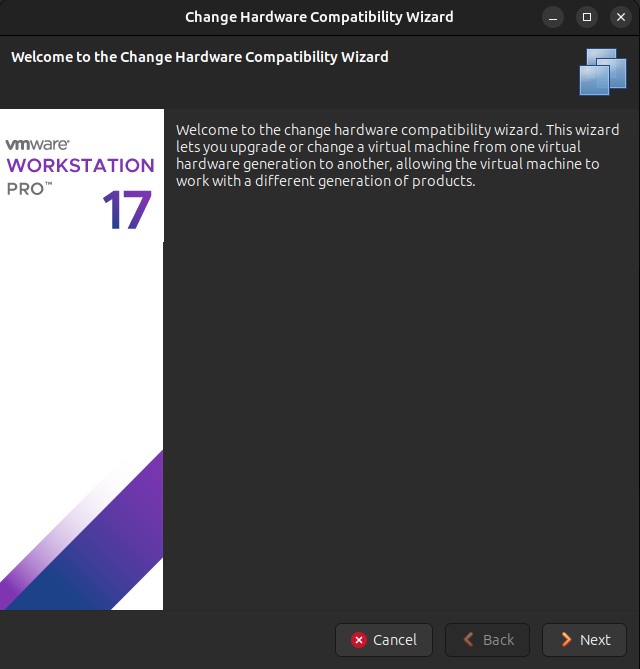

2. Select the version compatible with *ESXi*.

   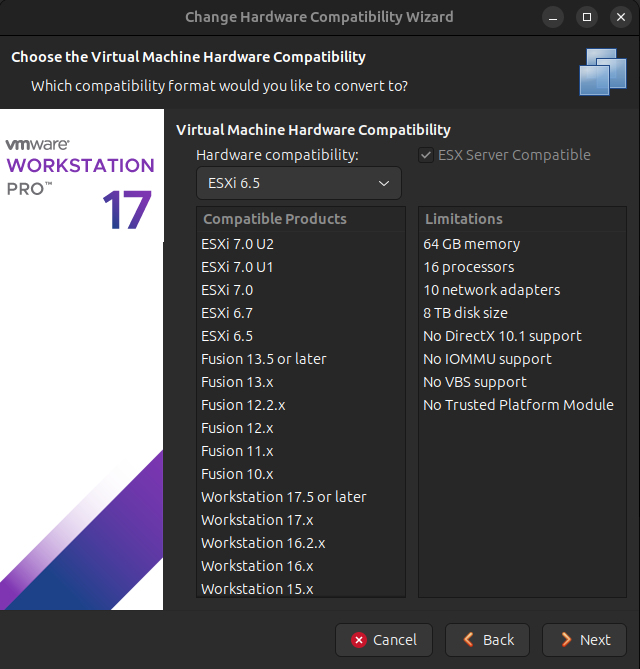

3. After the cloning operation was performed, in the *File > Export to OVF* section, export in *ovf* format.

##### Installing *OVF Tool*

1. Install according to the OS, in this case Linux from [OVF Tool](https://developer.broadcom.com/tools/open-virtualization-format-ovf-tool/latest).
2. After downloading the compressed installer in *.zip*, decompress it with.

    ```sh
    unzip VMware-ovftool-5.0.0-24781994-lin.x86_64.zip -d ~ovftool
    ```

3. Configure the PATH Variable by opening the file.

    ```sh
    nano ~/.bashrc
    ```

   * Add the following path to the file

    ```sh
    export PATH="$PATH:$HOME/ovftool"
    ```

   * Save the changes.

    ```sh
    source ~/.bashrc
    ```

4. Verify the installation.

    ```sh
    ovftool --version
    ```

   * Output obtained.

      ```sh
      VMware ovftool 4.6.3 (build-24031167)
      ```

##### Exporting the *golden_image* to *ESXi*

1. Upload the *.ovf* file using the following command.

    ```sh
    ovftool \
      --noSSLVerify \
      --datastore="san_data" \
      --name="MiVM" \
      --diskMode=thin \
      "/RockyServer9.ovf" \
      "vi://root@172.24.131.196/"
    ```

    > NOTE: The error "Invalid configuration for device '2'.' for property 'VirtualVideoCard.videoRamSizeInKB" occurred.

2. To fix the error, the `RockyServer9.ovf` file must be edited.

    ```sh
    sudo nano RockyServer9.ovf
    ```

   * Delete the line.

    ```sh
    <vmw:Config ovf:required="false" vmw:key="videoRamSizeInKB" vmw:value="262144"/>
    ```

3. Run the command again, but with certain changes.

    ```sh
    ovftool \
      --skipManifestCheck \
      --lax \
      --noSSLVerify \
      --datastore="san_data" \
      --name="MiVM" \
      --diskMode=thin \
      "/home/general/Documents/UCR/2025-Semestre-II/Infrastructure/projects/partII/golden_image/RockyServer9.ovf" \
      "vi://root@172.24.131.196/"
    ```

   * `--lax` **Error tolerance** (Lax parsing): This option instructs `ovftool` to ignore certain **minor errors or inconsistencies** in the format of the `.ovf` or `.vmx` file and continue with the deployment process.
   * `--skipManifestCheck` **Skip manifest verification**: The **manifest** (`.mf`) is a security file that contains checksums/hashes of all files in the package (such as the `.ovf` and the `.vmdk` disk). `ovftool` uses the manifest to **verify the integrity** of the files.

   * Output obtained.

    ```sh
    Transfer Completed
    Warning:
    - The manifest is present but user flag causing to skip it
    Completed successfully
    ```

##### Verification inside ESXi

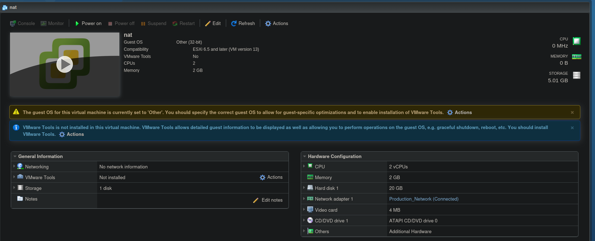

1. Fix the warning by adding the *Guest OS* as *Linux* and the *Guest OS Version* as a version close to that of the vm, in this case *Red Hat Enterprise Linux 7 (64 bits)*.

    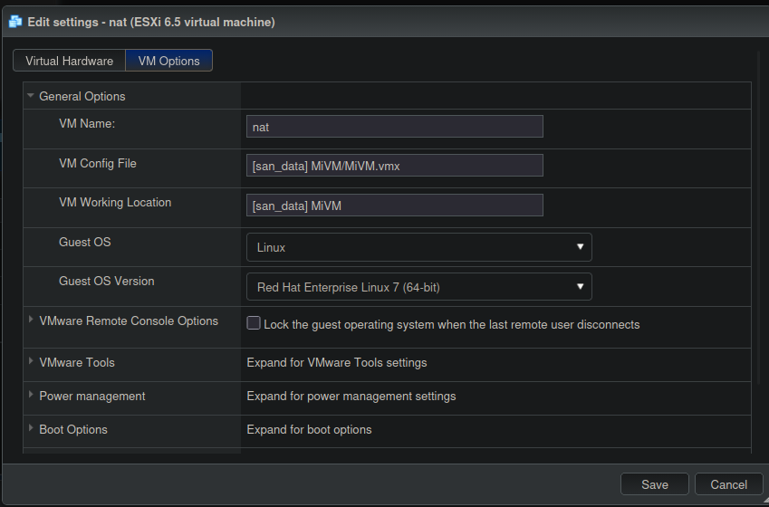

#### Create the *vSwitch* for the external network

1. Go to the *Networking > Virtual switches* section.

    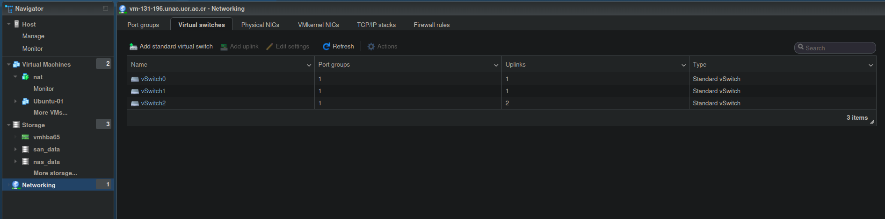

2. From *vSwitch2*, remove the *vmnic3* it has (in this project, only *vmnic3* will be used for now). Then in the *vSwitch2 > Actions > Edit Settings* section, click the `X` to remove the *uplink 2* it has.

    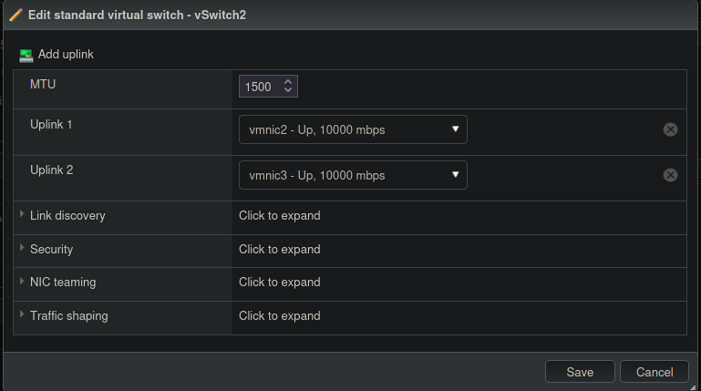

    * After the change.
    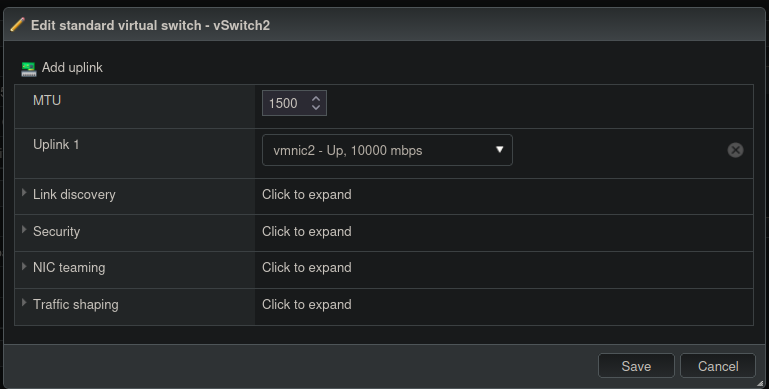

3. After removing *vmnic3* from *vSwitch2*, proceed to create a new *vSwitch* (*vExternalNetwork*).

    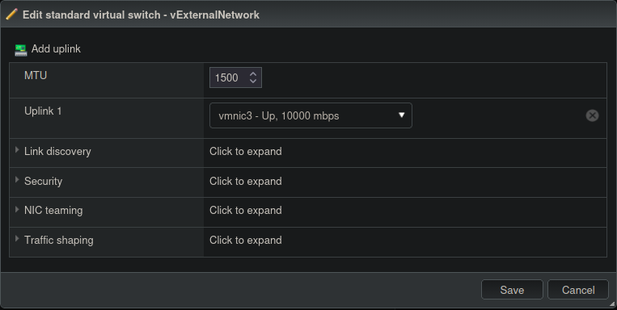

#### Creating the *Port Group* for the external network

1. In the *Networking > Port Groups* section, click the `Add port group` option.

    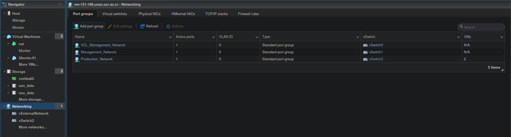

2. Create the *port group* *External_Network* in the *Virtual Switch* *vExternalNetwork*.

    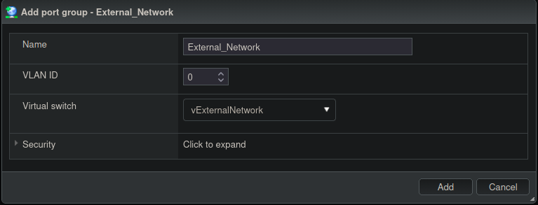

#### Change the new network adapter on the NAT *vm*

1. In the *Virtual Machines > nat > Actions > Edit settings* section.

    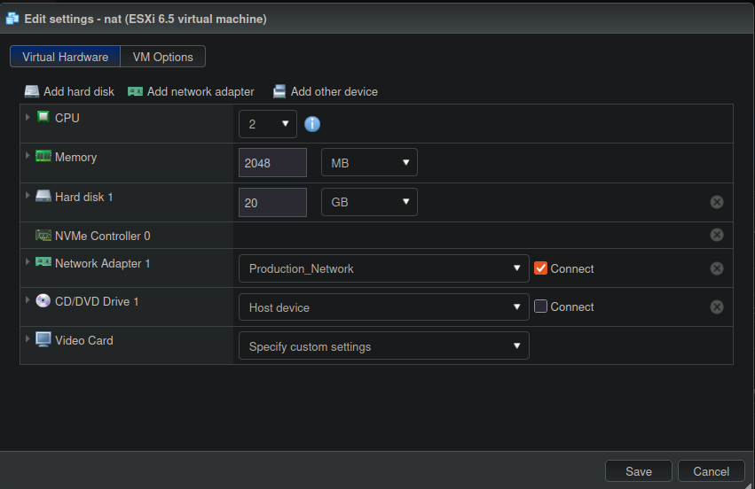

    * Change *Network Adapter 1* to *External_Network*.

    

#### Assign the public IP to the NAT *vm*

1. Inside the NAT *vm*, enter the `nmtui` command.

    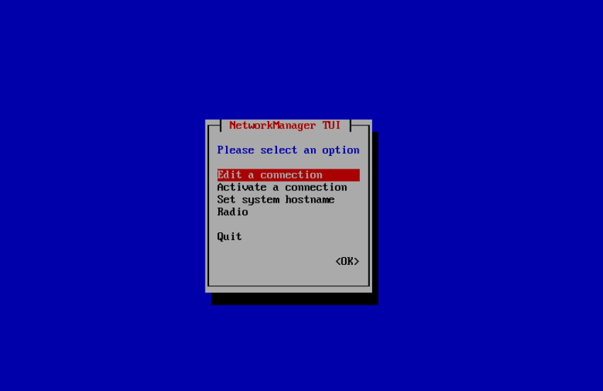

2. Click the `Edit a connection` option.

    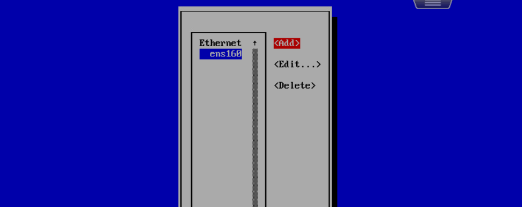

3. Select the `<Edit>` option.

    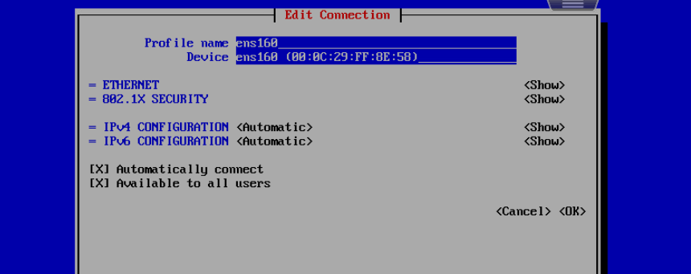

4. Manually add the IPv4 and disable IPv6. Assign a public IP from those that were assigned, also add the public network *Gateway*, and the *DNS*.

    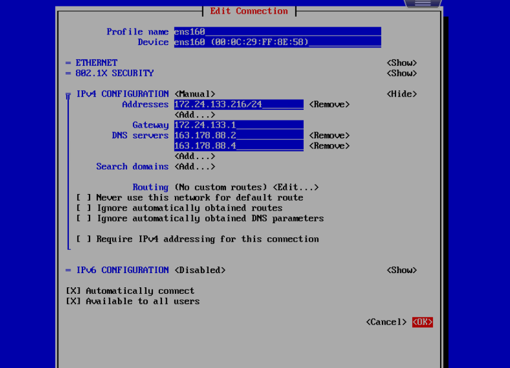

5. Then in the `Activate a connection` section, deactivate and reactivate it.

    

6. Verify with the `ip a` command.

    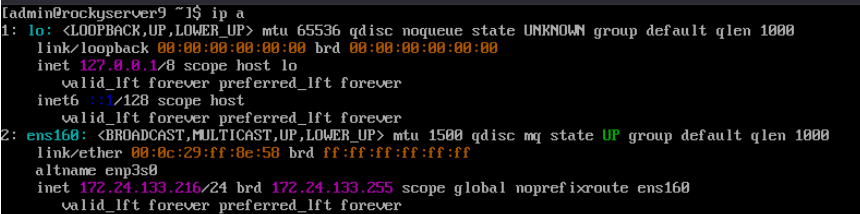

7. Also verify by doing `ping 8.8.8.8` to check the Internet connection.

    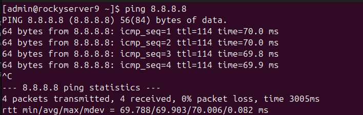

8. Also, `VMware Tools` must be installed.

    ```sh
    sudo dnf install open-vm-tools
    ```

    * Enable it with.

    ```sh
    sudo systemctl enable --now vmtoolsd
    ```

### Change Hostname and Password

#### Change Hostname

1. Check the current Hostname.

    ```sh
    hostnamectl
    ```

   * Output

    ```sh
    Static hostname: rockyserver9
          Icon name: computer-vm
            Chassis: vm 🖴
          Machine ID: b107111389644127b0bf435ec037baf6
            Boot ID: b411411319ea4551862ca3e7af4e06f1
      Virtualization: vmware
    Operating System: Rocky Linux 9.6 (Blue Onyx)
        CPE OS Name: cpe:/o:rocky:rocky:9::baseos
              Kernel: Linux 5.14.0-570.33.2.el9_6.x86_64
        Architecture: x86-64
    Hardware Vendor: VMware, Inc.
      Hardware Model: VMware Virtual Platform
    Firmware Version: 6.00
    ```

2. Change the Hostname.

    ```sh
    sudo hostnamectl set-hostname nat
    ```

   * Verify the change.

    ```sh
    hostnamectl
    ```

   * Output.

    ```sh
    Static hostname: nat
          Icon name: computer-vm
            Chassis: vm 🖴
          Machine ID: b107111389644127b0bf435ec037baf6
            Boot ID: b411411319ea4551862ca3e7af4e06f1
      Virtualization: vmware
    Operating System: Rocky Linux 9.6 (Blue Onyx)
        CPE OS Name: cpe:/o:rocky:rocky:9::baseos
              Kernel: Linux 5.14.0-570.33.2.el9_6.x86_64
        Architecture: x86-64
    Hardware Vendor: VMware, Inc.
      Hardware Model: VMware Virtual Platform
    Firmware Version: 6.00
    ```

3. Update the `/etc/hosts` file.

    ```sh
    sudo nano /etc/hosts
    ```

   * Add the line.

    ```sh
    127.0.1.1 nat
    ```

#### Change Password

1. Type the command.

    ```sh
    passwd
    ```

2. Type the new password.

#### Clone a *golden_image* for the Application and Database *vm*

1. Before this, create a new *vSwitch* called *vInternalNetwork* without an uplink, with a new *port group* named `Internal_Network`.

    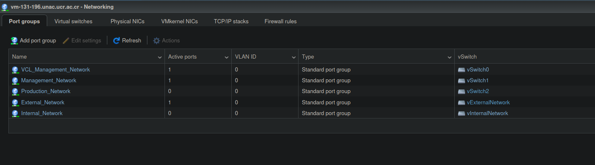

2. Upload the new application *vm* to *ESXi*.

    ```sh
    ovftool \
      --skipManifestCheck \
      --lax \
      --noSSLVerify \
      --datastore="san_data" \
      --name="app" \
      --diskMode=thin \
      --net:"nat"="Internal_Network" \
      "/home/general/Documents/UCR/2025-Semestre-II/Infrastructure/projects/partII/golden_image/RockyServer9.ovf" \
      "vi://root@172.24.131.196/"
    ```

3. Upload the new database *vm* to *ESXi*.

    ```sh
    ovftool \
      --skipManifestCheck \
      --lax \
      --noSSLVerify \
      --datastore="san_data" \
      --name="db" \
      --diskMode=thin \
      --net:"nat"="Internal_Network" \
      "/home/general/Documents/UCR/2025-Semestre-II/Infrastructure/projects/partII/golden_image/RockyServer9.ovf" \
      "vi://root@172.24.131.196/"
    ```

#### Internal network configuration (NAT)

#### Assign a private IP to the NAT *vm*

1. Add a new *Internal_Network* network adapter to the NAT *vm*.

    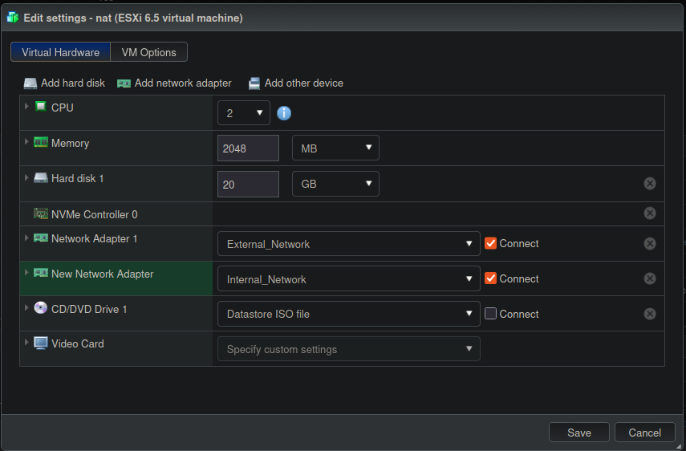

    * Verify that the new interface was added.

    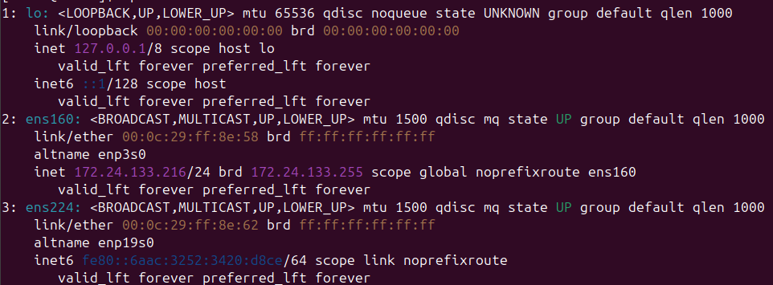

2. Assign a private IP to the network interface.

    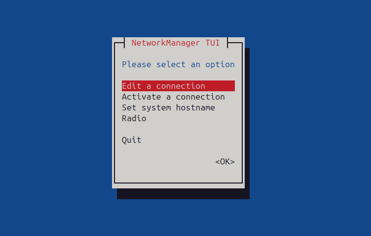
            * IP 1 is assigned from the internal network 192.168.216.0/24 because it will do the routing; also without a *Gateway* since the same *vm* will act as one, and without using it as a *default gateway*.

    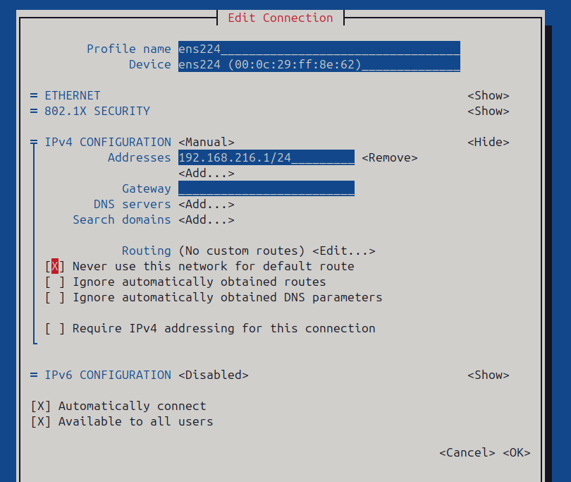

    * Verify that an IP was added to the *ens224* interface.
    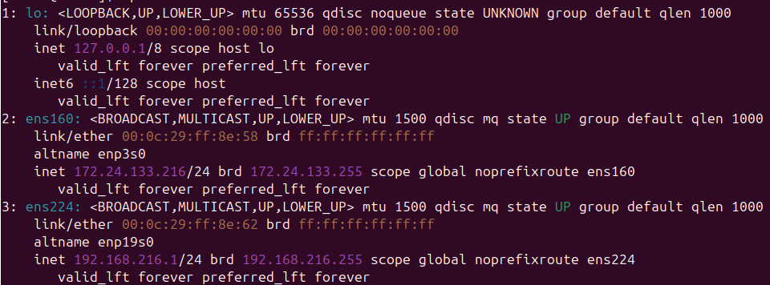

#### Configure firewall zones on the NAT *vm*

1. When running the command to see the interfaces in the default zone, in this case the public zone.

    ```sh
    sudo firewall-cmd --list-all
    ```

   * Output obtained.

    ```sh
    public (active)
      target: default
      icmp-block-inversion: no
      interfaces: ens160 ens224
      sources:
      services: ssh
      ports:
      protocols:
      forward: yes
      masquerade: no
      forward-ports:
      source-ports:
      icmp-blocks:
      rich rules:
    ```

   * As can be seen, both interfaces are in this zone.
   * As can be seen, both interfaces are in this zone.

2. First, move the *ens160* interface to the *external* zone.

    ```sh
    sudo firewall-cmd --add-interface=ens160 --zone=external --permanent
    ```

3. Move the `ens224` interface to the `internal` zone:

    ```sh
    sudo firewall-cmd --add-interface=ens224 --zone=internal --permanent
    ```

4. Reload the firewall configuration:

    ```sh
    sudo firewall-cmd --reload
    ```

5. Verify the `external` and `internal` zones.

   * Zone `external`:

    ```sh
    sudo firewall-cmd --list-all --zone=external
    ```

   * Output:

    ```sh
    external (active)
      target: default
      icmp-block-inversion: no
      interfaces: ens160
      sources:
      services: ssh
      ports:
      protocols:
      forward: yes
      masquerade: yes
      forward-ports:
      source-ports:
      icmp-blocks:
      rich rules:
    ```

   * Zone `internal`:

    ```sh
    sudo firewall-cmd --list-all --zone=internal
    ```

    Output:

    ```sh
    internal (active)
      target: default
      icmp-block-inversion: no
      interfaces: ens224
      sources:
      services: cockpit dhcpv6-client mdns samba-client ssh
      ports:
      protocols:
      forward: yes
      masquerade: no
      forward-ports:
      source-ports:
      icmp-blocks:
      rich rules:
    ```

6. Remove unnecessary services from the `internal` zone:

    ```sh
    sudo firewall-cmd --zone=internal --remove-service=cockpit --permanent
    sudo firewall-cmd --zone=internal --remove-service=dhcpv6-client --permanent
    sudo firewall-cmd --zone=internal --remove-service=mdns --permanent
    sudo firewall-cmd --zone=internal --remove-service=samba-client --permanent
    ```

7. Reload the firewall:

    ```sh
    sudo firewall-cmd --reload
    ```

   * Verify status:

    ```sh
    sudo firewall-cmd --zone=internal --list-all
    ```

#### Configure *IP Forwarding* on the NAT *vm*

1. Edit the `/etc/sysctl.d/99-sysctl.conf` file to make the changes persistent, using [IP Forwarding](https://linuxconfig.org/how-to-turn-on-off-ip-forwarding-in-linux) as reference.

    ```sh
    sudo nano /etc/sysctl.d/99-sysctl.conf
    ```

   * Edit or add the line.

    ```ini
    net.ipv4.ip_forward = 1
    ```

2. Apply changes.

    ```sh
    sudo sysctl -p
    ```

   * Verify with.

    ```sh
    cat /proc/sys/net/ipv4/ip_forward
    ```

   * Output.

    ```sh
    1
    ```

#### Configure firewall policies on the NAT *vm*

Using [Firewalld Policies](https://discussion.fedoraproject.org/t/nat-router-with-2-interfaces-how-to-do-with-firewalld-and-centos-9-stream/124488/4) as reference.

1. View active policies.

    ```sh
    sudo firewall-cmd --list-all-policies
    ```

2. Create a new policy.

    ```sh
    sudo firewall-cmd --permanent --new-policy=internal-external
    ```

3. Define how packets coming from that direction will be handled.

    ```sh
    sudo firewall-cmd --permanent --policy=internal-external --set-target=ACCEPT
    ```

4. Add the *masquerade* option.

    ```sh
    sudo firewall-cmd --permanent --policy=internal-external --add-masquerade
    ```

5. Tell the policy what the ingress zone is.

    ```sh
    sudo firewall-cmd --permanent --policy=internal-external --add-ingress-zone=internal
    ```

6. Tell the policy what the egress zone is.

    ```sh
    sudo firewall-cmd --permanent --policy=internal-external --add-egress-zone=external
    ```

7. Reload firewall.

    ```sh
    sudo firewall-cmd --reload
    ```

#### Add private IP to the database *vm*

1. View the interfaces and assigned IPs.

    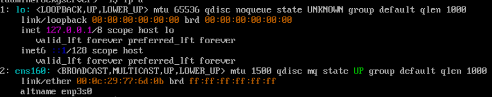

2. Now with `sudo nmtui`, assign a private IP to the *ens160* interface, IP 192.168.216.2/24 with *Gateway* 192.168.216.1 which is the NAT *vm*.

    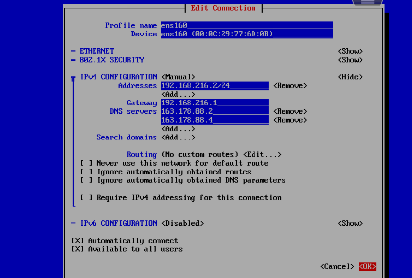

    * Restart the interface.

3. Verify.

    ```sh
    ip route
    ```

    * Output obtained.

    ```sh
    default via 192.168.216.1 dev ens160 proto static metric 100
    192.168.216.0/24 dev ens160 proto kernel scope link src 192.168.216.2 metric 100
    ```

4. Check Internet access.

    ```sh
    ping google.com
    ```

    * Output.

    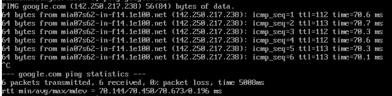

#### Add private IP to the application *vm*

1. View the interfaces and assigned IPs.

    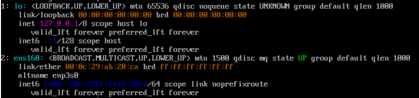

2. Now with `sudo nmtui`, assign a private IP to the *ens160* interface, IP 192.168.216.3/24 with *Gateway* 192.168.216.1 which is the NAT *vm*.

    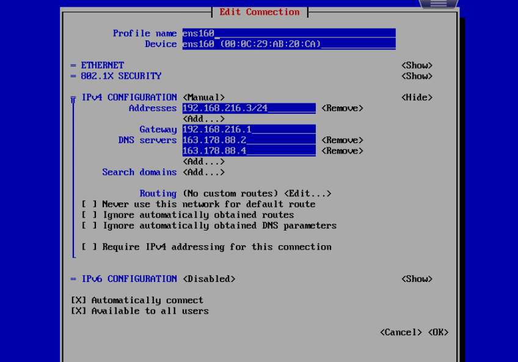

3. Verify.

    ```sh
    ip route
    ```

    * Output obtained.

    ```sh
    default via 192.168.216.1 dev ens160 proto static metric 100
    192.168.216.0/24 dev ens160 proto kernel scope link src 192.168.216.3 metric 100
    ```

4. Check Internet access.

    ```sh
    ping google.com
    ```

    * Output.

    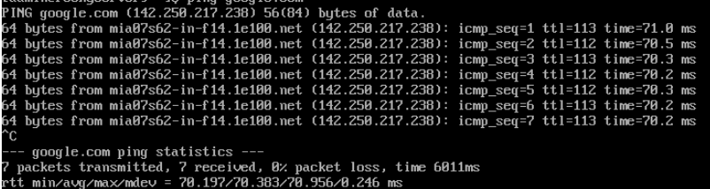

---

### GLPI Requirements

#### Prerequisites

##### Webserver

[**Nginx**](https://nginx.org/) will be used as the web server, a high-performance and efficient solution.
<https://glpi-install.readthedocs.io/en/latest/prerequisites.html#web-server>

###### Nginx Configuration

>Note: The following configuration is suitable only for **GLPI version 10.0.7 or later**.

```ini
server {
    listen 80;
    listen [::]:80;

    server_name glpi.localhost;

    root /var/www/glpi/public;

    location / {
        try_files $uri /index.php$is_args$args;
    }

    location ~ ^/index\.php$ {
        # the following line needs to be adapted, as it changes depending on OS distributions and PHP versions
        fastcgi_pass unix:/run/php/php-fpm.sock;

        fastcgi_split_path_info ^(.+\.php)(/.*)$;
        include fastcgi_params;

        fastcgi_param SCRIPT_FILENAME $document_root$fastcgi_script_name;
    }
}
```

##### PHP

[**PHP**](https://www.php.net/) will be used because it is a fundamental requirement on which GLPI is built. It is the server-side programming language in which the entire application has been developed.
<https://glpi-install.readthedocs.io/en/latest/prerequisites.html#php>

| GLPI version | Minimum PHP version |
| ------------ | ------------------- |
| 10.0.X       | 7.4                 |
| 11.0.X       | 8.2                 |

> Note: GLPI compatibility with new PHP versions is validated shortly after their release. Using the most recent version is recommended for best performance.

**Required PHP Extensions**
The following extensions are required for GLPI to function:

* `dom`, `fileinfo`, `filter`, `libxml`, `simplexml`, `tokenizer`, `xmlreader`, `xmlwriter` (used for various operations, enabled by default).
* `curl` (access to remote resources, marketplace, agents).
* `gd` (image handling).
* `intl` (internationalization).
* `mysqli` (database connection).
* `session` (session support).
* `zlib` (compressed communication with agents, gzip packages, PDF).

###### Additional Extensions for GLPI 11.0

* `bcmath` (QR code generation).
* `mbstring` (multibyte support and *charset* conversion).
* `openssl` (encrypted communication and OAuth 2.0 authentication).

##### Database

GLPI officially supports [MySQL](https://dev.mysql.com) and [MariaDB](https://mariadb.com) database servers. For this implementation, **MySQL** has been selected.
<https://glpi-install.readthedocs.io/en/latest/prerequisites.html#database>

|GLPI version|Database server|Minimum version|
|---|---|---|
|10.0.X|MySQL|5.7|
|10.0.X|MariaDB|10.2|
|11.0.X|MySQL|8.0|
|11.0.X|MariaDB|10.6|

> Note: Using a recent LTS (Long-Term Support) version of the database server is recommended for optimal performance and stability.

#### Requirements

There are no official minimum or maximum hardware requirements, as the infrastructure sizing depends directly on the workload. From the *vm* point of view mentioned in the [forum](https://forum.glpi-project.org/viewtopic.php?id=287005), the recommendations are very similar to those of the *vm* on which it will be installed.

---

### Database Configuration

#### Create database network

1. Create a new *vSwitch* without *uplink* for the database network *vDBNetwork*.

    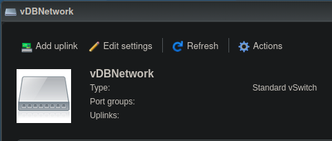

2. Create a new *Port Group* for the *vDBNetwork*, named *DB_Network*.

    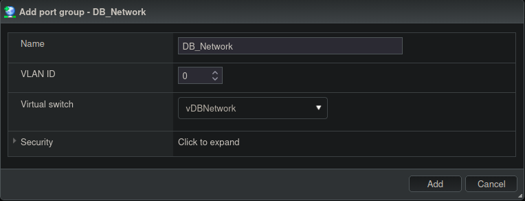
    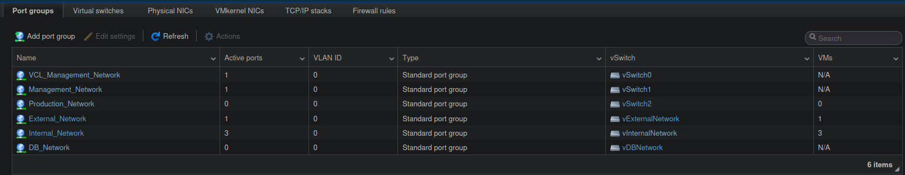

3. Add the new network interface to the database *vm*.

    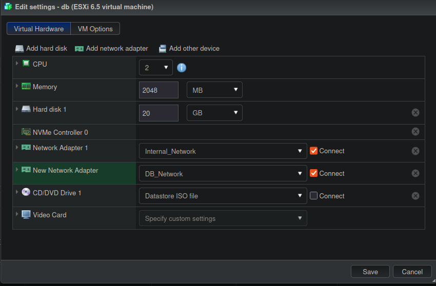

4. Add the new network interface to the application *vm*.

    

#### Database network IP assignment

1. Assign a private IP (192.168.217.1) to the database *vm*, without assigned *gateway* and without the *default gateway* option.

    

    * Verify.

    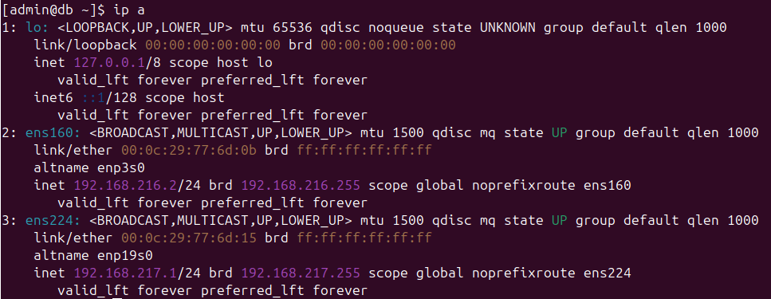
    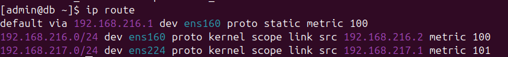

2. Assign a private IP (192.168.217.2) to the application *vm*, with the *gateway* being the database IP and without the *default gateway* option.

    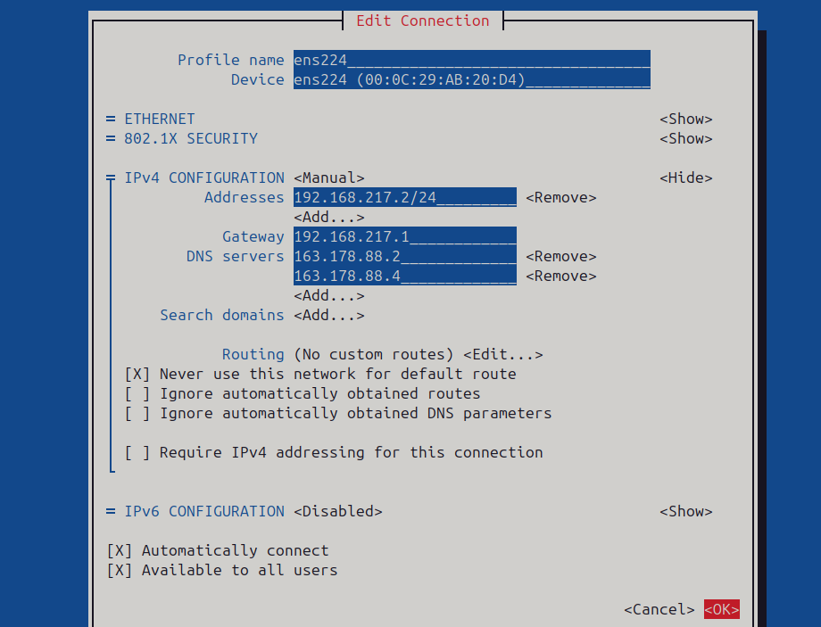

    * Verify.

    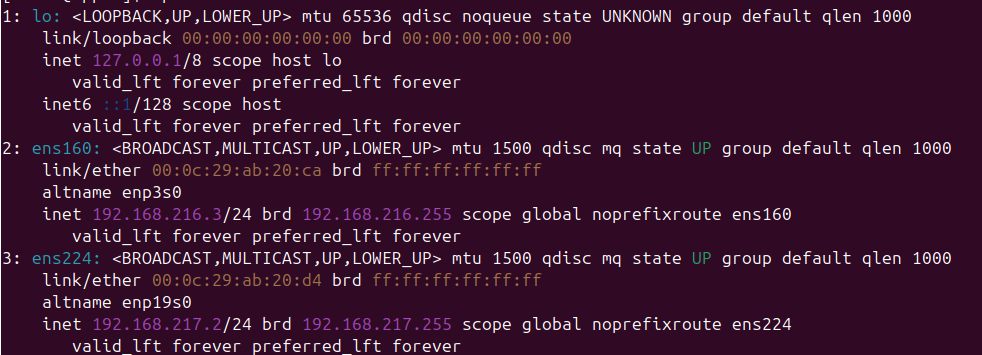
    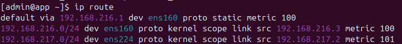

3. Check connection between machines.

    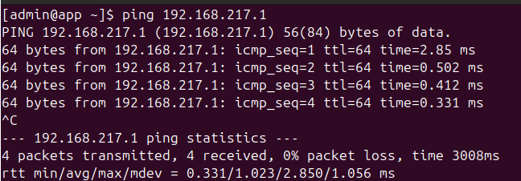

#### Firewall zone configuration for the database and application *vm*

Using <https://docs.redhat.com/en/documentation/red_hat_enterprise_linux/7/html/security_guide/sec-working_with_zones.> as reference.

##### Proper interface-to-zone assignment

1. View active zones.

    ```sh
    firewall-cmd --get-active-zones
    ```

    * Output.

    ```sh
    public
      interfaces: ens160 ens224
    trusted
      interfaces: lo
    ```

2. Move the *ens160* interface to the *internal* zone.

    ```sh
    sudo firewall-cmd --permanent --zone=internal --change-interface=ens160
    ```

    * Apply changes.

    ```sh
    sudo firewall-cmd --reload
    ```

    * Verify.

    ```sh
    firewall-cmd --get-active-zones
    ```

    * Output.

    ```sh
    internal
      interfaces: ens160
    public
      interfaces: ens224
    trusted
      interfaces: lo
    ```

3. Create a new *database* zone.

    ```sh
    sudo firewall-cmd --permanent --new-zone=database
    ```

4. Assign the *ens224* interface to the new *database* zone.

    ```sh
    sudo firewall-cmd --permanent --zone=database --change-interface=ens224
    ```

    * Apply changes.

    ```sh
    sudo firewall-cmd --reload
    ```

    * Verify.

    ```sh
    firewall-cmd --get-active-zones
    ```

    * Output.

    ```sh
    database
      interfaces: ens224
    internal
      interfaces: ens160
    trusted
      interfaces: lo
    ```

##### Configure properties of the *internal* zone

1. Clean up services from the *internal* zone.

    * View zone properties.

    ```sh
    sudo firewall-cmd --zone=internal --list-all
    ```

    * Output

    ```sh
    internal (active)
      target: default
      icmp-block-inversion: no
      interfaces: ens160
      sources:
      services: cockpit dhcpv6-client mdns samba-client ssh
      ports:
      protocols:
      forward: yes
      masquerade: no
      forward-ports:
      source-ports:
      icmp-blocks:
      rich rules:
    ```

    * Remove unnecessary services.

    ```sh
    sudo firewall-cmd --zone=internal --remove-service=cockpit --permanent
    sudo firewall-cmd --zone=internal --remove-service=dhcpv6-client --permanent
    sudo firewall-cmd --zone=internal --remove-service=mdns --permanent
    sudo firewall-cmd --zone=internal --remove-service=samba-client --permanent
    ```

    * Reload.

    ```sh
    sudo firewall-cmd --reload
    ```

    * Verify.

    ```sh
    internal (active)
      target: default
      icmp-block-inversion: no
      interfaces: ens160
      sources:
      services: ssh
      ports:
      protocols:
      forward: yes
      masquerade: no
      forward-ports:
      source-ports:
      icmp-blocks:
      rich rules:
    ```

2. Remove the forwarding part.

    ```sh
    sudo firewall-cmd --permanent --zone=internal --remove-forward
    ```

    * Reload.

    ```sh
    sudo firewall-cmd --reload
    ```

    * Verify.

    ````sh
    internal (active)
      target: default
      icmp-block-inversion: no
      interfaces: ens160
      sources:
      services: ssh
      ports:
      protocols:
      forward: no
      masquerade: no
      forward-ports:
      source-ports:
      icmp-blocks:
      rich rules:
    ````

##### Configure properties of the *database* zone

##### Application VM

1. View zone properties.

    ```sh
    sudo firewall-cmd --zone=database --list-all
    ```

    * Output

    ```sh
    database (active)
      target: default
      icmp-block-inversion: no
      interfaces: ens224
      sources:
      services:
      ports:
      protocols:
      forward: no
      masquerade: no
      forward-ports:
      source-ports:
      icmp-blocks:
      rich rules:
    ```

    * Add a *rich rule* for access to the database *vm*.

    ```sh
    sudo firewall-cmd --zone=database --add-rich-rule='rule family="ipv4" destination address="192.168.217.1" service name="mysql" accept' --permanent
    ```

    * Reload.

    ```sh
    sudo firewall-cmd --reload
    ```

    * Output.

    ```sh
    database (active)
      target: default
      icmp-block-inversion: no
      interfaces: ens224
      sources:
      services:
      ports:
      protocols:
      forward: no
      masquerade: no
      forward-ports:
      source-ports:
      icmp-blocks:
      rich rules:
        rule family="ipv4" destination address="192.168.217.1" service name="mysql" accept
    ```

##### Database VM

1. View zone properties.

    ```sh
    sudo firewall-cmd --zone=database --list-all
    ```

    * Output

    ```sh
    database (active)
      target: default
      icmp-block-inversion: no
      interfaces: ens224
      sources:
      services:
      ports:
      protocols:
      forward: no
      masquerade: no
      forward-ports:
      source-ports:
      icmp-blocks:
      rich rules:
    ```

    * Add a *rich rule* for access to the database *vm*.

    ```sh
    sudo firewall-cmd --zone=database --add-rich-rule='rule family="ipv4" source address="192.168.217.2" service name="mysql" accept' --permanent
    ```

    * Reload.

    ```sh
    sudo firewall-cmd --reload
    ```

    * Output.

    ```sh
    database (active)
      target: default
      icmp-block-inversion: no
      interfaces: ens224
      sources:
      services:
      ports:
      protocols:
      forward: no
      masquerade: no
      forward-ports:
      source-ports:
      icmp-blocks:
      rich rules:
        rule family="ipv4" destination address="192.168.217.1" service name="mysql" accept
    ```

#### MySQL/MariaDB Installation

1. Install the server and client.

    ```sh
    sudo dnf install mariadb-server mariadb -y
    ```

    * Installs the database server service (`mariadb-server`) and the client (`mariadb`) that allows running queries.

2. Enable and start the service.

    ```sh
    sudo systemctl enable --now mariadb
    ```

    * Verify that it is active.

    ```sh
    sudo systemctl status mariadb
    ```

    * Expected output.

    ```sh
    Active: active (running)
    ```

#### Initial configuration and hardening

1. Run the secure configuration wizard.

    ```sh
    sudo mysql_secure_installation
    ```

    * *Enter current password for root (enter for none):*

      * Press *enter*, since there is no password yet.

    * `Switch to unix_socket authentication \[Y/n]`

      * Press *n*, to always authenticate by password.

    * `Change the root password? \[Y/n]`

      * Press *Y*, to assign a password to the root user.

    * `Remove anonymous users? \[Y/n]`

      * Press *Y*, to delete accounts without a username.

    * `Disallow root login remotely? \[Y/n]`

      * Press *Y*, to prevent remote access, for greater security.

    * `Remove test database and access to it? \[Y/n]`

      * Press *Y*, for greater security.

    * `Reload privilege tables now? \[Y/n]`

      * Press *Y*.

#### Creating the database and user for GLPI

1. Enter the MariaDB interpreter.

    ```sh
    sudo mysql -u root -p
    ```

2. Create the database and user.

    ```sh
    CREATE DATABASE glpidb CHARACTER SET utf8mb4 COLLATE utf8mb4_unicode_ci;
    ```

    * `CREATE DATABASE glpidb`: creates a new database called `glpidb`, which will be used exclusively by GLPI. GLPI creates its own tables and relationships within this database.
    * `CHARACTER SET utf8mb4`: defines the character set to use. `utf8mb4` is the complete version of UTF-8 and allows storing all Unicode characters, including emojis and special symbols. It is preferable to `utf8`, which does not support all of Unicode.
    * `COLLATE utf8mb4_unicode_ci`: defines how characters are compared and sorted. `unicode_ci` means:

      * `unicode`: uses Unicode rules to compare letters (respecting accents and international equivalences).
      * `ci`: case-insensitive.

    ```sh
    CREATE USER 'glpiuser'@'192.168.217.2' IDENTIFIED BY '<strong_password>';
    ```

    * `CREATE USER 'glpiuser'@'%'`: creates a new MariaDB user named `glpiuser`.
    * The `@'192.168.217.2'` indicates from where it can connect.

    ```sh
    GRANT ALL PRIVILEGES ON glpidb.* TO 'glpiuser'@'192.168.217.2';
    ```

    * `GRANT ALL PRIVILEGES`: grants all permissions on that database (create tables, insert data, modify records, etc.). GLPI needs this to create its data schema at installation time.
    * `ON glpidb.*`: means that permissions apply to all tables (`*`) within the `glpidb` database.
    * `TO 'glpiuser'@'192.168.217.2'`: assigns those permissions only to the specific user and IP address.

    ```sh
    FLUSH PRIVILEGES;
    ```

    * This command reloads the privilege tables (in `mysql.user`, `mysql.db`, etc.) without restarting the server.

3. Configuration verification.

    ```sh
    SELECT user, host FROM mysql.user WHERE user = 'glpiuser';
    ```

    * Output.

    ```sh
    +----------+---------------+
    | User     | Host          |
    +----------+---------------+
    | glpiuser | 192.168.217.2 |
    +----------+---------------+
    1 row in set (0.004 sec)
    ```

#### Configure listen IP

1. Edit the main server configuration.

    ```sh
    sudo nano /etc/my.cnf.d/mariadb-server.cnf
    ```

    * Edit or add in the `[mysqld]` section

    ```ini
    bind-address=192.168.217.1
    ```

2. Restart the service to apply changes.

    ```sh
    sudo systemctl restart mariadb
    ```

##### Disable SSH IPv6 on the three machines

1. View active sockets.

    ```sh
    ss -tulp
    ```

    * Output.

    ```sh
    Netid              State               Recv-Q              Send-Q                           Local Address:Port                            Peer Address:Port              Process
    udp                UNCONN              0                   0                                    127.0.0.1:323                                  0.0.0.0:*
    udp                UNCONN              0                   0                                        [::1]:323                                     [::]:*
    tcp                LISTEN              0                   128                                    0.0.0.0:ssh                                  0.0.0.0:*
    tcp                LISTEN              0                   80                               192.168.217.1:mysql                                0.0.0.0:*
    tcp                LISTEN              0                   128                                       [::]:ssh                                     [::]:*
    ```

1. Open the configuration file.

    ```sh
    sudo nano /etc/ssh/sshd_config
    ```

    * Add or edit.

    ```ini
    AddressFamily inet
    ListenAddress <IP_PUBLIC_ZONE>
    ```

    * Validate and reload:

    ```sh
    sudo sshd -t
    sudo systemctl reload sshd
    ```

1. Verify.

    ```sh
    Netid              State               Recv-Q              Send-Q                           Local Address:Port                            Peer Address:Port              Process
    udp                UNCONN              0                   0                                    127.0.0.1:323                                  0.0.0.0:*
    udp                UNCONN              0                   0                                        [::1]:323                                     [::]:*
    tcp                LISTEN              0                   80                               192.168.217.1:mysql                                0.0.0.0:*
    tcp                LISTEN              0                   128                              192.168.216.2:ssh                                  0.0.0.0:*
    ```

##### Disable chrony IPv6 on the three machines

1. Open the `/etc/sysconfig/chronyd` file.

    ```sh
    sudo nano /etc/sysconfig/chronyd
    ```

    * Edit or add.

    ```sh
    OPTIONS="-4 -F 2 -u chrony"
    ```

    * Apply changes.

    ```sh
    sudo systemctl restart chronyd
    ```

    * Verify.

    ```sh
    Netid              State               Recv-Q              Send-Q                           Local Address:Port                            Peer Address:Port              Process
    udp                UNCONN              0                   0                                    127.0.0.1:323                                  0.0.0.0:*
    tcp                LISTEN              0                   80                               192.168.217.1:mysql                                0.0.0.0:*
    tcp                LISTEN              0                   128                              192.168.216.2:ssh                                  0.0.0.0:*
    ```

#### Test the database connection from the application *vm*

1. Install the MariaDB client.

    ```sh
    sudo dnf install mariadb
    ```

2. Test the database connection from the application.

    ```sh
    mysql -u glpiuser -p -h 192.168.217.1 -D glpidb
    ```

    * Output.

    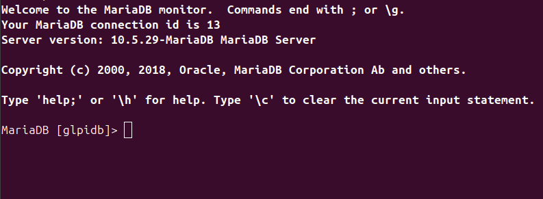

---

### Application Configuration (*GLPI*)

#### External network configuration of the application *vm*

1. Add a new network adapter (*External_Network*) to the application *vm*.

    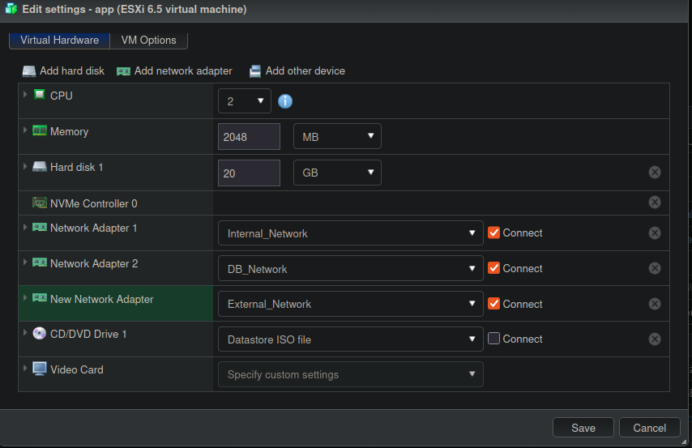

2. Assign a public IP (172.24.133.217) with *nmtui*, with the public network *Gateway* (172.24.133.1) and the two *DNS* (163.178.88.2,  163.178.88.4).

    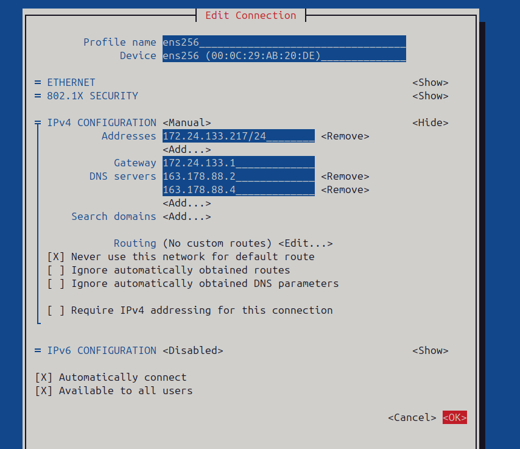

    * Verify.

    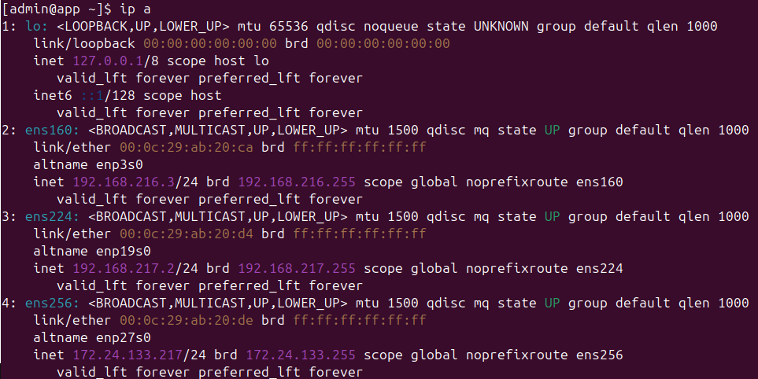
    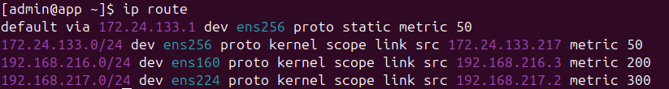

#### PHP-FPM Installation and Configuration

1. Update packages.

    ```sh
    sudo dnf update -y
    ```

2. Install basic tools.

    ```sh
    sudo dnf install -y epel-release yum-utils unzip wget git
    ```

3. Reset the PHP module.

    ```sh
    sudo dnf module reset php -y
    ```

    * `dnf module reset php -y` Avoids conflicts between versions.

4. Enable the PHP 8.1 "stream" from the module repository.

    ```sh
    sudo dnf module enable php:8.1 -y
    ```

    * GLPI 10 works with PHP ≥ 8.1.

5. Install required packages.

    ```sh
    sudo dnf install -y php php-fpm php-mysqlnd php-gd php-xml php-mbstring php-curl php-ldap php-zip php-bz2 php-intl php-apcu php-cli php-json
    ```

    * `php` (base package), `php-fpm` (FastCGI Process Manager — processes PHP scripts and integrates with Nginx),
    * `php-mysqlnd` (native MySQL/MariaDB driver for PHP),
    * `php-gd` (image manipulation), `php-xml`, `php-mbstring`, `php-curl`, `php-ldap`, `php-imap`, `php-zip`, `php-bz2`, `php-intl` (internationalization), `php-apcu` (user cache), `php-cli` (for running php commands from console), `php-json` (JSON handling).

6. Enable the `php-fpm` service to start automatically at system startup and start it now.

    ```sh
    sudo systemctl enable --now php-fpm
    ```

7. Show current status.

    ```sh
    sudo systemctl status php-fpm
    ```

8. Adjust PHP-FPM configuration.

    ```sh
    sudo nano /etc/php-fpm.d/www.conf
    ```

    * Edit or add.

    ```sh
    user = nginx
    group = nginx
    listen = /run/php-fpm/www.sock
    listen.owner = nginx
    listen.group = nginx
    ```

    * The `www.conf` file defines PHP-FPM pool(s).
    * `user = nginx` and `group = nginx` — PHP-FPM will run processes with the `nginx` user and group. This allows PHP processes to access site files if they belong to the `nginx` user.
    * `listen = /run/php-fpm/www.sock` — uses a Unix socket instead of TCP to communicate with Nginx. Advantage: more efficient and secure for local connections between Nginx and PHP-FPM.
    * `listen.owner` / `listen.group` — assign owner and group to the socket so that Nginx (running as `nginx`) can write/read.

9. Apply changes.

    ```sh
    sudo systemctl restart php-fpm
    ```

#### Nginx Installation

1. Install `nginx`.

    ```sh
    sudo dnf install -y nginx
    ```

2. Enable and start the service.

    ```sh
    sudo systemctl enable --now nginx
    ```

3. View current status.

    ```sh
    sudo systemctl status nginx
    ```

#### Download and install GLPI

1. Navigate to the download location.

    ```sh
    cd /srv/www
    ```

2. Download the tarball with the GLPI version from Github.

    ```sh
    sudo wget https://github.com/glpi-project/glpi/releases/download/10.0.15/glpi-10.0.15.tgz
    ```

3. Decompress the `.tgz` file.

    ```sh
    sudo tar -xvzf glpi-10.0.15.tgz
    ```

    * Delete the compressed file once extracted,

    ```sh
    sudo rm -f glpi-10.0.15.tgz
    ```

4. Recursively change the owner and group of all files to `nginx`, so that Nginx/PHP-FPM can read and write.

    ```sh
    sudo chown -R nginx:nginx /srv/www/glpi
    ```

5. Set permissions: owner has read+write+execute; group and others read+execute.

    ```sh
    sudo chmod -R 755 /srv/www/glpi
    ```

#### Nginx Configuration for GLPI

Using <https://www.digitalocean.com/community/tutorials/php-fpm-nginx,> as reference.

1. Create the specific configuration file for the GLPI service.

    ```sh
    sudo nano /etc/nginx/conf.d/glpi.conf
    ```

    * Add.

    ```sh
    server {
        listen 172.24.133.217:80 default_server;
        server_name 172.24.133.217;

        root /srv/www/glpi;
        index index.php index.html;

        access_log /var/log/nginx/glpi_access.log main;
        error_log /var/log/nginx/glpi_error.log warn;

        location / {
            try_files $uri $uri/ /index.php?$query_string;
        }

        location ~ \.php$ {
            include fastcgi_params;
            fastcgi_pass unix:/run/php-fpm/www.sock;
            fastcgi_index index.php;
            fastcgi_param SCRIPT_FILENAME $document_root$fastcgi_script_name;
        }

        location ~* \.(js|css|png|jpg|jpeg|gif|ico)$ {
            expires max;
            log_not_found off;
        }
    }
    ```

    * `server { ... }` — block that defines a virtual host in Nginx.
    * `listen 80;` — Nginx listens on port 80 (HTTP).
    * `server_name` — server name.
    * `root /srv/www/glpi;` — folder from which static files will be served.
    * `index index.php index.html;` — priority of index files.
    * `access_log` / `error_log` — dedicated log paths for GLPI.
    * `location / { try_files $uri $uri/ /index.php?$query_string; }` — common rule for PHP applications: if the requested file doesn't exist, pass the request to `index.php` keeping the query string.
    * `location ~ \.php$ { ... }` — handles PHP files:

      * `include fastcgi_params;` — loads standard FastCGI parameters.
      * `fastcgi_pass unix:/run/php-fpm/www.sock;` — routes the request to PHP-FPM through the Unix socket (matches `listen` in `www.conf`).
      * `fastcgi_param SCRIPT_FILENAME $document_root$fastcgi_script_name;` — defines the real PHP script path.

    * `location ~* \.(js|css|...)` — cache static resources in the browser.

2. Validate syntax.

    ```sh
    sudo nginx -t
    ```

3. Restart Nginx.

    ```sh
    sudo systemctl restart nginx
    ```

    * Output.

    ```sh
    nginx: the configuration file /etc/nginx/nginx.conf syntax is ok
    nginx: configuration file /etc/nginx/nginx.conf test is successful
    ```

4. Open HTTP port in the firewall.

    ```sh
    sudo firewall-cmd --permanent --zone=public --add-service=http
    ```

    * Apply changes.

    ```sh
    sudo firewall-cmd --reload
    ```

#### Browser installation (GLPI wizard) pt I

1. Open <http://172.24.133.217> in the browser.
2. Select the language.

    

3. Accept the license.

    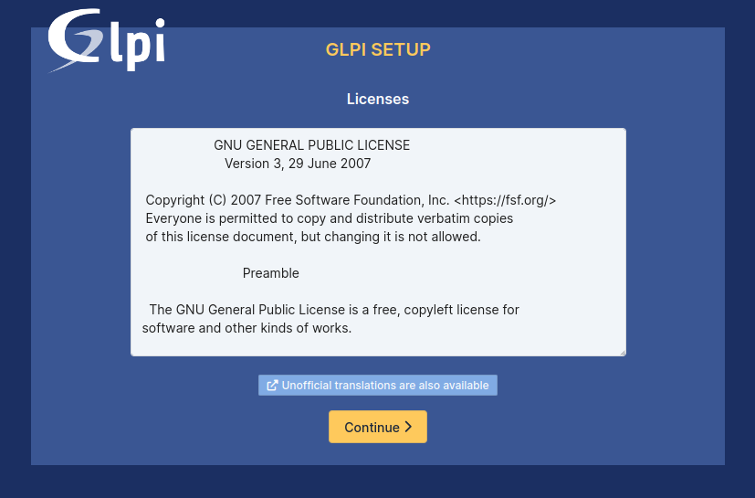

4. Click `Install`.

    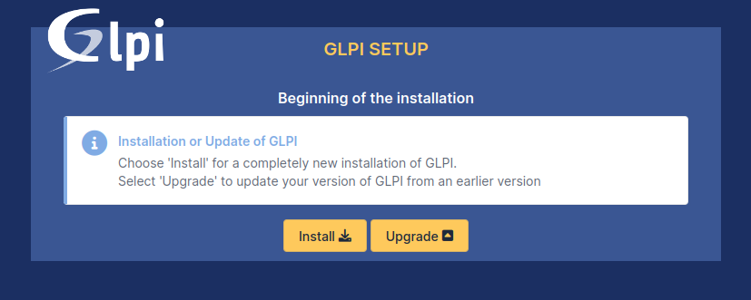

5. Verify PHP environment requirements.

    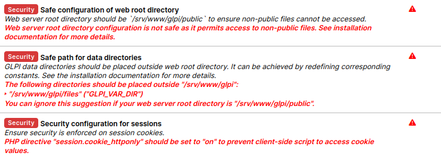

    * **Secure configuration of the web root directory:** The web server root directory must be `/srv/www/glpi/public` to ensure that non-public files cannot be accessed. *The current web server root directory configuration is not secure, as it allows access to non-public files. See the installation documentation for more details.*
    * **Safe path for data directories:** GLPI data directories must be located outside the web server root directory. This can be achieved by redefining the corresponding constants. See the installation documentation for more details. *The following directories must be located outside "/srv/www/glpi":*

      * "/srv/www/glpi/files" ("GLPI_VAR_DIR")
        * *You can ignore this suggestion if your web server root directory is "/srv/www/glpi/public".*

    * **Security configuration for sessions:** Ensure that security measures are applied to session cookies. *The PHP directive "session.cookie_httponly" must be set to "on" to prevent client-side scripts from accessing cookie values.*

    
    

    * **SELinux mode is in permissive mode:** For security reasons, SELinux mode should be in enforcing mode.
    * **Emulated PHP extensions:**

      * Slightly improves performance.
        * The following extensions are installed: ctype, iconv, mbstring.
        * The following extension is not present: sodium.

#### SELinux in *enforcing* mode with *audit2why*

1. Download the necessary dependencies.

    ```sh
    sudo dnf install policycoreutils-python-utils -y
    ```

2. Analyze the reports.

    ```sh
    sudo ausearch -m avc | audit2why
    ```

    * Output obtained.

    ```sh
    type=AVC msg=audit(1762581370.417:1944): avc:  denied  { open } for  pid=5712 comm="php-fpm" path="/srv/www/glpi/install/mysql/glpi-empty.sql" dev="dm-3" ino=263629 scontext=system_u:system_r:httpd_t:s0 tcontext=unconfined_u:object_r:var_t:s0 tclass=file permissive=1

        Was caused by:
            Missing type enforcement (TE) allow rule.

            You can use audit2allow to generate a loadable module to allow this access.

    type=AVC msg=audit(1762581942.744:1994): avc:  denied  { getattr } for  pid=5858 comm="nginx" path="/srv/www/glpi/public/index.php" dev="dm-3" ino=264150 scontext=system_u:system_r:httpd_t:s0 tcontext=unconfined_u:object_r:var_t:s0 tclass=file permissive=1

        Was caused by:
            Missing type enforcement (TE) allow rule.

            You can use audit2allow to generate a loadable module to allow this access.
    ```

    * Nginx/PHP-FPM run in the httpd_t domain and are attempting to read files under /srv/www/glpi and /srv/www/glpi/public.
    * Those files are labeled as var_t (tcontext … object_r:var_t), which is NOT an allowed type for httpd_t.
    * Result: avc: denied { getattr | open | read } on index.php, vendor/…, install/mysql/glpi-empty.sql, etc.

3. Label all of glpi as readable content.

    ```sh
    sudo semanage fcontext -a -t httpd_sys_content_t "/srv/www/glpi(/.*)?"
    ```

4. Overwrite with read/write label for dirs that require it.

    ```sh
    sudo semanage fcontext -a -t httpd_sys_rw_content_t "/srv/www/glpi/(files|config|marketplace|plugins)(/.*)?"
    ```

5. Apply labels on disk.

    ```sh
    sudo restorecon -Rv /srv/www/glpi
    sudo nginx -t
    ```

6. Verify labels.

    ```sh
    ls -lZ /srv/www/glpi/public/index.php
    ls -ldZ /srv/www/glpi/files /srv/www/glpi/config /srv/www/glpi/marketplace /srv/www/glpi/plugins
    ```

7. Required booleans `httpd_can_network_connect`.

    ```sh
    sudo setsebool -P httpd_can_network_connect on
    ```

8. Set SELinux to enforcing.

    ```sh
    sudo setenforce 1
    ```

9. Fix *Security configuration for sessions*. Create a specific configuration file.

    ```sh
    sudo tee /etc/php.d/90-glpi-session.ini >/dev/null <<'EOF'
    ; Hardening for GLPI sessions.
    session.cookie_httponly = 1
    session.cookie_secure = 0
    session.use_strict_mode = 1
    session.use_only_cookies = 1
    ; SameSite helps protect against CSRF
    session.cookie_samesite = Lax
    EOF
    ```

    * Change permissions.

    ```sh
    sudo chmod 644 /etc/php.d/90-glpi-session.ini
    ```

    * Restart PHP-FPM.

    ```sh
    sudo systemctl restart php-fpm
    ```

10. For the *Safe configuration of web root directory* and *Safe path for data directories* suggestions, which ask that instead of `root /srv/www/glpi` it should be `root /srv/www/glpi/public` in the `/etc/nginx/conf.d/glpi.conf` file. But for now, so as not to affect the installation, proceed this way, and after the installation change it to `root /srv/www/glpi/public`.

#### Browser installation (GLPI wizard) pt II

1. Click `Continue`.

    

2. Enter the database parameters.

    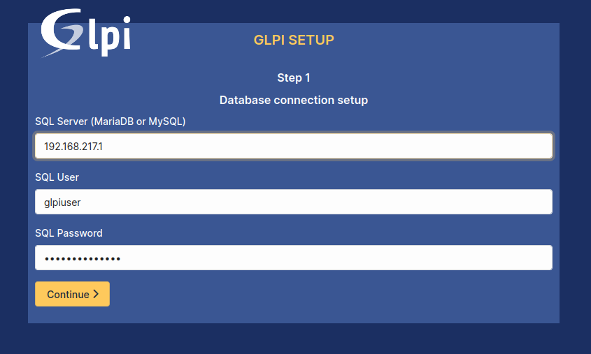

3. Click to use the `glpidb` database.

    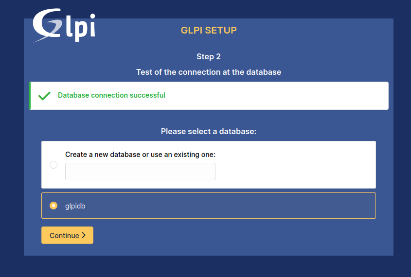
    
    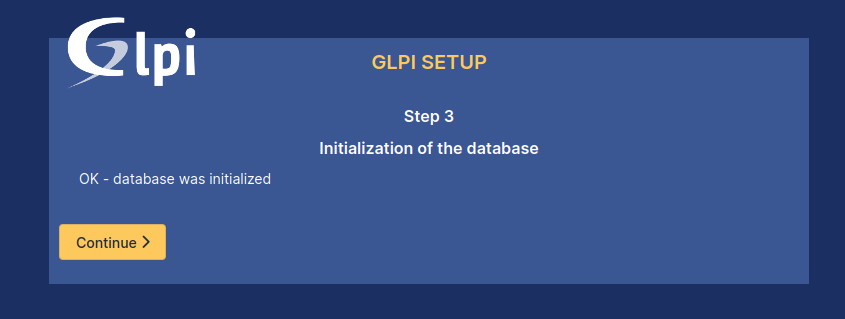

4. Click *continue* in the `Collect data` section.

    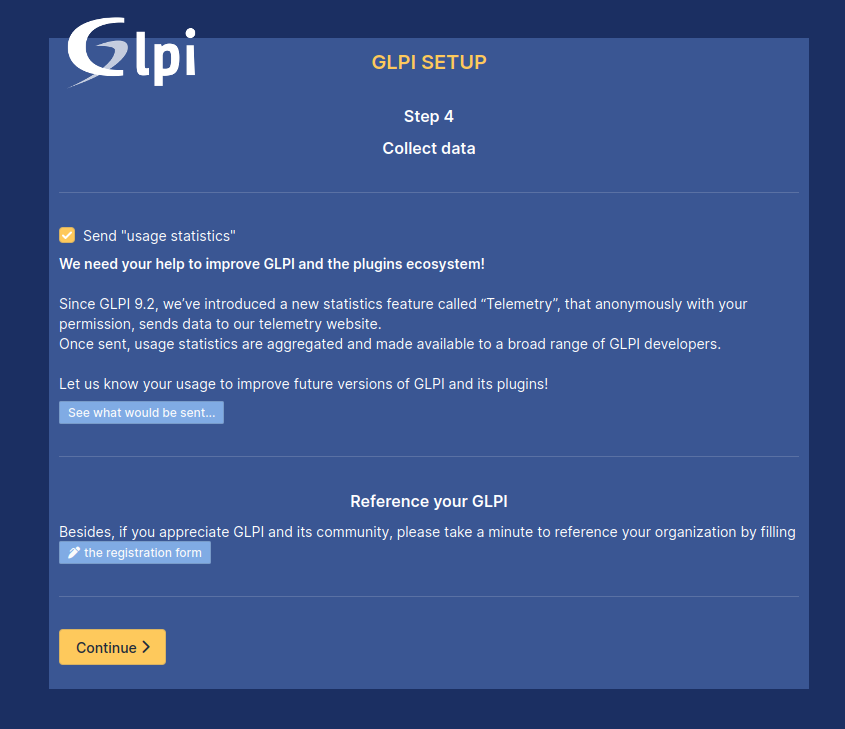

5. Click *continue* in the `One last thing before starting` section.

    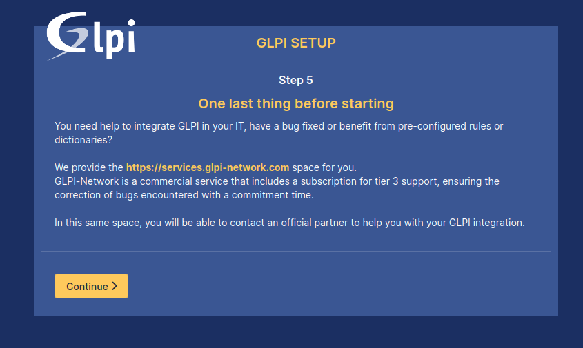

6. Installation completed.

    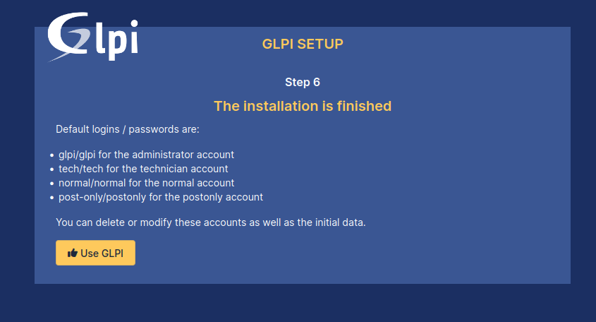

7. Log in with default credentials.

    ```txt
    user: glpi
    password: glpi
    ```

    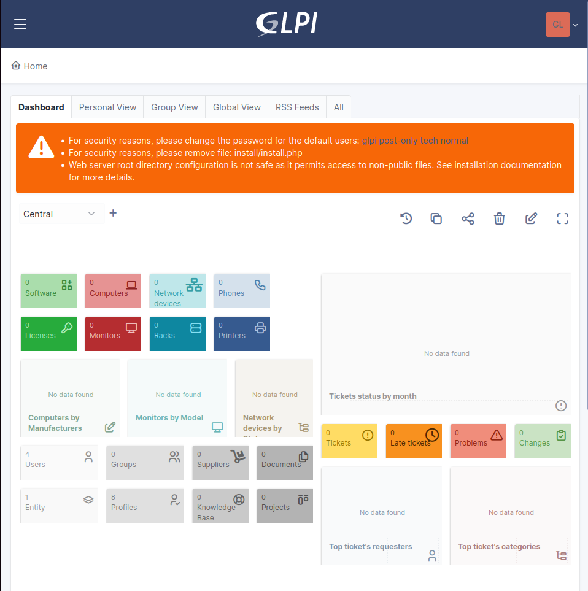

8. Change passwords for users.

    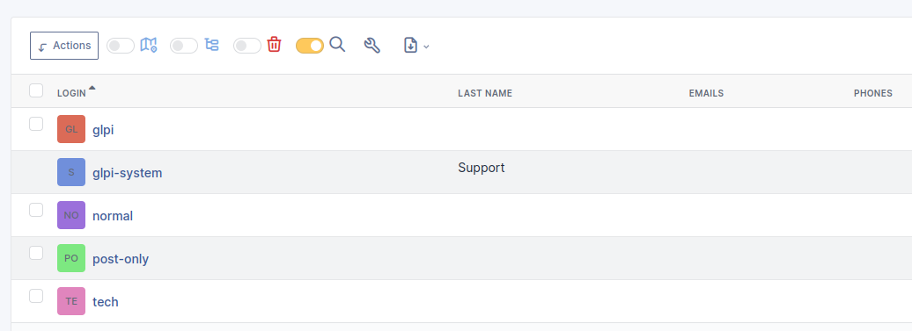

#### Fix warnings


1. Delete installation files.

    ```sh
    sudo rm -rf /srv/www/glpi/install/install.php
    ```

2. Validate syntax.

    ```sh
    sudo nginx -t
    ```

3. Restart Nginx.

    ```sh
    sudo systemctl restart nginx
    ```

---

### *Reverse Proxy* Configuration

#### Create new *App_Network* network

1. Create a new *vSwitch* without *uplink* named *vAppNetwork*.

    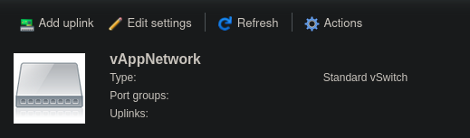

2. Create a *Port Group* for the new *vSwitch*.

    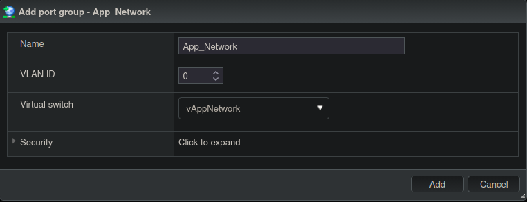
    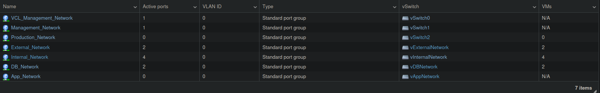

3. Assign the three interfaces *Internal_Network*, *External_Network*, and *App_Network* to the *proxy* *vm*.

    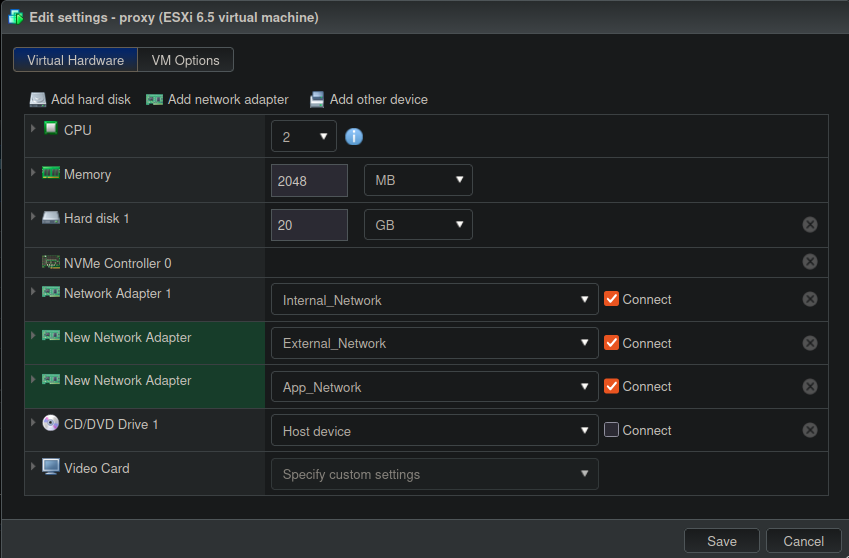

4. Assign a public IP (172.24.133.218) to the *reverse proxy* *vm*. With the *gateway* 172.24.133.1. Without checking the *default gateway* option since it is intended to be so.

    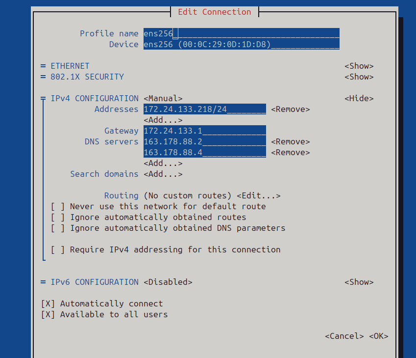

5. Assign a private IP (192.168.216.4/24) for the *Internal* network, with gateway 192.168.216.1 and checking the option to never be the *default gateway*. /etc/NetworkManager/system-connections

    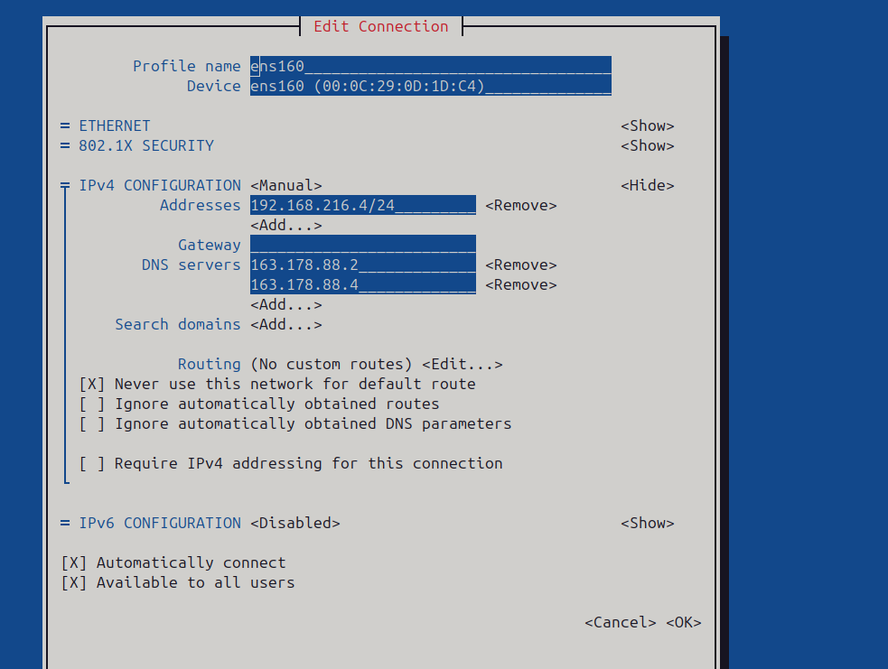

6. Assign a private IP (192.168.218.1) for the *App_Network* network, without gateway since it will be itself.


#### Configure *firewall* zones on the *reverse proxy* *vm*

1. View active zones.

    ```sh
    firewall-cmd --get-active-zones
    ```

    * Output.

    ```sh
    public
      interfaces: ens256 ens224 ens160
    trusted
      interfaces: lo
    ```

2. Move the *ens160* interface to the *internal* zone.

    ```sh
    sudo firewall-cmd --permanent --zone=internal --change-interface=ens160
    ```

    * Apply changes.

    ```sh
    sudo firewall-cmd --reload
    ```

    * Verify.

    ```sh
    firewall-cmd --get-active-zones
    ```

    * Output.

    ```sh
    internal
      interfaces: ens160
    public
      interfaces: ens256 ens224
    trusted
      interfaces: lo
    ```

3. Create a new *application* zone.

    ```sh
    sudo firewall-cmd --permanent --new-zone=application
    ```

4. Assign the *ens224* interface to the new *application* zone.

    ```sh
    sudo firewall-cmd --permanent --zone=application --change-interface=ens224
    ```

    * Apply changes.

    ```sh
    sudo firewall-cmd --reload
    ```

    * Verify.

    ```sh
    firewall-cmd --get-active-zones
    ```

    * Output.

    ```sh
    application
      interfaces: ens224
    internal
      interfaces: ens160
    public
      interfaces: ens256
    trusted
      interfaces: lo
    ```

5. Remove unnecessary services from zones.

    * Output after the changes.

    ```sh
    application (active)
      target: default
      icmp-block-inversion: no
      interfaces: ens224
      sources:
      services:
      ports:
      protocols:
      forward: no
      masquerade: no
      forward-ports:
      source-ports:
      icmp-blocks:
      rich rules:

    internal (active)
      target: default
      icmp-block-inversion: no
      interfaces: ens160
      sources:
      services: ssh
      ports:
      protocols:
      forward: no
      masquerade: no
      forward-ports:
      source-ports:
      icmp-blocks:
      rich rules:

    public (active)
      target: default
      icmp-block-inversion: no
      interfaces: ens256
      sources:
      services:
      ports:
      protocols:
      forward: yes
      masquerade: no
      forward-ports:
      source-ports:
      icmp-blocks:
      rich rules:
    ```

6. Ensure that traffic only goes to the application.

    ```sh
    sudo firewall-cmd --permanent --zone=application --add-rich-rule='rule family="ipv4" destination address="192.168.218.2" service name="http" accept'
    ```

    * Reload changes.

    ```sh
    sudo firewall-cmd --reload
    ```

    * View changes.

    ```sh
    application (active)
      target: default
      icmp-block-inversion: no
      interfaces: ens224
      sources:
      services:
      ports:
      protocols:
      forward: no
      masquerade: no
      forward-ports:
      source-ports:
      icmp-blocks:
      rich rules:
        rule family="ipv4" destination address="192.168.218.2" service name="http" accept
    ```

#### *ApplicationNetwork* network configuration on the Application *vm*

1. Remove the *ExternalNetwork* interface from the *app* *vm*.

    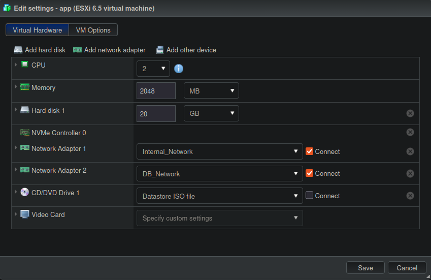

2. Add the *ApplicationNetwork* network interface.

    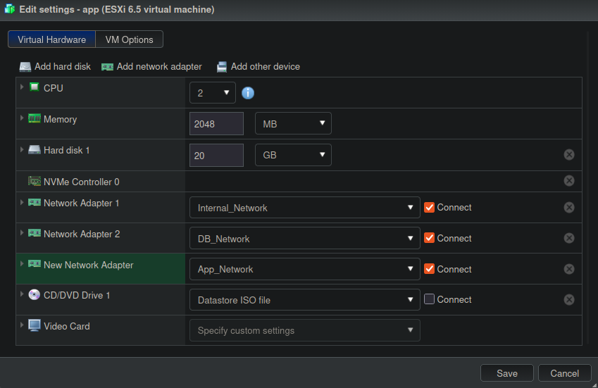

3. Assign a private IP (192.168.218.2) to the new interface of the *ApplicationNetwork*, with the *gateway* of the *reverse proxy* *vm* (192.168.218.1).

    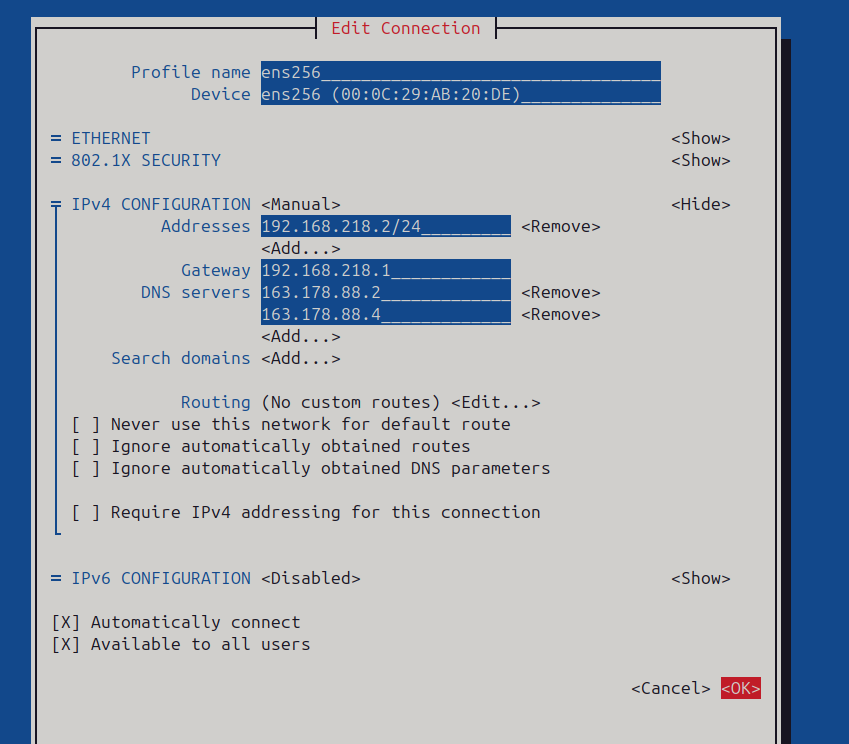

4. Verify that the default gateway is the *reverse proxy*.

    ```sh
    ip route
    ```

    * Output.

    ```sh
    default via 192.168.218.1 dev ens256 proto static metric 50
    192.168.216.0/24 dev ens160 proto kernel scope link src 192.168.216.3 metric 200
    192.168.217.0/24 dev ens224 proto kernel scope link src 192.168.217.2 metric 300
    192.168.218.0/24 dev ens256 proto kernel scope link src 192.168.218.2 metric 50
    ```

5. Check that there is ping with the *reverse proxy* *vm*.

    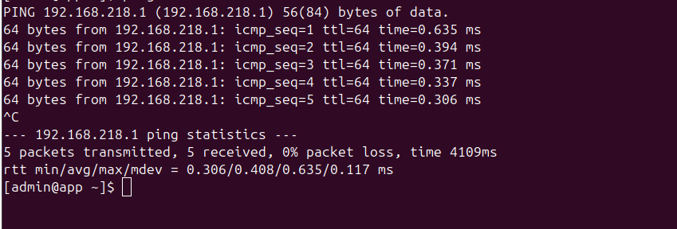

#### Firewall configuration changes on the Application *vm*

1. View active zones.

    ```sh
    sudo firewall-cmd --get-active-zones
    ```

    * Output.

    ```sh
    database
      interfaces: ens224
    internal
      interfaces: ens160
    public
      interfaces: ens256
    trusted
      interfaces: lo
    ```

2. Create a new *application* zone.

    ```sh
    sudo firewall-cmd --permanent --new-zone=application
    ```

3. Assign the *ens256* interface to the new *application* zone.

    ```sh
    sudo firewall-cmd --permanent --zone=application --change-interface=ens256
    ```

    * Apply changes.

    ```sh
    sudo firewall-cmd --reload
    ```

    * Verify.

    ```sh
    firewall-cmd --get-active-zones
    ```

    * Output.

    ```sh
    application
      interfaces: ens256
    database
      interfaces: ens224
    internal
      interfaces: ens160
    trusted
      interfaces: lo
    ```

4. View parameters of the *application* zone.

    ```sh
    application (active)
      target: default
      icmp-block-inversion: no
      interfaces: ens256
      sources:
      services:
      ports:
      protocols:
      forward: no
      masquerade: no
      forward-ports:
      source-ports:
      icmp-blocks:
      rich rules:
    ```

5. Ensure that traffic only comes from the reverse proxy.

    ```sh
    sudo firewall-cmd --permanent --zone=application --add-rich-rule='rule family="ipv4" source address="192.168.218.1" service name="http" accept'
    ```

    * Reload changes.

    ```sh
    sudo firewall-cmd --reload
    ```

    * View changes.

    ```sh
      target: default
      icmp-block-inversion: no
      interfaces: ens256
      sources:
      services:
      ports:
      protocols:
      forward: no
      masquerade: no
      forward-ports:
      source-ports:
      icmp-blocks:
      rich rules:
        rule family="ipv4" source address="192.168.218.1" service name="http" accept
    ```

#### *Nginx* configuration changes on the Application *vm*

1. Edit the *nginx* configuration file for *glpi*, so that it listens on the new IP of the *ApplicationNetwork* network.

    ```sh
    sudo nano /etc/nginx/conf.d/glpi.conf
    ```

    * Edit.

    ```ini
    server {
        listen 192.168.218.2:80;
        server_name 192.168.218.2;

        root /srv/www/glpi;
        index index.php index.html;

        access_log /var/log/nginx/glpi_access.log main;
        error_log /var/log/nginx/glpi_error.log warn;

        location / {
            try_files $uri $uri/ /index.php?$query_string;
        }

        location ~ \.php$ {
            include fastcgi_params;
            fastcgi_pass unix:/run/php-fpm/www.sock;
            fastcgi_index index.php;
            fastcgi_param SCRIPT_FILENAME $document_root$fastcgi_script_name;
        }

        location ~* \.(js|css|png|jpg|jpeg|gif|ico)$ {
            expires max;
            log_not_found off;
        }
    }
    ```

2. Apply changes.

    ```sh
    sudo nginx -t
    sudo systemctl restart nginx
    sudo systemctl restart php-fpm
    ```

3. Verify by making a request using *curl*.

    ```sh
    curl http://192.168.218.2/
    ```

    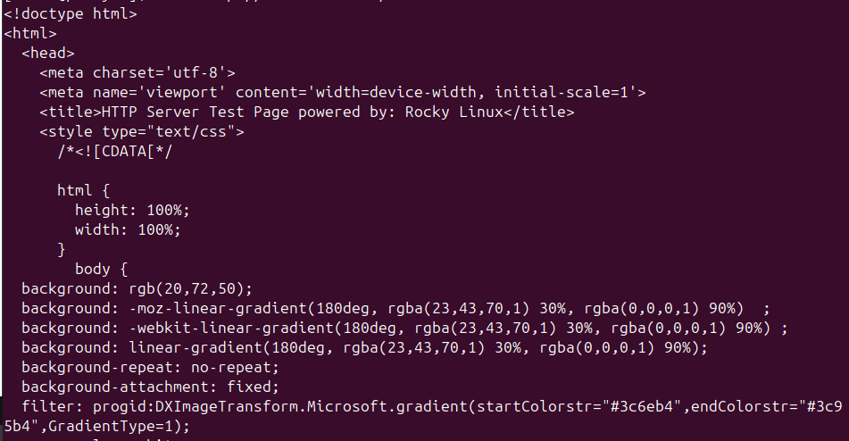

#### Nginx Installation on the *reverse proxy* *vm*

1. Install `nginx`.

    ```sh
    sudo dnf install -y nginx
    ```

2. Enable and start the service.

    ```sh
    sudo systemctl enable --now nginx
    ```

3. View current status.

    ```sh
    sudo systemctl status nginx
    ```

#### SSL Certificate Creation

1. Create the necessary folders.

    ```sh
    sudo mkdir -p /etc/ssl/private /etc/ssl/certs
    ```

    * Assign secure permissions.

    ```sh
    sudo chmod 700 /etc/ssl/private
    ```

2. Create the configuration file (`.cnf`).

    ```sh
    sudo bash -c 'cat >/etc/pki/tls/glpi_proxy.cnf <<EOF
    [req]
    distinguished_name = dn
    x509_extensions    = v3_req
    prompt             = no

    [dn]
    C  = CR
    ST = SanJose
    L  = SanJose
    O  = GLPIProxy
    OU = IT
    CN = 172.24.133.218

    [v3_req]
    subjectAltName = @alt_names

    [alt_names]
    IP.1  = 172.24.133.218
    EOF'
    ```

    * `[req]` Indicates that a certificate with extensions will be generated.
    * `prompt = no` Prevents OpenSSL from requesting data manually.
    * `[dn]` Defines the certificate fields (distinguished name):

      * `CN` (Common Name) must be the proxy's IP or DNS name.

    * `[v3_req]` Adds modern extensions (such as SAN).
    * `[alt_names]` Includes both the DNS name and the real IP of the proxy.

3. Generate the certificate and key.

    ```sh
    sudo openssl req -x509 -nodes -days 365 -newkey rsa:2048 \
      -keyout /etc/ssl/private/glpi_proxy.key \
      -out /etc/ssl/certs/glpi_proxy.crt \
      -config /etc/pki/tls/glpi_proxy.cnf
    ```

    * `-x509` Generates an X.509 certificate (standard type for SSL).
    * `-nodes` Does not encrypt the private key (necessary for Nginx to start automatically).
    * `-days 365` Validity of 1 year.
    * `-newkey rsa:2048` Creates a new 2048-bit RSA key.
    * `-config` Uses your `.cnf` file to define SAN, CN, etc.

4. Adjust permissions.

    ```sh
    sudo chmod 600 /etc/ssl/private/glpi_proxy.key
    sudo chown root:root /etc/ssl/private/glpi_proxy.key
    ```

    * Verify contents.

    ```sh
    sudo openssl x509 -in /etc/ssl/certs/glpi_proxy.crt -noout -text | egrep -A3 'Subject:|Subject Alternative Name'
    ```

    * Output.

    ```sh
            Subject: C=CR, ST=SanJose, L=SanJose, O=GLPIProxy, OU=IT, CN=172.24.133.218
            Subject Public Key Info:
                Public Key Algorithm: rsaEncryption
                    Public-Key: (2048 bit)
    --
                X509v3 Subject Alternative Name:
                    IP Address:172.24.133.218
                X509v3 Subject Key Identifier:
                    F3:4E:31:CE:3F:19:3F:A3:2D:25:2A:80:8B:40:B3:FB:16:39:DB:82
    ```

#### Nginx Configuration on the reverse proxy *vm*

1. Create the specific configuration file for the GLPI service.

    ```sh
    sudo nano /etc/nginx/conf.d/glpi.conf
    ```

    * HTTP → HTTPS redirection.

    ```ini
    server {
        listen 80;
        server_name 172.24.133.218;

        # Redirect all HTTP traffic to HTTPS
        return 301 https://$host$request_uri;
    }
    ```

    * `listen 80;` Listens for HTTP requests (port 80).
    * `server_name 172.24.133.218;` Defines the name or IP that this block will handle.
    * `return 301 https://$host$request_uri;` Redirects all HTTP traffic to the same host but using HTTPS.

    * HTTPS Server (Reverse Proxy).

    ```ini
    server {
        listen 443 ssl http2;
        server_name 172.24.133.218;

        access_log /var/log/nginx/glpi_proxy_access.log main;
        error_log  /var/log/nginx/glpi_proxy_error.log warn;
    ```

    * `listen 443 ssl http2;` Listens for HTTPS traffic with HTTP/2 support.
    * `server_name` IP or domain of the proxy.
    * `access_log` and `error_log` Paths where access and error logs will be stored.

    * SSL Certificates.

    ```ini
    ssl_certificate     /etc/ssl/certs/glpi_proxy.crt;
    ssl_certificate_key /etc/ssl/private/glpi_proxy.key;
    ```

    * Configure SSL security.

    ```ini
    ssl_protocols TLSv1.2 TLSv1.3;
    ssl_prefer_server_ciphers on;
    ssl_ciphers "EECDH+AESGCM:EDH+AESGCM:AES256+EECDH:AES256+EDH";
    ssl_session_cache shared:SSL:10m;
    ssl_session_timeout 10m;
    ssl_session_tickets off;
    ```

    * `ssl_protocols` Only allows TLS 1.2 and 1.3 (secure protocols).
    * `ssl_ciphers` Defines the accepted encryption algorithms.
    * `ssl_session_cache` and `timeout` Improve performance by storing sessions.
    * `ssl_session_tickets off` Avoids "ticket reuse" vulnerabilities.

    * Security headers.

    ```ini
    add_header Strict-Transport-Security "max-age=31536000; includeSubDomains" always;
    add_header X-Frame-Options SAMEORIGIN;
    add_header X-Content-Type-Options nosniff;
    add_header X-XSS-Protection "1; mode=block";
    ```

    * `Strict-Transport-Security`: Forces HTTPS use for 1 year.
    * `X-Frame-Options`: Prevents the site from being embedded in external iframes.
    * `X-Content-Type-Options`: Prevents the browser from interpreting incorrect MIME types.
    * `X-XSS-Protection`: Activates basic protection against XSS.

    * Reverse Proxy configuration.

    ```ini
    location / {
        proxy_pass http://192.168.218.2;  # IP of GLPI VM
        proxy_set_header Host $host;
        proxy_set_header X-Real-IP $remote_addr;
        proxy_set_header X-Forwarded-For $proxy_add_x_forwarded_for;
        proxy_set_header X-Forwarded-Proto https;
        proxy_set_header X-Forwarded-Host $host;
        proxy_set_header X-Forwarded-Port 443;

        proxy_redirect off;
    }
    ```

    * `proxy_pass` Forwards requests to the internal server (the VM with GLPI).
    * `proxy_set_header` Adds useful headers that inform the backend:

      * Real client IP (`X-Real-IP`)
      * Original protocol (`X-Forwarded-Proto`)
      * Original host (`X-Forwarded-Host`)

    * `proxy_redirect off` Avoids incorrect internal redirects.

    * Complete file.

    ```ini
    # ────────────────────────────────────────────────
    # Redirection HTTP → HTTPS
    # ────────────────────────────────────────────────
    server {
        listen 80;
        server_name 172.24.133.218;

        # Redirect all HTTP traffic to HTTPS
        return 301 https://$host$request_uri;
    }

    # ────────────────────────────────────────────────
    # Server HTTPS (Reverse Proxy)
    # ────────────────────────────────────────────────
    server {
        listen 443 ssl http2;
        server_name 172.24.133.218;

        access_log /var/log/nginx/glpi_proxy_access.log main;
        error_log  /var/log/nginx/glpi_proxy_error.log warn;

        # Certification path
        ssl_certificate     /etc/ssl/certs/glpi_proxy.crt;
        ssl_certificate_key /etc/ssl/private/glpi_proxy.key;

        # Security recommendations
        ssl_protocols TLSv1.2 TLSv1.3;
        ssl_prefer_server_ciphers on;
        ssl_ciphers "EECDH+AESGCM:EDH+AESGCM:AES256+EECDH:AES256+EDH";
        ssl_session_cache shared:SSL:10m;
        ssl_session_timeout 10m;
        ssl_session_tickets off;

        # Security Headers
        add_header Strict-Transport-Security "max-age=31536000; includeSubDomains" always;
        add_header X-Frame-Options SAMEORIGIN;
        add_header X-Content-Type-Options nosniff;
        add_header X-XSS-Protection "1; mode=block";

        location / {
            proxy_pass http://192.168.218.2;  # IP of GLPI VM
            proxy_set_header Host $host;
            proxy_set_header X-Real-IP $remote_addr;
            proxy_set_header X-Forwarded-For $proxy_add_x_forwarded_for;
            proxy_set_header X-Forwarded-Proto https;
            proxy_set_header X-Forwarded-Host $host;
            proxy_set_header X-Forwarded-Port 443;

            proxy_redirect off;
        }
    }
    ```

2. Validate syntax.

    ```sh
    sudo nginx -t
    ```

3. Restart Nginx.

    ```sh
    sudo systemctl restart nginx
    ```

#### Open the https service in the firewall on the *reverse proxy* *vm*

1. Open the https service in the firewall.

    ```sh
    sudo firewall-cmd --zone=public --add-service=https --permanent
    ```

    * Reload

    ```sh
    sudo firewall-cmd --reload
    ```

    * Verify.

    ```sh
    sudo firewall-cmd --zone=public --list-all
    ```

    * Output.

    ```sh
    public (active)
      target: default
      icmp-block-inversion: no
      interfaces: ens256
      sources:
      services: https
      ports:
      protocols:
      forward: no
      masquerade: no
      forward-ports:
      source-ports:
      icmp-blocks:
      rich rules:
    ```

#### SELinux in *enforcing* mode on the *reverse proxy* *vm*

1. Required booleans `httpd_can_network_connect`.

    ```sh
    sudo setsebool -P httpd_can_network_connect on
    ```

2. Set SELinux to enforcing.

    ```sh
    sudo setenforce 1
    ```

---

### Verify

1. Connect through the browser to IP 172.24.133.218.

    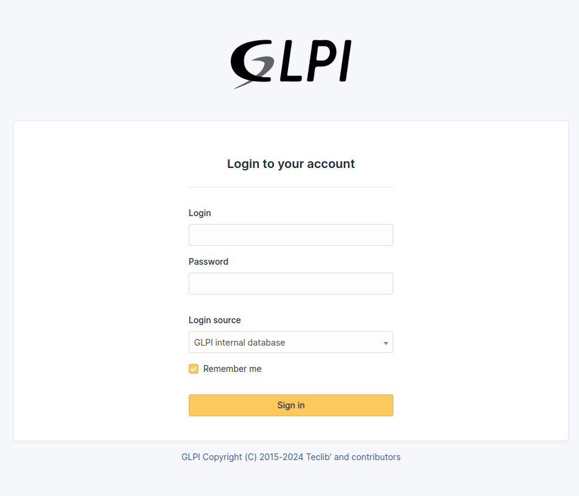

2. Log in.

    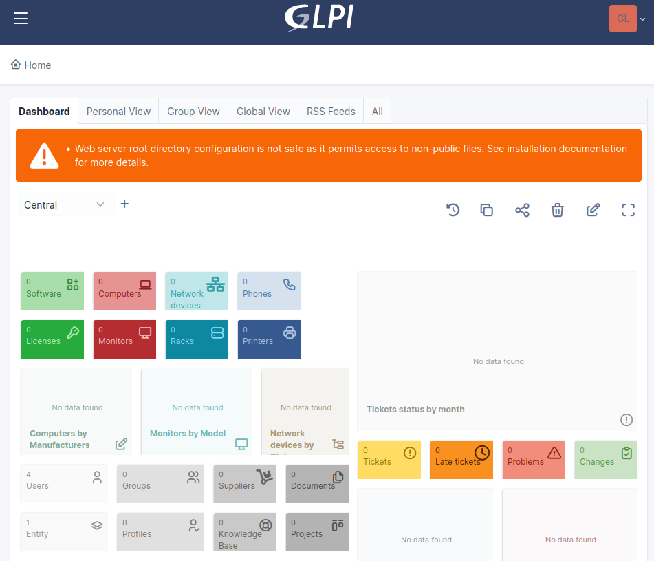

>Note: As seen in the image, the warning persists, but the correct connection is still achieved.

---

### Service Use

1. Add the *vms* available.

    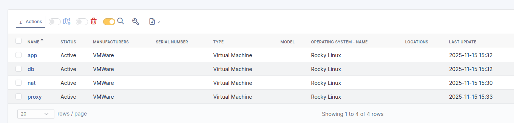

2. Add the *vSwitches*.

    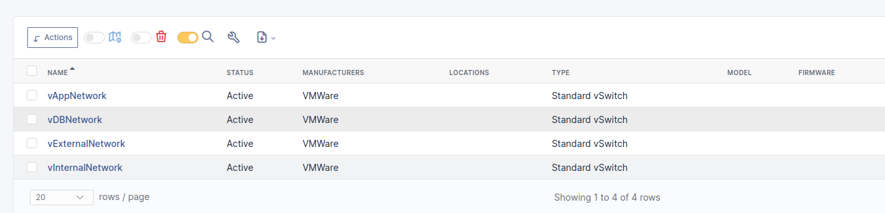

3. *ESXi* and *TrueNas* added.

    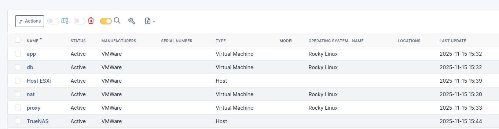
