# Project, Part III - IT Service with Load Balancing and HA Infrastructure

## Cover Page

### University of Costa Rica

* **Technological Infrastructure Integration CI-0138**
* **Project, Part III - IT Service with Load Balancing and HA Infrastructure**
* **Professor:** Ariel Mora Jiménez
* **Student:** Anderson Vargas Navarro - C28183
* **2nd semester, 2025**
* **Group:** 001

---

## **Project, Part III - IT Service with Load Balancing and HA Infrastructure**

### General Description

This project consists of provisioning an IT service with fault tolerance, load balancing, and high availability functions in the Computational Academic Cloud. For the project, open-source software will be used, including the application called Netbox or GLPI as the service to provision.

#### General Objective

Implement and integrate the functional components, load balancing, and high availability for a technological infrastructure service implemented in a virtual mini data center.

#### Specific Objectives

1. Define the architecture of a technological infrastructure service that has at least two structural levels or layers, basic security, and operates under load balancing and high availability conditions.
2. Define appropriate network addressing to host the service.
3. Establish logical communication channels (through the network) internally between service components, and externally with users and service managers.
4. Define routing functions and packet filters to manage and secure access to the service through the network.
5. Install the web service to integrate appropriately into the network structure, published and highly available on the NAC platform.

#### Service Characteristics and Requirements

The service to install is the Netbox or GLPI web application. The following describes the
requirements for creating the service:

1. *Technological infrastructure*: the service must be implemented entirely using the NAC platform. The virtual machines for the web service and the database must be hosted in the virtual mini data center infrastructure previously built in this course. For virtual machine provisioning, storage provided through the SAN service (i.e., iSCSI) must be used; ISO images and other working files within the hypervisor must use storage provided through NAS.
2. *Base image for servers*: all service servers must be installed from at least one base installation, which we will call a base image, that is, an initial installation that will be duplicated to obtain the other servers, using the Rocky Linux 9 distribution or higher.
3. *Website*: the website will be implemented using the Nginx web server and at least two instances of it will be installed, on different virtual machines, to provide load balancing and fault tolerance for the website. The necessary considerations must be made so that functions such as authentication (login), web session management, and tasks such as uploading files to the site work appropriately when enabling load balancing and high availability capabilities. The website is the external layer of the service.
4. *Database*: the database server to use will be PostgreSQL or MariaDB and at least two instances of it will be installed, on different virtual machines, integrated through the cluster products Pgpool or Galera. The database is the internal layer of the service.
5. *Load balancing with fault tolerance on the website*: to balance the loads of the website and offer appropriate levels of fault tolerance, the HAproxy product will be used, of which two different virtual servers will be installed, in a fail-over type cluster configuration with the support of the Keepalived product.
6. *Database load balancing*: to provide load balancing to the database, the database cluster can be integrated through a proxy system using the PgPool-II product for PostgreSQL or MaxScale for MariaDB. In this case, a single server of the proxy component will be installed. Optionally, if desired, a second PgPool-II or MaxScale server can be installed and integrated with the first, in a fail-over type cluster configuration, with the support of the Keepalived product or other support software, to provide fault tolerance for the balancing service.

#### Documentation, Security, Management, and Testing Considerations

During the implementation of the service and for its subsequent management and monitoring, the following aspects must be considered:

1. *Architecture documentation*: the architecture(s) of the service must be documented, including at least the viewpoints of the service infrastructure, management, load balancing, fault tolerance, and security, with a level of detail such that the document can be used by a third party to continue the service.
2. *Installation documentation*: the installation and component integration procedures must be documented, such that the document can be used by a third party to reproduce the service implementation procedure.

Within the aspects to include in the documentation, consider:

1. *Network addresses*: the network address assigned to the service publication must be accessible from any point on the UCR internal network. The network address assigned for service management must also be accessible from the UCR internal network, but incorporating additional mechanisms to prevent the entry of non-administrator users. The publication and management network addresses of the service must be different. All network addresses assigned to web and database equipment, for internal communication between services, must be private and not directly accessible from any network other than one internal to the service.
2. *Virtual machine security*: both the base image(s) and the service equipment must be installed by defining security objectives, which are established from security requirements defined as part of the task.
3. *Network security*: appropriate technical policies and controls must be established to regulate network traffic from, to, and between service components.
4. *Database and stored component security*: appropriate technical policies and controls must be established for the information contained in the database, whether configuration or information from the service's own operation.
5. *Service management*: the available mechanisms for access to service management (e.g. SSH) must be separated, at the network interface and packet level, from the channels through which the service will be provided to users. Considerations must be established to appropriately safeguard the connection to management ports.
6. *System management*: if applicable, appropriate security controls must be established so that the application management modules are restricted in their access only to channels and users authorized for their administration.
7. *Service testing*: define, implement, and document a set of tests and results that appropriately demonstrate the fault tolerance, load balancing, and high availability capabilities of the different service components.

---

### Service Architecture Description

#### General Description of the Service Architecture

##### General Service Description

This section will introductorily address the general characteristics of the application service to be implemented, identifying the stakeholders and their concerns. This allows establishing the fundamental elements that make up the service architecture and its relationship with the technological environment, considering the load balancing, fault tolerance, and high availability mechanisms implemented in this stage of the project.

##### General Service Characteristics

The GLPI (Gestionnaire Libre de Parc Informatique) institutional service is implemented as a centralized platform for the management of incidents, assets, requests, and technical support processes.
The architecture is based on a multi-layer design with high availability, consisting of:

###### Presentation and Balancing Layer (HAProxy + Keepalived)

* A server dedicated to HAProxy, responsible for receiving all HTTPS connections from users.
* Access is done through a public IP assigned to the HAProxy server.
* HAProxy uses a Virtual IP (VIP) managed by Keepalived, which allows forwarding requests transparently to active application nodes.

###### Application Layer

* Two identical servers with Nginx + PHP-FPM running GLPI.
* Both form an active/passive cluster where:
  * app1 is *MASTER*, app2 is *BACKUP*.
  * Only the active node has the VIP using Keepalived.
* HAProxy communicates exclusively with this VIP, so failover is transparent.

###### Database Layer (Galera + MaxScale)

* A MariaDB cluster with two nodes (db1, db2) configured with Galera.
* Access to the database is done exclusively through the MaxScale proxy, which:
  * Balances reads.
  * Redirects writes to the corresponding node.
  * Abstracts individual failures from database nodes.

###### Management and Maintenance Layer

* An independent VM within the *Internal Network*, used exclusively for administration:
  * SSH, monitoring, log tracking, and test execution.
* The service management and publication channels are completely isolated through the design of internal subnets.

The resulting architecture offers fault tolerance in the application, in the database, and at the user access point, guaranteeing operational continuity, data integrity, and ease of administration.

##### Stakeholders

At this stage, the main actors directly involved in the implementation, operation, and use of the GLPI service are identified.

* **Developers & Builders:** responsible for the installation, configuration, and deployment of the service. They define the network topology, web services, and database server configuration.
* **Operators & Maintainers:** in charge of the daily administration of the system, access control, monitoring, data backup, and application of updates.
* **End users:** employees or technicians who access the GLPI portal through a web browser to register incidents, consult requests, or manage inventory.

##### Concerns

This section details the specific concerns of the stakeholders.

###### Developers & Builders

* How to ensure that HAProxy efficiently manages certified HTTPS connections and forwarding to the VIP?
* What mechanisms ensure that the failover between app1 and app2 is transparent for users?
* How is the isolation between the *External*, *Internal*, *App*, *AppDB*, and *DB* networks accomplished?
* How is internal traffic protected between HAProxy, Keepalived, the application, MaxScale, and Galera?
* How to validate that the VIP movement does not affect session consistency or service availability?

###### Operators & Maintainers

* How to monitor the health of HAProxy, Keepalived, MaxScale, and Galera nodes?
* How are application or database failures detected?
* What policies guarantee traceability and log security?
* How to execute updates or maintenance while reducing downtime?
* How to control access to administration interfaces without affecting user traffic?

###### End Users

* How to maintain continuous access to the service even if an application or database node fails?
* How to ensure that credentials and data are transmitted securely via HTTPS?
* How to avoid loss or inconsistency of information in case of unexpected restarts?
* How are roles and permissions within GLPI controlled?

##### System Context Diagram (C4 - Level 1)

To represent the high-level architecture of the service, a C4 Diagram – Level 1 (System Context) is used, which shows the main elements and the relationships between them.

###### Main Diagram Components

1. **End users (Web Clients):** access GLPI through a browser using HTTPS.
2. **Web Server / Proxy:** receives HTTP/HTTPS requests and acts as the presentation layer; may include load balancing or reverse proxy.
3. **Application Server:** processes the system logic, stores configuration information, users, incidents, and inventory.
4. **Public network (Publication Zone):** channel through which users access the service.
5. **Management network (Administration Zone):** used exclusively by operators and administrators for maintenance tasks.

###### Relationships Between Components

* **End users** send HTTPS requests to the Web Server.
* The **Web Server** forwards processing requests to the Application Server.
* The **Application Server** receives, executes, and returns queries and transactions.
* **Administrators** connect via SSH to the management server for maintenance operations.

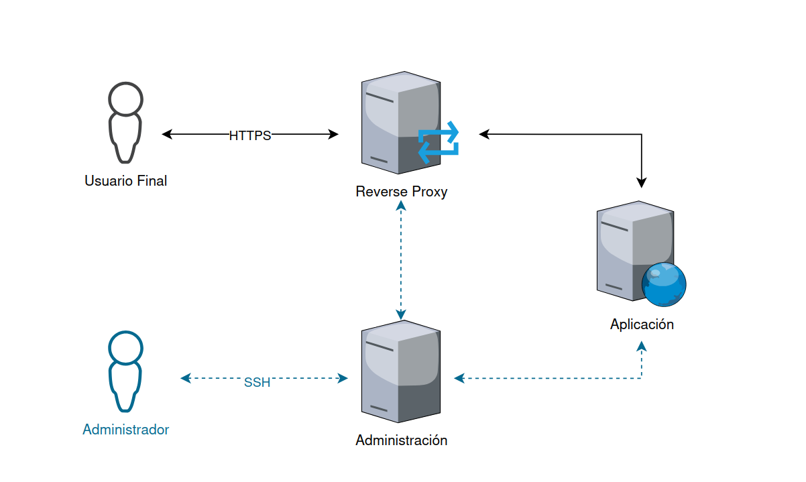

---

#### Network Topology and Addressing

The complete infrastructure of the GLPI service is deployed on a virtualized environment consisting of seven virtual machines, distributed across several internal networks that allow isolating, segmenting, and securing communication between the different service components.
Each virtual machine fulfills a specific role within the high availability architecture:

1. **HAProxy Server (Reverse Proxy)**
    Exposes the service to the NAC network, receives all HTTPS requests from users, and directs them to the virtual IP provided by Keepalived on the GLPI application nodes.

2. **Application Servers (APP1 and APP2)**
    Run GLPI through PHP-FPM. Both instances work in active/passive mode thanks to Keepalived, which assigns a floating virtual IP (VIP) used by HAProxy as the destination.

3. **Database Proxy (MaxScale)**
    It is the intermediate point between the GLPI servers and the MariaDB Galera cluster. It provides read/write load balancing and database backend abstraction.

4. **Database Servers (DB1 and DB2)**
    Implement a MariaDB Galera cluster, replicating information synchronously to ensure integrity and fault tolerance.

5. **Administration Server (NAT VM)**
    Allows secure system management via SSH, as well as providing Internet access via NAT for all internal VMs.

The topology is organized into four internal networks that adequately divide the communication flows according to their purpose:

* Internal Network (management and SSH access)
* App Network (traffic between HAProxy ↔ APPs)
* AppDB Network (traffic between APPs ↔ MaxScale)
* DB Network (communication between MaxScale ↔ DB cluster)

##### Networks Defined in the Architecture

###### External / Public Network

Publication of the GLPI service to internal users of the institution via HTTPS and allowing external administrative access only to the administration VM.

* **Range:** `172.24.133.0/24`
* **Connected servers:**

| Server         | Public IP        |
| -------------- | ---------------- |
| Administration | `172.24.133.216` |
| HAProxy        | `172.24.133.218` |

###### Internal Network (Management)

Management and SSH access for all internal VMs, as well as Internet access via NAT.

* **Range:** `192.168.216.0/24`
* **Connected servers:**

| Server                      | *Internal Network* IP |
| --------------------------- | --------------------- |
| Administration              | `192.168.216.1`       |
| DB Proxy (MaxScale)         | `192.168.216.2`       |
| Application Server 1        | `192.168.216.3`       |
| HAProxy                     | `192.168.216.4`       |
| Database 1 (MariaDB)        | `192.168.216.5`       |
| Database 2 (MariaDB)        | `192.168.216.6`       |
| Application Server 2        | `192.168.216.7`       |

###### App Network

Direct communication from HAProxy to GLPI instances and operation of Keepalived's VRRP protocol.

* **Range:** `192.168.218.0/24`
* **Note:** here resides the **floating virtual IP 192.168.218.100**, controlled by Keepalived.
* **Connected servers:**

|Server|*App Network* IP|*Keepalive (VIP)* IP|
|---|---|---|
|Application Server 1|`192.168.218.2`|`192.168.218.100`|
|Application Server 2|`192.168.218.3`|`192.168.218.100`|
|HAProxy|`192.168.218.1`|—|

###### AppDB Network

Secure connection between APP1/APP2 and MaxScale.

* **Range:** `192.168.217.0/24`
* **Connected servers:**

| Server                   | *AppDB Network* IP |
| ------------------------ | ------------------ |
| DB Proxy (MaxScale)      | `192.168.217.1`    |
| Application Server 1     | `192.168.217.2`    |
| Application Server 2     | `192.168.217.3`    |

###### DB Network (Galera Cluster)

Intra-cluster communication between DB1 and DB2, plus the link from MaxScale to the nodes.

* **Range:** `192.168.219.0/24`
* **Connected servers:**

| Server                 | *DB Network* IP |
| ---------------------- | --------------- |
| DB Proxy (MaxScale)    | `192.168.219.1` |
| Database 1 (DB1)       | `192.168.219.2` |
| Database 2 (DB2)       | `192.168.219.3` |

##### Switches and Port Groups

The hypervisor has *vSwitches* and *Port Groups* defined that allow logical and physical segmentation of communication between layers. This separation is fundamental for security and the correct operation of the service.

| **vSwitch / Port Group**                | **Description**                                                                                | **Connected to**                                         | **Uplink** |
| --------------------------------------- | ---------------------------------------------------------------------------------------------- | -------------------------------------------------------- | ---------- |
| **vExternalNetwork / External_Network** | Publication network accessible from the institutional intranet.                                | Administration (NAT), Reverse Proxy                      | vmnic3     |
| **vInternalNetwork / Internal_Network** | Internal administration network between VMs.                                                   | Administration, App1, App2, MaxScale, DB1, DB2, HA Proxy | —          |
| **vDBNetwork / DB_Network**             | Dedicated network for communication between MaxScale ↔ Galera cluster (db1, db2).              | MaxScale, DB1, DB2                                       | —          |
| **vAppDBNetwork / AppDB_Network**       | Connection network between application servers and the database, through MaxScale.             | MaxScale, App1, App2                                     |            |
| **vAppNetwork / App_Network**           | Network for communication between HA Proxy ↔ Application (App1, App2).                         | HA Proxy, App1, App2                                     | —          |

##### Physical Topology Diagram (C4 - Level 3)

To represent the physical and logical distribution of the GLPI service infrastructure, a C4 Diagram – Level 3 (Deployment) is used. This diagram shows how the system components are deployed on the virtual machines, how they connect to each other through segmented networks, and which interfaces each node uses.

###### Main Diagram Components (C4 - Level 3)

1. **HAProxy Server (HTTPS)**
    * Exposes the GLPI service to the institutional network via HTTPS.
    * Uses Keepalived to announce a virtual IP (VIP) on the *App Network*, enabling transparent failover.
    * Verifies the health of both application servers through *health checks*.
2. **GLPI Application Servers (app1 and app2 – PHP-FPM + Nginx)**
    * Execute the system logic.
    * Receive balanced traffic from HAProxy (VIP).
    * Communicate with MaxScale through the *AppDB Network*.
    * Do not expose services to external networks.
    * Are redundant: if one fails, HAProxy redirects all traffic to the other.
3. **Database Proxy Server (MaxScale)**
    * Acts as an intermediate layer between GLPI and the MariaDB nodes.
    * Performs read load balancing and write failover handling.
    * Only accessible from application servers through the *AppDB Network*.
4. **MariaDB Servers (db1 and db2)**
    * Implement a Galera cluster for synchronous replication.
    * Receive exclusive traffic from MaxScale.
    * Have no access to the external network or application network.
    * Provide high availability and consistency in the database.
5. **Administration Server (NAT VM)**
    * Management access via SSH to all internal servers through the *Internal Network*.
    * Performs monitoring, maintenance, and backups.
    * Its NAT interface allows Internet access for updates without exposing any other server.
    * Does not participate in the user flow of the service.
6. **vExternalNetwork (external vSwitch)**
    * Institutional public network.
    * Connected only to the HAProxy server.
    * Carries HTTPS traffic from users.
7. **vInternalNetwork**
    * Internal administration network.
    * Used for SSH access between servers.
    * Connected to HA Proxy, Application (1 and 2), MaxScale, Database (1 and 2) and Administration/NAT.
8. **vAppNetwork**
    * Network where HAProxy, app1, and app2 operate.
    * Carries HTTP requests from HAProxy to the applications.
    * Also used for VRRP (Keepalived) that controls the VIP.
9. **vAppDBNetwork**
    * Network dedicated to communication between app1/app2 → MaxScale.
10. **vDBNetwork**
    * Exclusive network between MaxScale and db1/db2.

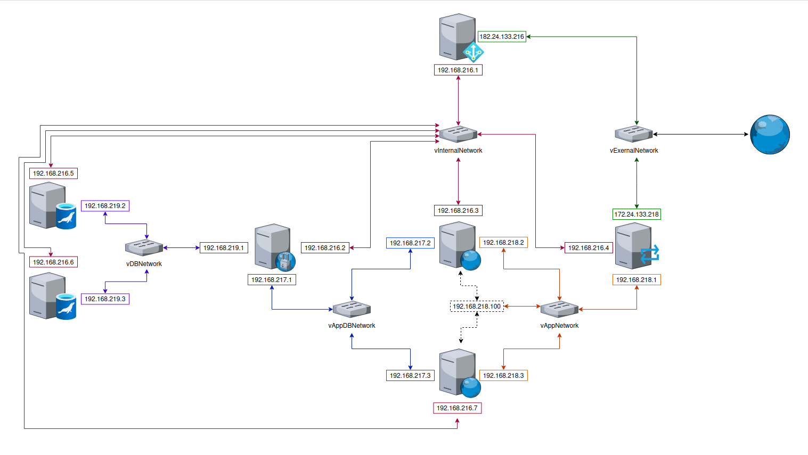

#### Service Security Architecture

The security architecture implemented for the GLPI service is based on the principles of segmentation, least privilege, end-to-end encryption, and hardening of all nodes. The main objective is to reduce the attack surface and guarantee the availability, integrity, and confidentiality of the data handled by the platform.

##### Operating System Security

All virtual machines are deployed on **Rocky Linux 9** as the base operating system, applying the following measures:

* **Updated system:** `dnf update` is run before configuring any service to ensure the installation of recent security patches.
* **System hardening:**
  * Removal of unnecessary packages and unused services.
  * Strict configuration of `firewalld` with zones separated by function.
  * Implementation of **Fail2ban** to protect exposed services such as SSH.
  * **SELinux** in *enforcing* mode with policies adjusted to each service.
* **Controlled privileged access:**
  * Only SSH access with keys is allowed.
  * Root login via SSH is disabled.

##### Network Security

Network security is based on zone isolation and granular traffic control.

###### Network Segmentation

Different virtual networks are used to separate critical functions:

* **Public network:** used exclusively by the HA Proxy and the NAT server.
* **Application network:** internal communication between HA Proxy and the application servers.
* **Database network:** connection between the cluster nodes (db1 and db2) with MaxScale.
* **Application with database network:** connection between the application servers and MaxScale.
* **Administration network:** internal network for SSH and maintenance.

###### Implemented Controls

* **Mandatory HTTPS encryption** at the entry point (HA proxy).
* **Zone-based firewall**, so that each interface belongs to a zone according to its role.
* **Rich rules** applied to:
  * Allow only HTTP/HTTPS traffic from external zones to the Proxy.
  * Restrict database queries so that only the Application Server can connect.
  * Block lateral traffic between servers that do not require it.

##### Database Security

The database server (MariaDB) runs in isolation and with specific controls:

* **Listens on an exclusive private interface**, avoiding public exposure.
* **Dedicated user for GLPI**, with minimum permissions.
* **Access restriction** to a single authorized IP.
* **Strong password policies**.

#### Service Testing

This section documents the set of tests performed to validate the operation of the GLPI service under conditions of fault tolerance, load balancing, and high availability in the various critical components of the architecture.
The main objective of these tests is to demonstrate that the system maintains operational continuity even in the face of simulated failures in the application, load balancing, and database layers.

##### MariaDB + Galera Cluster Tests

The first block of tests consisted of validating that servers **db1** and **db2** were in a state of permanent synchronization and that operations executed on one were correctly replicated to the other.

###### Validations Performed in MariaDB + Galera Cluster Tests

* The cluster status was verified using _wsrep_local_state_comment, confirming that both nodes were in the Synced state.
* A test database was created in db1 and its immediate appearance in db2 was confirmed.
* A table and records were created in db2, verifying their availability in db1, demonstrating bidirectional replication.
* A failure of node db1 was simulated to validate that the cluster remained operational with only db2, observing that the cluster size was reduced to 1 node but without losing availability.
* Upon restarting db1, it was verified that it automatically rejoined the cluster through an IST (Incremental State Transfer) process, avoiding complete reconstructions.

###### Result of MariaDB + Galera Cluster Tests

The MariaDB cluster operates correctly in active-active mode, maintains immediate consistency, and supports the failure of one node without impact on the service operation.

##### Database Proxy Tests (MaxScale)

To ensure the continuity of the database service to the application layer, the operation of **MaxScale** was validated against failures in the cluster nodes:

###### Validations Performed in Database Proxy Tests (MaxScale)

* It was verified that MaxScale correctly detected the role of each node (Master/Slave or Synced/Donor) within the Galera cluster.
* One of the MariaDB nodes was temporarily stopped and it was confirmed that MaxScale automatically redirected connections to the available node.
* It was confirmed that the GLPI application maintained connection without errors and without requiring reconfiguration on the web service side.

###### Result of Database Proxy Tests (MaxScale)

MaxScale responded appropriately to cluster failures, guaranteeing continuity of the database service.

##### Keepalived Failover Tests (App1 ↔ App2)

To validate the high availability of the application layer, failover tests were performed on app1 and app2 machines, which share a VIP (192.168.218.100/32) within the application network.

###### Validations Performed in Keepalived Failover Tests (App1 ↔ App2)

* The Keepalived service on app1 (master node) was shut down or stopped and it was verified that app2 automatically took the VIP, confirming the role switch (*BACKUP → MASTER*).
* It was validated on the server interface (via `ip addr`) that the VIP appeared correctly on app2.
* Service access was tested through the public IP of the HAProxy (172.24.133.218) confirming service continuity without interruption.
* Upon restarting Keepalived on app1, it was verified that it recovered its role as the primary node and that the VIP returned to it.

###### Result of Keepalived Failover Tests (App1 ↔ App2)

The implemented solution ensures immediate continuity of the application service even in the event of a complete failure of one of the VMs.

##### Load Balancing Tests (HAProxy)

The behavior of the HAProxy load balancer was checked, verifying its capacity to distribute requests between app1 and app2 and its reaction to failures.

###### Validations Performed in Load Balancing Tests (HAProxy)

* Multiple HTTP and HTTPS requests were made via `curl -vk` and via web browser, confirming alternating distribution between both nodes.
* It was verified that the *healthcheck* correctly marked a node as *DOWN* when its Nginx or PHP-FPM service was shut down.
* It was confirmed that, when a node was marked as *DOWN*, HAProxy sent all traffic only to the active node.

###### Result of Load Balancing Tests (HAProxy)

Load balancing behaves correctly both in normal state and in the face of failures in one of the nodes.

##### GLPI Service Availability Tests

Once all layers were validated, final user experience tests were performed on the service accessible from the institutional network.

###### Validations Performed in GLPI Service Availability Tests

* Access to the GLPI portal through the public address assigned to HAProxy.
* Login to the GLPI system confirming full functionality of the PHP backend and connection with the database.
* Verification of resource loading, file uploads, and navigation within the system.
* Functional tests of the GLPI system: ticket creation, access to inventory, element search, etc.

###### Result of GLPI Service Availability Tests

The service remained fully available both during normal tests and during infrastructure failure tests.

> Note: In the Implementation section, how the tests were performed is described in more practical terms along with the results in a more graphical manner, whether terminal outputs or images.
---

## Implementation

### Database Cluster

#### Creation and Initial Configuration of the New Servers (*db1*, *db2*, and *dbproxy*)

##### Remove Network Interfaces from the Current Database *vm*

1. Network interfaces on the *vm*.

    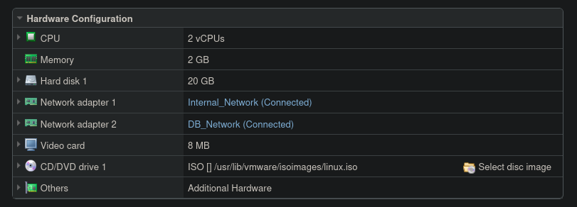

2. Click *Edit* to remove the interfaces.

    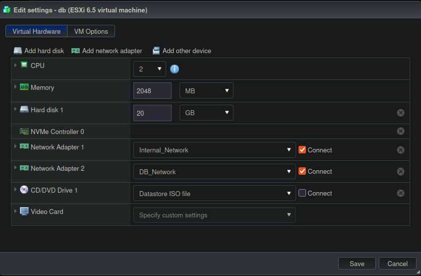

3. Remove the *Internal_Network* and *DB_Network* interfaces.

    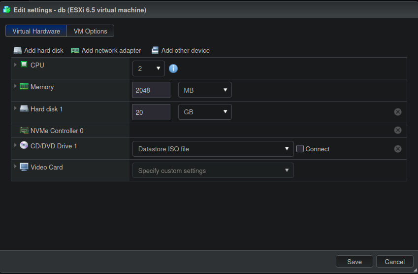

##### Clone the Three New Machines

1. Clone the new machine for *dbproxy*.

    ```sh
    ovftool \
    --skipManifestCheck \
    --lax \
    --noSSLVerify \
    --datastore="san_data" \
    --name="dbproxy" \
    --diskMode=thin \
    --net:"nat"="Internal_Network" \
    "/home/general/Documents/UCR/2025-Semestre-II/Infrastructure/projects/partII/golden_image/RockyServer9.ovf" \
    "vi://root@172.24.131.196/"
    ```

2. Clone the new machine for *db1*.

    ```sh
    ovftool \
    --skipManifestCheck \
    --lax \
    --noSSLVerify \
    --datastore="san_data" \
    --name="db1" \
    --diskMode=thin \
    --net:"nat"="Internal_Network" \
    "/home/general/Documents/UCR/2025-Semestre-II/Infrastructure/projects/partII/golden_image/RockyServer9.ovf" \
    "vi://root@172.24.131.196/"
    ```

3. Clone the new machine for *db2*.

    ```sh
    ovftool \
    --skipManifestCheck \
    --lax \
    --noSSLVerify \
    --datastore="san_data" \
    --name="db2" \
    --diskMode=thin \
    --net:"nat"="Internal_Network" \
    "/home/general/Documents/UCR/2025-Semestre-II/Infrastructure/projects/partII/golden_image/RockyServer9.ovf" \
    "vi://root@172.24.131.196/"
    ```

    * Result.

    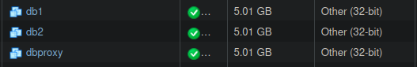

##### Assign Internal Network IP to the *dbproxy* *vm*

1. Open *nmtui*.

    ```sh
    sudo nmtui
    ```

2. Assign IP `192.168.216.2`.

    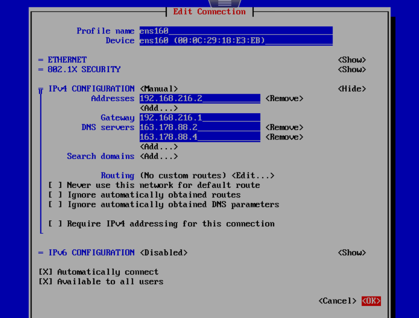

3. Check Internet connection.

    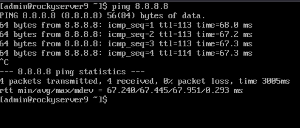

##### Assign Internal Network IP to the *db1* *vm*

1. Open *nmtui*.

    ```sh
    sudo nmtui
    ```

2. Assign IP `192.168.216.5`.

    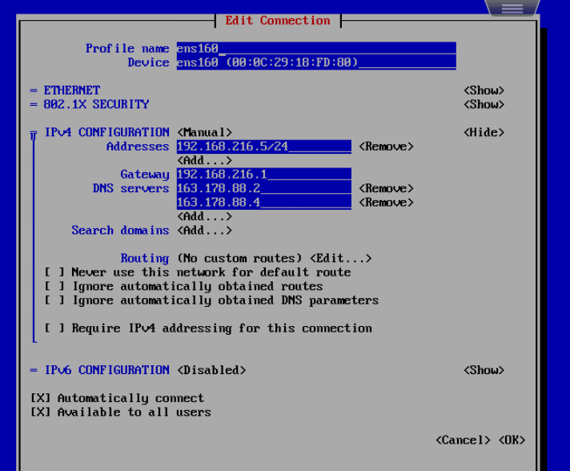

3. Check Internet connection.

    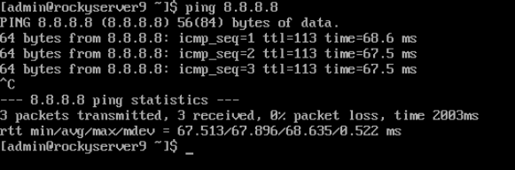

##### Assign Internal Network IP to the *db2* *vm*

1. Open *nmtui*.

    ```sh
    sudo nmtui
    ```

2. Assign IP `192.168.216.6`.

    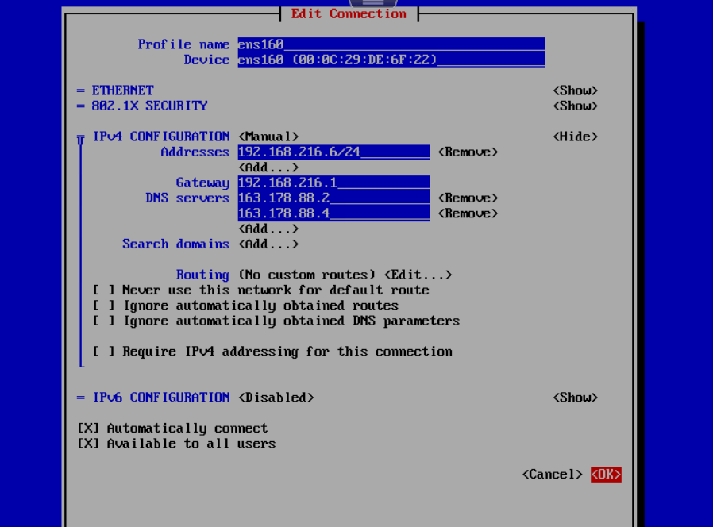

3. Check Internet connection.

    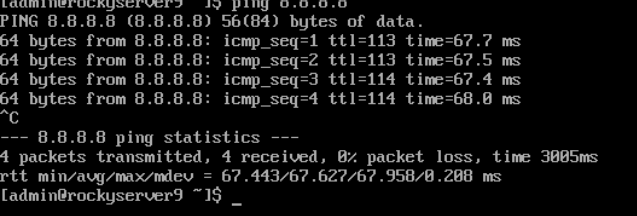

##### Create the *AppDB_Network* Network

1. Create the *vSwitch* *vAppDBNetwork*.

    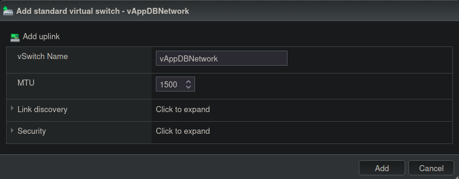

2. Create the *port group* *AppDB_Network*.

    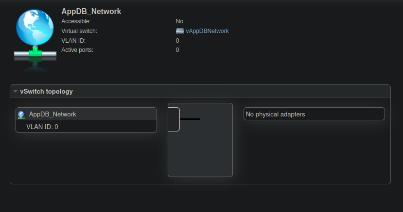

##### Change the *DB_Network* Interface to the Application *vm*

1. On the application *vm*, change the network interface from *DB_Network* to *AppDB_Network*.

    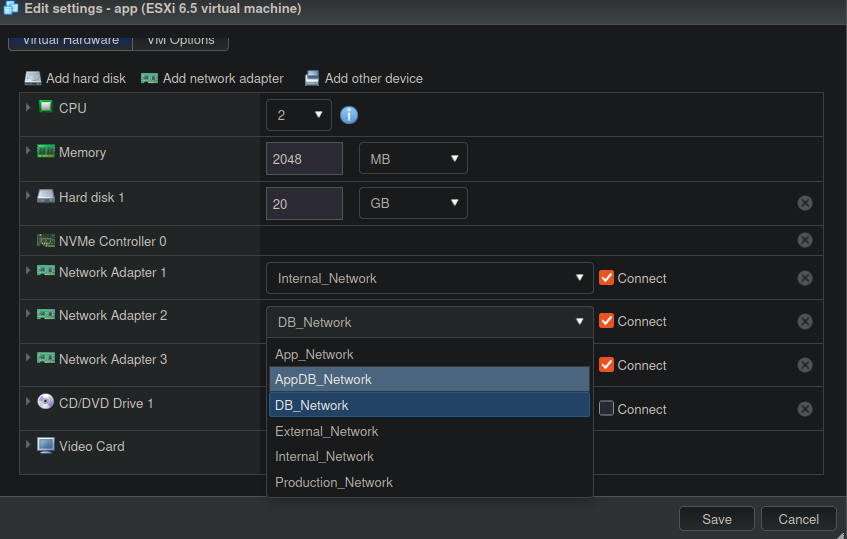
    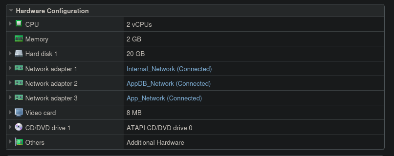

##### Assign Interface and IP to the *dbproxy* *vm*

1. Add the *DB_Network* network interface.

    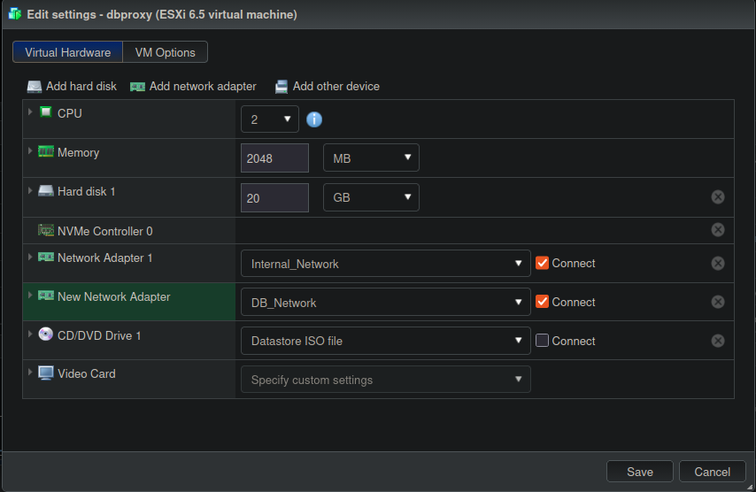

2. Assign an IP from the *DB_Network* `192.168.219.0` network, in this case `192.168.219.1` is assigned.

    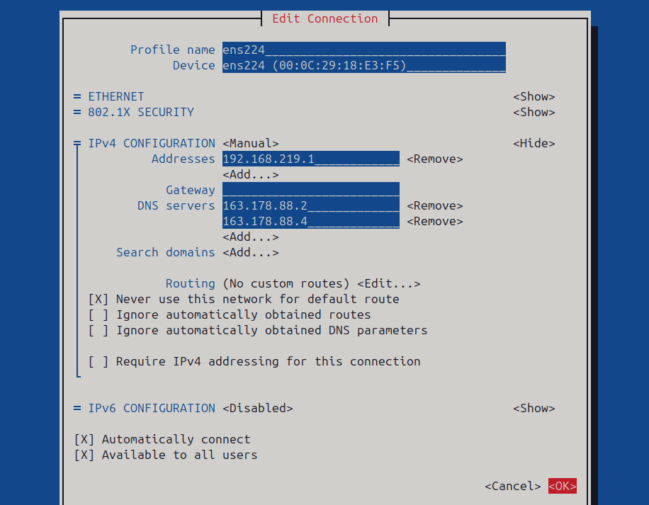

3. Verify.

    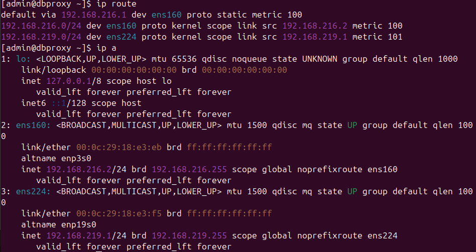

##### Assign Interface and IP to the *db1* *vm*

1. Add the *DB_Network* network interface.

    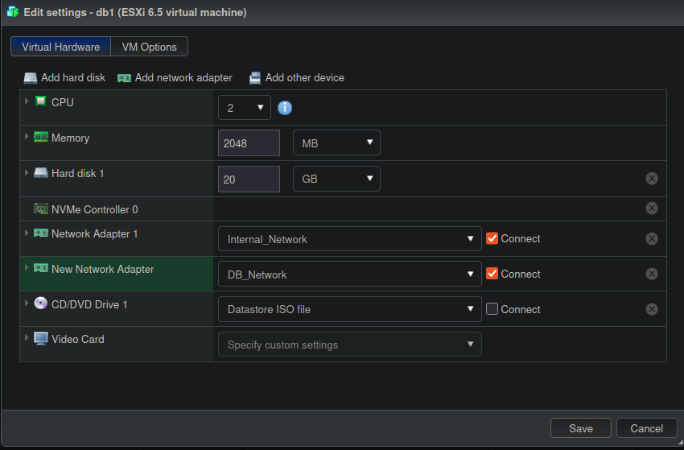

2. Assign an IP from the *DB_Network* `192.168.219.0` network, in this case `192.168.219.2` is assigned.

    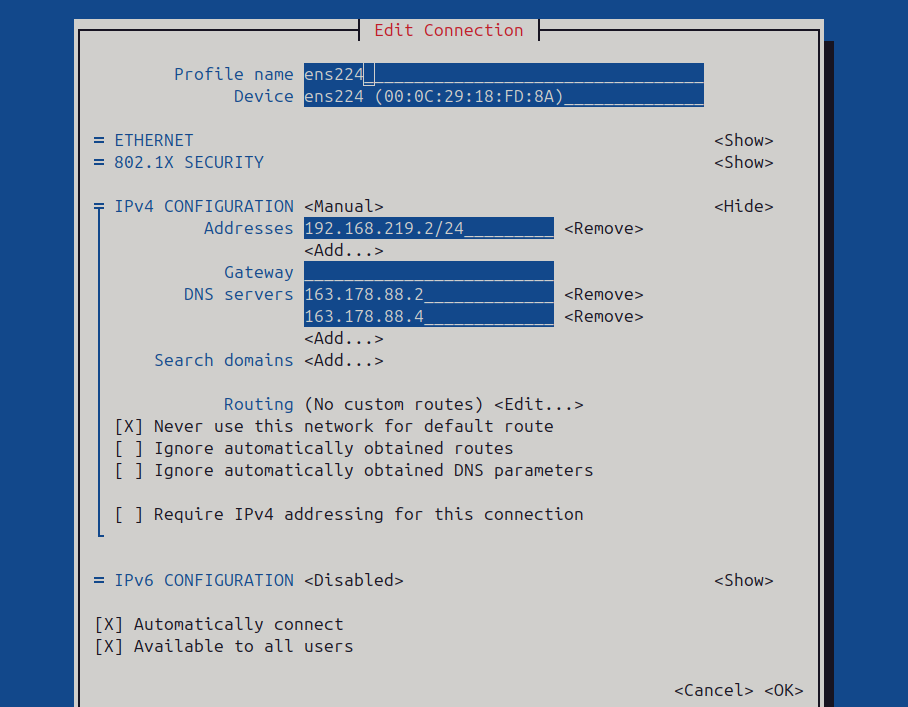

3. Verify.

    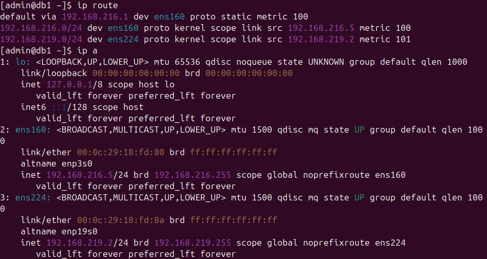

4. Check connection with *dbproxy*.

    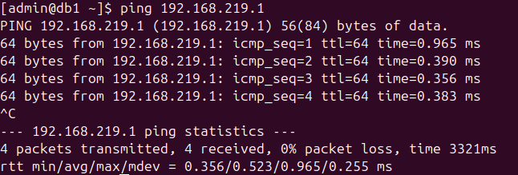

##### Assign Interface and IP to the *db2* *vm*

1. Add the *DB_Network* network interface.

    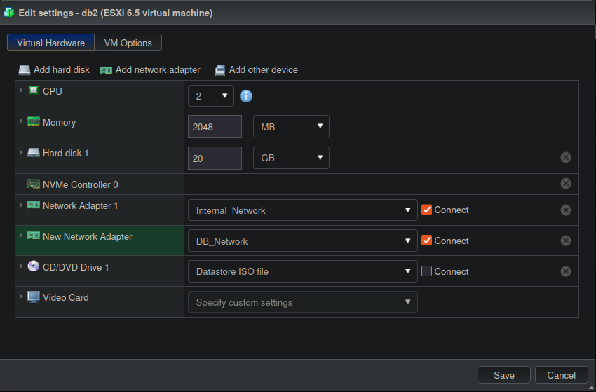

2. Assign an IP from the *DB_Network* `192.168.219.0` network, in this case `192.168.219.3` is assigned.

    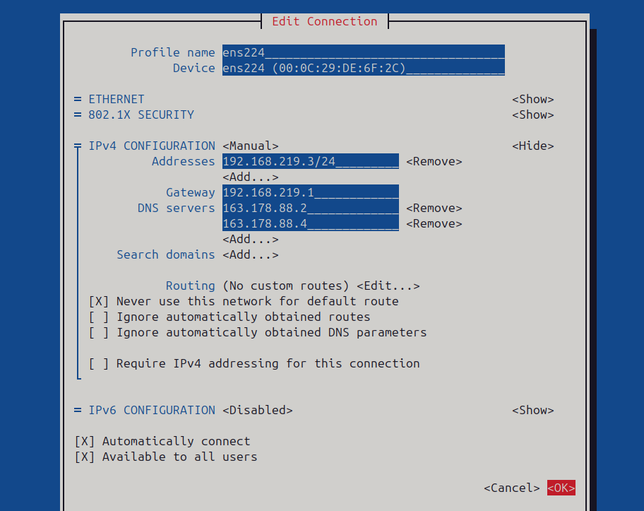

3. Verify.

    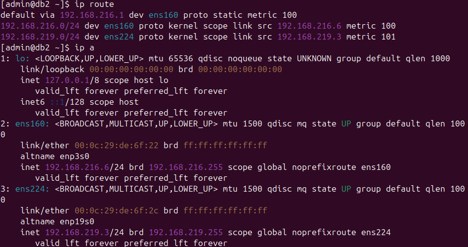

4. Check connection with *dbproxy* and *db1*.

    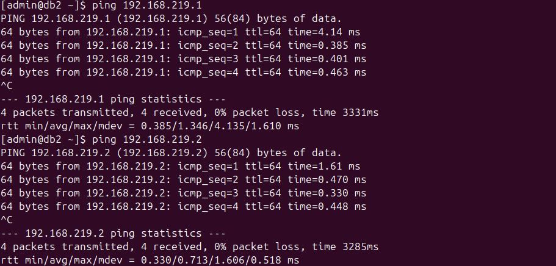
    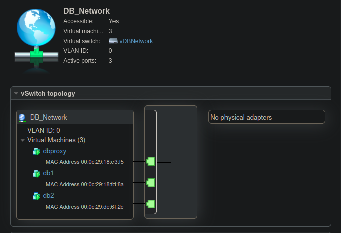

##### Configure the *internal* Zone on the Three *vms*

1. Move the *160* interface to the *internal* zone.

    ```sh
    sudo firewall-cmd --add-interface=ens160 --zone=internal --permanent
    ```

2. Disable unnecessary services.

    ```sh
    sudo firewall-cmd --zone=internal --remove-service=cockpit --permanent
    sudo firewall-cmd --zone=internal --remove-service=dhcpv6-client --permanent
    sudo firewall-cmd --zone=internal --remove-service=mdns --permanent
    sudo firewall-cmd --zone=internal --remove-service=samba-client --permanent
    ```

3. Reload to apply changes.

    ```sh
    sudo firewall-cmd --reload
    ```

4. Verify.

    ```sh
    sudo firewall-cmd --list-all --zone=internal
    ```

* Expected output.

    ```sh
    internal (active)
    target: default
    icmp-block-inversion: no
    interfaces: ens160
    sources:
    services: ssh
    ports:
    protocols:
    forward: yes
    masquerade: no
    forward-ports:
    source-ports:
    icmp-blocks:
    rich rules:
    ```

##### Configure the *database* Zone on the *dbproxy* *vm*

1. Create the *database* zone.

    ```sh
    sudo firewall-cmd --new-zone=database --permanent
    ```

    * Apply changes.

    ```sh
    sudo firewall-cmd --reload
    ```

2. Move the *224* interface to the *database* zone.

    ```sh
    sudo firewall-cmd --add-interface=ens224 --zone=database --permanent
    ```

3. Reload *firewalld*.

    ```sh
    sudo firewall-cmd --reload
    ```

4. Verify the *database* zone.

    ```sh
    sudo firewall-cmd --zone=database --list-all
    ```

5. Configure *richRules* on *dbproxy*.

    ```sh
    # Accept ALL from db1 (any port, inbound/outbound)
    sudo firewall-cmd --permanent --zone=database --add-rich-rule='rule family="ipv4" source address="192.168.219.2" accept'

    # Accept ALL from db2 (any port, inbound/outbound)
    sudo firewall-cmd --permanent --zone=database --add-rich-rule='rule family="ipv4" source address="192.168.219.3" accept'
    ```

    * Apply changes.

    ```sh
    sudo firewall-cmd --reload
    ```

6. Verify.

    ```sh
    sudo firewall-cmd --zone=database --list-all
    ```

    * Expected output.

    ```sh
    database (active)
    target: default
    icmp-block-inversion: no
    interfaces: ens224
    sources:
    services:
    ports:
    protocols:
    forward: no
    masquerade: no
    forward-ports:
    source-ports:
    icmp-blocks:
    rich rules:
        rule family="ipv4" source address="192.168.219.2" accept
        rule family="ipv4" source address="192.168.219.3" accept
    ```

##### Configure the *database* Zone on the *db1* *vm*

1. Create the *database* zone.

    ```sh
    sudo firewall-cmd --new-zone=database --permanent
    ```

    * Apply changes.

    ```sh
    sudo firewall-cmd --reload
    ```

2. Move the *224* interface to the *database* zone.

    ```sh
    sudo firewall-cmd --add-interface=ens224 --zone=database --permanent
    ```

3. Reload *firewalld*.

    ```sh
    sudo firewall-cmd --reload
    ```

4. Verify the *database* zone.

    ```sh
    sudo firewall-cmd --zone=database --list-all
    ```

5. Configure *richRules* on *db1*.

    ```sh
    # Accept ALL from MaxScale (any port)
    sudo firewall-cmd --permanent --zone=database --add-rich-rule='rule family="ipv4" source address="192.168.219.1" accept'

    # Accept ALL from db2 (any port)
    sudo firewall-cmd --permanent --zone=database --add-rich-rule='rule family="ipv4" source address="192.168.219.3" accept'
    ```

    * Apply changes.

    ```sh
    sudo firewall-cmd --reload
    ```

6. Verify.

    ```sh
    sudo firewall-cmd --zone=database --list-all
    ```

    * Expected output.

    ```sh
    database (active)
    target: default
    icmp-block-inversion: no
    interfaces: ens224
    sources:
    services:
    ports:
    protocols:
    forward: no
    masquerade: no
    forward-ports:
    source-ports:
    icmp-blocks:
    rich rules:
        rule family="ipv4" source address="192.168.219.1" accept
        rule family="ipv4" source address="192.168.219.3" accept
    ```

##### Configure the *database* Zone on the *db2* *vm*

1. Create the *database* zone.

    ```sh
    sudo firewall-cmd --new-zone=database --permanent
    ```

    * Apply changes.

    ```sh
    sudo firewall-cmd --reload
    ```

2. Move the *224* interface to the *database* zone.

    ```sh
    sudo firewall-cmd --add-interface=ens224 --zone=database --permanent
    ```

3. Reload *firewalld*.

    ```sh
    sudo firewall-cmd --reload
    ```

4. Verify the *database* zone.

    ```sh
    sudo firewall-cmd --zone=database --list-all
    ```

5. Configure *richRules* on *db2*.

    ```sh
    # Accept ALL from MaxScale (any port)
    sudo firewall-cmd --permanent --zone=database --add-rich-rule='rule family="ipv4" source address="192.168.219.1" accept'

    # Accept ALL from db1 (any port)
    sudo firewall-cmd --permanent --zone=database --add-rich-rule='rule family="ipv4" source address="192.168.219.2" accept'
    ```

    * Apply changes.

    ```sh
    sudo firewall-cmd --reload
    ```

6. Verify.

    ```sh
    sudo firewall-cmd --zone=database --list-all
    ```

    * Expected output.

    ```sh
    database (active)
    target: default
    icmp-block-inversion: no
    interfaces: ens224
    sources:
    services:
    ports:
    protocols:
    forward: no
    masquerade: no
    forward-ports:
    source-ports:
    icmp-blocks:
    rich rules:
        rule family="ipv4" source address="192.168.219.2" accept
        rule family="ipv4" source address="192.168.219.1" accept
    ```

##### Database Network Connectivity Tests

1. Test connectivity.

    ```sh
    # Install netcat if not present
    sudo dnf install -y ncat

    # From dbproxy, connect to db1
    ncat -zv 192.168.219.2 3306

    # From dbproxy, connect to db2
    ncat -zv 192.168.219.3 3306

    # From db1, connect to db2:3306
    ncat -zv 192.168.219.3 3306

    # From db1, connect to db2:4567
    ncat -zv 192.168.219.3 4567

    # From db2, connect to db1:3306
    ncat -zv 192.168.219.2 3306

    # From db2, connect to db1:4567
    ncat -zv 192.168.219.2 4567
    ```

    > Note: since MariaDB, Galera, or MaxScale have not yet been downloaded and configured, it will not be possible to verify this at the moment; test it after these configurations.

---

#### Galera Cluster Configuration

##### MariaDB and Galera Installation (on db1 and db2)

1. Install MariaDB.

    ```sh
    sudo dnf install -y mariadb-server
    ```

2. Install Galera.

    ```sh
    sudo dnf install -y galera
    ```

##### Galera File Configuration on the *db1* *vm*

1. Create the configuration file `/etc/my.cnf.d/galera.cnf` and open it.

    ```sh
    sudo nano /etc/my.cnf.d/galera.cnf
    ```

2. Add the configuration inside the file.

    ```ini
    [mysqld]
    wsrep_on=ON
    binlog_format=ROW
    default_storage_engine=InnoDB
    innodb_autoinc_lock_mode=2

    # Cluster name
    wsrep_cluster_name="galera_cluster"

    # List of nodes (both)
    wsrep_cluster_address="gcomm://192.168.219.2,192.168.219.3"

    # Local node address
    wsrep_node_address="192.168.219.2"
    wsrep_node_name="db1"

    # Galera provider
    wsrep_provider=/usr/lib64/galera/libgalera_smm.so

    # Donation method state
    wsrep_sst_method=rsync
    ```

    * `wsrep_on=ON`: **Activates the Galera module** within MariaDB. Without this line, MariaDB starts in standalone mode (without replication). It is **mandatory** in MariaDB 10.5+ on Rocky Linux 9.
    * `binlog_format=ROW`: Galera replicates **data changes** (rows), not SQL commands. It is mandatory.
    * **What it does:** configures the **binlog format** (binary log) in **ROW** mode (row-level logging).
    * **Why it is used with Galera:** Galera requires or recommends `ROW` because change-set replication (write-sets) works correctly when changes are represented at the row level. Avoids consistency issues that can occur with `STATEMENT`.
    * **Practical effect:** the binlog records changes per row (more data in the log, but more precision). Also useful for compatibility with backup and replication tools.
    * `default_storage_engine=InnoDB`: Galera only works with **InnoDB** (supports transactions); ignores MyISAM.
    * **What it does:** forces new tables to be created by default with the **InnoDB** engine.
    * **Why it is important:** Galera requires InnoDB (or XtraDB) because it needs transactions and row-level locking. Engines like MyISAM are not compatible with Galera synchronous replication.
    * **Practical effect:** ensures transactional behavior and ACID recovery.
    * `innodb_autoinc_lock_mode=2`: Allows multiple nodes to generate IDs simultaneously without locking the database (maximum speed).
    * **What it does:** defines how InnoDB manages `AUTO_INCREMENT`. The value `2` corresponds to **interleaved** (`2 = interleaved`), which is the recommended mode with Galera to avoid contention in multi-master environments.
    * **Why:** reduces locks between concurrent inserts on different nodes and avoids autoincrement conflicts in parallel operations.
    * **Practical effect:** better concurrency in bulk inserts; in some cases it may generate gaps in `AUTO_INCREMENT` values (this is normal).
    * `wsrep_cluster_name`: The "club name". If it doesn't match, nodes won't talk to each other.
    * `wsrep_cluster_address`: The phone list (`gcomm://IP1,IP2`). It tells the node who to call to join the group.
    * `wsrep_node_address`: "I am this IP". Ensures that data traffic travels through the correct network.
    * `wsrep_node_name`: "My name is db1". Used to identify who is who in the error logs.
    * `wsrep_provider`: Loads the Galera plugin file (`.so`) within MariaDB.
    * `wsrep_sst_method=rsync`: Defines how to copy data when joining. `rsync` copies everything robustly and simply. It is more reliable than `mariabackup` in small clusters, although it briefly blocks writes on the donor node during the initial transfer.

##### Galera File Configuration on the *db2* *vm*

1. Create the configuration file `/etc/my.cnf.d/galera.cnf` and open it.

    ```sh
    sudo nano /etc/my.cnf.d/galera.cnf
    ```

2. Add the configuration inside the file.

    ```ini
    [mysqld]
    wsrep_on=ON
    binlog_format=ROW
    default_storage_engine=InnoDB
    innodb_autoinc_lock_mode=2

    # Cluster name
    wsrep_cluster_name="galera_cluster"

    # List of nodes (both)
    wsrep_cluster_address="gcomm://192.168.219.2,192.168.219.3"

    # Local node address
    wsrep_node_address="192.168.219.3"
    wsrep_node_name="db2"

    # Galera provider
    wsrep_provider=/usr/lib64/galera/libgalera_smm.so

    # Donation method state
    wsrep_sst_method=rsync
    ```

3. Rename the file so it loads after mariadb-server.cnf.

    ```sh
    sudo mv /etc/my.cnf.d/galera.cnf /etc/my.cnf.d/z-galera.cnf
    ```

##### Create the SST User (Optional)

Only run on *db1*; since it is a cluster, once it is created, it will exist on both, but it needs to be created before activating the cluster. Also, only if you decide to use `mariabackup` instead of `rsync`, execute these steps only on *db1*:

1. On db1, start MariaDB without cluster.

    ```sh
    sudo systemctl start mariadb
    ```

2. Enter MariaDB.

    ```sh
    sudo mariadb
    ```

3. Execute.

    ```sh
    CREATE USER 'sstuser'@'192.168.219.%' IDENTIFIED BY 'sstpass';
    GRANT RELOAD, LOCK TABLES, PROCESS, REPLICATION CLIENT ON *.* TO 'sstuser'@'192.168.219.%';
    FLUSH PRIVILEGES;
    ```

    * `sudo systemctl start mariadb`: The database is started in "normal" mode (without cluster) just to create the user.
    * `CREATE USER 'sstuser'@'92.168.219.%'...`: Creates a user named `sstuser` that can connect from any IP (`%`) within the database network (192.168.219.0).
    * `GRANT RELOAD, LOCK TABLES...`: Grants special permissions.
    * `RELOAD`: To reload configurations.
    * `LOCK TABLES`: Needed briefly during the initial backup.
    * `REPLICATION CLIENT`: Permission to request data updates.
    * `FLUSH PRIVILEGES`: Tells MariaDB "Reload the user and permissions table right now".

4. Close MariaDB.

    ```sh
    exit;
    ```

##### Initialize (Bootstrap) the Cluster on db1

The "chicken and the egg" problem. If *db1* is started normally, it will look for *db2*. If *db2* is started, it will look for *db1*. Neither starts because they wait for the other. Someone has to start.

1. Install dependencies.

    ```sh
    sudo dnf install -y socat
    ```

2. Stop MariaDB on both nodes (for safety).

    ```sh
    sudo systemctl stop mariadb
    sudo systemctl status mariadb --no-pager
    ```

3. On *db1*, BOOTSTRAP the cluster.

    ```sh
    sudo systemctl set-environment _WSREP_NEW_CLUSTER='--wsrep-new-cluster'
    sudo systemctl start mariadb
    ```

    * This command is special. It starts MariaDB ignoring the list of other nodes.
    * It tells *db1*: "You are the first node, the origin, create a new Cluster UUID".

    > *Note:* Never use this command if the cluster is already running; only use it the first time (or after a total shutdown of all servers).

4. Clear the environment variable.

    ```sh
    sudo systemctl unset-environment _WSREP_NEW_CLUSTER
    ```

##### Verify Cluster Status on db1

1. Enter MariaDB.

    ```sh
    sudo mariadb
    ```

2. Execute inside.

    ```sh
    SELECT @@wsrep_on;
    SHOW STATUS LIKE 'wsrep_cluster_size';
    SHOW STATUS LIKE 'wsrep_cluster_status';
    SHOW STATUS LIKE 'wsrep_local_state_comment';
    ```

    * Expected output.
    * **`@@wsrep_on`**: Must be **1**. Confirms that Galera is activated.
    * **`wsrep_cluster_size`**: Must be **1**. (Only 1 live node for now).
    * **`wsrep_cluster_status`**: Must be **Primary**. Means the node is healthy and has authority.
    * **`wsrep_local_state_comment`**: Must be **Synced**. Means it is ready to receive queries.

3. Exit MariaDB.

    ```sh
    exit;
    ```

##### Join db2 to the Cluster

1. Install socat.

    ```sh
    sudo dnf install -y socat
    ```

2. Clear the datadir if it is a new installation or there were previous failed attempts.

    ```sh
    sudo systemctl stop mariadb
    sudo rm -rf /var/lib/mysql/*
    ```

3. Inside *db2*, start MariaDB (wait a few seconds (60/90) before verifying).

    ```sh
    sudo systemctl start mariadb
    ```

4. Verify.

    ```sh
    sudo mariadb -e "SHOW STATUS LIKE 'wsrep_cluster_size';"
    ```

    * Expected output.

    ```sh
    2
    ```

    * MariaDB reads the configuration file.
    * Sees the list `wsrep_cluster_address="gcomm://192.168.219.2..."`.
    * Contacts the IP of *db1*.
    * Authenticates using `sstuser`.
    * Says: "I'm new, give me all the data".
    * *db1* sends it a complete copy (SST).
    * *db2* applies the data and enters the `Synced` state.

    Now, `wsrep_cluster_size` should automatically rise to **2**.

##### Verify Mutual Synchronization

1. On *db1* and *db2*, run.

    ```sh
    sudo mariadb -e "SHOW STATUS LIKE 'wsrep_local_state_comment';"
    ```

2. Expected output on both.

    ```sh
    Synced
    ```

##### Functionality Tests

1. Create DB on db1 and view on db2.

    ```sh
    sudo mariadb -e "CREATE DATABASE testdb;"
    ```

    * On *db2*.

    ```sh
    sudo mariadb -e "SHOW DATABASES;"
    ```

    * Expected output.

    ```sh
    testdb
    ```

2. Create table on db2 and verify on db1.

    ```sh
    sudo mariadb -e "USE testdb; CREATE TABLE ejemplo(id INT);"
    ```

    * On *db1*.

    ```sh
    sudo mariadb -e "SHOW TABLES IN testdb;"
    ```

3. Create records on db2.

    ```sh
    sudo mariadb -e "INSERT INTO testdb.ejemplo VALUES (1),(2),(3);"
    ```

    * On *db1*.

    ```sh
    sudo mariadb -e "SELECT * FROM testdb.ejemplo;"
    ```

    * Expected output.

    ```sh
    +------+
    | id   |
    +------+
    |    1 |
    |    2 |
    |    3 |
    +------+
    ```

4. Simulate failure of *db1*, execute on *db1*.

    ```sh
    sudo systemctl stop mariadb
    ```

    * On *db2*.

    ```sh
    sudo mariadb -e "SHOW STATUS LIKE 'wsrep_cluster_size';"
    ```

    * Expected output.

    ```sh
    1
    ```

    * Means the cluster continues to function.

5. Restart db1 and validate rejoin.

    ```sh
    sudo systemctl start mariadb
    ```

    * Verify on *db1*.

    ```sh
    sudo mariadb -e "SHOW STATUS LIKE 'wsrep_local_state_comment';"
    ```

    * Expected output.

    ```sh
    Synced
    ```

    * When *db1* is turned on again (normal start, NOT `galera_new_cluster`):
        1. Looks for its companions.
        2. Finds *db2*.
        3. Realizes it is missing data (those written while it was off).
        4. Does an **IST (Incremental State Transfer)**: Only requests the missing data, does not copy the entire database again (much faster).
        5. Joins the cluster and the size returns to **2**.

    > *Note*: do not delete this test data, as it may be useful for the next MaxScale configuration.

---

#### MaxScale Configuration

##### Configure the *AppDB_Network* Network on the *dbproxy* and *app* *vms*

###### Verify Interfaces of the **vms**

1. In the *Virtual Machines < app < Edit* section, verify that *app* has the *AppDB_Network* network interface.

    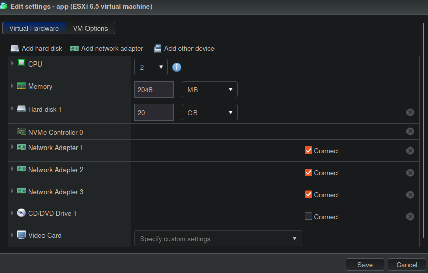

2. Add the *AppDB_Network* network interface to the *dbproxy* vm.

    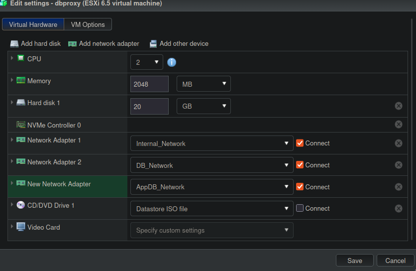

###### Assign *AppDB_Network* IPs on the *dbproxy* and *app* *vms*

1. Enter the *dbproxy* vm and open *nmtui*.

    ```sh
    sudo nmtui
    ```

2. Assign an IP from the 192.168.217.0/24 network, in this case *dbproxy* with IP 192.168.217.1/24.

    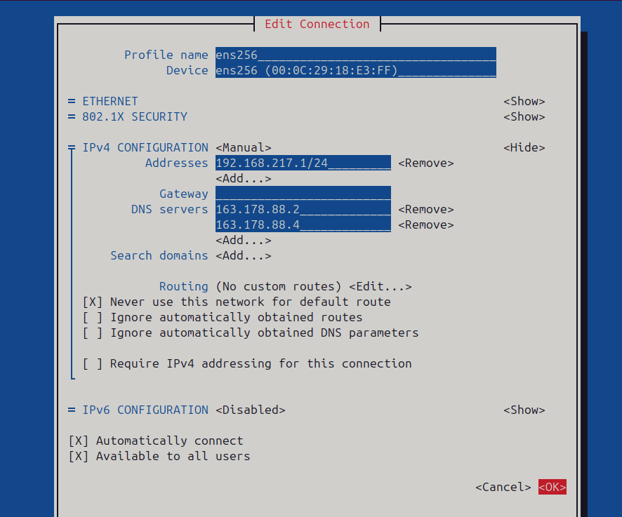

    * Verify.

    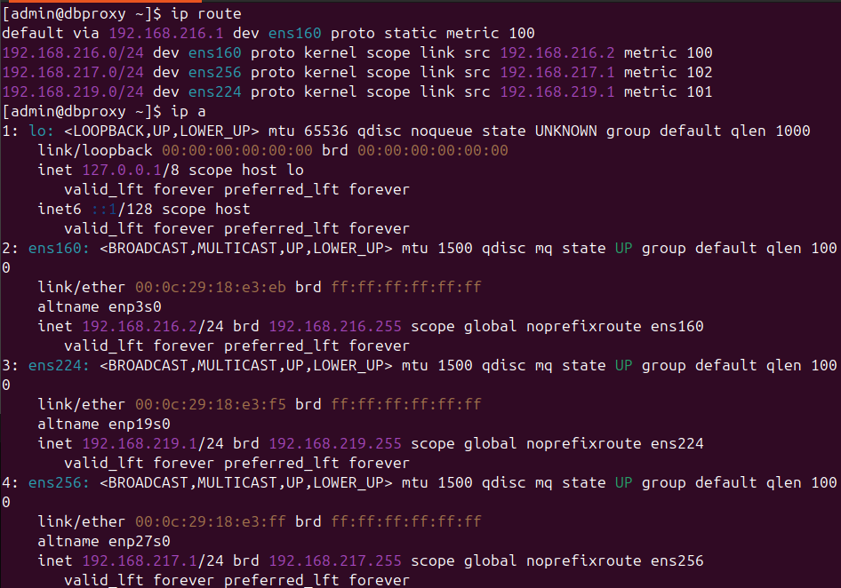

3. Enter the *dbproxy* vm and open *nmtui*.

    ```sh
    sudo nmtui
    ```

4. Assign an IP from the 192.168.217.0/24 network, in this case *app* with IP 192.168.217.2/24.

    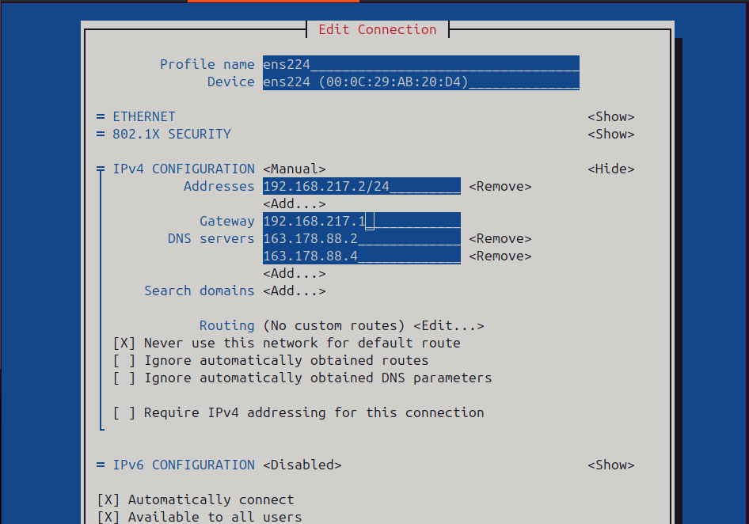

    * Verify.

    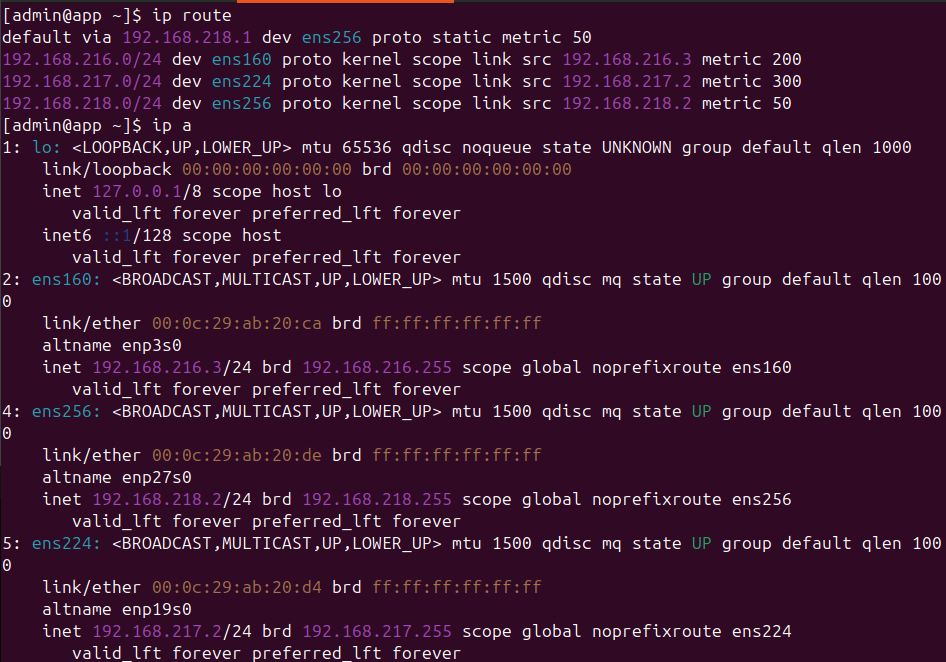

##### Firewall Zone Configuration on the *dbapp* *vm*

1. Create new zone for AppDB_Network.

    ```sh
    sudo firewall-cmd --new-zone=appdb --permanent
    ```

2. Reload to apply the new zone.

    ```sh
    sudo firewall-cmd --reload
    ```

3. Add the AppDB_Network interface to the new zone.

    ```sh
    sudo firewall-cmd --add-interface=ens256 --zone=appdb --permanent
    ```

4. Allow port 4006 (MaxScale) only from appweb (192.168.217.2).

    ```sh
    sudo firewall-cmd --zone=appdb --add-rich-rule='rule family="ipv4" source address="192.168.217.2" port protocol="tcp" port="4006" accept' --permanent
    ```

5. Reload firewall.

    ```sh
    sudo firewall-cmd --reload
    ```

    * Verify changes.

    ```sh
    sudo firewall-cmd --zone=appdb --list-all
    ```

* Expected output.

    ```sh
    appdb (active)
    target: default
    icmp-block-inversion: no
    interfaces: ens256
    sources:
    services:
    ports:
    protocols:
    forward: no
    masquerade: no
    forward-ports:
    source-ports:
    icmp-blocks:
    rich rules:
        rule family="ipv4" source address="192.168.217.2" port port="4006" protocol="tcp" accept
    ```

##### Firewall Zone Configuration on the *app* *vm*

1. Delete the current zone called *database*.

    ```sh
    sudo firewall-cmd --permanent --delete-zone=database
    ```

2. Reload to apply.

    ```sh
    sudo firewall-cmd --reload
    ```

3. Create new zone for AppDB_Network.

    ```sh
    sudo firewall-cmd --new-zone=appdb --permanent
    ```

4. Reload to apply the new zone.

    ```sh
    sudo firewall-cmd --reload
    ```

5. Add the AppDB_Network interface to the new zone.

    ```sh
    sudo firewall-cmd --add-interface=ens224 --zone=appdb --permanent
    ```

6. Allow port 4006 (MaxScale) only from dbproxy (192.168.217.1).

    ```sh
    sudo firewall-cmd --zone=appdb --add-rich-rule='rule family="ipv4" destination address="192.168.217.1" port protocol="tcp" port="4006" accept' --permanent
    ```

7. Reload firewall.

    ```sh
    sudo firewall-cmd --reload
    ```

    * Verify changes.

    ```sh
    sudo firewall-cmd --zone=appdb --list-all
    ```

    * Expected output.

    ```sh
    appdb (active)
    target: default
    icmp-block-inversion: no
    interfaces: ens224
    sources:
    services:
    ports:
    protocols:
    forward: no
    masquerade: no
    forward-ports:
    source-ports:
    icmp-blocks:
    rich rules:
        rule family="ipv4" destination address="192.168.217.1" port port="4006" protocol="tcp" accept
    ```

##### MaxScale Installation

1. Add the official repository with the MariaDB tool.

    ```sh
    curl -LsS https://r.mariadb.com/downloads/mariadb_repo_setup | sudo bash
    ```

2. Install the `maxscale` package.

    ```sh
    sudo dnf install -y maxscale
    ```

3. Verify the package was installed.

    ```sh
    rpm -qi maxscale
    ```

4. Enable and start MaxScale.

    ```sh
    sudo systemctl enable --now maxscale
    ```

5. Verify status.

    ```sh
    sudo systemctl status maxscale --no-pager
    ```

    * Output.

    ```sh
    ● maxscale.service - MariaDB MaxScale Database Proxy
        Loaded: loaded (/usr/lib/systemd/system/maxscale.service; enabled; preset: disabled)
        Active: active (running) since Sun 2025-11-23 16:05:41 CST; 3s ago
        Process: 32432 ExecStartPre=/usr/bin/install -d /var/cache/maxscale -o maxscale -g maxscale (code=exited, status=0/SUCCESS)
        Process: 32433 ExecStart=/usr/bin/maxscale (code=exited, status=0/SUCCESS)
    Main PID: 32435 (maxscale)
        Tasks: 10 (limit: 10845)
        Memory: 9.4M
            CPU: 90ms
        CGroup: /system.slice/maxscale.service
                └─32435 /usr/bin/maxscale
    ```

##### Creating MaxScale Users in the Galera Cluster

MaxScale needs two users with special permissions:

* **Monitoring user** (`maxscale_monitor`): To supervise the status of the nodes.
* **Routing user** (`maxscale_router`): To execute application queries.

**Execute ONLY on db1 (it will automatically replicate to db2):**

1. Enter MariaDB.

    ```sh
    sudo mariadb
    ```

2. Create monitoring user.

    ```sql
    CREATE USER 'maxscale_monitor'@'192.168.219.1' IDENTIFIED BY '<STRONG_PASSWORD>';
    ```

3. Grant necessary permissions for monitoring.

    ```sql
    GRANT REPLICATION CLIENT, REPLICATION SLAVE ON *.* TO 'maxscale_monitor'@'192.168.219.1';
    ```

    * **`REPLICATION CLIENT`** A key monitoring permission. Allows the user (in this case, `maxscale_monitor`) to run commands like `SHOW MASTER STATUS` or `SHOW SLAVE STATUS`. MaxScale needs this permission to monitor the Galera state (whether the node is synchronized, whether it is offline, etc.) without needing to replicate data.
    * **`REPLICATION SLAVE`** Permission that allows a user to act as a slave or replica node. Specifically, it allows connecting to another server to read its *binary log* and apply transactions. In the context of Galera, this permission is vital for synchronization and incremental state transfer (IST) between nodes.

4. Create user for queries (routing).

    ```sql
    CREATE USER 'maxscale_router'@'192.168.219.1' IDENTIFIED BY '<STRONG_PASSWORD>';
    CREATE USER 'maxscale_router'@'192.168.217.1' IDENTIFIED BY '<STRONG_PASSWORD>';
    ```

5. Grant read permissions on all databases.

    ```sql
    GRANT ALL PRIVILEGES ON *.* TO 'maxscale_router'@'192.168.219.1';
    GRANT ALL PRIVILEGES ON *.* TO 'maxscale_router'@'192.168.217.1';
    ```

6. Create user for GLPI with the application host.

    ```sh
    CREATE USER 'glpiuser'@'192.168.217.2' IDENTIFIED BY '<STRONG_PASSWORD>';
    CREATE USER 'glpiuser'@'192.168.219.1' IDENTIFIED BY '<STRONG_PASSWORD>';
    ```

    * Grant permissions on the entire segment.

    ```sh
    GRANT ALL PRIVILEGES ON glpidb.* TO 'glpiuser'@'192.168.217.2';
    GRANT ALL PRIVILEGES ON glpidb.* TO 'glpiuser'@'192.168.219.1';
    ```

7. Apply changes.

    ```sql
    FLUSH PRIVILEGES;
    ```

8. Verify created users.

    ```sql
    SELECT User, Host FROM mysql.user;
    ```

    * Expected output.

    ```sql
    +------------------+---------------+
    | User             | Host          |
    +------------------+---------------+
    | maxscale_router  | 192.168.217.1 |
    | glpiuser         | 192.168.217.2 |
    | sstuser          | 192.168.219.% |
    | glpiuser         | 192.168.219.1 |
    | maxscale_monitor | 192.168.219.1 |
    | maxscale_router  | 192.168.219.1 |
    | mariadb.sys      | localhost     |
    | mysql            | localhost     |
    | root             | localhost     |
    +------------------+---------------+
    ```

##### MaxScale Configuration for the Galera Cluster

1. Edit the MaxScale configuration file.

    ```sh
    sudo nano /etc/maxscale.cnf
    ```

    * Add (delete the defaults).

    ```ini
    # MaxScale Configuration for Galera Cluster
    # Documentation: https://mariadb.com/kb/en/mariadb-maxscale/

    [maxscale]
    threads=auto
    log_augmentation=1
    ms_timestamp=1

    # -------------------------------------------------------------------
    # Monitor: Monitors the status of the nodes in the Galera Cluster
    # -------------------------------------------------------------------
    [Galera-Monitor]
    type=monitor
    module=galeramon
    servers=db1,db2
    user=maxscale_monitor
    passwd=<PASSWORD>
    monitor_interval=2000
    backend_connect_timeout=10
    use_priority=false
    available_when_donor=true

    # -------------------------------------------------------------------
    # Definition of Servers (Cluster Nodes)
    # -------------------------------------------------------------------
    [db1]
    type=server
    address=192.168.219.2
    port=3306
    protocol=MariaDBBackend

    [db2]
    type=server
    address=192.168.219.3
    port=3306
    protocol=MariaDBBackend

    # -------------------------------------------------------------------
    # Service 1: Read/Write Splitting
    # -------------------------------------------------------------------
    [Read-Write-Service]
    type=service
    router=readwritesplit
    servers=db1,db2
    user=maxscale_router
    passwd=<PASSWORD>
    max_slave_connections=100
    use_sql_variables_in=master
    master_failure_mode=fail_on_write
    transaction_replay=true

    # -------------------------------------------------------------------
    # Listener 1: Port for Read/Write Split Service
    # IMPORTANT: Use the REAL IP of dbproxy
    # -------------------------------------------------------------------
    [Read-Write-Listener]
    type=listener
    service=Read-Write-Service
    protocol=MariaDBClient
    port=4006
    address=192.168.21.1
    ssl=off
    ```

    * Verify and grant permissions.

    ```sh
    sudo chown maxscale:maxscale /etc/maxscale.cnf
    sudo chmod 600 /etc/maxscale.cnf
    ```

2. Validate the configuration file.

    ```sh
    sudo -u maxscale maxscale --config-check
    ```

    * Expected output.

    ```sh
    Configuration file /etc/maxscale.cnf is valid.
    ```

3. Start and enable the MaxScale service.

    ```sh
    sudo systemctl start maxscale
    ```

    * Verify status.

    ```sh
    sudo systemctl status maxscale --no-pager
    ```

    * Expected output.

    ```sh
    ● maxscale.service - MariaDB MaxScale Database Proxy
        Loaded: loaded (/usr/lib/systemd/system/maxscale.service; enabled; preset: disabled)
        Active: active (running) since Sun 2025-11-23 16:05:41 CST; 4h 49min ago
        Process: 32432 ExecStartPre=/usr/bin/install -d /var/cache/maxscale -o maxscale -g maxscale (code=exited, status=0/SUCCESS)
        Process: 32433 ExecStart=/usr/bin/maxscale (code=exited, status=0/SUCCESS)
    Main PID: 32435 (maxscale)
        Tasks: 10 (limit: 10845)
        Memory: 9.4M
            CPU: 22.367s
        CGroup: /system.slice/maxscale.service
                └─32435 /usr/bin/maxscale
    ```

4. Enable automatic startup.

    ```sh
    sudo systemctl enable maxscale
    ```

    * Verify.

    ```sh
    sudo systemctl is-enabled maxscale
    ```

    * Expected output.

    ```sh
    enabled
    ```

5. View MaxScale logs.

    ```sh
    sudo journalctl -u maxscale -f
    ```

##### Using maxctrl (Administration CLI)

1. List all servers and their status.

    ```sh
    sudo maxctrl list servers
    ```

    * Expected output.

    ```sh
    ┌────────┬───────────────┬──────┬─────────────┬─────────────────────────┬──────┬────────────────┐
    │ Server │ Address       │ Port │ Connections │ State                   │ GTID │ Monitor        │
    ├────────┼───────────────┼──────┼─────────────┼─────────────────────────┼──────┼────────────────┤
    │ db1    │ 192.168.219.2 │ 3306 │ 0           │ Master, Synced, Running │      │ Galera-Monitor │
    ├────────┼───────────────┼──────┼─────────────┼─────────────────────────┼──────┼────────────────┤
    │ db2    │ 192.168.219.3 │ 3306 │ 0           │ Slave, Synced, Running  │      │ Galera-Monitor │
    └────────┴───────────────┴──────┴─────────────┴─────────────────────────┴──────┴────────────────┘
    ```

2. View monitor status.

    ```sh
    sudo maxctrl show monitor Galera-Monitor
    ```

3. View active services.

    ```sh
    sudo maxctrl list services
    ```

    * Expected output.

    ```sh
    ┌────────────────────┬────────────────┬─────────────┬───────────────────┬──────────┐
    │ Service            │ Router         │ Connections │ Total Connections │ Targets  │
    ├────────────────────┼────────────────┼─────────────┼───────────────────┼──────────┤
    │ Read-Write-Service │ readwritesplit │ 0           │ 0                 │ db1, db2 │
    └────────────────────┴────────────────┴─────────────┴───────────────────┴──────────┘
    ```

##### Verification of MaxScale Proper Operation

1. From *dbproxy*, connect to the Read/Write Split service (port 4006). First install the MariaDB/MySQL command-line client `sudo dnf install mariadb -y`.

    ```sh
    mysql -h 192.168.217.1 -P 4006 -u maxscale_router -p'<PASSWORD>' --skip-ssl -e "SELECT @@hostname, NOW();"
    ```

    * Expected output.

    ```sh
    +------------+---------------------+
    | @@hostname | NOW()               |
    +------------+---------------------+
    | db2        | 2025-11-24 10:14:25 |
    +------------+---------------------+
    ```

2. Verify that writes work.

    ```sh
    mysql -h 192.168.217.1 -P 4006 -u maxscale_router -p'<PASSWORD>' --skip-ssl << 'EOF'
    USE testdb;
    ALTER TABLE ejemplo ADD COLUMN nombre VARCHAR(255);
    DESCRIBE ejemplo;
    EOF
    ```

    * Insert.

    ```sh
    mysql -h 192.168.217.1 -P 4006 -u maxscale_router -p'<PASSWORD>' --skip-ssl << 'EOF'
    USE testdb;
    INSERT INTO ejemplo (id, nombre) VALUES (100, 'Prueba MaxScale');
    SELECT * FROM ejemplo WHERE id = 100;
    EOF
    ```

    * Expected output.

    ```sh
    id    nombre
    100    NULL
    100    Prueba MaxScale
    ```

3. Verify replication on the direct nodes.

    ```sh
    # On db1
    sudo mariadb -e "SELECT * FROM testdb.ejemplo WHERE id = 100;"

    # On db2
    sudo mariadb -e "SELECT * FROM testdb.ejemplo WHERE id = 100;"
    ```

    * Output.

    ```sh
    +------+-----------------+
    | id   | nombre          |
    +------+-----------------+
    |  100 | NULL            |
    |  100 | Prueba MaxScale |
    +------+-----------------+
    ```

##### Simulate Node Failure and Verify Automatic Failover

1. Stop the *db1* vm.

    ```sh
    sudo systemctl stop mariadb
    ```

    * Verify that MaxScale detected the failure, from *dbproxy*.

    ```sh
    sudo maxctrl list servers
    ```

    * Expected output.

    ```sh
    ┌────────┬───────────────┬──────┬─────────────┬─────────────────────────┬──────┬────────────────┐
    │ Server │ Address       │ Port │ Connections │ State                   │ GTID │ Monitor        │
    ├────────┼───────────────┼──────┼─────────────┼─────────────────────────┼──────┼────────────────┤
    │ db1    │ 192.168.219.2 │ 3306 │ 0           │ Down                    │      │ Galera-Monitor │
    ├────────┼───────────────┼──────┼─────────────┼─────────────────────────┼──────┼────────────────┤
    │ db2    │ 192.168.219.3 │ 3306 │ 0           │ Master, Synced, Running │      │ Galera-Monitor │
    └────────┴───────────────┴──────┴─────────────┴─────────────────────────┴──────┴────────────────┘
    ```

    * db1 changed to Down, db2 continues Running.

2. From *dbproxy*, test that queries continue to work.

    ```sh
    mysql -h 192.168.217.1 -P 4006 -u maxscale_router -p'<PASSWORD>' --skip-ssl -e "SELECT @@hostname, NOW();"
    ```

3. Recover the *db1* database node.

    ```sh
    sudo systemctl start mariadb
    ```

4. From *dbproxy*, verify that *db1* is operational again.

    ```sh
    sudo maxctrl list servers
    ```

    * Expected output.

    ```sh
    +------------+---------------------+
    | @@hostname | NOW()               |
    +------------+---------------------+
    | db2        | 2025-11-24 10:27:53 |
    +------------+---------------------+
    ```

##### Check the Master-Slave Schema

1. Test reads.

    ```sh
    for i in {1..10}; do
        echo -n "Attempt $i: "
        mysql -h 192.168.217.1 -P 4006 -u maxscale_router -p'<PASSWORD>' --skip-ssl -e "SELECT @@hostname;" 2>&1 | grep -oE "db[12]"
    done
    ```

    * Output.

    ```sh
    SELECT 1: db2
    SELECT 2: db2
    SELECT 3: db2
    SELECT 4: db2
    SELECT 5: db2
    SELECT 6: db2
    SELECT 7: db2
    SELECT 8: db2
    SELECT 9: db2
    SELECT 10: db2
    ```

2. Test writes.

    ```sh
    mysql -h 192.168.217.1 -P 4006 -u maxscale_router -p'<PASSWORD>' --skip-ssl << 'EOF'
    USE testdb;
    INSERT INTO ejemplo (id, nombre) VALUES (500, 'Test escritura Master-Slave');
    EOF
    ```

    * Output from *db1* (Master).

    ```sh
    343 Query INSERT INTO ejemplo (id, nombre) VALUES (500, 'Test escritura Master-Slave')
    ```

##### Verification from appweb with the glpiuser

1. Test connection to MaxScale.

    ```sh
    mysql -h 192.168.217.1 -P 4006 -u glpiuser -p'<PASSWORD>' --skip-ssl -e "SELECT @@hostname, NOW();"
    ```

2. Test read/write.

    ```sh
    mysql -h 192.168.217.1 -P 4006 -u maxscale_router -p'<PASSWORD>' --skip-ssl << 'EOF'
    USE testdb;
    INSERT INTO ejemplo (id, nombre) VALUES (900, 'Test desde appweb');
    SELECT * FROM ejemplo WHERE id = 900;
    EOF
    ```

3. Verify that data can be read.

    ```sh
    mysql -h 192.168.217.1 -P 4006 -u maxscale_router -p'<PASSWORD>' --skip-ssl -e "SELECT * FROM testdb.ejemplo ORDER BY id LIMIT 10;"
    ```

#### Transfer Data from the Previous Database to the Cluster

1. Add interface to the old database *vm* (optional if not removed previously).

    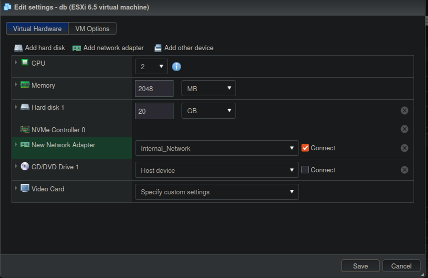

2. Assign an IP from the internal network 192.168.216.0, in this case 192.168.216.7.

    ```sh
    sudo nmtui
    ```

    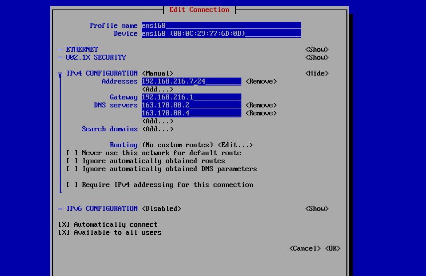

3. Verify that the GLPI database exists.

    ```sh
    mysql -u root -p -e "SHOW DATABASES;"
    ```

    * Output.

    ```sh
    +--------------------+
    | Database           |
    +--------------------+
    | glpidb             |
    | information_schema |
    | mysql              |
    | performance_schema |
    +--------------------+
    ```

4. Create the dump (a dump is a text file that contains all the SQL instructions necessary to recreate the complete structure and restore all database data from that moment on).

    ```sh
    mysqldump --single-transaction --routines --triggers --events \
    -u root -p glpidb > /root/glpidb_dump.sql
    ```

5. Transfer the dump and files to the cluster.

    ```sh
    scp /root/glpidb_dump.sql admin@192.168.216.5:/home/admin/
    ```

6. Verify the cluster is healthy.

    ```sh
    sudo mariadb
    ```

    * Insert.

    ```sh
    SHOW STATUS LIKE 'wsrep_cluster_size';
    SHOW STATUS LIKE 'wsrep_local_state_comment';
    ```

    * Output.

    ```sh
    +--------------------+-------+
    | Variable_name      | Value |
    +--------------------+-------+
    | wsrep_cluster_size | 2     |
    +--------------------+-------+

    +---------------------------+--------+
    | Variable_name             | Value  |
    +---------------------------+--------+
    | wsrep_local_state_comment | Synced |
    +---------------------------+--------+
    ```

7. Create the database.

    ```sh
    sudo mariadb -e "CREATE DATABASE glpidb CHARACTER SET utf8mb4 COLLATE utf8mb4_unicode_ci;"
    ```

    * Verify it was created.

    ```sh
    sudo mariadb -e "SHOW DATABASES;"
    ```

    * Expected output.

    ```sh
    +--------------------+
    | Database           |
    +--------------------+
    | glpidb             |
    +--------------------+

    ```

8. Import the dump in db1; Galera automatically replicates to db2.

    ```sh
    sudo mariadb glpidb < /home/admin/glpidb_dump.sql
    ```

9. Verify that the database exists.

    ```sh
    sudo mariadb -e "SHOW DATABASES LIKE 'glpidb';"
    ```

10. Verify it was done correctly.

    ```sh
    # View imported tables
    sudo mariadb -e "SHOW TABLES IN glpidb;"

    # Verify a typical record count
    sudo mariadb -e "SELECT COUNT(*) FROM glpidb.glpi_users;"

    # Verify no errors occurred during the import
    sudo mariadb -e "CHECK TABLE glpidb.glpi_users;"
    ```

#### Configure GLPI to Work with the Cluster

1. View current GLPI configuration.

    ```sh
    sudo cat /srv/www/glpi/config/config_db.php
    ```

    * Output.

    ```sh
    <?php
    class DB extends DBmysql {
    public $dbhost = '192.168.217.1';
    public $dbuser = 'glpiuser';
    public $dbpassword = '%25OA5%26h3k6EiRy%25';
    public $dbdefault = 'glpidb';
    public $use_utf8mb4 = true;
    public $allow_myisam = false;
    public $allow_datetime = false;
    public $allow_signed_keys = false;
    }
    ```

2. Edit and add with the command `sudo nano /srv/www/glpi/config/config_db.php`.

    ```sh
    <?php
    class DB extends DBmysql {
    public $dbhost = '192.168.217.1:4006';
    public $dbuser = 'glpiuser';
    public $dbpassword = '<GLPIUSER_PASSWORD>';
    public $dbdefault = 'glpidb';
    public $use_utf8mb4 = true;
    public $allow_myisam = false;
    public $allow_datetime = false;
    public $allow_signed_keys = false;
    }
    ```

3. Restart web services.

    ```sh
    sudo systemctl restart nginx
    sudo systemctl restart php-fpm
    ```

4. Adjust permissions.

    ```sh
    sudo chown nginx:nginx /srv/www/glpi/config/config_db.php
    sudo chmod 640 /srv/www/glpi/config/config_db.php
    ```

5. Adjust SELinux.

    ```sh
    sudo restorecon -Rv /srv/www/glpi/
    ```

6. Clear cache.

    ```sh
    sudo systemctl restart php-fpm
    sudo rm -rf /srv/www/glpi/files/_cache/*
    ```

#### Verify GLPI Works Correctly

1. Open the browser at 172.24.133.218.

    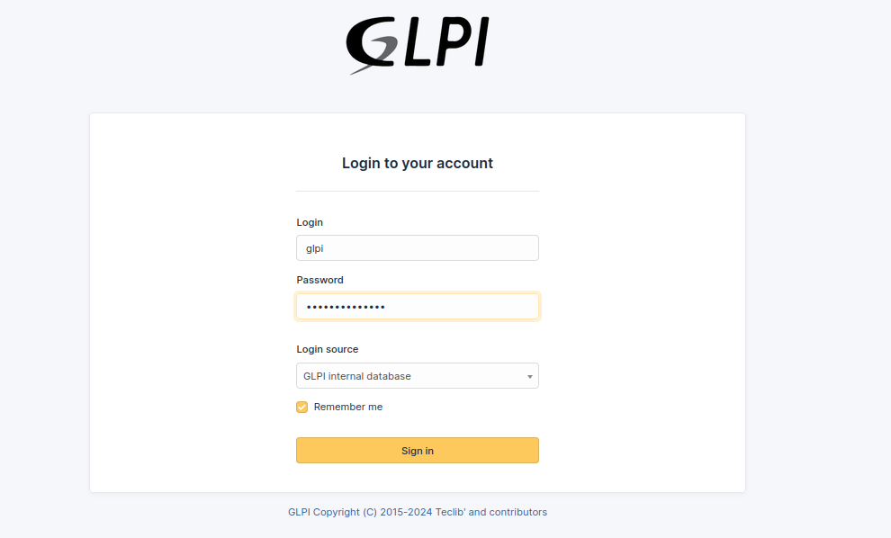

2. View overview of previously registered elements.

    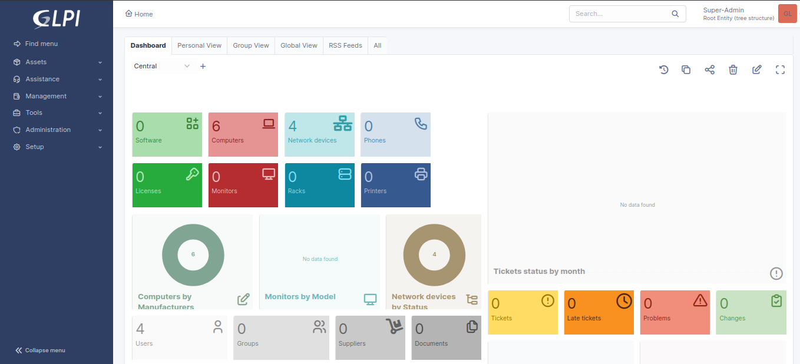

3. View specific elements.

    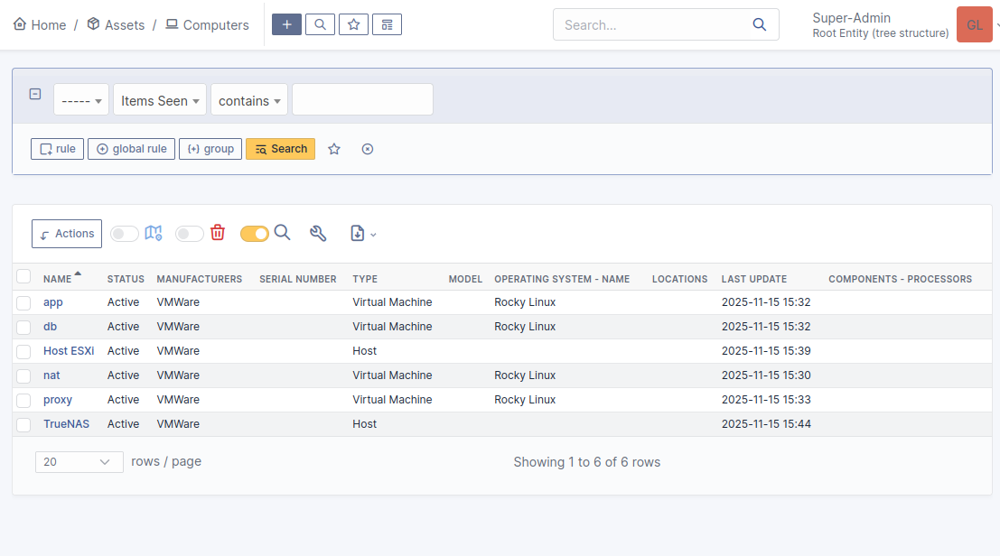
    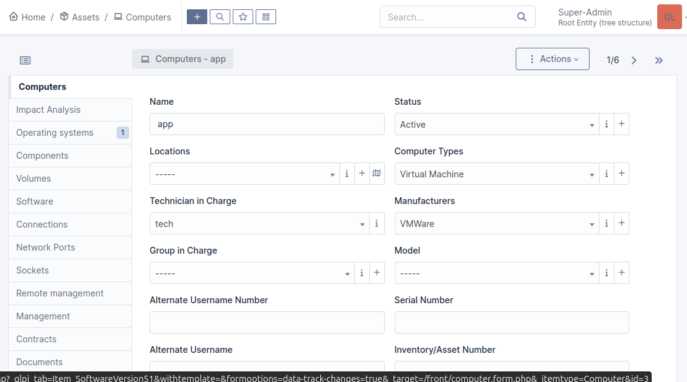

---

### Application Fault Tolerance

#### Clone and Configure the *app2* *vm*

##### Clone the *app1* *vm*

Using [video](https://www.youtube.com/watch?v=Q-SpblOEDPY) as reference.

1. The *vm* (*app*) to be cloned must be shut down, then go to the *Storage* section and the *Datastore browser*.

    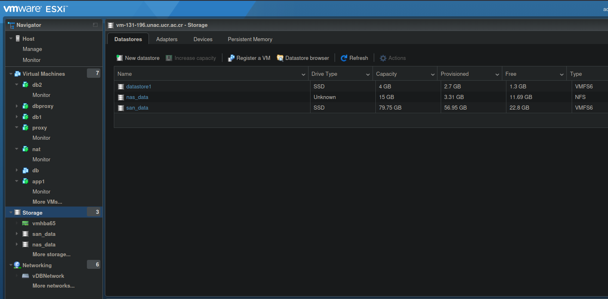

2. Go to the *san_data* section.

    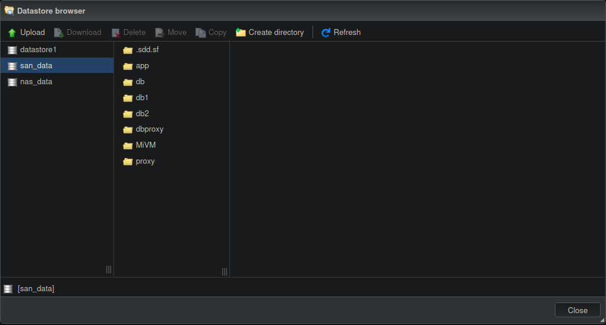

3. Click *Create directory*.

    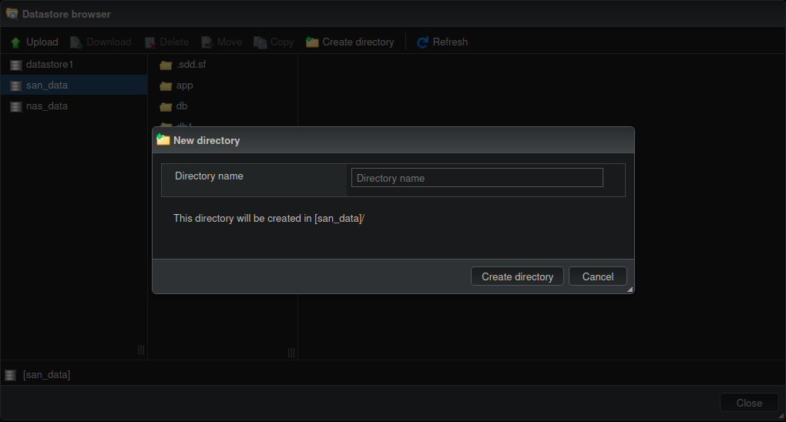

4. Assign the name *app2*.

    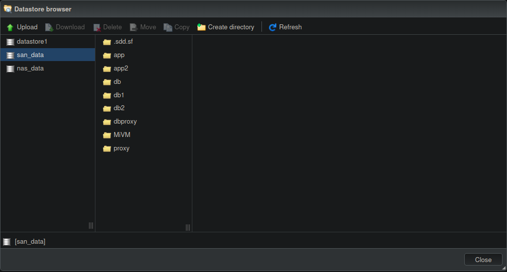

5. Go to the folder of the vm to be cloned (app) and click *copy* on the *.vmx* file.

    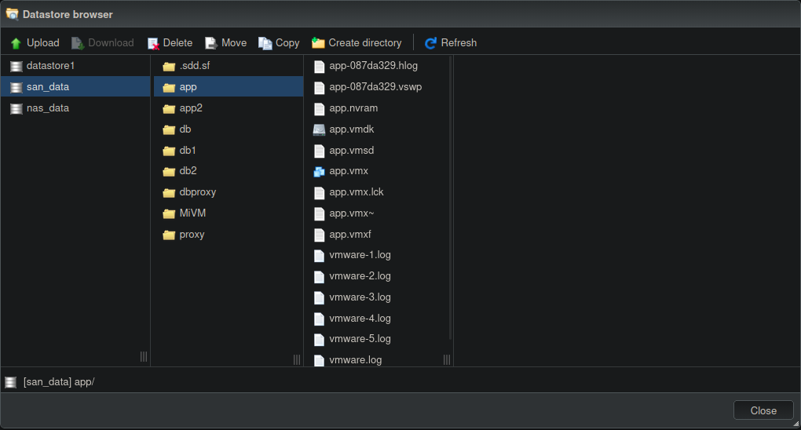

6. Select the destination, which will be the *app2* folder created previously.

    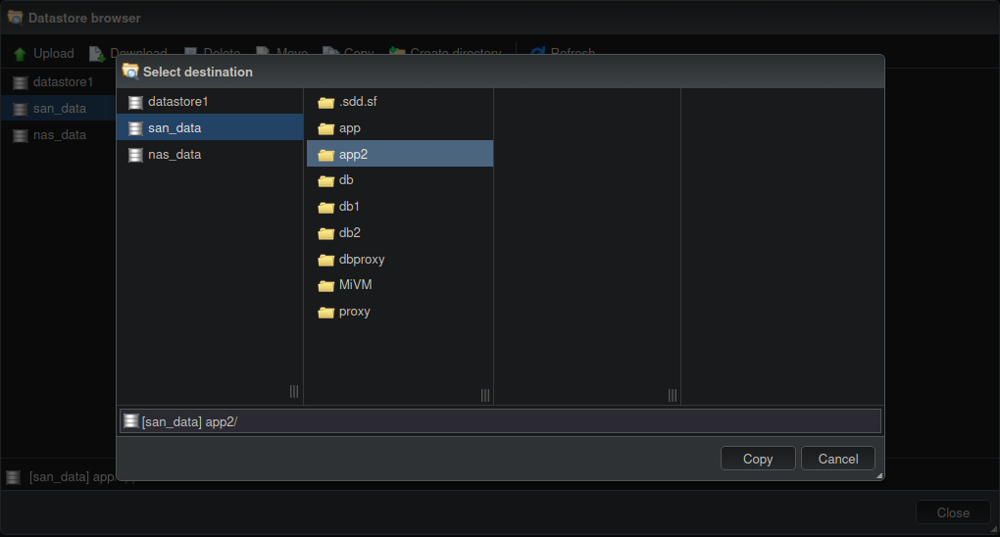

7. Do the same with the *.vmdk* file.

    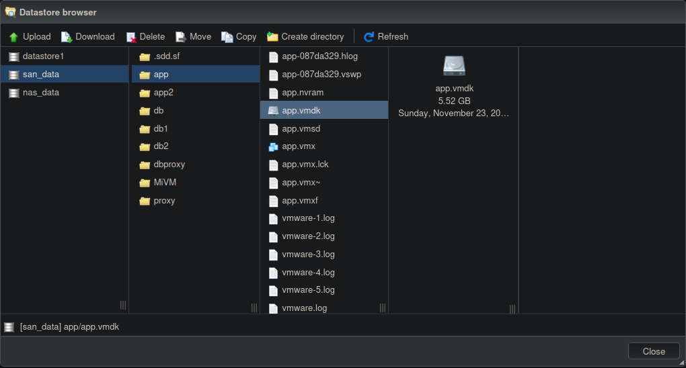
    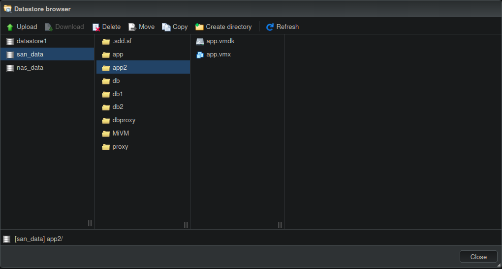

8. Go to the *Virtual Machines* section and click *Create / Register VM*.

    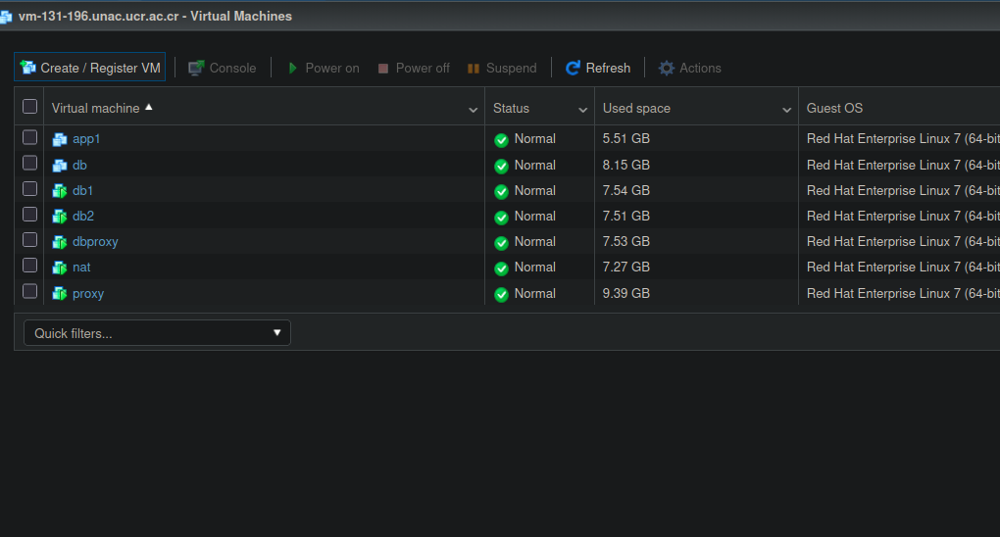

9. Select *Register an existing machine*.

    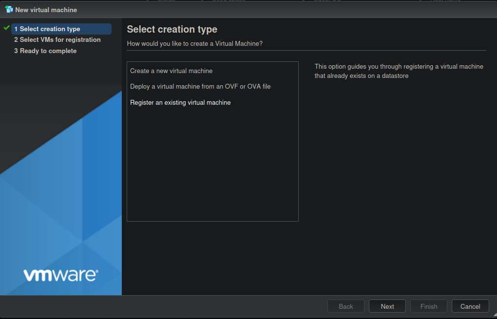

10. Select *Select one or more virtual machines, a datastore or a directory*.

    

11. Choose the *.vmx* file from the *app2* folder that was just copied.

    

12. Click *Finish*.

    

13. Rename the cloned *vm*.

    

14. Start the *vm* and select the *Copied it* option.

    

##### Change the IPs of *app2*

1. Assign IP *192.168.216.7* for the *Internal_Network* network.

    

2. Assign IP *192.168.217.3* for the *AppDB_Network* network.

    

3. Assign IP *192.168.218.3* for the *App_Network* network.

    

4. Change the */etc/ssh/sshd_config* file to change the listen_address to IP *192.168.216.7*.

    

    * Restart to apply changes.

    ```sh
    sudo systemctl restart sshd
    ```

##### Create the Database User for *app2*

1. Inside the *db1* *vm*.

    ```sh
    sudo mariadb
    ```

2. Run the following command.

    ```sh
    GRANT ALL PRIVILEGES ON glpidb.* TO 'glpiuser'@'192.168.217.3' IDENTIFIED BY '<STRONG_PASSWORD>';
    FLUSH PRIVILEGES;
    ```

3. Verify user list.

    ```sh
    +------------------+---------------+
    | User             | Host          |
    +------------------+---------------+
    | maxscale_router  | 192.168.217.1 |
    | glpiuser         | 192.168.217.2 |
    | glpiuser         | 192.168.217.3 |
    | sstuser          | 192.168.219.% |
    | glpiuser         | 192.168.219.1 |
    | maxscale_monitor | 192.168.219.1 |
    | maxscale_router  | 192.168.219.1 |
    | mariadb.sys      | localhost     |
    | mysql            | localhost     |
    | root             | localhost     |
    +------------------+---------------+
    ```

##### Change the IPs Within the Nginx Configuration Inside *app2*

1. Create the specific configuration file for the GLPI service.

    ```sh
    sudo nano /etc/nginx/conf.d/glpi.conf
    ```

    * Add.

    ```sh
    GNU nano 5.6.1                    /etc/nginx/conf.d/glpi.conf
    server {
        listen 192.168.218.100:80 default_server;
        server_name 192.168.218.100;

        root /srv/www/glpi;
        index index.php index.html;

        access_log /var/log/nginx/glpi_access.log main;
        error_log /var/log/nginx/glpi_error.log warn;

        location / {
            try_files $uri $uri/ /index.php?$query_string;
        }

        location ~ \.php$ {
            include fastcgi_params;
            fastcgi_pass unix:/run/php-fpm/www.sock;
            fastcgi_index index.php;
            fastcgi_param SCRIPT_FILENAME $document_root$fastcgi_script_name;
        }

        location ~* \.(js|css|png|jpg|jpeg|gif|ico)$ {
            expires max;
            log_not_found off;
        }
    }
    ```

2. Enable binding to non-local IPs.

    ```sh
    sudo nano /etc/sysctl.conf
    ```

    * Add or edit.

    ```sh
    net.ipv4.ip_nonlocal_bind = 1
    ```

    * Apply.

    ```sh
    sudo sysctl -p
    ```

3. Apply changes.

    ```sh
    sudo nginx -t
    sudo systemctl restart nginx
    sudo systemctl restart php-fpm
    ```

4. Verify by making a request using *curl*.

    ```sh
    curl http://192.168.218.3/
    ```

#### Configure Firewall on *app1* and *app2*

##### Configure Firewall *app1*

1. The firewall configurations must be set in the *application* zone.

    ```sh
    application (active)
    target: default
    icmp-block-inversion: no
    interfaces: ens256
    sources:
    services:
    ports:
    protocols:
    forward: no
    masquerade: no
    forward-ports:
    source-ports:
    icmp-blocks:
    rich rules:
        rule family="ipv4" source address="192.168.218.1" service name="http" accept
    ```

2. Add the *VRRP* protocol to the *application* zone.

    ```sh
    sudo firewall-cmd --zone=application --add-protocol=vrrp --permanent
    ```

    * Reload.

    ```sh
    sudo firewall-cmd --reload
    ```

    * Verify.

    ```sh
    sudo firewall-cmd --zone=application --list-all
    ```

    * Expected output.

    ```sh
    target: default
    icmp-block-inversion: no
    interfaces: ens256
    sources:
    services:
    ports:
    protocols: vrrp
    forward: no
    masquerade: no
    forward-ports:
    source-ports:
    icmp-blocks:
    rich rules:
        rule family="ipv4" source address="192.168.218.1" service name="http" accept
    ```

#### Install and Configure Keepalived on *app1*

1. Install Keepalived.

    ```sh
    sudo dnf install keepalived -y
    ```

2. Configure Keepalived.

    ```sh
    sudo nano /etc/keepalived/keepalived.conf
    ```

    * Add this configuration.

    ```sh
    vrrp_instance VI_1 {
        # Preferred initial state. The MASTER owns the Virtual IP (VIP).
        state MASTER

        # Network interface for VRRP advertisements and the VIP.
        interface ens256

        # Virtual Router ID. Must be the same on all nodes (MASTER/BACKUP).
        virtual_router_id 51

        # APP1 > APP2
        priority 200

        # Interval for sending VRRP advertisements (in seconds).
        advert_int 1

        # Authentication configuration block.
        authentication {
            # Authentication type (PASS is the most suggested).
            auth_type PASS

            # Shared password. Must be identical on all nodes.
            auth_pass <PASSWORD>
        }

        # Block for the floating Virtual IP(s).
        virtual_ipaddress {
            # The IP clients will use. Floats between MASTER and BACKUP.
            192.168.218.100
        }
    }
    ```

3. Enable and start keepalived.

    ```sh
    sudo systemctl enable keepalived
    sudo systemctl start keepalived
    ```

4. Verify it started without errors.

    ```sh
    sudo systemctl status keepalived
    ```

5. Verify that *app1* takes the *VIP*.

    ```sh
    ip a show ens256
    ```

    * Output.

    ```sh
    4: ens256: <BROADCAST,MULTICAST,UP,LOWER_UP> mtu 1500 qdisc mq state UP group default qlen 1000
        link/ether 00:0c:29:ab:20:de brd ff:ff:ff:ff:ff:ff
        altname enp27s0
        inet 192.168.218.2/24 brd 192.168.218.255 scope global noprefixroute ens256
        valid_lft forever preferred_lft forever
        inet 192.168.218.100/32 scope global ens256
        valid_lft forever preferred_lft forever
    ```

    > Note: IP *192.168.218.100* which is the *VIP* must appear, since it is the *MASTER*.

#### Install and Configure Keepalived on *app2*

1. Install Keepalived.

```sh
sudo dnf install keepalived -y
```

1. Configure Keepalived.

    ```sh
    sudo nano /etc/keepalived/keepalived.conf
    ```

    * Add this configuration.

    ```sh
    vrrp_instance VI_1 {
        # Preferred initial state. The MASTER owns the Virtual IP (VIP).
        state BACKUP

        # Network interface for VRRP advertisements and the VIP.
        interface ens256

        # Virtual Router ID. Must be the same on all nodes (MASTER/BACKUP).
        virtual_router_id 51

        # APP1 > APP2
        priority 100

        # Interval for sending VRRP advertisements (in seconds).
        advert_int 1

        # Authentication configuration block.
        authentication {
            # Authentication type (PASS is the most suggested).
            auth_type PASS

            # Shared password. Must be identical on all nodes.
            auth_pass <PASSWORD>
        }

        # Block for the floating Virtual IP(s).
        virtual_ipaddress {
            # The IP clients will use. Floats between MASTER and BACKUP.
            192.168.218.100
        }
    }
    ```

2. Enable and start keepalived.

    ```sh
    sudo systemctl enable keepalived
    sudo systemctl start keepalived
    ```

3. Verify it started without errors.

    ```sh
    sudo systemctl status keepalived
    ```

4. Verify that *app1* takes the *VIP*.

    ```sh
    ip a show ens256
    ```

    * Output.

    ```sh
    4: ens256: <BROADCAST,MULTICAST,UP,LOWER_UP> mtu 1500 qdisc mq state UP group default qlen 1000
        link/ether 00:0c:29:ba:34:09 brd ff:ff:ff:ff:ff:ff
        altname enp27s0
        inet 192.168.218.3/24 brd 192.168.218.255 scope global noprefixroute ens256
        valid_lft forever preferred_lft forever
    ```

    > Note: IP *192.168.218.100* which is the *VIP* **must NOT** appear, since it is the *BACKUP*.

#### Simulate Failure of the Primary Node (*app1*)

1. Shut down the primary node *app1*.

    ```sh
    sudo systemctl stop keepalived
    ```

2. On *app2*.

    ```sh
    ip a show ens256
    ```

    * Output.

    ```sh
    4: ens256: <BROADCAST,MULTICAST,UP,LOWER_UP> mtu 1500 qdisc mq state UP group default qlen 1000
        link/ether 00:0c:29:ba:34:09 brd ff:ff:ff:ff:ff:ff
        altname enp27s0
        inet 192.168.218.3/24 brd 192.168.218.255 scope global noprefixroute ens256
        valid_lft forever preferred_lft forever
        inet 192.168.218.100/32 scope global ens256
        valid_lft forever preferred_lft forever
    ```

    > Note: The *VIP* must appear on the secondary node for the automatic *failover* to be working.

#### Migrate from *Nginx* to *HAProxy*

##### Prepare Certificates + Backups from the Current Reverse Proxy (Nginx)

1. Create backup folder.

    ```sh
    sudo mkdir -p /root/nginx_backup
    ```

2. Save all current config.

    ```sh
    sudo cp -a /etc/nginx /root/nginx_backup/nginx_$(date +%F)
    ```

3. Back up certificates.

    ```sh
    sudo cp /etc/ssl/certs/glpi_proxy.crt   /root/nginx_backup/
    sudo cp /etc/ssl/private/glpi_proxy.key /root/nginx_backup/
    ```

4. Convert certificate to HAProxy format (PEM).

    ```sh
    sudo bash -c 'cat /etc/ssl/certs/glpi_proxy.crt /etc/ssl/private/glpi_proxy.key > /etc/ssl/private/glpi_proxy.pem'
    chmod 600 /etc/ssl/private/glpi_proxy.pem
    ```

##### Install and Configure HAProxy

1. Install HAProxy.

    ```sh
    sudo dnf install haproxy -y
    ```

2. Create configuration file */etc/haproxy/haproxy.cfg*.

    ```sh
    sudo touch /etc/haproxy/haproxy.cfg
    ```

3. Edit and add the following configuration.

    ```sh
    global
        log /dev/log local0
        log /dev/log local1 notice
        daemon
        maxconn 4000
        user haproxy
        group haproxy
        ca-base /etc/ssl/certs
        crt-base /etc/ssl/private

    defaults
        log     global
        mode    http
        option  httplog
        option  dontlognull
        timeout connect 5s
        timeout client  50s
        timeout server  50s
        option forwardfor

    #---------------------------------------------------------------------
    # FRONTEND HTTP → redirect to HTTPS
    #---------------------------------------------------------------------
    frontend http-in
        bind :80
        redirect scheme https if !{ ssl_fc }

    #---------------------------------------------------------------------
    # FRONTEND HTTPS
    #---------------------------------------------------------------------
    frontend https-in
        bind :443 ssl crt /etc/ssl/private/glpi_proxy.pem
        mode http

        # Logs
        option httplog

        # Headers GLPI
        http-request set-header X-Forwarded-Proto https
        http-request set-header X-Forwarded-Host %[req.hdr(host)]
        http-request set-header X-Real-IP %[src]

        default_backend glpi_backend

    #---------------------------------------------------------------------
    # BACKEND GLPI with keepalived VIP
    #---------------------------------------------------------------------
    backend glpi_backend
        mode http

        # Health check against the VIP
        option httpchk GET /
        http-check expect status 200

        # The VIP MOVES between app1 and app2
        server glpi 192.168.218.100:80 check
    ```

    * *Global*.

    |Line|Meaning|
    |---|---|
    |`log /dev/log local0`|HAProxy will send logs to syslog using facility local0.|
    |`log /dev/log local1 notice`|Sends additional logs with notice severity.|
    |`daemon`|Runs in the background (systemd still manages it).|
    |`maxconn 4000`|Maximum simultaneous connections.|
    |`user haproxy` / `group haproxy`|Which user HAProxy runs as → more secure.|
    |`ca-base`|Folder where it looks for CAs (for SSL).|
    |`crt-base`|Folder where it looks for certificates (for the https frontend).|

    * *Defaults*.

    |Parameter|Meaning|
    |---|---|
    |`log global`|Uses the log config from the global block.|
    |`mode http`|All traffic is handled in HTTP mode (L7).|
    |`option httplog`|Detailed HTTP log format.|
    |`option dontlognull`|Does not log empty connections.|
    |**timeouts**|Avoids hanging connections.|
    |`option forwardfor`|Adds `X-Forwarded-For` header with real client IP.|

    * *Frontend HTTP*

    |Line|Explanation|
    |---|---|
    |`bind :80`|HAProxy listens on port 80 (HTTP).|
    |`redirect scheme https if !{ ssl_fc }`|Automatic redirect to HTTPS.|

    * *Frontend HTTPS*

    |Line|Meaning|
    |---|---|
    |`bind :443 ssl crt ...`|HAProxy listens HTTPS and uses the certificate.|
    |`mode http`|Processes HTTP.|
    |`http-request set-header ...`|Adds headers so GLPI knows the real scheme, real IP, host, etc.|
    |`default_backend glpi_backend`|Sends traffic to the backend defined below.|

    * *Backend GLPI*

    |Line|Explanation|
    |---|---|
    |`mode http`|HTTP operation.|
    |`option httpchk GET /`|Health check: makes a GET / to GLPI.|
    |`http-check expect status 200`|Must respond 200 to be considered healthy.|
    |`server glpi 192.168.218.100:80 check`|The backend is the **virtual IP (VIP)** of the APP1/APP2 cluster.|

4. Verify syntax.

    ```sh
    sudo haproxy -c -f /etc/haproxy/haproxy.cfg
    ```

    * Expected output.

    ```sh
    Configuration file is valid
    ```

5. Disable nginx.

    ```sh
    sudo systemctl stop nginx
    sudo systemctl disable nginx
    ```

6. Enable HAProxy, verify that nginx is not running.

    ```sh
    sudo systemctl enable haproxy
    sudo systemctl restart haproxy
    sudo systemctl status haproxy
    ```

##### Configure Firewall for HAProxy

1. Change the previous configuration of the *application* zone.

    ```sh
    application (active)
    target: default
    icmp-block-inversion: no
    interfaces: ens224
    sources:
    services:
    ports:
    protocols:
    forward: no
    masquerade: no
    forward-ports:
    source-ports:
    icmp-blocks:
    rich rules:
        rule family="ipv4" destination address="192.168.218.2" service name="http" accept
    ```

2. Remove the *rich rule*.

    ```sh
    sudo firewall-cmd --zone=application --permanent --remove-rich-rule='rule family="ipv4" destination address="192.168.218.2" service name="http" accept'
    ```

3. Add the new rich rule, referencing the *VIP*.

    ```sh
    sudo firewall-cmd --zone=application --permanent --add-rich-rule='rule family="ipv4" destination address="192.168.218.100" service name="http" accept'
    ```

4. Reload the firewall.

    ```sh
    sudo firewall-cmd --reload
    ```

5. Verify.

    ```sh
    sudo firewall-cmd --zone=application --list-all
    ```

    * Expected output.

    ```sh
    application (active)
    target: default
    icmp-block-inversion: no
    interfaces: ens224
    sources:
    services:
    ports:
    protocols:
    forward: no
    masquerade: no
    forward-ports:
    source-ports:
    icmp-blocks:
    rich rules:
        rule family="ipv4" destination address="192.168.218.100" service name="http" accept
    ```

#### Verification

1. In the browser, navigate to address *172.24.133.218*.

    

##### Test Keepalived Failover

1. On *app1*.

    ```sh
    sudo systemctl stop keepalived
    ```

2. On *app2*.

    ```sh
    ip a show ens256
    ```

    * Expected output.

    ```sh
    4: ens256: <BROADCAST,MULTICAST,UP,LOWER_UP> mtu 1500 qdisc mq state UP group default qlen 1000
        link/ether 00:0c:29:ba:34:09 brd ff:ff:ff:ff:ff:ff
        altname enp27s0
        inet 192.168.218.3/24 brd 192.168.218.255 scope global noprefixroute ens256
        valid_lft forever preferred_lft forever
        inet 192.168.218.100/32 scope global ens256
        valid_lft forever preferred_lft forever

    ```

3. In the browser, navigate to address *172.24.133.218* and reload the page.


