# Project, Part IV - Modernization and Containers

## Cover Page

### University of Costa Rica

* **Infrastructure Design and Operation CI-0144**
* **Project, Part IV - Modernization and Containers**
* **Professor:** Ariel Mora Jiménez
* **Student:** Anderson Vargas Navarro - C28183
* **1st semester, 2026**
* **Group:** 002

---

## **Project, Part IV - Modernization and Containers**

Using the Podman container engine, migrate the web application deployed on your
infrastructure from being deployed natively to being deployed through containers.
Depending on the application, you must research how it can be deployed in
containers, as well as how to migrate the information so that it shows the same as
the application installed natively.

Additionally, you must also deploy the WikiJS tool using containers. This
tool will be used to document this and the other projects that will be
developed in the course.

You may decide whether to deploy using containers with a VM that
contains the database, or to also deploy the database using
containers. If you choose the second option, you must deploy both the
application and the database using the "pods" functionality provided by
Podman.

Additionally, you must use the dockle and trivy tools to perform a
scan for possible security issues in the deployed containers and
fix those that do not require modifications to the images.

For this project the following additional aspects will be graded:

* Container deployment decisions (ports used, volumes, computational resources, among others)

* Integration with SELinux

---

## Current Infrastructure State

## Current State Network Topology and Addressing

The complete GLPI service infrastructure is deployed on a virtualized
environment consisting of seven virtual machines, distributed across several
internal networks that allow isolating, segmenting, and securing communication between
the different service components. Each virtual machine fulfills a
specific role within the high availability architecture:

1. **HAProxy Server (Reverse Proxy)**

Exposes the service to the NAC network, receives all HTTPS requests from users
and directs them to the virtual IP provided by Keepalived on
the GLPI application nodes.

1. **Application Servers (APP1 and APP2)**

Run GLPI through PHP-FPM. Both instances work in active/passive
mode thanks to Keepalived, which assigns a floating virtual IP (VIP) used by HAProxy
as the destination.

* **Version:** GLPI Release 10.0.15

1. **Database Proxy (MaxScale)**

It is the intermediate point between the GLPI servers and the MariaDB Galera cluster.
It provides read/write load balancing and database backend abstraction.

1. **Database Servers (DB1 and DB2)**

Implement a MariaDB Galera cluster, replicating information
synchronously to ensure integrity and fault tolerance.

* **Version:** MariaDB 10.5.29

1. **Administration Server (NAT VM)**

Allows secure system management via SSH, as well as providing Internet access via NAT for all internal VMs.

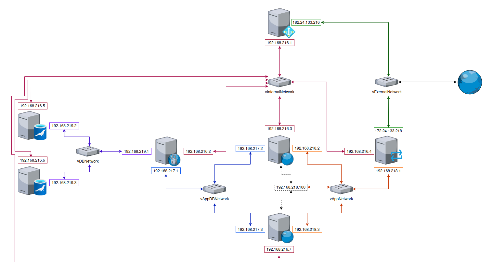

---

## Networks Defined in the Current State Architecture

### External / Public Network

Publication of the GLPI service to internal users of the institution via
HTTPS and allowing external administrative access only to the administration VM.

* **Range:** `172.24.133.0/24`

* **Connected servers:**

| Server         | Public IP        |
| -------------- | ---------------- |
| Administration | `172.24.133.216` |
| HAProxy        | `172.24.133.218` |

### Internal Network (Management)

Management and SSH access for all internal VMs, as well as Internet access via NAT.

* **Range:** `192.168.216.0/24`

* **Connected servers:**

| Server                      | *Internal Network* IP |
| --------------------------- | --------------------- |
| Administration              | `192.168.216.1`       |
| DB Proxy (MaxScale)         | `192.168.216.2`       |
| Application Server 1        | `192.168.216.3`       |
| HAProxy                     | `192.168.216.4`       |
| Database 1 (MariaDB)        | `192.168.216.5`       |
| Database 2 (MariaDB)        | `192.168.216.6`       |
| Application Server 2        | `192.168.216.7`       |

### App Network

Direct communication from HAProxy to the GLPI instances and operation of
Keepalived's VRRP protocol.

* **Range:** `192.168.218.0/24`

* **Note:** here resides the **floating virtual IP 192.168.218.100**, controlled by Keepalived.

* **Connected servers:**

|Server|*App Network* IP|*Keepalive (VIP)* IP|
|---|---|---|
|Application Server 1|`192.168.218.2`|`192.168.218.100`|
|Application Server 2|`192.168.218.3`|`192.168.218.100`|
|HAProxy|`192.168.218.1`|—|

### AppDB Network

Secure connection between APP1/APP2 and MaxScale.

* **Range:** `192.168.217.0/24`

* **Connected servers:**

| Server                   | *AppDB Network* IP |
| ------------------------ | ------------------ |
| DB Proxy (MaxScale)      | `192.168.217.1`    |
| Application Server 1     | `192.168.217.2`    |
| Application Server 2     | `192.168.217.3`    |

### DB Network (Galera Cluster)

Intra-cluster communication between DB1 and DB2, plus the link from MaxScale
to the nodes.

* **Range:** `192.168.219.0/24`

* **Connected servers:**

|Server|*DB Network* IP|
|---|---|
|DB Proxy (MaxScale)|`192.168.219.1`|
|Database 1 (DB1)|`192.168.219.2`|
|Database 2 (DB2)|`192.168.219.3`|

---

## Operation Validation

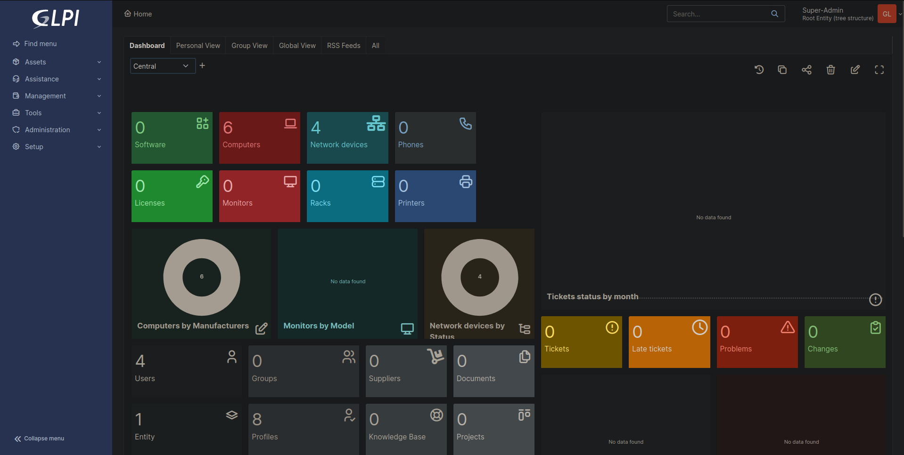

---

## Service Architecture Description

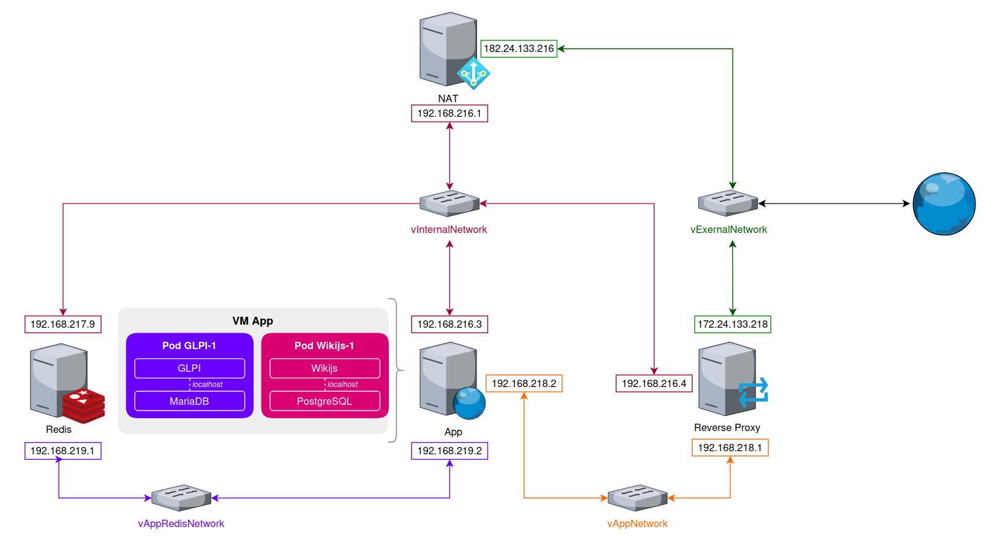

## Network Topology and Addressing

### General Topology Description

The service infrastructure is deployed on a virtualized environment
consisting of **four active virtual machines**, each with a
clearly defined role within the modernized container-based architecture:

1. **Administration / NAT Server (*vm nat*)** Acts as the Internet gateway for all internal VMs via NAT, and as the SSH administrative access point into the infrastructure. Has its own public IP for remote administration.
2. **Reverse Proxy Server (*vm proxy*)** Exposes GLPI and Wiki.js services to the institutional network via HTTPS through HAProxy. Receives incoming requests and redirects them to the containers in *vm pods* through the *App Network*.
3. **Container Server (*vm pods*)** Hosts all system services deployed as rootless Podman containers. Runs two independent pods: `glpi-pod` with GLPI and MariaDB, and `wikijs-pod` with Wiki.js and PostgreSQL. Communicates with the reverse proxy through the *App Network* and with Redis through the *AppRedis Network*.
4. **Cache Server (*vm redis*)** Provides the Redis cache service used by GLPI to store sessions and frequent operational data. It is isolated on a dedicated network to reduce the attack surface.

> *Note:* The `app1`, `app2`, `db1`, `db2`, and `dbproxy` VMs from the previous project were deleted or disconnected after the migration to containers. `app1` and `db1` are kept with their interfaces removed as a backup.

---

#### Networks Defined in the Architecture

##### External Network (External / Public Network)

* **Objective:** publish GLPI and Wiki.js services to institution users via HTTPS, and allow external administrative access to *vm nat* and *vm proxy*.

* **Access:** only to the Administration/NAT server and the Reverse Proxy.

* **Restrictions:** containers and Redis are not accessible from this network.

* **Range:** `172.24.133.0/24`

##### Internal Network (Internal Network)

* **Objective:** management and SSH access for all internal VMs, as well as Internet access via NAT.

* **Access:** SSH to each server, controlled Internet access via NAT.

* **Range:** `192.168.216.0/24`

##### Application Network (App Network)

* **Objective:** communication between HAProxy (*vm proxy*) and the GLPI and Wiki.js containers (*vm pods*).

* **Access:** only the reverse proxy can connect to ports `8080` (GLPI) and `3000` (Wiki.js) of *pods*.

* **Range:** `192.168.218.0/24`

##### Cache Network (AppRedis Network)

* **Objective:** dedicated communication between the *vm pods* containers and the Redis server.

* **Access:** only *vm pods* can connect to port `6379` of *vm redis*.

* **Restrictions:** no access from the public network or from the general internal network.

* **Range:** `192.168.219.0/24`

---

#### IP Addressing per Virtual Machine

|Server|Function|Public IP|*Internal Network* IP|*App Network* IP|*AppRedis Network* IP|
|---|---|---|---|---|---|
|Administration (*nat*)|NAT + SSH Management|`172.24.133.217`|`192.168.216.1`|—|—|
|Reverse Proxy (*proxy*)|HAProxy HTTPS|`172.24.133.218`|`192.168.216.4`|`192.168.218.1`|—|
|Containers (*pods*)|GLPI + Wiki.js + DBs|—|`192.168.216.8`|`192.168.218.2`|`192.168.219.2`|
|Cache (*redis*)|Redis|—|`192.168.216.9`|—|`192.168.219.1`|

---

#### Firewall Rules

##### Administration / NAT Server (*vm nat*)

* Zone `external` (*ens160*)

  * Allowed services: `ssh`

  * `masquerade` enabled

* Zone `internal` (*ens224*)

  * Allowed services: `ssh`

  * `forward: no`

##### Reverse Proxy Server (*vm proxy*)

* Zone `external` (*ens160*)

  * Allowed services: `https`, `ssh`

* Zone `internal` (*ens224*)

  * Allowed services: `ssh`

* Zone `application` (*ens256*)

  * *Rich rules*:

```ini
rule family="ipv4" destination address="192.168.218.2" port port="8080" protocol="tcp" accept
rule family="ipv4" destination address="192.168.218.2" port port="3000" protocol="tcp" accept
```

##### Container Server (*vm pods*)

* Zone `internal` (*ens160*)

  * Allowed services: `ssh`

  * `forward: no`

* Zone `application` (*ens224*)

  * *Rich rules*:

```ini
rule family="ipv4" source address="192.168.218.1/24" port port="8080" protocol="tcp" accept
rule family="ipv4" source address="192.168.218.1/24" port port="3000" protocol="tcp" accept
```

* Zone `appredis` (*ens256*)

  * *Rich rule*:

```ini
rule family="ipv4" destination address="192.168.219.1/32" port port="6379" protocol="tcp" accept
```

##### Cache Server (*vm redis*)

* Zone `internal` (*ens160*)

  * Allowed services: `ssh`

* Zone `appredis` (*ens224*)

  * *Rich rule*:

```ini
rule family="ipv4" source address="192.168.219.2/32" port port="6379" protocol="tcp" accept
```

---

#### Switches and Port Groups

|**vSwitch / Port Group**|**Description**|**Connected to**|**Uplink**|
|---|---|---|---|
|**vExternalNetwork / External_Network**|Public network toward the NAC.|nat (*ens160*), proxy (*ens160*)|vmnic3|
|**vInternalNetwork / Internal_Network**|Internal administration network between VMs.|nat (*ens224*), proxy (*ens224*), pods (*ens160*), redis (*ens160*)|—|
|**vAppNetwork / App_Network**|Communication between HAProxy and the containers.|proxy (*ens256*), pods (*ens224*)|—|
|**vAppRedis / AppRedis_Network**|Dedicated channel between containers and Redis.|pods (*ens256*), redis (*ens224*)|—|

---

### Physical Topology Diagram (C4 - Level 3)

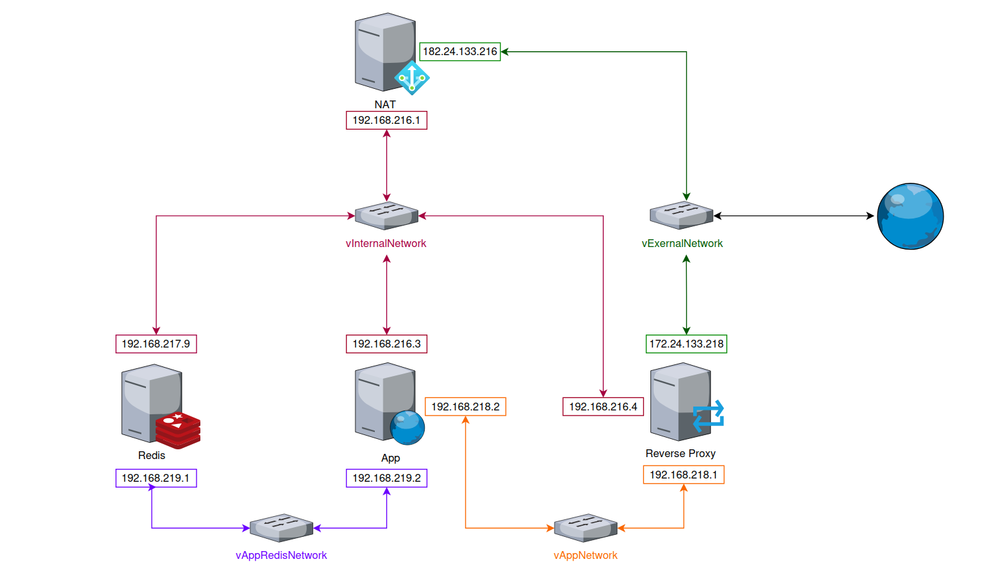
Here is the corrected section with the proper separation between *vm nat*
(administration) and *vm proxy* (HAProxy):

#### Main Diagram Components

1. **Administration / NAT Server (*vm nat*)**

    * Provides Internet access via NAT for internal VMs.

    * Allows SSH administrative access from the external network.

    * Does not participate in the service request flow.

2. **Reverse Proxy Server (*vm proxy*)**

    * System entry point for users.

    * Exposes GLPI on port `443` and Wiki.js on port `8443` via HTTPS.

    * Redirects traffic to *vm pods* through the *App Network*.

3. **Container Server (*vm pods*)**

    * Runs `glpi-pod`: GLPI (`8080`) and MariaDB (`3306` internal) containers.

    * Runs `wikijs-pod`: Wiki.js (`3000`) and PostgreSQL (`5432` internal) containers.

    * Connects to Redis through the *AppRedis Network* for GLPI cache.

4. **Cache Server (*vm redis*)**

    * Provides Redis cache to the GLPI container.

    * Only accepts connections from `192.168.219.2`.

    * Does not expose services on external networks or the general internal network.

5. **vExternalNetwork**

    * Connected to the uplink toward the NAC public network.

    * Carries HTTPS traffic to/from users.

    * Connected to *vm nat* and *vm proxy*.

6. **vInternalNetwork**

    * Internal administration network.

    * Used for SSH access between servers.

    * Connected to *nat*, *proxy*, *pods*, and *redis*.

7. **vAppNetwork**

    * Communication channel between HAProxy and the containers.

    * Connects *vm proxy* with *vm pods*.

8. **vAppRedis Network**

    * Channel dedicated exclusively to cache traffic.

    * Connects *vm pods* with *vm redis*.

#### Relationships Between Components

* The **HAProxy** (*vm proxy*):

  * Receives HTTPS requests from the external network.

  * Redirects HTTP traffic to ports `8080` (GLPI) and `3000` (Wiki.js) of *vm pods* through the *App Network*.

* The **containers in *vm pods***:

  * GLPI and MariaDB share the network namespace within `glpi-pod`, communicating via `localhost`.

  * Wiki.js and PostgreSQL share the network namespace within `wikijs-pod`.

  * GLPI queries Redis at `192.168.219.1:6379` through the *AppRedis Network*.

* The **Redis server** (*vm redis*):

  * Only accepts connections from `192.168.219.2`.

  * Does not participate in the user web request flow.

* The ***vm nat***:

  * Provides Internet access to all internal VMs via NAT.

  * Allows SSH administrative access from the external network.

  * Does not participate in the GLPI or Wiki.js service request flow.

---

## Pods and Containers

The container architecture is organized into two independent pods
deployed on *vm pods* using rootless Podman with Quadlet. Each
pod groups the containers that need to communicate with each other, sharing the
same internal network namespace.
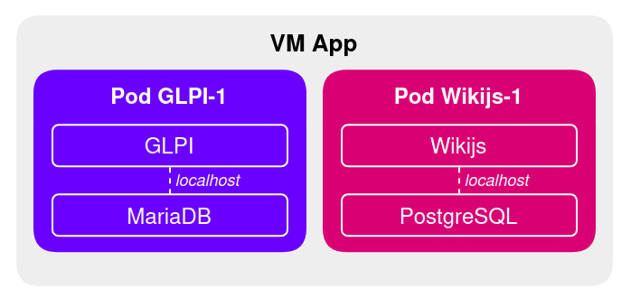

### GLPI Pod (`glpi-pod`)

|Container|Image|Internal port|Host port|
|---|---|---|---|
|`glpi`|`docker.io/glpi/glpi:10.0`|`80`|`8080`|
|`mariadb`|`docker.io/library/mariadb:10.11`|`3306`|not exposed|

**Internal communication:** By sharing the pod's network namespace, the `glpi` container connects to MariaDB using `127.0.0.1:3306`, as if both services were running on the same machine. Port `3306` is not exposed outside the pod, so the database is not accessible from the host or the network.

**External cache:** The `glpi` container connects to the Redis server at `192.168.219.1:6379` through the *AppRedis Network*, using the host's `ens256` interface. The connection is authenticated via a password managed as a Podman secret.

**Persistent volumes:**

| Volume on host                          | Path in container                | Container  | Purpose                                                    |
| --------------------------------------- | -------------------------------- | ---------- | ---------------------------------------------------------- |
| `~/containers/volumes/glpi-files`       | `/var/glpi`                      | `glpi`     | Operational files, attached documents, cache and sessions  |
| `~/containers/volumes/glpi-plugins`     | `/var/www/html/glpi/plugins`     | `glpi`     | Manually installed plugins                                 |
| `~/containers/volumes/glpi-marketplace` | `/var/www/html/glpi/marketplace` | `glpi`     | Extensions downloaded from the Marketplace                 |
| `~/containers/volumes/mariadb-data`     | `/var/lib/mysql`                 | `mariadb`  | Persistent database data                                   |
| `~/containers/configs/mariadb/glpi.cnf` | `/etc/mysql/conf.d/glpi.cnf`     | `mariadb`  | Custom MariaDB configuration (read-only)                   |

> *Permissions note:* The GLPI volumes are assigned to UID `33` (`www-data`) and the MariaDB ones to UID `999` (`mysql`), adjusted via `podman unshare chown` for rootless mode compatibility. All volumes use the `:Z` label so that SELinux automatically applies the correct context.

---

### Wiki.js Pod (`wikijs-pod`)

|Container|Image|Internal port|Host port|
|---|---|---|---|
|`wikijs`|`docker.io/requarks/wiki:2`|`3000`|`3000`|
|`postgres-wikijs`|`docker.io/library/postgres:16`|`5432`|not exposed|

**Internal communication:** Just like in `glpi-pod`, both containers share the pod's network namespace. The `wikijs` container connects to PostgreSQL using `127.0.0.1:5432`. Port `5432` is not exposed outside the pod.

**Persistent volumes:**

|Volume on host|Path in container|Container|Purpose|
|---|---|---|---|
|`~/containers/volumes/wikijs-data`|`/wiki/data/content`|`wikijs`|User-generated content, pages and assets|
|`~/containers/volumes/postgres-data`|`/var/lib/postgresql/data`|`postgres-wikijs`|Persistent PostgreSQL data|

> *Permissions note:* The Wiki.js volume is assigned to UID `1000` (`node`) and the PostgreSQL one to UID `999` (`postgres`), adjusted via `podman unshare chown`. All volumes use the `:Z` label for SELinux compatibility.

---

### Pod Comparison

|Feature|`glpi-pod`|`wikijs-pod`|
|---|---|---|
|**Application engine**|PHP (Apache)|Node.js|
|**Database**|MariaDB 10.11|PostgreSQL 16|
|**DB communication**|`127.0.0.1:3306`|`127.0.0.1:5432`|
|**Port exposed to host**|`8080`|`3000`|
|**External cache**|Redis (`192.168.219.1:6379`)|Not applicable|
|**Application volumes**|3 (files, plugins, marketplace)|1 (content)|
|**DB volumes**|1 (mariadb-data)|1 (postgres-data)|
|**Secret management**|Podman secrets|Podman secrets|

---

## Implementation

## Infrastructure Reorganization and Cleanup

### Creation and Initial Configuration of the New Server (*pods*)

1. Clone the golden image, to create the new *pods* vm.

    ```sh
    ovftool \
      --skipManifestCheck \
      --lax \
      --noSSLVerify \
      --datastore="san_data" \
      --name="pods" \
      --diskMode=thin \
      --net:"nat"="Internal_Network" \
      "/home/general/Documents/UCR/2025-Semestre-II/Infrastructure/projects/partII/golden_image/RockyServer9.ovf" \
      "vi://root@172.24.131.196/"
    ```

2. Assign the internal network IP to the *pods* *vm*.

    ```sh
    sudo nmtui
    ```

3. Assign IP `192.168.216.8`.

    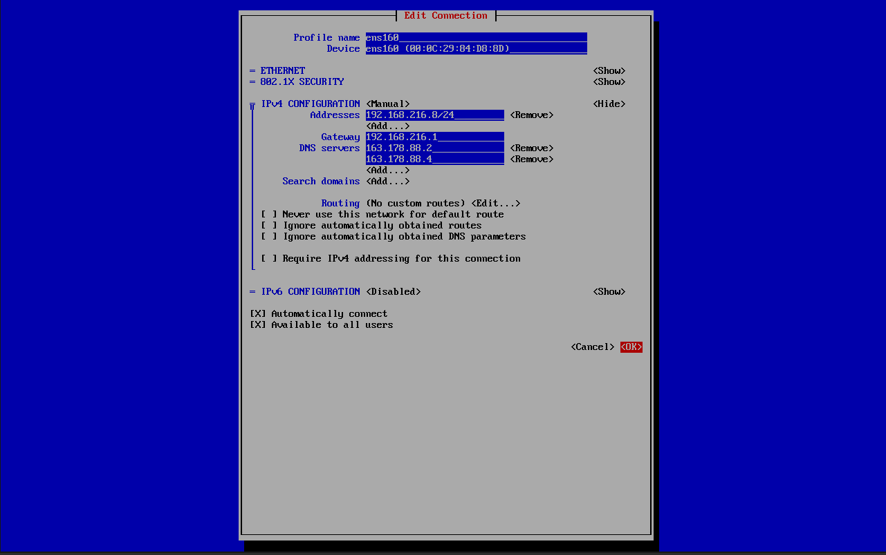
    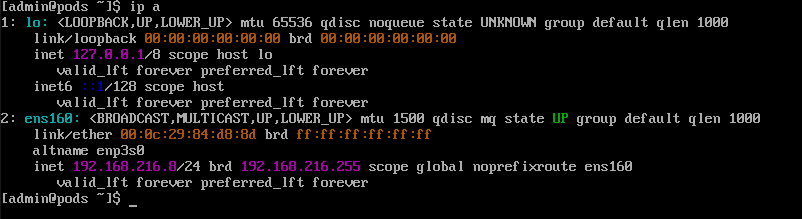

4. Check Internet connection.

    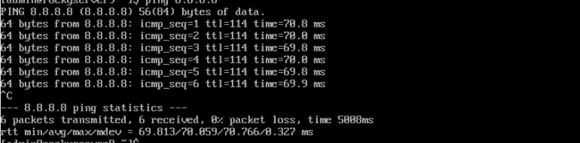

5. Change the password of the new *pods* vm.

    ```sh
    passwd
    ```

6. Change the Hostname.

    ```sh
    sudo hostnamectl set-hostname pods
    ```

    * Verify the change.

    ```sh
    hostnamectl
    ```

    * Output.

    ```sh
    Static hostname: pods
    ```

7. Update the `/etc/hosts` file.

    ```sh
    sudo nano /etc/hosts
    ```

    * Add the line.

    ```sh
    127.0.1.1 pods
    ```

    * Restart *vm pods*.

8. Install `VMware Tools`.

    ```sh
    sudo dnf install open-vm-tools
    ```

    * Enable it with.

    ```sh
    sudo systemctl enable --now vmtoolsd
    ```

9. Generate SSH host key.

    ```sh
    sudo rm -f /etc/ssh/ssh_host_*
    sudo ssh-keygen -A
    sudo systemctl restart sshd
    ```

10. Configure SSH key access from the administration vm.

    * Check if user SSH keys already exist.

    ```sh
    ls -la ~/.ssh
    ```

    * If they do not exist, generate them.

    ```sh
    ssh-keygen -t ed25519 -f ~/.ssh/id_ed25519 -C "admin@nat"
    ```

11. Configure permissions.

    ```sh
    chmod 700 ~/.ssh
    chmod 600 ~/.ssh/id_ed25519
    chmod 644 ~/.ssh/id_ed25519.pub
    chmod 600 ~/.ssh/config
    chmod 600 ~/.ssh/authorized_keys
    ```

    * Transfer public key to the destination *vm pods*.

    ```sh
    ssh-copy-id admin@192.168.216.8
    ```

    * Create alias for quick access.

    ```sh
    nano ~/.ssh/config
    ```

    * Add.

    ```sh
    Host pods
        HostName 192.168.216.8
        User admin
        IdentityFile ~/.ssh/id_ed25519
    ```

    * Verify connection.

    ```sh
    ssh pods
    ```

12. Check if SELinux is in enforcing mode.

    ```sh
    getenforce
    ```

    * If the output is.

    ```sh
    Enforcing
    ```

    * Switch to Permissive.

    ```sh
    sudo setenforce 0
    ```

---

### Firewall *internal* Zone Configuration

Using [security guide](https://docs.redhat.com/en/documentation/red_hat_enterprise_linux/7/html/security_guide/sec-working_with_zones) as reference.

#### Proper Interface-to-Zone Assignment

1. View active zones.

```sh
firewall-cmd --get-active-zones
```

* Output.

```sh
public
  interfaces: ens160 ens224
trusted
  interfaces: lo
```

1. Move the *ens160* interface to the *internal* zone.

```sh
sudo firewall-cmd --permanent --zone=internal --change-interface=ens160
```

* Apply changes.

```sh
sudo firewall-cmd --reload
```

* Verify.

```sh
firewall-cmd --get-active-zones
```

* Output.

```sh
internal
  interfaces: ens160
public
  interfaces: ens224
trusted
  interfaces: lo
```

1. Create a new *database* zone.

    ```sh
    sudo firewall-cmd --permanent --new-zone=database
    ```

2. Assign the *ens224* interface to the new *database* zone.

    ```sh
    sudo firewall-cmd --permanent --zone=database --change-interface=ens224
    ```

    * Apply changes.

    ```sh
    sudo firewall-cmd --reload
    ```

    * Verify.

    ```sh
    firewall-cmd --get-active-zones
    ```

    * Output.

    ```sh
    database
      interfaces: ens224
    internal
      interfaces: ens160
    trusted
      interfaces: lo
    ```

#### Configure Properties of the *internal* Zone

1. Clean up services from the *internal* zone.

* View zone properties.

```sh
sudo firewall-cmd --zone=internal --list-all
```

* Output

```sh
internal (active)
  target: default
  icmp-block-inversion: no
  interfaces: ens160
  sources:
  services: cockpit dhcpv6-client mdns samba-client ssh
  ports:
  protocols:
  forward: yes
  masquerade: no
  forward-ports:
  source-ports:
  icmp-blocks:
  rich rules:
```

* Remove unnecessary services.

```sh
sudo firewall-cmd --zone=internal --remove-service=cockpit --permanent
sudo firewall-cmd --zone=internal --remove-service=dhcpv6-client --permanent
sudo firewall-cmd --zone=internal --remove-service=mdns --permanent
sudo firewall-cmd --zone=internal --remove-service=samba-client --permanent
```

* Reload.

```sh
sudo firewall-cmd --reload
```

* Verify.

````sh
internal (active)
  target: default
  icmp-block-inversion: no
  interfaces: ens160
  sources:
  services: ssh
  ports:
  protocols:
  forward: yes
  masquerade: no
  forward-ports:
  source-ports:
  icmp-blocks:
  rich rules:
````

1. Remove the forwarding part.

```sh
sudo firewall-cmd --permanent --zone=internal --remove-forward
```

* Reload.

```sh
sudo firewall-cmd --reload
```

* Verify.

````sh
internal (active)
  target: default
  icmp-block-inversion: no
  interfaces: ens160
  sources:
  services: ssh
  ports:
  protocols:
  forward: no
  masquerade: no
  forward-ports:
  source-ports:
  icmp-blocks:
  rich rules:
````

---

### Extend Storage on *vm pods*

The original disk could not be expanded because the swap partition blocked growth. The solution was to add a new disk from ESXi.

1. Add disk from ESXi

![[Pasted image 20260331223659.png|559]]

> From the ESXi interface, edit the VM and add a new hard disk with the desired size, in this case 16GB, in **thin allocation**; for this solution the vm must be powered off.

1. Verify the disk was detected

    ```bash
    lsblk
    ```

    * Output.

    ```sh
    NAME                     MAJ:MIN RM  SIZE RO TYPE MOUNTPOINTS
    sda                        8:0    0   16G  0 disk
    sr0                       11:0    1 1024M  0 rom
    nvme0n1                  259:0    0   30G  0 disk
    ├─nvme0n1p1              259:1    0  512M  0 part /boot
    ├─nvme0n1p2              259:2    0 18.2G  0 part
    │ ├─rl-pool00_tmeta      253:0    0   16M  0 lvm
    │ │ └─rl-pool00-tpool    253:2    0 14.5G  0 lvm
    │ │   ├─rl-root          253:3    0    8G  0 lvm  /
    │ │   ├─rl-pool00        253:4    0 14.5G  1 lvm
    │ │   ├─rl-var_tmp       253:5    0    1G  0 lvm  /var/tmp
    │ │   ├─rl-tmp           253:6    0    1G  0 lvm  /tmp
    │ │   ├─rl-home          253:7    0    2G  0 lvm  /home
    │ │   ├─rl-var           253:8    0    1G  0 lvm  /var
    │ │   ├─rl-var_log       253:9    0    1G  0 lvm  /var/log
    │ │   └─rl-var_log_audit 253:10   0  520M  0 lvm  /var/log/audit
    │ └─rl-pool00_tdata      253:1    0 14.5G  0 lvm
    │   └─rl-pool00-tpool    253:2    0 14.5G  0 lvm
    │     ├─rl-root          253:3    0    8G  0 lvm  /
    │     ├─rl-pool00        253:4    0 14.5G  1 lvm
    │     ├─rl-var_tmp       253:5    0    1G  0 lvm  /var/tmp
    │     ├─rl-tmp           253:6    0    1G  0 lvm  /tmp
    │     ├─rl-home          253:7    0    2G  0 lvm  /home
    │     ├─rl-var           253:8    0    1G  0 lvm  /var
    │     ├─rl-var_log       253:9    0    1G  0 lvm  /var/log
    │     └─rl-var_log_audit 253:10   0  520M  0 lvm  /var/log/audit
    └─nvme0n1p3              259:3    0    1G  0 part [SWAP]
    ```

    > The new disk appears as `sda` (or similar) without partitions or mount point.

    1. Add the disk to the VG (Volume Group).

    ```bash
    sudo pvcreate /dev/sda
    sudo vgextend rl /dev/sda
    sudo vgdisplay rl | grep Free
    ```

    * `sudo pvcreate /dev/sda`: This command initializes the physical disk `/dev/sda` so that LVM can use it; technically it converts it into a Physical Volume (PV), marking it as available space for the volume management system.

    * `sudo vgextend rl /dev/sda`: This command takes the disk you just prepared and adds it to the Volume Group (VG) called `rl` (which is the main group of your Rocky/AlmaLinux installation); basically "enlarges the bag" of total storage on your server.

    * `sudo vgdisplay rl | grep Free`: This command queries the detailed information of the volume group `rl` and filters the output to show only how much **Free** space is now available to distribute among your partitions (like `/boot`, `/var`, or `/`).

2. Extend the logical volume.

    ```bash
    sudo lvextend -L +10G /dev/rl/home
    ```

3. Extend the filesystem (ext4).

    ```bash
    sudo resize2fs /dev/rl/home
    ```

    * Verify.

    ```bash
    df -h /home
    ```

    * Output.

    ```sh
    Filesystem           Size  Used Avail Use% Mounted on
    /dev/mapper/rl-home   12G  1.5G  9.8G  14% /home
    ```

---

### Database Dump

Using [mariadb backup guide](https://mariadb.com/docs/server/mariadb-quickstart-guides/mariadb-backup-guide) as reference.

1. Log in to MariaDB, directly on *db1* vm (primary node of the database cluster).

```sh
sudo mariadb
```

* Verify that the GLPI database exists.

```sh
MariaDB [(none)]> SHOW DATABASES;
```

* Output.

```sql
+--------------------+
| Database           |
+--------------------+
| glpidb             |
| information_schema |
| mysql              |
| performance_schema |
+--------------------+
```

* View users.

```sql
MariaDB [(none)]> SELECT User, Host FROM mysql.user;
+------------------+---------------+
| User             | Host          |
+------------------+---------------+
| maxscale_router  | 192.168.217.1 |
| glpiuser         | 192.168.217.2 |
| glpiuser         | 192.168.217.3 |
| sstuser          | 192.168.219.% |
| glpiuser         | 192.168.219.1 |
| maxscale_monitor | 192.168.219.1 |
| maxscale_router  | 192.168.219.1 |
| mariadb.sys      | localhost     |
| mysql            | localhost     |
| root             | localhost     |
+------------------+---------------+
```

1. Create the dump (a dump is a text file that contains all the SQL instructions necessary to recreate the complete structure and restore all database data from that point in time) of GLPI.

    ```sh
    sudo mysqldump --single-transaction --routines --triggers --events -u root -p glpidb > /home/admin/glpidb_dump.sql
    ```

2. Verify dump integrity before moving it.

    ```sh
    tail -n 5 /home/admin/glpidb_dump.sql
    ```

    * Output.

    ```sh
    /*!40101 SET CHARACTER_SET_RESULTS=@OLD_CHARACTER_SET_RESULTS */;
    /*!40101 SET COLLATION_CONNECTION=@OLD_COLLATION_CONNECTION */;
    /*!40111 SET SQL_NOTES=@OLD_SQL_NOTES */;

    -- Dump completed on 2026-03-31  8:48:46
    ```

    * Create checksum of the dump.

    ```sh
    sha256sum /home/admin/glpidb_dump.sql > /home/admin/glpidb_dump.sql.sha256
    ```

3. Transfer the dump to *vm pods*.

    ```sh
    scp /root/glpidb_dump.sql admin@192.168.216.7:/home/admin/
    ```

    * Transfer checksum.

    ```sh
    scp /root/glpidb_dump.sql.sha256 admin@192.168.216.7:/home/admin/
    ```

4. Verify that the file transfer was correct, from *vm pods*.

    ```sh
    sha256sum -c glpidb_dump.sql.sha256
    ```

    * Output.

    ```sh
    /home/admin/glpidb_dump.sql: OK
    ```

---

### Changing the NAT Public IP

During SSH connectivity tests to the NAT machine, an intermittent
problem was detected where the connection was suddenly lost and, when trying to
reconnect, the SSH client reported a change in the remote host's identity.

#### Detected Problem

From the administration machine the following errors were obtained:

```sh
client_loop: send disconnect: Broken pipe
```

Subsequently, when trying to reconnect:

```sh
@@@@@@@@@@@@@@@@@@@@@@@@@@@@@@@@@@@@@@@@@@@@@@@@@@@@@@@@@@@
@    WARNING: REMOTE HOST IDENTIFICATION HAS CHANGED!     @
@@@@@@@@@@@@@@@@@@@@@@@@@@@@@@@@@@@@@@@@@@@@@@@@@@@@@@@@@@@
Host key verification failed.
```

Additionally, when repeatedly querying the public SSH fingerprint of IP `172.24.133.216`, it was observed that it alternated between two different fingerprints:

```sh
256 SHA256:tLVmuatGJ/kQY16OiYj8bfmjaouWYveaJrInQGCREiw 172.24.133.216 (ED25519)
256 SHA256:COwa31oABhj1ZsPzEj6NksscpAHoxi5bxHa4xk34CE4 172.24.133.216 (ED25519)
```

This indicated that **the public IP was being answered by more than one
machine**, which caused the SSH identity conflict.
To avoid this behavior and isolate the problem, it was decided to **change the public IP of the NAT server** from `172.24.133.216` to `172.24.133.217`.

#### Procedure Performed

1. View interfaces and zones.

```sh
sudo firewall-cmd --get-active-zones
```

* Output.

```sh
external
  interfaces: ens160
internal
  interfaces: ens224
trusted
  interfaces: lo
```

* View *external* zone.

```sh
external (active)
  target: default
  icmp-block-inversion: no
  interfaces: ens160
  sources:
  services: ssh
  ports:
  protocols:
  forward: yes
  masquerade: yes
  forward-ports:
  source-ports:
  icmp-blocks:
  rich rules:
```

* View *internal* zone.

```sh
internal (active)
  target: default
  icmp-block-inversion: no
  interfaces: ens224
  sources:
  services:
  ports:
  protocols:
  forward: yes
  masquerade: no
  forward-ports:
  source-ports:
  icmp-blocks:
  rich rules:
```

1. View IPs and interfaces.

```sh
ip address
ip route
```

* Output.

```sh
1: lo: <LOOPBACK,UP,LOWER_UP> mtu 65536 qdisc noqueue state UNKNOWN group default qlen 1000
    link/loopback 00:00:00:00:00:00 brd 00:00:00:00:00:00
    inet 127.0.0.1/8 scope host lo
       valid_lft forever preferred_lft forever
    inet6 ::1/128 scope host
       valid_lft forever preferred_lft forever
2: ens160: <BROADCAST,MULTICAST,UP,LOWER_UP> mtu 1500 qdisc mq state UP group default qlen 1000
    link/ether 00:0c:29:ff:8e:58 brd ff:ff:ff:ff:ff:ff
    altname enp3s0
    inet 172.24.133.216/24 brd 172.24.133.255 scope global noprefixroute ens160
       valid_lft forever preferred_lft forever
3: ens224: <BROADCAST,MULTICAST,UP,LOWER_UP> mtu 1500 qdisc mq state UP group default qlen 1000
    link/ether 00:0c:29:ff:8e:62 brd ff:ff:ff:ff:ff:ff
    altname enp19s0
    inet 192.168.216.1/24 brd 192.168.216.255 scope global noprefixroute ens224
       valid_lft forever preferred_lft forever

default via 172.24.133.1 dev ens160 proto static metric 100
172.24.133.0/24 dev ens160 proto kernel scope link src 172.24.133.216 metric 100
192.168.216.0/24 dev ens224 proto kernel scope link src 192.168.216.1 metric 101
```

1. Change IP from `172.24.133.216` to `172.24.133.217`.

```sh
sudo nmtui
```

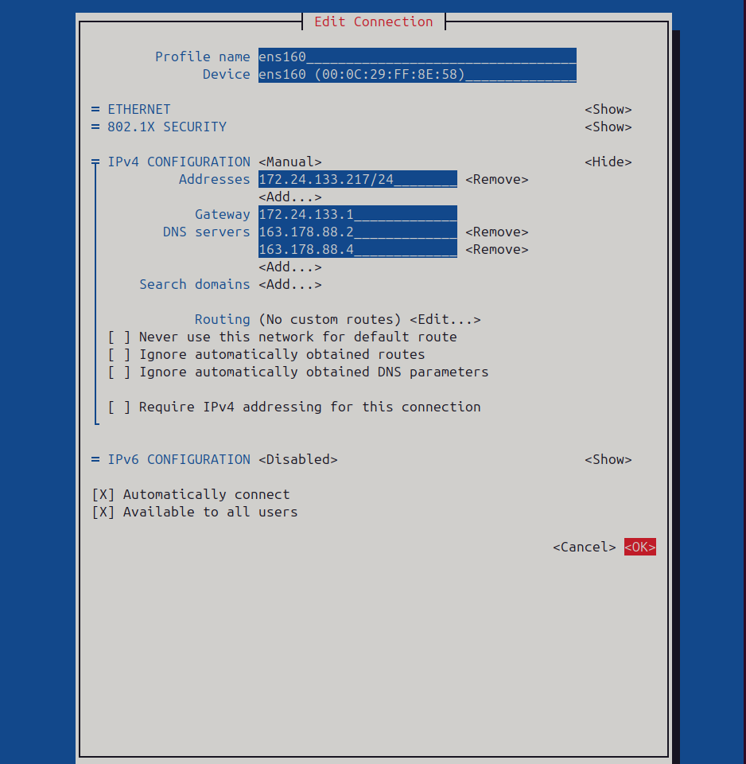

1. Verify.

```sh
[admin@nat ~]$ ip a
1: lo: <LOOPBACK,UP,LOWER_UP> mtu 65536 qdisc noqueue state UNKNOWN group default qlen 1000
    link/loopback 00:00:00:00:00:00 brd 00:00:00:00:00:00
    inet 127.0.0.1/8 scope host lo
       valid_lft forever preferred_lft forever
    inet6 ::1/128 scope host
       valid_lft forever preferred_lft forever
2: ens160: <BROADCAST,MULTICAST,UP,LOWER_UP> mtu 1500 qdisc mq state UP group default qlen 1000
    link/ether 00:0c:29:ff:8e:58 brd ff:ff:ff:ff:ff:ff
    altname enp3s0
    inet 172.24.133.217/24 brd 172.24.133.255 scope global noprefixroute ens160
       valid_lft forever preferred_lft forever
3: ens224: <BROADCAST,MULTICAST,UP,LOWER_UP> mtu 1500 qdisc mq state UP group default qlen 1000
    link/ether 00:0c:29:ff:8e:62 brd ff:ff:ff:ff:ff:ff
    altname enp19s0
    inet 192.168.216.1/24 brd 192.168.216.255 scope global noprefixroute ens224
       valid_lft forever preferred_lft forever
[admin@nat ~]$ ip route
default via 172.24.133.1 dev ens160 proto static metric 102
172.24.133.0/24 dev ens160 proto kernel scope link src 172.24.133.217 metric 102
192.168.216.0/24 dev ens224 proto kernel scope link src 192.168.216.1 metric 101
[admin@nat ~]$
```

* From *vm pods*.

```sh
[admin@pods ~]$ ping 8.8.8.8
PING 8.8.8.8 (8.8.8.8) 56(84) bytes of data.
64 bytes from 8.8.8.8: icmp_seq=1 ttl=114 time=77.0 ms
64 bytes from 8.8.8.8: icmp_seq=2 ttl=114 time=68.5 ms
64 bytes from 8.8.8.8: icmp_seq=3 ttl=114 time=70.6 ms
^C
--- 8.8.8.8 ping statistics ---
3 packets transmitted, 3 received, 0% packet loss, time 2004ms
rtt min/avg/max/mdev = 68.469/72.039/77.026/3.634 ms
```

---

### Taking VM Snapshots

1. Take Snapshot of *vm nat*.

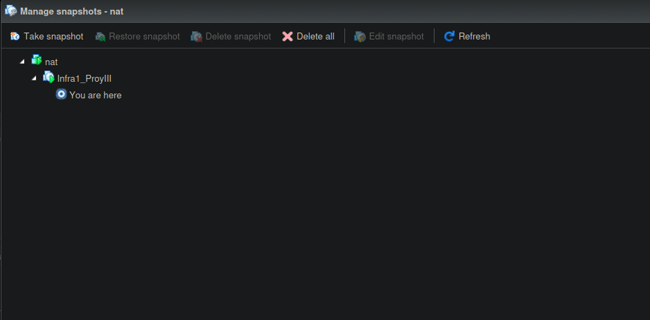

1. Take Snapshot of *vm db1*.

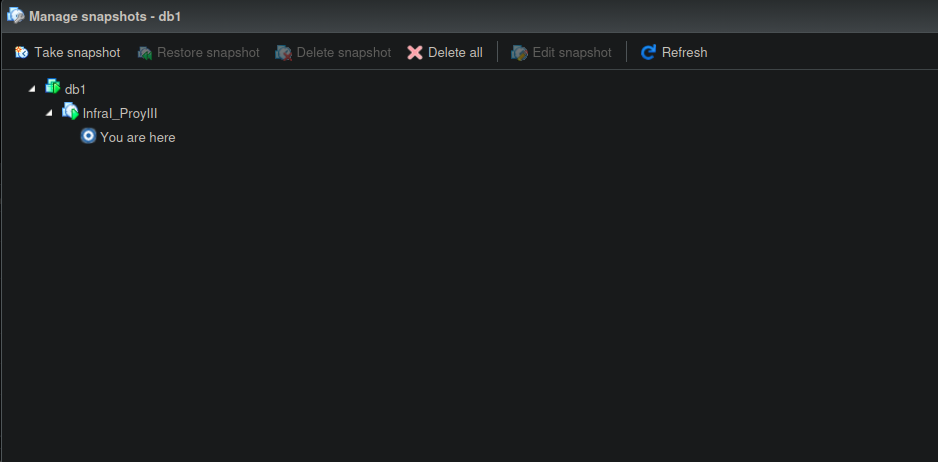

1. Take Snapshot of *vm app1*.

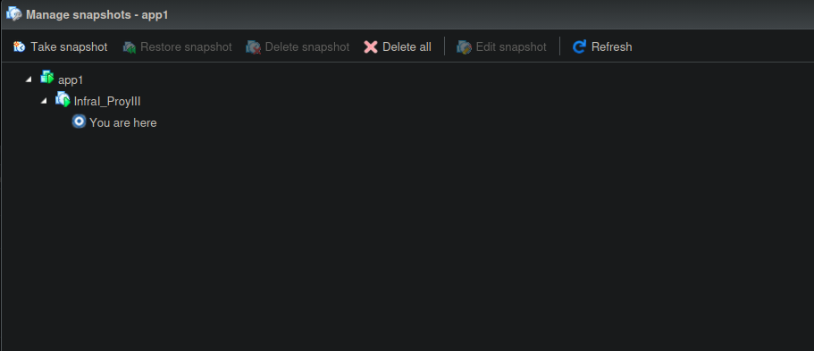

---

### Pause Services

1. Put GLPI in maintenance mode.

```sh
sudo systemctl stop nginx
```

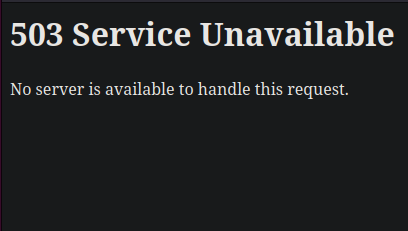

1. Check if there are files inside `/srv/www/glpi/`.

> *Note: in this case, since the files and plugins folders were empty in config, there are no files strictly necessary for the migration; nonetheless, the GLPI folder was compressed and transferred to the pods vm.*

1. Transfer the compressed directory to *vm pods*.

```sh
sudo scp glpi-old-backup.tar.gz admin@192.168.216.8:/home/admin/
```

### Disconnect and Delete Resources

1. Remove interfaces from *vms app1 and db1*.

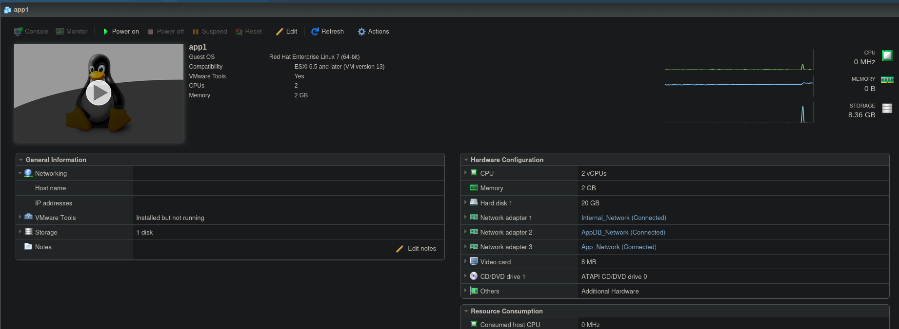
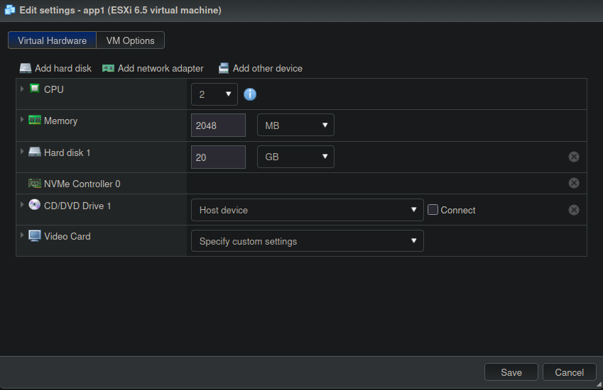
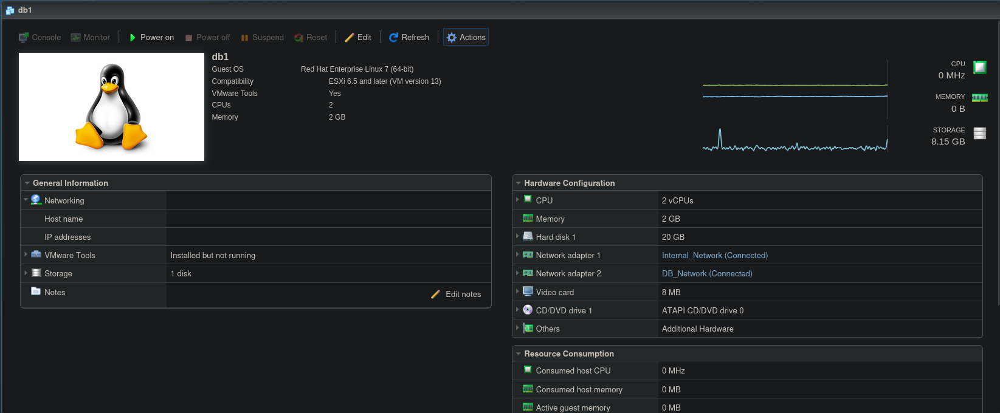
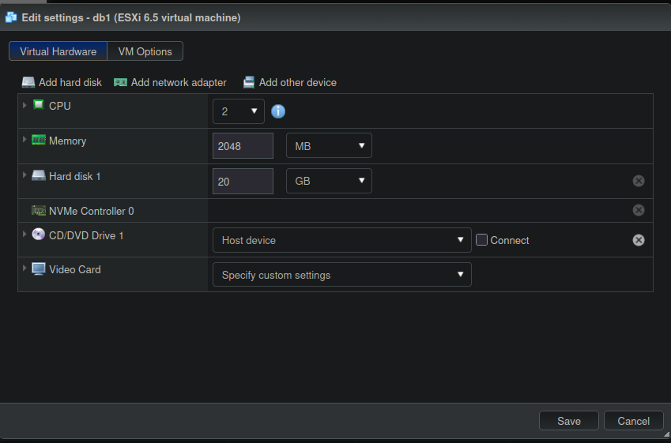

> They were not deleted, to have a second backup.

1. Delete the *app2*, *db2*, and *dbproxy* vms.

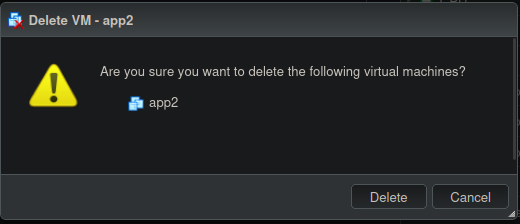
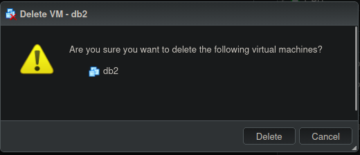
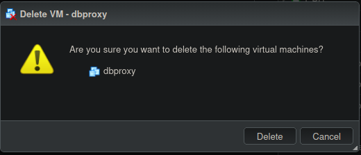

1. Result of the virtual machines after deletion.

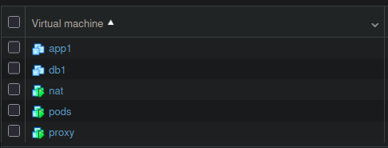

1. Delete the switches that will no longer be used.

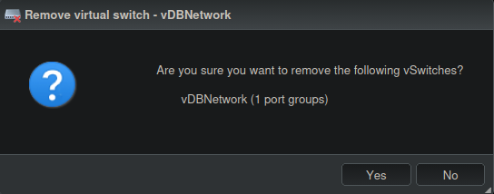
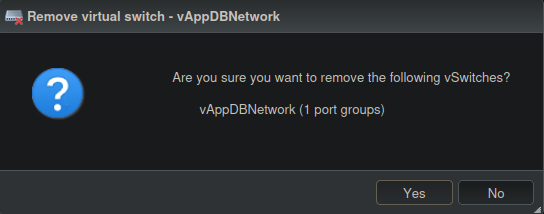

---

## Podman Installation and Base Configuration

### Podman Installation

Following as guide:

* [How to Install Podman on Rocky Linux 9](https://docs.vultr.com/how-to-install-podman-on-rocky-linux-9)
* [Podman Guide - Rocky Linux 10](https://docs.rockylinux.org/10/guides/containers/podman_guide/)
* [Install Podman on Rocky Linux](https://oneuptime.com/blog/post/2026-03-16-install-podman-rocky-linux/view)

1. Update the server's package index.

    ```sh
    dnf update --security
    ```

2. Install Podman.

    ```sh
    sudo dnf install podman -y
    ```

3. View the Podman version installed on the server.

    ```sh
    podman --version
    ```

    * Output.

    ```sh
    podman version 5.6.0
    ```

---

### Initial Podman Configuration

1. Confirm rootless mode.

```sh
cat /etc/subuid
```

* Output.

```sh
admin:100000:65536
```

* If it does not appear, add the line.

```sh
sudo usermod --add-subuids 100000-165535 $(whoami)
sudo usermod --add-subgids 100000-165535 $(whoami)
```

1. Enable lingering for the user.

```sh
sudo loginctl enable-linger admin
```

* Verify.

```sh
loginctl show-user admin | grep Linger
```

* Output.

```sh
Linger=yes
```

> By default, on Linux (specifically on systems with `systemd`), when a user logs out, the operating system "cleans up" everything that user had open and stops their personal service manager to save resources.

1. Create the folder structure.

```sh
mkdir -p ~/containers/{quadlet,configs,volumes,backups}
mkdir -p ~/containers/configs/{glpi,mariadb}
mkdir -p ~/containers/volumes/{glpi-files,glpi-plugins,glpi-marketplace,mariadb-data}
```

* For *Quadlet*.

```sh
mkdir -p ~/.config/containers/systemd/
```

|Path|Use|
|---|---|
|`~/containers/configs/glpi`|External configuration files and GLPI environment variables|
|`~/containers/configs/mariadb`|Custom MariaDB configuration|
|`~/containers/volumes/glpi-files`|Main persistent GLPI files|
|`~/containers/volumes/glpi-plugins`|Manually installed GLPI plugins|
|`~/containers/volumes/glpi-marketplace`|Content downloaded from the GLPI marketplace|
|`~/containers/volumes/mariadb-data`|Database data|
|`~/.config/containers/systemd`|Quadlet files|

---

### Image Selection and Analysis

#### Image Selection and Download

1. Choosing the GLPI image, it will be used directly from its official Docker Hub source: [GLPI Docker Hub](https://hub.docker.com/r/glpi/glpi)

    * Previously installed version: `10.0.15`

    * Chosen for this implementation: `glpi:10.0`

    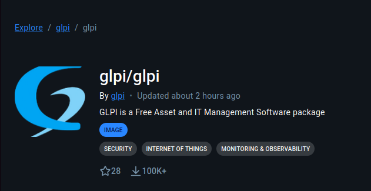
    >*Note:* GLPI 10.0.x officially supports MariaDB 10.3 through 10.11, so the selected version `mariadb:10.11` is compatible. You can verify this in the official documentation: [GLPI Installation Guide](https://glpi-install.readthedocs.io/en/latest/install/#files-and-directories-locations)

2. Choosing the MariaDB image, it will be used directly from its official Docker Hub source: [MariaDB Docker Hub](https://hub.docker.com/_/mariadb)

    * Previously installed version: `10.5.29`

    * Chosen for this implementation: ~~`mariadb:10.5`~~ `mariadb:10.11`

    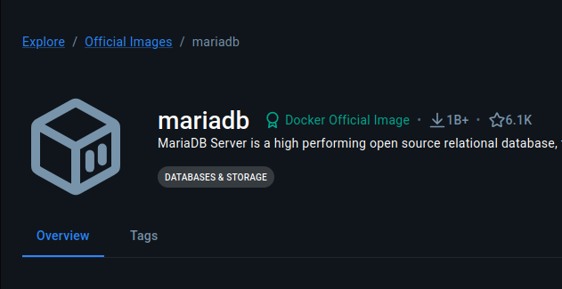

3. Pull the selected images from DockerHub.

    * GLPI.

    ```sh
    podman pull glpi/glpi:10.0
    ```

    * MariaDB

    ```sh
    podman pull mariadb:10.5
    podman pull mariadb:10.11
    ```

    * Verify.

    ```sh
    podman assets
    ```

    * Output.

    ```sh
    REPOSITORY                 TAG            IMAGE ID      CREATED        SIZE
    docker.io/library/mariadb  10.11          c0fc1a911284  2 weeks ago    337 MB
    docker.io/glpi/glpi        10.0           fa7680783b9d  4 weeks ago    1 GB
    docker.io/library/mariadb  10.5           7171297ddfbc  10 months ago  401 MB
    ```

#### Installing *Trivy* and *Dockle*

1. Install [**Trivy**](https://github.com/aquasecurity/trivy).

    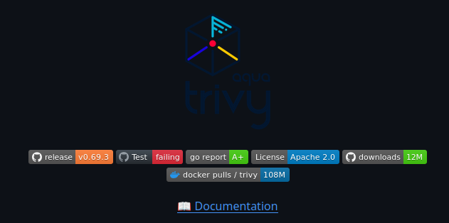

    * Trivy is a security scanner that analyzes container images for known vulnerabilities (CVEs) in OS packages and libraries, exposed secrets, and misconfigurations.

    * Installation: [Trivy Installation](https://trivy.dev/docs/latest/getting-started/installation/#__tabbed_1_1)

```sh
sudo rpm -ivh https://github.com/aquasecurity/trivy/releases/download/v0.69.3/trivy_0.69.3_Linux-64bit.rpm
```

* Verify.

```sh
trivy --version
```

* Output.

```sh
Version: 0.69.3
```

1. Install [**Dockle**](https://github.com/goodwithtech/dockle).

    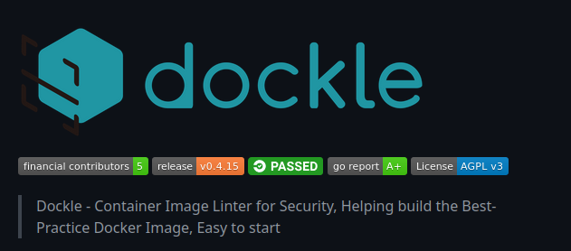

    * Dockle is a container image auditing tool that verifies compliance with best construction practices (CIS Benchmarks) and detects configuration issues in the image, such as running as root, use of insecure tags, or incorrect file permissions. It does not scan for software vulnerabilities.

    * Installation: [Dockle Installation](https://github.com/goodwithtech/dockle?tab=readme-ov-file#installation)

```sh
VERSION=$(
 curl --silent "https://api.github.com/repos/goodwithtech/dockle/releases/latest" | \
 grep '"tag_name":' | \
 sed -E 's/.*"v([^"]+)".*/\1/' \
) && sudo rpm -ivh https://github.com/goodwithtech/dockle/releases/download/v${VERSION}/dockle_${VERSION}_Linux-64bit.rpm
```

* Verify.

```sh
dockle --version
```

* Output.

```sh
dockle version 0.4.15
```

#### Analysis with Trivy

1. Create folder to save the results.

    ```sh
    mkdir -p ~/containers/security-scans/trivy
    ```

2. Scan the **GLPI** image `glpi/glpi:10.0` with *Trivy*.

    ```sh
    trivy image docker.io/glpi/glpi:10.0 > ~/containers/security-scans/trivy/glpi_report.txt
    ```

    * View report.

    ```sh
    less ~/containers/security-scans/trivy/glpi_report.txt
    grep -E "Total:|CRITICAL:|HIGH:|MEDIUM:|LOW:" ~/containers/security-scans/trivy/glpi_report.txt
    ```

    * Output.

    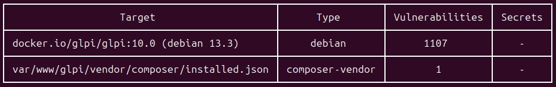

    ```sh
    Total: 1107 (UNKNOWN: 7, LOW: 669, MEDIUM: 337, HIGH: 89, CRITICAL: 5)
    Total: 1 (UNKNOWN: 0, LOW: 1, MEDIUM: 0, HIGH: 0, CRITICAL: 0)
    ```

    > *The first line corresponds to vulnerabilities detected in the base OS packages of the image (Debian 13.3), while the second corresponds to application-specific dependencies detected by Composer.*

    * In particular, *Trivy* identified a vulnerability in the `firebase/php-jwt` library:

    ```sh
    Library: firebase/php-jwt
    CVE: CVE-2025-45769
    Severity: LOW
    Installed Version: v6.10.0
    Fixed Version: 7.0.0
    ```

    > **Results**: The scan of the `glpi/glpi:10.0` image shows a considerable number of known vulnerabilities, most associated with base system packages and dependencies included in the image, rather than necessarily with the GLPI application logic itself.
    >
    > For this reason, the result should not be interpreted solely by the total number of findings, but also by their context, severity, and real exposure within the deployment environment.
    > In this case, the image can be used within the project environment, as long as it is accompanied by appropriate security measures.

3. Scan the **MariaDB** image `mariadb:10.5` with *Trivy*.

    ```sh
    trivy image docker.io/mariadb:10.5 > ~/containers/security-scans/trivy/mariadb_report.txt
    ```

    * Output.

    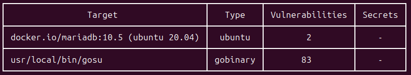

    ```sh
    Total: 2 (UNKNOWN: 0, LOW: 0, MEDIUM: 2, HIGH: 0, CRITICAL: 0)
    Total: 83 (UNKNOWN: 0, LOW: 2, MEDIUM: 40, HIGH: 37, CRITICAL: 4)
    ```

    > *The first line corresponds to vulnerabilities detected in the base OS packages of the image (Ubuntu 20.04), while the second corresponds to vulnerabilities detected in the `gosu` binary included within the image.*
    >**Result:** The analysis of the `mariadb:10.5` image shows that an important part of the findings does not correspond directly to the MariaDB database engine, but to components included in the base image and auxiliary utilities.
    >
    >However, the presence of HIGH and CRITICAL vulnerabilities, together with the use of an older base system, makes this version a less convenient option from a security standpoint.
    >
    >For this reason, although the image can technically function, it was not selected as the final version for deployment.

4. Scan the **MariaDB** image `mariadb:10.11` with *Trivy*.

    ```sh
    trivy image docker.io/mariadb:10.11 > ~/containers/security-scans/trivy/mariadb_11_report.txt
    ```

    * Output.

    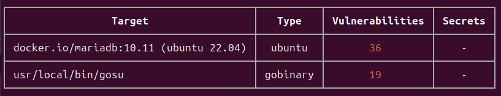

    ```sh
    Total: 36 (UNKNOWN: 0, LOW: 25, MEDIUM: 11, HIGH: 0, CRITICAL: 0)
    Total: 19 (UNKNOWN: 0, LOW: 1, MEDIUM: 12, HIGH: 5, CRITICAL: 1)
    ```

    > **Result:** Compared to version `10.5`, the `mariadb:10.11` image presents a more favorable security profile, being built on a more recent base system and significantly reducing the number of higher severity findings.
    >
    > Although vulnerabilities are still detected in auxiliary components included in the image, the overall result is considerably more acceptable for service deployment.
    >
    > **Since GLPI is compatible with MariaDB 10.11, this version was considered a more suitable alternative and was the one selected for the final implementation, as it offers a better balance between compatibility, stability, and security.**

---

#### Analysis with Dockle

1. Create folder to save the results.

    ```sh
    mkdir -p ~/containers/security-scans/dockle
    ```

2. Scan the **GLPI** image `glpi/glpi:10.0` with *Dockle*.

    ```sh
    dockle docker.io/glpi/glpi:10.0 > ~/containers/security-scans/dockle/glpi_report.txt
    ```

    * Output.

    ```sh
    FATAL    - DKL-DI-0005: Clear apt-get caches
    INFO    - CIS-DI-0005: Enable Content trust for Docker
    INFO    - CIS-DI-0006: Add HEALTHCHECK instruction to the container image
    INFO    - CIS-DI-0008: Confirm safety of setuid/setgid files
    ```

    > **Result**: The analysis with *Dockle* shows mainly observations related to good construction practices and image hardening, rather than direct functional failures of the application.
    >
    > Among the most relevant findings are incomplete `apt` cache cleanup, the absence of a `HEALTHCHECK` instruction, and the presence of files with `setuid/setgid` permissions, aspects that slightly increase the container's exposure surface.

3. Scan the **MariaDB** images `mariadb:10.5` and `mariadb:10.11` with *Dockle*.

    ```sh
    dockle docker.io/mariadb:10.5 > ~/containers/security-scans/dockle/mariadb_report.txt
    dockle docker.io/mariadb:10.11 > ~/containers/security-scans/dockle/mariadb_11_report.txt
    ```

    * Output.

    ```sh
    WARN    - CIS-DI-0001: Create a user for the container
    INFO    - CIS-DI-0005: Enable Content trust for Docker
    INFO    - CIS-DI-0006: Add HEALTHCHECK instruction to the container image
    INFO    - CIS-DI-0008: Confirm safety of setuid/setgid files
    ```

    > **Result**: For both `mariadb:10.5` and `mariadb:10.11`, the Dockle result was the same. Dockle mainly reported hardening observations related to container execution and the presence of privileged binaries.
    >
    > The most important point is that the container runs with the default user defined in the image, which generates a warning for not explicitly forcing a non-privileged user in the final layer.
    > The absence of `HEALTHCHECK` and the existence of some binaries with `setuid/setgid` permissions were also identified, something relatively common in images based on full Linux systems.

---

## GLPI Migration to Podman

### GLPI Pod Design

A single GLPI pod will be implemented containing:

* 1 GLPI container

* 1 MariaDB container

![[Pasted image 20260403100211.png|328]]

|Pod|Container|Function|
|---|---|---|
|`glpi-pod`|`glpi`|GLPI web application|
|`glpi-pod`|`mariadb`|System database|

> *Note:* The official GLPI image already includes the web stack necessary to expose the application, so it is not necessary to add an extra one, such as the Nginx used in the previous implementation.

#### Define Ports Exposed to the Host

| Component | Internal port | Host port | Justification |
| --------- | ------------: | --------: | ----------------------------- |
| GLPI | 80 | 8080 | Access from reverse proxy |
| MariaDB | 3306 | not exposed | Only accessible inside the pod |

> *Note:* Since **GLPI and MariaDB will be inside the same pod**, both will share the **same network namespace**. This means GLPI can connect to MariaDB using `127.0.0.1` or `localhost`.

---

### Defining the Persistent Directory Structure

1. For GLPI data persistence, it was decided to persist `/var/glpi`. This is because the most important part of GLPI to persist is not "the entire container", but its operational files. Mounted on:

    ```sh
    ~/containers/volumes/glpi-files
    ```

    * Normally the following persistent components are stored there:

      * uploaded files

      * attached documents

      * exports

      * caches and operational files

    * Additionally, it was decided to separate specific GLPI extensibility directories:

      * **Plugin:** Used for persistence of externally loaded extensions (`.tar.gz` files or repositories), allowing custom or unofficial plugins to remain operational after changes to the system image.:

        ```sh
        ~/containers/volumes/glpi-plugins
        ```

        * **Marketplace:** Functions as GLPI's official internal "App Store"; this volume allows installing and updating certified extensions with a single click from the web interface, ensuring that automatically downloaded tools persist in host storage:

        ```sh
        ~/containers/volumes/glpi-marketplace
        ```

2. For MariaDB data persistence, it was decided to persist `/var/lib/mysql`. This is because it avoids losing the database if the container is restarted, recreated, or updated. Mounted on:

    ```sh
    ~/containers/volumes/mariadb-data
    ```

3. Adjust permissions for rootless Podman for MariaDB.

    ```sh
    podman unshare chown -R 999:999 ~/containers/volumes/mariadb-data
    ```

    * `podman unshare`: Enters the user namespace. In rootless mode, the host user (e.g., 1000) is identified as "root" inside the container, while MariaDB runs as a low-privilege user.

    * `chown`: The standard Linux command to change the owner (*change owner*).

    * `-R`: Recursive. This is vital because MariaDB creates subfolders for each database; without this parameter, only the main folder would be accessible.

    * `999:999`: Corresponds to the standard ID of the `mysql` user in the official image. The first 999 represents the user and the second the group.

    >*Importance*: If MariaDB does not have ownership of this folder with ID 999, the container will enter a restart loop (*CrashLoopBackOff*) by not being able to initialize the system files.

4. Adjust permissions for rootless Podman for GLPI.

    ```sh
    podman unshare chown -R 33:33 ~/containers/volumes/glpi-files podman unshare
    chown -R 33:33 ~/containers/volumes/glpi-plugins podman unshare chown -R 33:33
    ~/containers/volumes/glpi-marketplace
    ```

    * `podman unshare`: As with the database, it maps the identity to allow assigning files to a user that technically does not exist outside the container.

    * `chown -R`: Ensures that each image, attached document, or loaded plugin automatically acquires the correct owner.

    * `33:33`: Represents the ID of the `www-data` user, the standard on Debian/Ubuntu-based systems for web servers, which is the base of the GLPI image.

    > *Importance*: - In glpi-files: Without this configuration, it is impossible to upload attached files in tickets. In glpi-plugins and glpi-marketplace: Without these permissions, GLPI cannot download or write the files of new features added from the web interface.

5. SELinux considerations. Since the VM uses SELinux, all mounted directories must be correctly labeled so that containers can access them. This will be done in Quadlet using the option:

    ```sh
    :Z
    ```

    * Example:

    ```sh
    Volume=%h/containers/volumes/glpi-files:/var/glpi:Z
    ```

    > *What does :Z do?* It tells Podman to automatically apply a suitable SELinux context for exclusive container use. This will be especially important later when SELinux is switched to `enforcing`.

---

### Quadlet Declarative Configuration

1. Create the password secrets.

    * Create secret for MariaDB root.

    ```sh
    read -s -p "MariaDB ROOT password: " MARIADB_ROOT_PASSWORD; echo printf '%s'
    "$MARIADB_ROOT_PASSWORD" | podman secret create mariadb_root_password - unset
    MARIADB_ROOT_PASSWORD
    ```

    * Create secret for `glpiuser`.

    ```sh
    read -s -p "MariaDB GLPI user password: " MARIADB_GLPI_PASSWORD; echo printf
    '%s' "$MARIADB_GLPI_PASSWORD" | podman secret create mariadb_glpi_password -
    unset MARIADB_GLPI_PASSWORD
    ```

    * Verify creation.

    ```sh
    podman secret ls
    ```

    * Output.

    ```sh
    ID                         NAME                   DRIVER      CREATED
    UPDATED 9d6d8f07da81c9c04726bd132  mariadb_glpi_password  file        5 seconds
    ago   5 seconds ago 954dec8589346baa1352dd6d6  mariadb_root_password  file
    21 seconds ago  21 seconds ago
    ```

2. Create environment variables file for MariaDB.

    ```sh
    nano ~/containers/configs/mariadb/mariadb.env
    ```

    * Add.

    ```ini
    MARIADB_DATABASE=glpidb
    MARIADB_USER=glpiuser
    MARIADB_AUTO_UPGRADE=1
    ```

    * Change permissions.

    ```sh
    chmod 600 ~/containers/configs/mariadb/mariadb.env
    ```

3. Create environment variables file for GLPI.

    ```sh
    nano ~/containers/configs/glpi/glpi.env
    ```

    * Add.

    ```ini
    GLPI_DB_HOST=127.0.0.1
    GLPI_DB_PORT=3306
    GLPI_DB_NAME=glpidb
    GLPI_DB_USER=glpiuser
    ```

    * Change permissions.

    ```sh
    chmod 600 ~/containers/configs/glpi/glpi.env
    ```

4. Create MariaDB configuration file.

    ```sh
    nano ~/containers/configs/mariadb/glpi.cnf
    ```

    * Add.

    ```ini
    [mysqld]
    # GLPI-required encoding
    character-set-server  = utf8mb4
    collation-server      = utf8mb4_unicode_ci
    default-time-zone     = '+00:00'

    # Connections
    max_connections       = 100

    # Memory
    innodb_buffer_pool_size = 256M

    # Slow query log
    slow_query_log        = 1
    slow_query_log_file   = /var/lib/mysql/slow.log
    long_query_time       = 2

    # Disable SSL for local connections within the pod
    skip_ssl
    ```

    * `[mysqld]`: Defines the section header. Indicates that the following configurations will apply directly to the daemon (main process) of the MariaDB server.

    * `character-set-server = utf8mb4`: Sets the character set to 4-byte UTF-8. This is critical for GLPI, as it allows full support for symbols, emojis, and various alphabets in tickets and descriptions.

    * `collation-server = utf8mb4_unicode_ci`: Defines how characters are compared and sorted. The `unicode_ci` variant ensures that database searches are accurate and follow international language standards.

    * `default-time-zone = '+00:00'`: Sets the server's timezone to UTC. This ensures that the timestamp of tickets is consistent, avoiding discrepancies if the physical server and the application are in different regions.

    * `max_connections = 100`: Limits the number of simultaneous connections to the database. For an academic or medium-scale environment, 100 connections are sufficient to support user traffic and GLPI background processes.

    * `innodb_buffer_pool_size = 256M`: Allocates the amount of RAM that MariaDB uses to cache data and table indexes. Since GLPI is a read-intensive application, a 256MB pool significantly improves response speed.

    * `slow_query_log = 1`: Activates slow query logging. It is a diagnostic tool that allows identifying processes that take too long to execute.

    * `slow_query_log_file = /var/lib/mysql/slow.log`: Defines the internal path where the log file for the slow queries mentioned above will be stored.

    * `long_query_time = 2`: Sets the time threshold (in seconds). Any query that takes more than 2 seconds will be recorded in the slow query log for later review.

    * **`skip_ssl`**: Tells MariaDB not to require SSL for local connections, since being inside the same pod, having a TLS certificate is not necessary.

    > Note: Without `skip_ssl` this error occurs: `error: 'TLS/SSL error: SSL is required, but the server does not support it'`.

5. Create Quadlet file for the pod.

    ```sh
    nano ~/.config/containers/systemd/glpi-pod.pod
    ```

    * Add.

    ```ini
    [Unit]
    Description=Pod GLPI

    [Pod]
    PodName=glpi-pod
    PublishPort=8080:80

    [Install]
    WantedBy=default.target
    ```

    * `[Unit]`: Starts the systemd metadata section, used to define basic information and dependencies of the unit before it runs.

    * `Description=Pod GLPI`: Provides a human-readable name for the service. This description will appear when running commands like `systemctl status`, making it easier to identify the Pod's purpose.

    * `[Pod]`: This is the specific Quadlet section that tells Podman it must create a container group (Pod) instead of an isolated container.

    * `PodName=glpi-pod`: Defines the internal name the Pod will have within Podman. This name is the one used to reference the shared network (for example, for GLPI to connect to `localhost`).

    * `PublishPort=8080:80`: Exposes the service externally. Maps port 8080 of the physical server (host) to port 80 internal to the Pod. This allows accessing GLPI from a browser at `http://IP-SERVER:8080`.

    * `[Install]`: Section that defines under what conditions the service should be enabled to be persistent.

    * `WantedBy=default.target`: Allows the Pod to start automatically asynchronously when the system boots or when the user logs in (in rootless mode), integrating it into the standard operating system lifecycle.

6. Create Quadlet file for the MariaDB container.

    ```sh
    nano ~/.config/containers/systemd/mariadb.container
    ```

    * Add.

    ```ini
    [Unit]
    Description=MariaDB for GLPI
    After=network-online.target

    [Container]
    Image=docker.io/library/mariadb:10.11
    ContainerName=mariadb
    Pod=glpi-pod.pod
    EnvironmentFile=%h/containers/configs/mariadb/mariadb.env

    # Secrets
    Secret=mariadb_root_password,type=mount
    Secret=mariadb_glpi_password,type=mount
    Environment=MARIADB_ROOT_PASSWORD_FILE=/run/secrets/mariadb_root_password
    Environment=MARIADB_PASSWORD_FILE=/run/secrets/mariadb_glpi_password

    # Volumes
    Volume=%h/containers/volumes/mariadb-data:/var/lib/mysql:Z
    Volume=%h/containers/configs/mariadb/glpi.cnf:/etc/mysql/conf.d/glpi.cnf:ro,Z

    # Native MariaDB image healthcheck
    HealthCmd=healthcheck.sh --connect --innodb_initialized
    HealthInterval=30s
    HealthRetries=3
    HealthStartPeriod=60s

    [Service]
    Restart=always
    RestartSec=10

    [Install]
    WantedBy=default.target
    ```

    * `[Unit]` section

      * **`Description=MariaDB for GLPI`**: Associates a descriptive name to the systemd unit to easily identify it when querying service status.

      * **`After=network-online.target`**: Ensures the container does not try to start until the operating system's network is fully active and ready.

    * `[Container]` section

      * **`Image=docker.io/library/mariadb:10.11`**: Specifies the official database engine image and version (10.11), guaranteeing stability and long-term support (LTS).

      * **`ContainerName=mariadb`**: Defines the static name of the container within Podman to facilitate its management and debugging.

      * **`Pod=glpi-pod.pod`**: Integrates the container into the previously defined Pod, allowing it to share the network (localhost) with the GLPI application.

      * **`EnvironmentFile=%h/containers/configs/mariadb/mariadb.env`**: Loads environment variables (such as passwords and users) from an external file. `%h` is a shortcut that automatically points to the user's `/home` directory.

      * **`Secret=mariadb_root_password,type=mount`**: Tells Podman to mount the "mariadb_root_password" secret as a temporary file inside the container.

      * **`Secret=mariadb_glpi_password,type=mount`**: Mounts the secret corresponding to the GLPI database user's password, ensuring the key is not visible as a plain environment variable.

      * **`Environment=MARIADB_ROOT_PASSWORD_FILE=/run/secrets/mariadb_root_password`**: Configures MariaDB to look for the superuser (`root`) password inside the mounted file's path, instead of receiving it in plain text.

      * **`Environment=MARIADB_PASSWORD_FILE=/run/secrets/mariadb_glpi_password`**: Defines the path of the file containing the password for the standard database user, maintaining data confidentiality during startup.

    * Volume Management

      * **`Volume=%h/containers/volumes/mariadb-data:/var/lib/mysql:Z`**: Maps the host folder where the actual data is stored. The `:Z` suffix tells SELinux to re-label permissions so the container can write without security blocks.

      * **`Volume=%h/containers/configs/mariadb/glpi.cnf:/etc/mysql/conf.d/glpi.cnf:ro,Z`**: Mounts the custom configuration file. The `:ro` suffix ensures the container can only read the file (Read-Only), protecting the original configuration.

    * Health Monitoring (Healthcheck)

      * **`HealthCmd=healthcheck.sh --connect --innodb_initialized`**: Runs an internal script that verifies whether the InnoDB engine has loaded into memory and accepts connections before marking the service as "operational".

      * **`HealthInterval=30s`**: Performs the health check every 30 seconds constantly.

      * **`HealthRetries=3`**: Allows up to three failed attempts before marking the container as "unhealthy".

      * **`HealthStartPeriod=60s`**: Grants a one-minute margin at startup for the database to initialize before starting to measure its health.

    * `[Service]` section

      * **`Restart=always`**: Configures a high availability policy; if the database process fails or closes unexpectedly, systemd will restart it immediately.

      * **`RestartSec=10`**: Sets a 10-second pause before each automatic restart attempt to avoid aggressive infinite loops.

    * `[Install]` section

      * **`WantedBy=default.target`**: Allows enabling the service to start automatically every time the user logs in or the server boots.

7. Create Quadlet file for the GLPI container.

    ```sh
    nano ~/.config/containers/systemd/glpi.container
    ```

    * Add.

    ```ini
    [Unit]
    Description=Container GLPI
    After=mariadb.service

    [Container]
    Image=docker.io/glpi/glpi:10.0
    ContainerName=glpi
    Pod=glpi-pod.pod
    EnvironmentFile=%h/containers/configs/glpi/glpi.env

    # Secrets
    Secret=mariadb_glpi_password,type=env,target=GLPI_DB_PASSWORD

    # Volumes
    Volume=%h/containers/volumes/glpi-files:/var/glpi:Z
    Volume=%h/containers/volumes/glpi-plugins:/var/www/html/glpi/plugins:Z
    Volume=%h/containers/volumes/glpi-marketplace:/var/www/html/glpi/marketplace:Z

    [Service]
    Restart=always
    RestartSec=15

    [Install]
    WantedBy=default.target
    ```

    * `[Unit]` section

      * **`Description=Container GLPI`**: Assigns a descriptive label to the systemd unit to identify the application process in system reports.

      * **`After=mariadb.service`**: Establishes an ordering dependency; indicates that this container should only attempt to start after the database service (**mariadb**) has started its process.

    * `[Container]` section

      * **`Image=docker.io/glpi/glpi:10.0`**: Defines the application's base image. Uses GLPI's official **10.0** version, ensuring the environment is predictable and reproducible.

      * **`ContainerName=glpi`**: Sets the unique name for the container within the Podman engine, facilitating the execution of specific diagnostic commands.

      * **`Pod=glpi-pod.pod`**: Associates this container to the same Pod as the database. This allows the application to communicate with MariaDB using `localhost`, as if they were on the same physical machine.

      * **`Secret=mariadb_glpi_password,type=env,target=GLPI_DB_PASSWORD`**: Maps a secret stored in the system directly as an internal environment variable.

        * The `target=GLPI_DB_PASSWORD` parameter tells the container that the database password value should be assigned specifically to that variable, which is the one GLPI recognizes to connect.

    * Volume Management (Persistence)

      * **`Volume=%h/containers/volumes/glpi-files:/var/glpi:Z`**: Maps the operational files directory (documents, logs, and sessions). The **`:Z`** suffix manages SELinux labels to allow writing in rootless mode.

      * **`Volume=%h/containers/volumes/glpi-plugins:/var/www/html/glpi/plugins:Z`**: Persists plugins manually installed on the host, preventing them from being deleted when updating or restarting the container image.

      * **`Volume=%h/containers/volumes/glpi-marketplace:/var/www/html/glpi/marketplace:Z`**: Ensures that extensions downloaded directly from the web interface (Marketplace) are physically stored on the server for permanent use.

    * `[Service]` section

      * **`Restart=always`**: Implements a self-repair policy; systemd will automatically restart the container if it fails or stops unexpectedly.

      * **`RestartSec=15`**: Defines a wait time of 15 seconds between restart attempts. This prevents resource exhaustion in case there is a persistent configuration error preventing startup.

    * `[Install]` section

      * **`WantedBy=default.target`**: Links the container startup to the user session or system startup, allowing GLPI to be available automatically after a server restart.

### Verification of the GLPI Pod Operation

1. Start services in order.

    ```sh
    systemctl --user daemon-reload
    ```

    * Start the pod first.

    ```sh
    systemctl --user start glpi-pod-pod.service
    systemctl --user status glpi-pod-pod.service
    ```

    * Output.

    ```sh
    ● glpi-pod-pod.service - Pod GLPI
        Loaded: loaded (/home/admin/.config/containers/systemd/glpi-pod.pod; generated)
        Active: active (running) since Sat 2026-04-04 09:27:40 CST; 32ms ago
    ```

    * Start MariaDB.

    ```sh
    systemctl --user start mariadb.service
    systemctl --user status mariadb.service
    ```

    * Wait for MariaDB to pass the healthcheck before continuing.

    ```sh
    podman healthcheck run mariadb
    podman ps --format "{{.Names}} {{.Status}}"
    ```

    * Output.

    ```sh
    glpi-pod-infra Up 10 minutes
    mariadb Up About a minute (healthy)
    ```

    > *Note:* Repeat until you see "healthy"

---

### Restore the Database Dump

1. Restore the database dump.

    ```sh
    podman exec -i mariadb sh -c 'mariadb -u root -p"$(cat /run/secrets/mariadb_root_password)" glpidb' \
      < ~/glpi_migration/glpidb_dump.sql
    ```

2. Verify integrity.

    ```sh
    podman exec -it mariadb sh -c 'mariadb -u root -p"$(cat /run/secrets/mariadb_root_password)" glpidb -e "
    SELECT COUNT(*) AS usuarios FROM glpi_users;
    SELECT COUNT(*) AS tickets FROM glpi_tickets;
    SELECT COUNT(*) AS equipos FROM glpi_computers;
    "'
    ```

    * Output.

    ```sh
    +----------+
    | usuarios |
    +----------+
    |        5 |
    +----------+
    +---------+
    | tickets |
    +---------+
    |       0 |
    +---------+
    +---------+
    | equipos |
    +---------+
    |       8 |
    +---------+
    ```

### Timezone Support Configuration

GLPI uses timezone information stored in MariaDB for certain
internal functions.
Therefore, after restoring the database, read permissions on the `mysql.time_zone_name` table must be granted and timezone information initialized from the GLPI container.

1. Grant permissions on `mysql.time_zone_name`.

    ```sh
    podman exec mariadb sh -c 'mariadb -u root -p"$(cat /run/secrets/mariadb_root_password)" -e "
    GRANT SELECT ON mysql.time_zone_name TO '\''glpiuser'\''@'\''%'\'';
    FLUSH PRIVILEGES;
    "'
    ```

2. Verify the permission was applied.

    ```sh
    podman exec mariadb sh -c 'mariadb -u root -p"$(cat /run/secrets/mariadb_root_password)" -e "
    SHOW GRANTS FOR '\''glpiuser'\''@'\''%'\'';
    "'
    ```

    * Output.

    ```sh
    Grants for glpiuser@%
    GRANT USAGE ON *.* TO `glpiuser`@`%` IDENTIFIED BY PASSWORD '*9128EC90808DDDDCE496E40318F07F06B7FBC70C'
    GRANT ALL PRIVILEGES ON `glpidb`.* TO `glpiuser`@`%`
    GRANT SELECT ON `mysql`.`time_zone_name` TO `glpiuser`@`%`
    ```

### Start the GLPI Container

1. Run to start the GLPI container.

    ```sh
    systemctl --user start glpi.service
    systemctl --user status glpi.service
    ```

    * Output.

    ```sh
    ● glpi.service - Container GLPI
        Loaded: loaded (/home/admin/.config/containers/systemd/glpi.container; generated)
        Active: active (running) since Sat 2026-04-04 09:50:12 CST; 5s ago
    ```

    * View pods.

    ```sh
    CONTAINER ID  IMAGE                            COMMAND               CREATED         STATUS                   PORTS                           NAMES
    ffa6f5114835                                                         22 minutes ago  Up 22 minutes            0.0.0.0:8080->80/tcp            glpi-pod-infra
    d85a78e067cd  docker.io/library/mariadb:10.11  mariadbd              13 minutes ago  Up 13 minutes (healthy)  0.0.0.0:8080->80/tcp, 3306/tcp  mariadb
    54791e427d87  docker.io/glpi/glpi:10.0         /usr/bin/supervis...  11 seconds ago  Up 12 seconds            0.0.0.0:8080->80/tcp            glpi
    ```

2. Initialize timezone support in GLPI.

    ```sh
    podman exec glpi php /var/www/glpi/bin/console database:enable_timezones
    ```

    * Output.

    ```sh
    The GLPI codebase has been updated. The update of the GLPI database is necessary.
    Run the "php bin/console database:update" command to process to the update.
    ```

3. Update the database.

    ```sh
    podman exec -it glpi php /var/www/glpi/bin/console database:update --no-interaction
    ```

    * Output.

    ```sh
    +-----------------------+----------------+---------+
    |                       | Current        | Targets |
    +-----------------------+----------------+---------+
    | Database host         | 127.0.0.1:3306 |         |
    | Database name         | glpidb         |         |
    | Database user         | glpiuser       |         |
    | GLPI version          | 10.0.24        | 10.0.24 |
    | GLPI database version | 10.0.24        | 10.0.24 |
    +-----------------------+----------------+---------+
    No migration is needed.
    ```

4. Verify that GLPI started correctly. View general container logs.

    ```sh
    podman logs glpi
    ```

5. View real-time logs.

    ```sh
    podman logs -f glpi
    ```

6. Verify container status.

    ```sh
    podman ps --all
    ```

    * Output.

    ```sh
    CONTAINER ID  IMAGE                            COMMAND               CREATED        STATUS                  PORTS                           NAMES
    ffa6f5114835                                                         11 hours ago   Up 11 hours             0.0.0.0:8080->80/tcp            glpi-pod-infra
    0797f6bcd28c  docker.io/library/mariadb:10.11  mariadbd              5 minutes ago  Up 5 minutes (healthy)  0.0.0.0:8080->80/tcp, 3306/tcp  mariadb
    c7913af9bfb3  docker.io/glpi/glpi:10.0         /usr/bin/supervis...  3 minutes ago  Up 3 minutes            0.0.0.0:8080->80/tcp            glpi
    ```

7. Validate that GLPI is actually listening inside the pod.

    ```sh
    curl -I http://127.0.0.1:8080
    ```

    * Output.

    ```sh
    HTTP/1.1 200 OK
    Date: Sun, 05 Apr 2026 02:07:12 GMT
    Server: Apache
    Set-Cookie: glpi_98791e0cd6b196015c2113c7eccdbee0=869cdc21b44d75cd2862496dadbae34b; path=/; HttpOnly; SameSite=Strict
    Expires: Thu, 19 Nov 1981 08:52:00 GMT
    Cache-Control: no-store, no-cache, must-revalidate
    Pragma: no-cache
    Content-Type: text/html; charset=UTF-8
    ```

8. Temporarily open the firewall.

    ```sh
    sudo firewall-cmd --zone=internal --add-port=8080/tcp
    ```

    * Test from *vm nat*.

    ```sh
    curl -I http://192.168.216.8:8080
    ```

    * Output.

    ```sh
    HTTP/1.1 200 OK
    Date: Sun, 05 Apr 2026 02:10:36 GMT
    Server: Apache
    Set-Cookie: glpi_cfbf2820ec76f51ba9886907f1d71d70=f6a421ef87ac5b700a446ab254f66386; path=/; HttpOnly; SameSite=Strict
    Expires: Thu, 19 Nov 1981 08:52:00 GMT
    Cache-Control: no-store, no-cache, must-revalidate
    Pragma: no-cache
    Content-Type: text/html; charset=UTF-8
    ```

    * Reload saved configuration.

    ```sh
    sudo firewall-cmd --reload
    ```

---

## Reverse Proxy Configuration for GLPI

### Enabling the *pods* vm Connection with *proxy*

1. Add AppNetwork interface to VM `pods`.

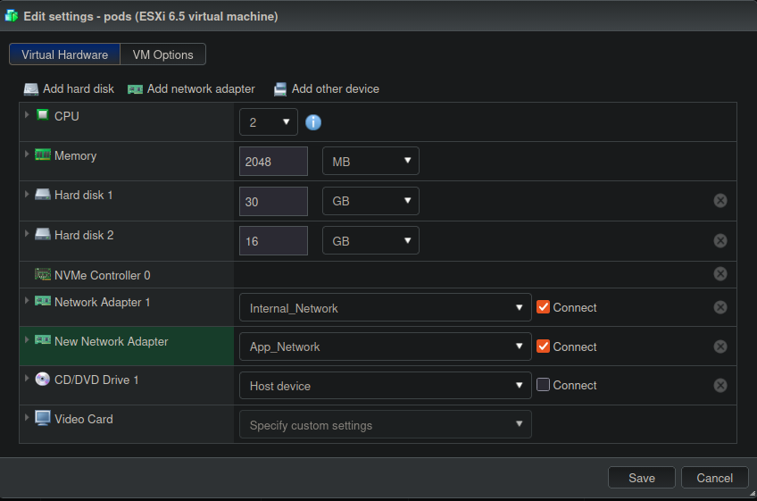

1. Assign IP `192.168.218.2` from the *AppNetwork* network.

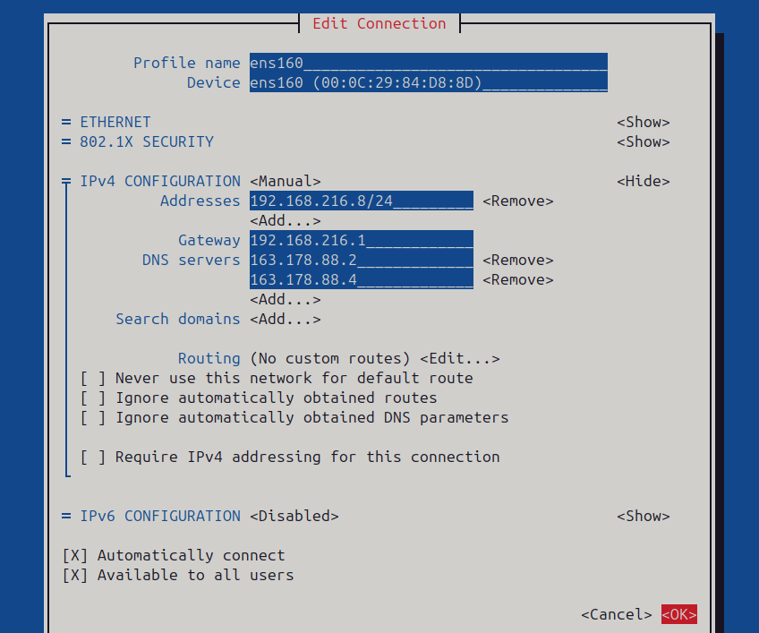

```sh
[admin@pods ~]$ ip a
1: lo: <LOOPBACK,UP,LOWER_UP> mtu 65536 qdisc noqueue state UNKNOWN group default qlen 1000
    link/loopback 00:00:00:00:00:00 brd 00:00:00:00:00:00
    inet 127.0.0.1/8 scope host lo
       valid_lft forever preferred_lft forever
    inet6 ::1/128 scope host
       valid_lft forever preferred_lft forever
2: ens160: <BROADCAST,MULTICAST,UP,LOWER_UP> mtu 1500 qdisc mq state UP group default qlen 1000
    link/ether 00:0c:29:84:d8:8d brd ff:ff:ff:ff:ff:ff
    altname enp3s0
    inet 192.168.216.8/24 brd 192.168.216.255 scope global noprefixroute ens160
       valid_lft forever preferred_lft forever
3: ens224: <BROADCAST,MULTICAST,UP,LOWER_UP> mtu 1500 qdisc mq state UP group default qlen 1000
    link/ether 00:0c:29:84:d8:97 brd ff:ff:ff:ff:ff:ff
    altname enp19s0
    inet 192.168.218.2/24 brd 192.168.218.255 scope global noprefixroute ens224
       valid_lft forever preferred_lft forever
[admin@pods ~]$ ip route
default via 192.168.216.1 dev ens160 proto static metric 100
default via 192.168.218.1 dev ens224 proto static metric 101
192.168.216.0/24 dev ens160 proto kernel scope link src 192.168.216.8 metric 100
192.168.218.0/24 dev ens224 proto kernel scope link src 192.168.218.2 metric 101
```

1. Ping from *pods* vm to *proxy* vm.

    ```sh
    PING 192.168.218.1 (192.168.218.1) 56(84) bytes of data.
    64 bytes from 192.168.218.1: icmp_seq=1 ttl=64 time=2.52 ms
    64 bytes from 192.168.218.1: icmp_seq=2 ttl=64 time=0.530 ms
    64 bytes from 192.168.218.1: icmp_seq=3 ttl=64 time=0.411 ms
    ^C
    --- 192.168.218.1 ping statistics ---
    3 packets transmitted, 3 received, 0% packet loss, time 2007ms
    rtt min/avg/max/mdev = 0.411/1.153/2.518/0.966 ms
    ```

2. Ping from *proxy* vm to *pods* vm.

    ```sh
    PING 192.168.218.2 (192.168.218.2) 56(84) bytes of data.
    64 bytes from 192.168.218.2: icmp_seq=1 ttl=64 time=0.748 ms
    64 bytes from 192.168.218.2: icmp_seq=2 ttl=64 time=0.517 ms
    64 bytes from 192.168.218.2: icmp_seq=3 ttl=64 time=0.748 ms
    ^C
    --- 192.168.218.2 ping statistics ---
    3 packets transmitted, 3 received, 0% packet loss, time 2003ms
    rtt min/avg/max/mdev = 0.517/0.671/0.748/0.108 ms
    ```

3. Configure firewall on VM `pods` for AppNetwork.

    * View active zones.

      ```sh
      internal interfaces: ens160 public interfaces: ens224 trusted interfaces: lo
      ```

    * Create a new *application* zone.

      ```sh
      sudo firewall-cmd --permanent --new-zone=application
      ```

    * Assign the *ens224* interface to the new *application* zone.

      ```sh
      sudo firewall-cmd --permanent --zone=application --change-interface=ens224
      ```

    * Open port 8080 only from the AppNetwork network.

    ```sh
    sudo firewall-cmd --permanent --zone=application --add-rich-rule='rule
    family="ipv4" source address="192.168.218.1/24" port port="8080" protocol="tcp"
    accept'
    ```

    * Apply changes.

    ```sh
    sudo firewall-cmd --reload
    ```

   * Verify.

    ```sh
    sudo firewall-cmd --zone=application --list-all
    ```

   * Output.

    ```sh
    target: default icmp-block-inversion: no interfaces: ens224 sources: services:
    ports: protocols: forward: no masquerade: no forward-ports: source-ports: icmp-
    blocks: rich rules: rule family="ipv4" source address="192.168.218.1/24" port
    port="8080" protocol="tcp" accept
    ```

---

### Updating the HAProxy Configuration

1. Inside *proxy* vm, edit `/etc/haproxy/haproxy.cfg` and change only the backend.

    ```sh
    sudo nano /etc/haproxy/haproxy.cfg
    ```

    * Change.

    ```sh
    #---------------------------------------------------------------------
    # BACKEND GLPI and VM pods
    #---------------------------------------------------------------------
    backend glpi_backend
        mode http

        option httpchk GET /
        http-check expect status 200

        # VM pods with GLPI in container
        server glpi-pods 192.168.218.2:8080 check
    ```

    * Result.

    ```sh
    global
        log /dev/log local0
        log /dev/log local1 notice
        daemon
        maxconn 4000
        user haproxy
        group haproxy
        ca-base /etc/ssl/certs
        crt-base /etc/ssl/private

    defaults
        log     global
        mode    http
        option  httplog
        option  dontlognull
        timeout connect 5s
        timeout client  50s
        timeout server  50s
        option forwardfor

    #---------------------------------------------------------------------
    # FRONTEND HTTP redirect to HTTPS
    #---------------------------------------------------------------------
    frontend http-in
        bind :80
        redirect scheme https if !{ ssl_fc }

    #---------------------------------------------------------------------
    # FRONTEND HTTPS
    #---------------------------------------------------------------------
    frontend https-in
        bind :443 ssl crt /etc/ssl/private/glpi_proxy.pem
        mode http

        # Logs
        option httplog

        # Headers GLPI
        http-request set-header X-Forwarded-Proto https
        http-request set-header X-Forwarded-Host %[req.hdr(host)]
        http-request set-header X-Real-IP %[src]

        default_backend glpi_backend

    #---------------------------------------------------------------------
    # BACKEND GLPI and VM pods
    #---------------------------------------------------------------------
    backend glpi_backend
        mode http

        option httpchk GET /
        http-check expect status 200

        # VM pods with GLPI in container
        server glpi-pods 192.168.218.2:8080 check
    ```

    * Verify syntax and restart.

    ```sh
    sudo haproxy -c -f /etc/haproxy/haproxy.cfg
    sudo systemctl restart haproxy
    sudo systemctl status haproxy
    ```

2. Update firewall on HAProxy.

    * Remove the old rule.

    ```sh
    sudo firewall-cmd --zone=application --permanent --remove-rich-rule='rule
    family="ipv4" destination address="192.168.218.100" service name="http" accept'
    ```

    * Add the new rule.

    ```sh
    sudo firewall-cmd --zone=application --permanent --add-rich-rule='rule
    family="ipv4" destination address="192.168.218.2" port port="8080"
    protocol="tcp" accept'
    ```

    * Apply changes.

    ```sh
    sudo firewall-cmd --reload
    ```

    * Verify.

    ```sh
    sudo firewall-cmd --zone=application --list-all
    ```

    * Output.

    ```sh
    application (active) target: default icmp-block-inversion: no interfaces: ens224
    sources: services: ports: protocols: forward: no masquerade: no forward-ports:
    source-ports: icmp-blocks: rich rules: rule family="ipv4" destination
    address="192.168.218.2" port port="8080" protocol="tcp" accept
    ```

---

### Browser Verification

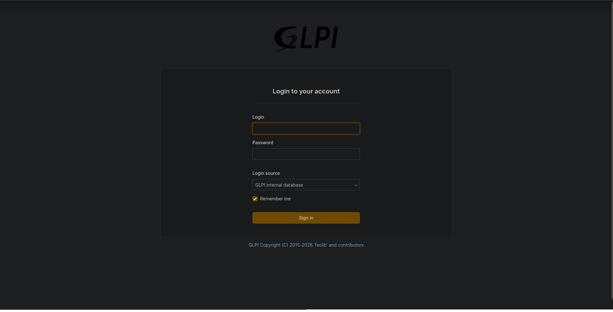
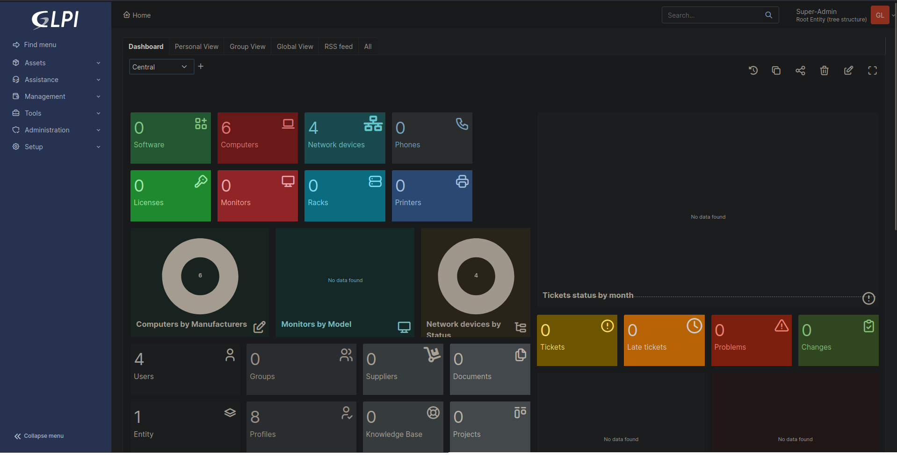
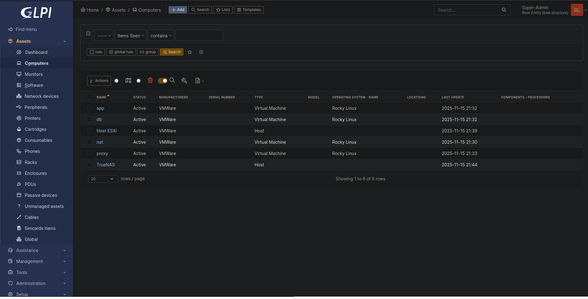

---

## WikiJS Deployment

Following the installation guide for the most stable version: [WikiJS Installation Guide](https://docs.requarks.io/install)

### WikiJS Image Selection and Analysis

#### WikiJS and Postgres Image Selection and Download

Using the versions recommended by the installation guide for docker: [Docker installation guide](https://docs.requarks.io/install/docker)

1. Choosing the WikiJS image, it will be used directly from its official Docker Hub source: [WikiJS Docker Hub](https://hub.docker.com/r/requarks/wiki)

    * Version chosen for this implementation: `requarks/wiki:2`

    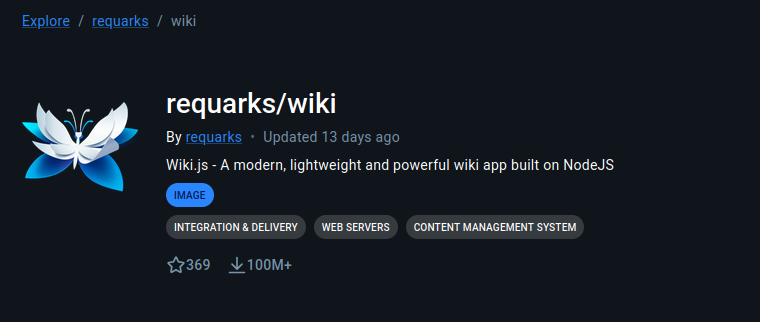
    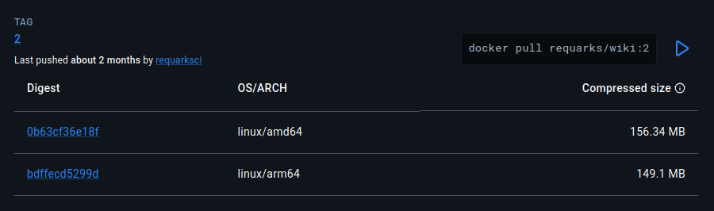

2. Choosing the Postgres image, it will be used directly from its official Docker Hub source: [Postgres Docker Hub](https://hub.docker.com/_/postgres)

    * Version chosen for this implementation: `postgres:15-alpine`

    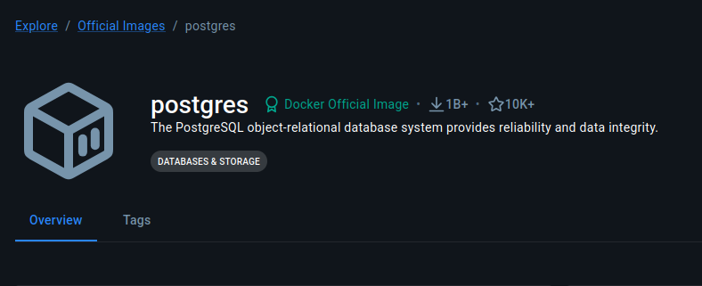
    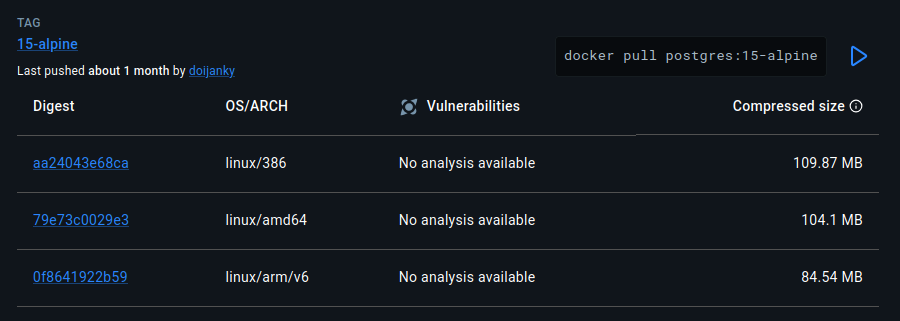

3. Pull the selected images from DockerHub.

    * GLPI.

    ```sh
    podman pull docker.io/requarks/wiki:2
    ```

    * MariaDB

    ```sh
    podman pull docker.io/postgres:15-alpine
    ```

    * Verify.

    ```sh
    podman assets
    ```

    * Output.

    ```sh
    REPOSITORY                  TAG            IMAGE ID      CREATED      SIZE
    docker.io/library/nginx     stable-alpine  dc73b49f5124  11 days ago  63.5 MB
    docker.io/library/mariadb   10.11          c0fc1a911284  2 weeks ago  337 MB
    docker.io/glpi/glpi         10.0           fa7680783b9d  4 weeks ago  1 GB
    docker.io/library/postgres  15-alpine      cd848ee12e8e  5 weeks ago  277 MB
    docker.io/requarks/wiki     2              ddae7be129f8  7 weeks ago  681 MB
    ```

---

#### Trivy Analysis for WikiJS and Postgres

1. Scan the **Wikijs** image `requarks/wiki:2` with *Trivy*.

    ```sh
    trivy image docker.io/requarks/wiki:2 > ~/containers/security-scans/trivy/wikijs_report.txt
    ```

    * View report.

    ```sh
    less ~/containers/security-scans/trivy/wikijs_report.txt
    grep -E "Total:|CRITICAL:|HIGH:|MEDIUM:|LOW:" ~/containers/security-scans/trivy/wikijs_report.txt
    ```

    * Output.

    ```sh
    docker.io/requarks/wiki:2 (alpine 3.23.3)
    =========================================
    Total: 7 (UNKNOWN: 0, LOW: 0, MEDIUM: 5, HIGH: 2, CRITICAL: 0)

    Node.js (node-pkg)
    ==================
    Total: 173 (UNKNOWN: 0, LOW: 15, MEDIUM: 61, HIGH: 89, CRITICAL: 8)
    ```

    > **Results**: The analysis of the Wiki.js image shows that an important part of the findings detected by Trivy is not directly related to the main application logic, but to base system dependencies and Node.js ecosystem packages included in the image.
    >
    > At the operating system layer, 7 vulnerabilities were identified in total, distributed as 5 MEDIUM and 2 HIGH, mainly associated with libraries such as `gnutls`, `libexpat`, and `zlib`. Although several of these vulnerabilities have a corrected version available, their presence indicates that the analyzed image has not yet incorporated all the most recent security patches.
    >
    > Additionally, the Node.js dependency analysis reported 173 vulnerabilities, including 89 HIGH and 8 CRITICAL, which represents a considerably larger exposure surface than what was observed only at the operating system level. This behavior is expected in JavaScript-based applications, due to the high number of transitive dependencies that typically form part of the execution environment.

2. Scan the **Postgres** image `postgres:15-alpine` with *Trivy*.

    ```sh
    trivy image docker.io/library/postgres:15-alpine > ~/containers/security-scans/trivy/postgres_report.txt
    ```

    * View report.

    ```sh
    less ~/containers/security-scans/trivy/postgres_report.txt
    grep -E "Total:|CRITICAL:|HIGH:|MEDIUM:|LOW:" ~/containers/security-scans/trivy/postgres_report.txt
    ```

    * Output.

    ```sh
    docker.io/library/postgres:15-alpine (alpine 3.23.3)
    ====================================================
    Total: 2 (UNKNOWN: 0, LOW: 0, MEDIUM: 1, HIGH: 1, CRITICAL: 0)

    usr/local/bin/gosu (gobinary)
    =============================
    Total: 19 (UNKNOWN: 0, LOW: 1, MEDIUM: 12, HIGH: 5, CRITICAL: 1)
    ```

    > **Results**: The analysis of the Postgres image shows a considerably smaller vulnerability surface compared to the other images evaluated.
    >
    > At the operating system layer, only 2 vulnerabilities were detected, distributed as 1 MEDIUM and 1 HIGH, indicating a relatively low exposure level. Additionally, in the `gosu` auxiliary binary, 19 findings were identified, including 1 CRITICAL, 5 HIGH, and 12 MEDIUM.
    >
    > Although these findings should be considered within the security evaluation, the total number observed remains moderate and suggests a more contained and lightweight image, consistent with the use of an Alpine base.

---

#### Dockle Analysis for WikiJS and Postgres

1. Scan the **Wikijs** image `requarks/wiki:2` with *Dockle*.

    ```sh
    dockle docker.io/requarks/wiki:2 > ~/containers/security-scans/dockle/wikijs_report.txt
    ```

    * Output.

    ```sh
    FATAL    - CIS-DI-0010: Do not store credential in environment variables/files
    INFO    - CIS-DI-0005: Enable Content trust for Docker
    INFO    - CIS-DI-0006: Add HEALTHCHECK instruction to the container image
    INFO    - DKL-LI-0003: Only put necessary files
    ```

    > **Result**: The analysis of the Wiki.js image with Dockle identified a FATAL severity finding, along with several informational observations related to container construction best practices.
    >
    > The main finding corresponds to the CIS-DI-0010 rule, associated with the presence of files considered suspicious within dependencies included in `node_modules`, specifically test keys (`id_rsa`, `id_dsa`, `id_ecdsa`) belonging to packages used for development or testing. Although these files do not necessarily represent active credentials from the deployment environment, their inclusion within the image increases audit noise and reflects a lack of cleanup of non-essential files.

2. Scan the **Postgres** image `postgres:15-alpine` with *Dockle*.

    ```sh
    dockle docker.io/library/postgres:15-alpine > ~/containers/security-scans/dockle/postgres_report.txt
    ```

    * Output.

    ```sh
    WARN    - CIS-DI-0001: Create a user for the container
    INFO    - CIS-DI-0005: Enable Content trust for Docker
    INFO    - CIS-DI-0006: Add HEALTHCHECK instruction to the container image
    ```

    > **Result**: The analysis of the Postgres image with Dockle presents a reduced number of observations, suggesting a cleaner construction more aligned with containerization best practices.
    >
    > The main finding corresponds to the CIS-DI-0001 rule, which warns that the container does not finish its execution with a non-privileged user, but with root. This aspect should be considered from a security standpoint, since the principle of least privilege recommends running services with dedicated and restricted users whenever possible.

---

### WikiJS Pod Design

![[Pasted image 20260405135354.png|519]]

| Pod          | Container  | Function                 |
| ------------ | ---------- | ------------------------ |
| `wikijs-pod` | `Wikijs`   | Wiki.js web application  |
| `wikijs-pod` | `postgres` | PostgreSQL database      |

> *Note:* Since both containers are inside the same pod, they share the network namespace. Wiki.js connects to PostgreSQL using `127.0.0.1:5432`.

#### Define Ports Exposed to the Host for Wiki.js and PostgreSQL

| Component  | Internal port | Host port   | Justification                  |
| ---------- | ------------: | ----------: | ------------------------------ |
| Wiki.js    |          3000 |        3000 | Access from reverse proxy      |
| PostgreSQL |          5432 | not exposed | Only accessible inside the pod |

> *Note:* Since **GLPI and MariaDB will be inside the same pod**, both will share the **same network namespace**. This means GLPI can connect to MariaDB using `127.0.0.1` or `localhost`.

### Defining the Persistent Directory Structure for Wiki.js and PostgreSQL

1. Create directories.

```sh
mkdir -p ~/containers/configs/{wikijs,postgres}
mkdir -p ~/containers/volumes/{wikijs-data,postgres-data}
```

| Path                                 | Use                                          |
| ------------------------------------ | -------------------------------------------- |
| `~/containers/configs/wikijs`        | Wiki.js environment variables                |
| `~/containers/configs/postgres`      | Custom PostgreSQL configuration              |
| `~/containers/volumes/wikijs-data`   | Wiki.js content files and assets             |
| `~/containers/volumes/postgres-data` | PostgreSQL database data                     |

1. Adjust permissions for rootless Podman.

    * PostgreSQL runs as the `postgres` user with UID 999:

    ```sh
    podman unshare chown -R 999:999 ~/containers/volumes/postgres-data
    ```

    * Wiki.js runs as the `node` user with UID 1000:

    ```sh
    podman unshare chown -R 1000:1000 ~/containers/volumes/wikijs-data
    ```

    > *Importance: Without the correct UID assignment, the containers will enter a restart loop by not being able to initialize their data directories in rootless mode.*

---

### Quadlet Declarative Configuration for Wiki.js and PostgreSQL

1. Create secrets for the wikijs user in PostgreSQL.

    ```sh
    read -s -p "PostgreSQL WIKIJS user password: " POSTGRES_WIKIJS_PASSWORD;

    printf '%s' "$POSTGRES_WIKIJS_PASSWORD" | podman secret create postgres_wikijs_password -; unset POSTGRES_WIKIJS_PASSWORD
    ```

    * Verify.

    ```sh
    podman secret ls
    ```

    * Output.

    ```sh
    ID                         NAME                      DRIVER      CREATED         UPDATED
    954dec8589346baa1352dd6d6  mariadb_root_password     file        36 hours ago    36 hours ago
    9d6d8f07da81c9c04726bd132  mariadb_glpi_password     file        36 hours ago    36 hours ago
    ad4d85161b4b880ec71bb9dae  postgres_wikijs_password  file        37 seconds ago  37 seconds ago
    ```

2. Create environment variables file for Postgres.

    ```sh
    nano ~/containers/configs/postgres/postgres.env
    ```

    * Add.

    ```ini
    POSTGRES_DB=wikijs
    POSTGRES_USER=wikijs
    ```

    * Permissions.

    ```sh
    chmod 600 ~/containers/configs/postgres/postgres.env
    ```

3. Create environment variables file for Wiki.js.

    ```sh
    nano ~/containers/configs/wikijs/wikijs.env
    ```

    * Add.

    ```ini
    DB_TYPE=postgres
    DB_HOST=127.0.0.1
    DB_PORT=5432
    DB_NAME=wikijs
    DB_USER=wikijs
    ```

    * Permissions.

    ```sh
    chmod 600 ~/containers/configs/wikijs/wikijs.env
    ```

4. Create Quadlet file for `wikijs-pod`.

    ```sh
    nano ~/.config/containers/systemd/wikijs-pod.pod
    ```

    * Add.

    ```sh
    [Unit]
    Description=Pod Wiki.js

    [Pod]
    PodName=wikijs-pod
    PublishPort=3000:3000

    [Install]
    WantedBy=default.target
    ```

5. Create Quadlet file for PostgreSQL.

    ```sh
    nano ~/.config/containers/systemd/postgres-wikijs.container
    ```

    * Add.

    ```sh
    [Unit]
    Description=PostgreSQL for Wiki.js
    After=network-online.target

    [Container]
    Image=docker.io/library/postgres:16
    ContainerName=postgres-wikijs
    Pod=wikijs-pod.pod
    EnvironmentFile=%h/containers/configs/postgres/postgres.env

    # Secret
    Secret=postgres_wikijs_password,type=env,target=POSTGRES_PASSWORD

    # Volumes
    Volume=%h/containers/volumes/postgres-data:/var/lib/postgresql/data:Z

    # Native PostgreSQL healthcheck
    HealthCmd=pg_isready -U wikijs -d wikijs
    HealthInterval=30s
    HealthRetries=3
    HealthStartPeriod=60s

    [Service]
    Restart=always
    RestartSec=10

    [Install]
    WantedBy=default.target
    ```

    > The version `docker.io/library/postgres:16` is being used instead of `docker.io/library/postgres:15-alpine`.

6. Create Quadlet file for wiki.js.

    ```sh
    nano ~/.config/containers/systemd/wikijs.container
    ```

    * Add.

    ```sh
    [Unit]
    Description=Container Wiki.js
    After=postgres-wikijs.service

    [Container]
    Image=docker.io/requarks/wiki:2
    ContainerName=wikijs
    Pod=wikijs-pod.pod
    EnvironmentFile=%h/containers/configs/wikijs/wikijs.env

    # Secret
    Secret=postgres_wikijs_password,type=env,target=DB_PASS

    # Volume
    Volume=%h/containers/volumes/wikijs-data:/wiki/data/content:Z

    [Service]
    Restart=always
    RestartSec=15

    [Install]
    WantedBy=default.target
    ```

    * `After=postgres-wikijs.service`: Wiki.js waits for PostgreSQL to have started before starting.

    * `DB_PASS`: Environment variable that Wiki.js uses internally to authenticate against the database.

    * `/wiki/data/content`: Internal path where Wiki.js stores user-generated content (pages, assets, etc.).

---

### Operation Verification

1. Start services in order.

```sh
systemctl --user daemon-reload
```

* Start the pod first.

```sh
systemctl --user start wikijs-pod-pod.service
systemctl --user status wikijs-pod-pod.service
```

* Output.

```sh
● wikijs-pod-pod.service - Pod Wiki.js
     Loaded: loaded (/home/admin/.config/containers/systemd/wikijs-pod.pod; generated)
     Active: active (running) since Sun 2026-04-05 20:59:06 CST; 50ms ago
```

* Start MariaDB.

```sh
systemctl --user start postgres-wikijs.service
systemctl --user status postgres-wikijs.service
```

* Output.

```sh
● postgres-wikijs.service - PostgreSQL for Wiki.js
     Loaded: loaded (/home/admin/.config/containers/systemd/postgres-wikijs.container; genera>
     Active: active (running) since Sun 2026-04-05 20:59:39 CST; 55ms ago
```

* Wait for MariaDB to pass the healthcheck before continuing.

```sh
podman healthcheck run postgres-wikijs
podman ps --format "{{.Names}} {{.Status}}"
```

* Output.

```sh
glpi Up 12 hours
glpi-pod-infra Up 12 hours
mariadb Up 12 hours (healthy)
wikijs-pod-infra Up About a minute
postgres-wikijs Up 52 seconds (healthy)
wikijs Up 51 seconds
```

> *Note:* Repeat until you see "healthy"

1. Start the Wiki.js container.

```sh
systemctl --user start wikijs.service
systemctl --user status wikijs.service
```

* Output.

```sh
● wikijs.service - Container Wiki.js
     Loaded: loaded (/home/admin/.config/containers/systemd/wikijs.container; generated)
     Active: active (running) since Sun 2026-04-05 20:59:40 CST; 1min 24s ago
```

1. View all containers.

```sh
podman ps --all
```

* Output.

```sh
CONTAINER ID  IMAGE                            COMMAND               CREATED             STATUS                       PORTS                             NAMES
b1dbc4b671f9  docker.io/glpi/glpi:10.0         /usr/bin/supervis...  12 hours ago        Up 12 hours                  0.0.0.0:8080->80/tcp              glpi
70b8bc67e93a                                                         12 hours ago        Up 12 hours                  0.0.0.0:8080->80/tcp              glpi-pod-infra
16d5fd108fa2  docker.io/library/mariadb:10.11  mariadbd              12 hours ago        Up 12 hours (healthy)        0.0.0.0:8080->80/tcp, 3306/tcp    mariadb
51f867b61d7c                                                         2 minutes ago       Up 2 minutes                 0.0.0.0:3000->3000/tcp            wikijs-pod-infra
ab2199b6686e  docker.io/library/postgres:16    postgres              About a minute ago  Up About a minute (healthy)  0.0.0.0:3000->3000/tcp, 5432/tcp  postgres-wikijs
35f3465a9264  docker.io/requarks/wiki:2        node --no-depreca...  About a minute ago  Up About a minute            0.0.0.0:3000->3000/tcp, 3443/tcp  wikijs
```

* View pod list.

```sh
POD ID        NAME        STATUS      CREATED        INFRA ID      # OF CONTAINERS
7c39018cf8f7  wikijs-pod  Running     3 minutes ago  51f867b61d7c  3
529d94a42507  glpi-pod    Running     12 hours ago   70b8bc67e93a  3
```

1. Validate that Wiki.js responds.

```sh
curl -I http://127.0.0.1:3000
```

* Output.

```sh
HTTP/1.1 200 OK
X-Powered-By: Express
Content-Type: text/html; charset=utf-8
Content-Length: 1315
ETag: W/"523-1y8rVhkyL7/SJ6nJ6Cbt7l+sNn4"
Vary: Accept-Encoding
Date: Mon, 06 Apr 2026 03:04:06 GMT
Connection: keep-alive
Keep-Alive: timeout=5
```

1. Temporarily open the firewall.

```sh
sudo firewall-cmd --zone=internal --add-port=3000/tcp
```

* Test from *vm nat*.

```sh
curl -I http://192.168.216.8:3000
```

* Output.

```sh
HTTP/1.1 200 OK
X-Powered-By: Express
Content-Type: text/html; charset=utf-8
Content-Length: 1315
ETag: W/"523-1y8rVhkyL7/SJ6nJ6Cbt7l+sNn4"
Vary: Accept-Encoding
Date: Mon, 06 Apr 2026 03:05:20 GMT
Connection: keep-alive
Keep-Alive: timeout=5
```

* Reload saved configuration.

```sh
sudo firewall-cmd --reload
```

---

### Reverse Proxy Configuration for Wiki.js

1. Add the Wikijs rule to the firewall on *vm pods*.

    ```sh
    sudo firewall-cmd --permanent --zone=application --add-rich-rule='rule family="ipv4" source address="192.168.218.1/24" port port="3000" protocol="tcp" accept'
    sudo firewall-cmd --reload
    sudo firewall-cmd --zone=application --list-all
    ```

2. Update HAProxy on *vm proxy*.

    * Edit `/etc/haproxy/haproxy.cfg` on the proxy vm and add the frontend and backend for Wiki.js.

    ```sh
    sudo nano /etc/haproxy/haproxy.cfg
    ```

    * Change file.

    ```sh
    global log /dev/log local0 log /dev/log local1 notice daemon maxconn 4000 user
    haproxy group haproxy ca-base /etc/ssl/certs crt-base /etc/ssl/private

    defaults log     global mode    http option  httplog option  dontlognull timeout
    connect 5s timeout client  50s timeout server  50s option forwardfor

    #--------------------------------------------------------------------- #
    FRONTEND HTTP redirect to HTTPS
    #--------------------------------------------------------------------- frontend
    http-in bind :80 redirect scheme https if !{ ssl_fc }

    #--------------------------------------------------------------------- #
    FRONTEND HTTPS
    #--------------------------------------------------------------------- frontend
    https-in bind :443 ssl crt /etc/ssl/private/glpi_proxy.pem mode http

    # Logs option httplog

    # Headers GLPI http-request set-header X-Forwarded-Proto https http-request set-
    header X-Forwarded-Host %[req.hdr(host)] http-request set-header X-Real-IP
    %[src]

    acl is_glpi  hdr(host) -i glpi.local acl is_wiki  hdr(host) -i wiki.local

    use_backend glpi_backend   if is_glpi use_backend wikijs_backend if is_wiki

    default_backend glpi_backend

    #--------------------------------------------------------------------- #
    FRONTEND HTTPS Wiki.js
    #--------------------------------------------------------------------- frontend
    wikijs-https-in bind :8443 ssl crt /etc/ssl/private/glpi_proxy.pem mode http

    option httplog http-request set-header X-Forwarded-Proto https http-request set-
    header X-Forwarded-Host %[req.hdr(host)] http-request set-header X-Real-IP
    %[src]

    default_backend wikijs_backend

    #--------------------------------------------------------------------- # BACKEND
    GLPI #---------------------------------------------------------------------
    backend glpi_backend mode http option httpchk GET / http-check expect status 200
    server glpi-pods 192.168.218.2:8080 check inter 10s fall 3 rise 2

    #--------------------------------------------------------------------- # BACKEND
    Wiki.js #---------------------------------------------------------------------
    backend wikijs_backend mode http option httpchk GET / http-check expect status
    200 server wikijs-pods 192.168.218.2:3000 check inter 10s fall 3 rise 2
    ```

    > *Note:* Port `8443` is used for Wiki.js and `443` is kept for GLPI. Access by hostname is also enabled. To access by hostname, the following must be done.

    * On Windows (as administrator), edit `C:\Windows\System32\drivers\etc\hosts` and add:

    ```sh
    172.24.133.218 glpi.local
    172.24.133.218 wiki.local
    ```

    * On Linux/Mac, edit `/etc/hosts`:

    ```sh
    172.24.133.218  glpi.local
    172.24.133.218  wiki.local
    ```

3. Verify syntax and restart.

    ```sh
    sudo haproxy -c -f /etc/haproxy/haproxy.cfg
    sudo systemctl restart haproxy
    sudo systemctl status haproxy
    ```

4. Update firewall on HAProxy.

    * Open port 8443 in the external zone.

    ```sh
    sudo firewall-cmd --zone=public --permanent --add-port=8443/tcp
    ```

    * Open port 8443 in the external zone.

    ```sh
    sudo firewall-cmd --zone=application --permanent --add-rich-rule='rule
    family="ipv4" destination address="192.168.218.2" port port="3000"
    protocol="tcp" accept'
    ```

    * Open port 8443 in the external zone.

    ```sh
    sudo firewall-cmd --reload sudo firewall-cmd --zone=application --list-all sudo
    firewall-cmd --zone=public --list-all
    ```

5. Check in the browser at `wiki.local` or `172.24.133.218:8443`.

    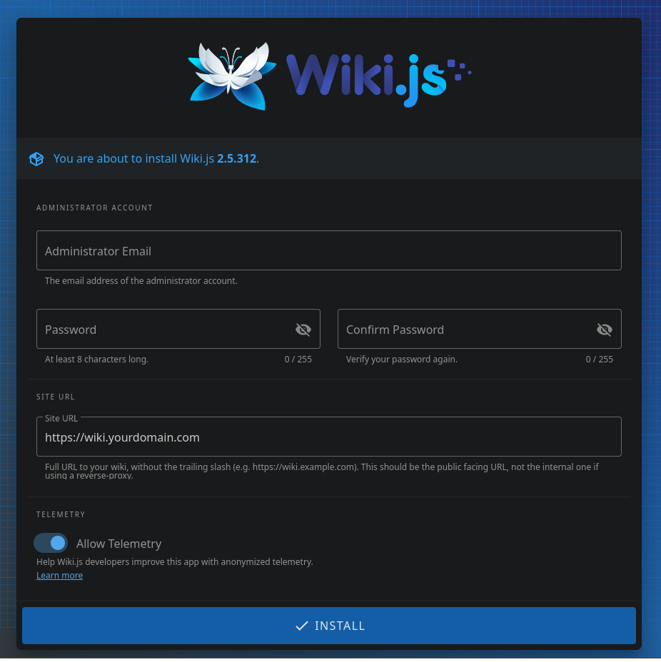

    * Enter the data and click `Install`.

    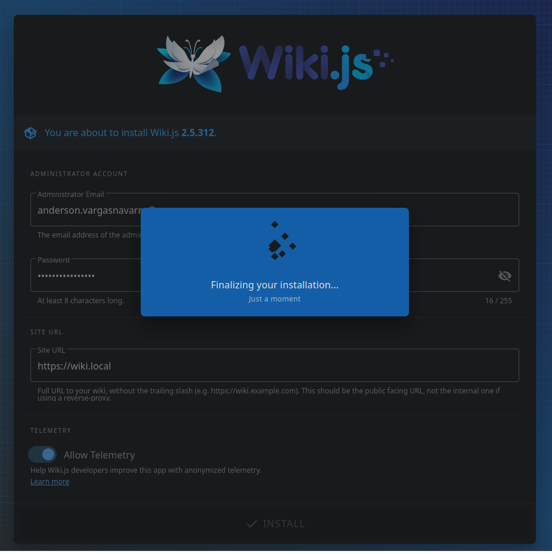

---

## Redis Deployment and Integration

### Redis VM Creation and Initial Configuration

1. Clone the golden image.

    ```sh
    ovftool \
      --skipManifestCheck \
      --lax \
      --noSSLVerify \
      --datastore="san_data" \
      --name="redis" \
      --diskMode=thin \
      --net:"nat"="Internal_Network" \
      "/home/general/Documents/UCR/2025-Semestre-II/Infrastructure/projects/partII/golden_image/RockyServer9.ovf" \
      "vi://root@172.24.131.196/"
    ```

2. Assign the internal network IP to *vm redis*.

    ```sh
    sudo nmtui
    ```

3. Assign IP `192.168.216.9`.

    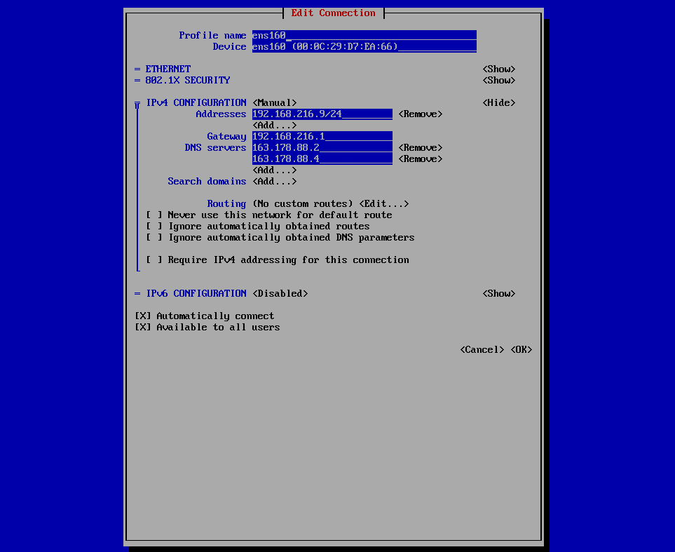

4. Check Internet connection.

    ```sh
    ping 8.8.8.8
    ```

    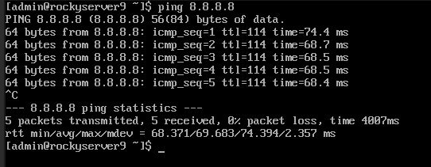

5. Change the password of the new *vm redis*.

    ```sh
    passwd
    ```

6. Change the Hostname.

    ```sh
    sudo hostnamectl set-hostname redis
    ```

    * Verify the change.

    ```sh
    hostnamectl
    ```

    * Expected output.

    ```sh
    Static hostname: redis
    ```

7. Update the `/etc/hosts` file.

    ```sh
    sudo nano /etc/hosts
    ```

    * Add the line.

    ```sh
    127.0.1.1 redis
    ```

    * Restart *vm redis*.

8. Install `VMware Tools`.

    ```sh
    sudo dnf install open-vm-tools -y
    ```

    * Enable it.

    ```sh
    sudo systemctl enable --now vmtoolsd
    ```

9. Generate SSH host key.

    ```sh
    sudo rm -f /etc/ssh/ssh_host_*
    sudo ssh-keygen -A
    sudo systemctl restart sshd
    ```

10. Configure SSH key access from the administration vm.

    * Transfer public key to *vm redis*.

    ```sh
    ssh-copy-id admin@192.168.216.9
    ```

    > *Note:* If there is an error, regenerate the SSH host key with `ssh-keygen -R <IP-Server>`

    * Add alias in `~/.ssh/config`.

    ```sh
    nano ~/.ssh/config
    ```

    * Add.

    ```sh
    Host redis
        HostName 192.168.216.9
        User admin
        IdentityFile ~/.ssh/id_ed25519
    ```

    * Verify connection.

    ```sh
    ssh redis
    ```

11. Check if SELinux is in enforcing mode.

    ```sh
    getenforce
    ```

    * If the output is `Enforcing`, switch to Permissive temporarily.

    ```sh
    sudo setenforce 0
    ```

    > **SELinux Note:** Redis needs to listen on a port and accept network connections. Later, when activating SELinux in `enforcing`, it will be necessary to enable the `redis_enable_notify` boolean and correctly label the data directory. This is detailed in the SELinux configuration section at the end of this document.

---

### Creating the AppRedis vSwitch on ESXi

1. Create a *vSwitch* without *uplink* with the name `vAppRedisNetwork`.

    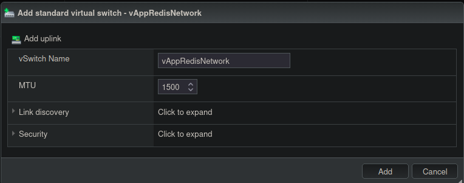

2. Create the Port Group associated with the *vSwitch* `vAppRedisNetwork`.

    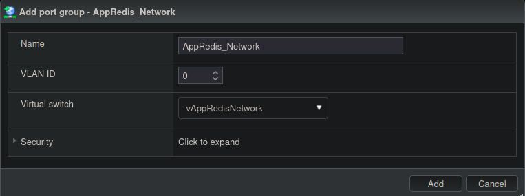

3. Add the `AppRedis_Network` interface to *vm redis*.

    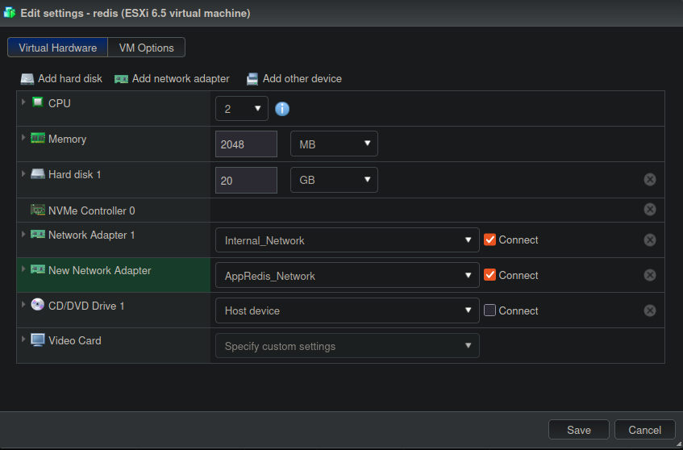

4. Assign IP `192.168.219.1` to the new interface on *vm redis*.

    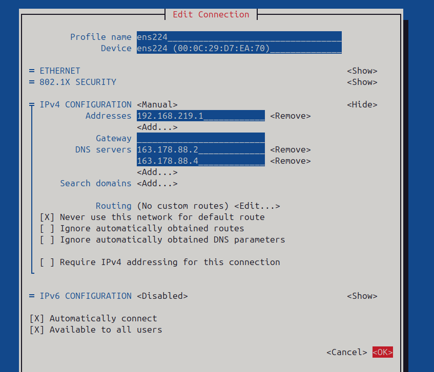

5. Add the `AppRedis_Network` interface to *vm pods*.

    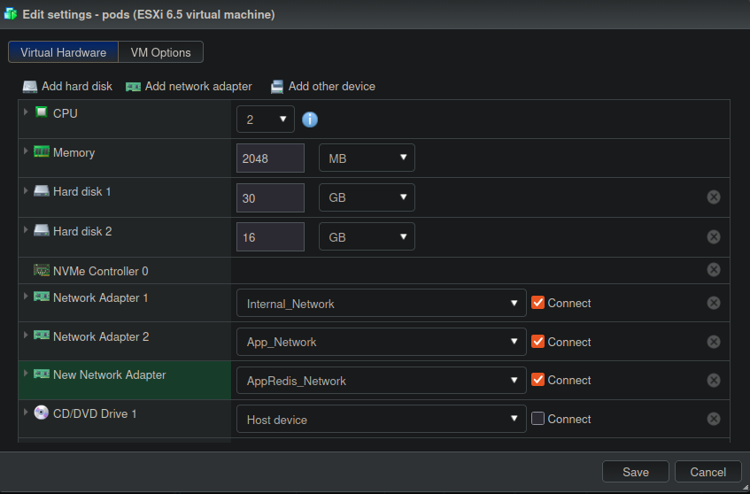

    ```sh
    [admin@redis ~]$ ip route
    default via 192.168.216.1 dev ens160 proto static metric 100
    192.168.216.0/24 dev ens160 proto kernel scope link src 192.168.216.9 metric 100
    192.168.219.0/24 dev ens224 proto kernel scope link src 192.168.219.1 metric 101
    ```

6. Assign IP `192.168.219.2` to the new interface on *vm pods*.

    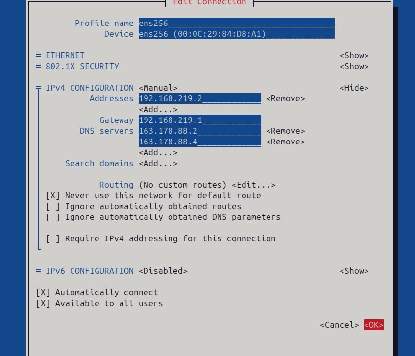

    ```sh
    default via 192.168.216.1 dev ens160 proto static metric 100
    default via 192.168.218.1 dev ens224 proto static metric 101
    192.168.216.0/24 dev ens160 proto kernel scope link src 192.168.216.8 metric 100
    192.168.218.0/24 dev ens224 proto kernel scope link src 192.168.218.2 metric 101
    192.168.219.0/24 dev ens256 proto kernel scope link src 192.168.219.2 metric 102
    ```

    * Verify connectivity between both VMs.

    ```sh
    ping 192.168.219.1
    ```

    * Output.

    ```sh
    [admin@pods ~]$ ping 192.168.219.1
    PING 192.168.219.1 (192.168.219.1) 56(84) bytes of data.
    64 bytes from 192.168.219.1: icmp_seq=1 ttl=64 time=0.856 ms
    64 bytes from 192.168.219.1: icmp_seq=2 ttl=64 time=0.633 ms
    64 bytes from 192.168.219.1: icmp_seq=3 ttl=64 time=0.860 ms
    ^C
    --- 192.168.219.1 ping statistics ---
    3 packets transmitted, 3 received, 0% packet loss, time 2030ms
    rtt min/avg/max/mdev = 0.633/0.783/0.860/0.106 ms
    ```

---

### Firewall Configuration on *vm redis*

1. Interface-to-zone assignment, view active zones.

    ```sh
    firewall-cmd --get-active-zones
    ```

    * Output.

    ```sh
    public
      interfaces: ens160 ens224
    trusted
      interfaces: lo
    ```

2. Move `ens160` (internal network) to the *internal* zone.

    ```sh
    sudo firewall-cmd --permanent --zone=internal --change-interface=ens160
    sudo firewall-cmd --reload
    ```

3. Create the *appredis* zone for the communication network with *pods*.

    ```sh
    sudo firewall-cmd --permanent --new-zone=appredis
    ```

4. Assign `ens224` to the *appredis* zone.

    ```sh
    sudo firewall-cmd --permanent --zone=appredis --change-interface=ens224
    sudo firewall-cmd --reload
    ```

    * Verify.

    ```sh
    firewall-cmd --get-active-zones
    ```

    * Expected output.

    ```sh
    appredis
      interfaces: ens224
    internal
      interfaces: ens160
    trusted
      interfaces: lo
    ```

5. Clean up unnecessary services from the *internal* zone.

    * View active services.

    ```sh
    sudo firewall-cmd --list-all --zone=internal
    ```

    * Output.

    ```sh
    internal (active)
      target: default
      icmp-block-inversion: no
      interfaces: ens160
      sources:
      services: cockpit dhcpv6-client mdns samba-client ssh
      ports:
      protocols:
      forward: yes
      masquerade: no
      forward-ports:
      source-ports:
      icmp-blocks:
      rich rules:
    ```

    * Remove the services.

    ```sh
    sudo firewall-cmd --zone=internal --remove-service=cockpit --permanent
    sudo firewall-cmd --zone=internal --remove-service=dhcpv6-client --permanent
    sudo firewall-cmd --zone=internal --remove-service=mdns --permanent
    sudo firewall-cmd --zone=internal --remove-service=samba-client --permanent
    sudo firewall-cmd --permanent --zone=internal --remove-forward
    sudo firewall-cmd --reload
    ```

    * Verify.

    ```sh
    sudo firewall-cmd --zone=internal --list-all
    ```

    * Expected output.

    ```sh
    internal (active)
      target: default
      icmp-block-inversion: no
      interfaces: ens160
      sources:
      services: ssh
      ports:
      protocols:
      forward: no
      masquerade: no
      forward-ports:
      source-ports:
      icmp-blocks:
      rich rules:
    ```

6. Open port 6379 only from the AppRedis network.

    ```sh
    sudo firewall-cmd --permanent --zone=appredis --add-rich-rule='rule family="ipv4" source address="192.168.219.2/32" port port="6379" protocol="tcp" accept'
    sudo firewall-cmd --reload
    ```

    * Verify.

    ```sh
    sudo firewall-cmd --zone=appredis --list-all
    ```

    * Expected output.

    ```sh
    appredis (active)
      target: default
      icmp-block-inversion: no
      interfaces: ens224
      sources:
      services:
      ports:
      protocols:
      forward: no
      masquerade: no
      forward-ports:
      source-ports:
      icmp-blocks:
      rich rules:
        rule family="ipv4" source address="192.168.219.2/32" port port="6379" protocol="tcp" accept
    ```

---

### Redis Installation and Configuration

#### Installation

1. Update the package index.

    ```sh
    sudo dnf update --security -y
    ```

    * Output.

    ```sh
    Last metadata expiration check: 2:29:20 ago on Wed 08 Apr 2026 03:52:58 PM CST.
    No security updates needed, but 206 updates available
    Dependencies resolved.
    Nothing to do.
    Complete!
    ```

2. Install Redis from the Rocky Linux 9 base repository.

    ```sh
    sudo dnf install redis -y
    ```

3. Verify the installed version.

    ```sh
    redis-server --version
    ```

    * Expected output.

    ```sh
    Redis server v=6.2.20 sha=00000000:0 malloc=jemalloc-5.1.0 bits=64 build=77f087a7c7063959
    ```

---

#### Redis Configuration for GLPI

1. Back up the original configuration file.

    ```sh
    sudo cp /etc/redis/redis.conf /etc/redis/redis.conf.bak
    ```

2. Edit the Redis configuration.

    ```sh
    sudo nano /etc/redis/redis.conf
    ```

    * Locate and modify the following bind parameters to only the AppRedis interface (`192.168.219.1`) and loopback (`127.0.0.1`):

    ```ini
    bind 127.0.0.1 192.168.219.1
    ```

    > By default Redis only listens on `127.0.0.1`. By adding `192.168.219.1` it is exposed only toward the AppRedis network, without opening to the general internal network.

    * Keep protected mode enabled:

    ```ini
    protected-mode yes
    ```

    > Works as an additional security layer together with `bind` and the password. With `bind` pointing only to `192.168.219.1` and `requirepass` configured, protected mode does not block legitimate connections from *pods*. Reference: [Redis Configuration Guide](https://experience.percona.com/valkey-redis/redis-configuration-guide/setting-up-your-first-redis-instance)

    * Standard port:

    ```ini
    port 6379
    ```

    * Require password:

    ```ini
    requirepass <PASSWORD_REDIS>
    ```

    >An authentication key is required for any read or write operation; this password will be used in the GLPI containers.

    * Disable destructive command:

    ```ini
    rename-command FLUSHALL ""
    ```

    > Disables the `FLUSHALL` command by renaming it to an empty string, preventing accidental deletion of all production data. Reference: [Redis Configuration Guide](https://experience.percona.com/valkey-redis/redis-configuration-guide/setting-up-your-first-redis-instance)

    * Persistence with RDB (periodic snapshots):

    ```ini
    save 3600 1
    save 300 10
    save 60 10000
    ```

    > The values `save 3600 1`, `save 300 10`, `save 60 10000` are exactly those appearing as defaults in the [Redis Configuration](https://raw.githubusercontent.com/redis/redis/6.2/redis.conf) file and mean:

    | Directive       | Meaning                                                |
    | --------------- | ------------------------------------------------------ |
    | `save 3600 1`   | Saves if at least 1 key changed in 60 minutes          |
    | `save 300 10`   | Saves if at least 10 keys changed in 5 minutes         |
    | `save 60 10000` | Saves if at least 10,000 keys changed in 1 minute      |

    * Data directory:

    ```ini
    dir /var/lib/redis
    ```

    * Memory limit:

    ```ini
    maxmemory 768mb
    maxmemory-policy allkeys-lru
    ```

    * **Why 768 MB?** The VM has 2 GB of physical memory. The OS consumes ~300-400 MB at rest, and Redis when doing the fork for RDB snapshots may temporarily need up to double the memory it is using due to Copy-on-Write. With 768 MB, ~1.2 GB remain free for the OS and fork peaks, preventing the OOM Killer from abruptly terminating the Redis process. Reference: [Redis Persistence](https://redis.io/docs/latest/operate/oss_and_stack/management/persistence/)

    * **`allkeys-lru`** evicts the least recently used keys when the limit is reached, ideal behavior for session caching where no key is strictly indispensable and it is preferable to automatically evict before failing. Reference: [Redis Eviction](https://redis.io/docs/latest/develop/reference/eviction/)

    * Log:

    ```ini
    loglevel notice
    logfile /var/log/redis/redis.log
    ```

    * Save and close the file.

---

#### Enable and Start Redis

1. Enable Redis with `systemctl`.

    ```sh
    sudo systemctl enable --now redis
    sudo systemctl status redis
    ```

    * Output.

    ```sh
    ● redis.service - Redis persistent key-value database
        Loaded: loaded (/usr/lib/systemd/system/redis.service; enabled; preset: disabled)
        Drop-In: /etc/systemd/system/redis.service.d
                └─limit.conf
        Active: active (running) since Wed 2026-04-08 20:53:38 CST; 69ms ago
    ```

2. Verify that Redis listens on the correct IP.

    ```sh
    ss -tlnp | grep 6379
    ```

    * Expected output.

    ```sh
    LISTEN 0      511    192.168.219.1:6379      0.0.0.0:*
    LISTEN 0      511        127.0.0.1:6379      0.0.0.0:*
    ```

3. Access.

    ```sh
    redis-cli -u redis://<REDIS_PASSWORD>@192.168.219.1:6379/0
    ```

---

### Redis Integration with GLPI

GLPI supports Redis as a cache and session backend since version 10.x. The configuration is done through its `config/config_db.php` file or via the web interface.

1. Create the Redis secret in *pods*.

    ```sh
    read -s -p "Redis password: " REDIS_PASSWORD; echo
    printf '%s' "$REDIS_PASSWORD" | podman secret create redis_password -
    unset REDIS_PASSWORD
    ```

    * Verify.

    ```sh
    podman secret ls
    ```

    * Output.

    ```sh
    ID                         NAME                      DRIVER      CREATED        UPDATED
    954dec8589346baa1352dd6d6  mariadb_root_password     file        4 days ago     4 days ago
    9d6d8f07da81c9c04726bd132  mariadb_glpi_password     file        4 days ago     4 days ago
    ad4d85161b4b880ec71bb9dae  postgres_wikijs_password  file        3 days ago     3 days ago
    d41639fb01121b773557583f9  redis_password            file        6 seconds ago  6 seconds ago
    ```

2. Add environment variables for GLPI.

    ```sh
    nano ~/containers/configs/glpi/glpi.env
    ```

    * Add.

    ```ini
    GLPI_CACHE_REDIS_HOST=192.168.219.1
    GLPI_CACHE_REDIS_PORT=6379
    ```

3. Update the GLPI Quadlet file.

    * Edit the GLPI container to inject the Redis variables.

    ```sh
    nano ~/.config/containers/systemd/glpi.container
    ```

    * Add in the `[Container]` section.

    ```ini
    Secret=redis_password,type=env,target=GLPI_CACHE_REDIS_PASSWORD
    ```

    > **Note:** The variable `GLPI_CACHE_REDIS_HOST` uses `192.168.219.2` because the glpi container shares the pod's network namespace, and the pod has the AppRedis interface with that IP. From inside the container, that IP is directly reachable.

    * The complete file would look like this:

    ```ini
    [Unit]
    Description=Container GLPI
    After=mariadb.service

    [Container]
    Image=docker.io/glpi/glpi:10.0
    ContainerName=glpi
    Pod=glpi-pod.pod
    EnvironmentFile=%h/containers/configs/glpi/glpi.env

    # Secrets
    Secret=mariadb_glpi_password,type=env,target=GLPI_DB_PASSWORD
    Secret=redis_password,type=env,target=GLPI_CACHE_REDIS_PASSWORD

    # Volumes
    Volume=%h/containers/volumes/glpi-files:/var/glpi:Z
    Volume=%h/containers/volumes/glpi-plugins:/var/www/html/glpi/plugins:Z
    Volume=%h/containers/volumes/glpi-marketplace:/var/www/html/glpi/marketplace:Z

    [Service]
    Restart=always
    RestartSec=15

    [Install]
    WantedBy=default.target
    ```

4. Reload and restart the GLPI container.

    ```sh
    systemctl --user daemon-reload
    systemctl --user restart glpi.service
    systemctl --user status glpi.service
    ```

5. Activate Redis as the cache backend from the GLPI CLI. [Redis CLI for GLPI](https://help.glpi-project.org/documentation/cli)

    ```sh
    # Redis (TLS) DSN format: rediss://[pass@][ip|host|socket[:port]][/db-index]
    podman exec -it glpi php /var/www/glpi/bin/console cache:configure \
      --context=core \
      --dsn="redis://<REDIS_PASSWORD>@192.168.219.1:6379/0"
    ```

6. Checking from the redis vm.

    ```sh
    redis-cli
    127.0.0.1:6379> AUTH default <PASSWORD>
    127.0.0.1:6379> MONITOR
    ```

    * View the logs while browsing from the GLPI interface.

    ```sh
    ...
    1775707753.195903 [0 192.168.219.2:55954] "SET" "core:37dc3757762d46103da03c016bd1c5d3976a5428" "a:1:{i:0;i:0;}"
    1775707753.197323 [0 192.168.219.2:55954] "MGET" "core:0d74920f7b4ea661e0670b6c28ffda3a7c2eb869"
    1775707753.208307 [0 192.168.219.2:55954] "MGET" "core:bec9df3446ee24068c694e035294bb9e72f6435d"
    1775707753.209739 [0 192.168.219.2:55954] "SET" "core:bec9df3446ee24068c694e035294bb9e72f6435d" "i:0;"
    1775707753.221185 [0 192.168.219.2:55954] "MGET" "core:2d03bd78927f28fc033adce8927dbc91f9026652"
    1775707753.222495 [0 192.168.219.2:55954] "MGET" "core:0d74920f7b4ea661e0670b6c28ffda3a7c2eb869"
    1775707753.224219 [0 192.168.219.2:55954] "SET" "core:2d03bd78927f28fc033adce8927dbc91f9026652" "i:1;"
    1775707753.231297 [0 192.168.219.2:55954] "MGET" "core:2d03bd78927f28fc033adce8927dbc91f9026652"
    1775707753.232494 [0 192.168.219.2:55954] "SET" "core:2d03bd78927f28fc033adce8927dbc91f9026652" "i:1;"
    ...
    ```

7. Architecture integrations and cache needs between GLPI and WikiJS.

    | Feature                     | GLPI (PHP)                                                                     | Wiki.js 2.x (Node.js)                                          |
    | --------------------------- | ------------------------------------------------------------------------------ | -------------------------------------------------------------- |
    | **Execution model**         | New process for each HTTP request, dies when finished                          | Single persistent process that does not die between requests   |
    | **Cache between requests**  | Needs external system (Redis) because each process is isolated                 | Keeps cache in RAM within the same process natively            |
    | **Shared state**            | Does not exist between requests without an external intermediary               | Exists naturally within the Node.js process                    |
    | **Native Redis support**    | Yes, with `cache:configure` command officially documented                      | Only in multi-instance architectures, not in single instance   |
    | **Real Redis benefit**      | High, avoids rebuilding translations, configurations and rules per request     | Zero in single container, already has internal shared memory   |
    | **Redis use case**          | Always recommended in production                                               | Only if multiple instances run in parallel                     |
    | **Conclusion**              | Redis integrated and necessary                                                 | Redis unnecessary in this architecture                         |

---

### SELinux Considerations on *vm redis*

1. Verify the contexts of Redis directories and files.

    ```sh
    sudo ls -laZ /var/lib/redis
    sudo ls -laZ /var/log/redis
    sudo ls -laZ /etc/redis/redis.conf
    ```

    * Output.

    ```sh
    drwxr-x---.  2 redis redis system_u:object_r:redis_var_lib_t:s0  4096 Apr  8 22:35 .
    drwxr-xr-x. 37 root  root  system_u:object_r:var_lib_t:s0        4096 Apr  8 18:25 ..
    -rw-r--r--.  1 redis redis system_u:object_r:redis_var_lib_t:s0 38937 Apr  8 22:35 dump.rdb
    total 12
    drwxr-x---.  2 redis redis system_u:object_r:redis_log_t:s0 4096 Apr  8 20:53 .
    drwxr-xr-x. 13 root  root  system_u:object_r:var_log_t:s0   4096 Apr  8 18:25 ..
    -rw-r--r--.  1 redis redis system_u:object_r:redis_log_t:s0 2189 Apr  8 22:35 redis.log
    -rw-r-----. 1 redis root system_u:object_r:redis_conf_t:s0 93918 Apr  8 20:48 /etc/redis/redis.conf
    ```

2. Verify that the Redis process runs with the correct context.

    ```sh
    ps -eZ | grep redis
    ```

    * Output.

    ```sh
    system_u:system_r:redis_t:s0      48133 ?        00:00:15 redis-server
    ```

3. Verify that SELinux does not record any denial in *permissive* mode.

    ```sh
    sudo ausearch -m avc
    ```

    * Output.

    ```sh
    <no matches>
    ```

    > Since there are no denials recorded in *permissive* mode, it means that SELinux did not detect any operation that would be blocked in *enforcing* mode. This indicates that the process runs under the `redis_t` type and the directories have their contexts correctly labeled by default, so no additional policy adjustments are required.

4. Activate SELinux in *enforcing* mode.

    ```sh
    sudo setenforce 1
    getenforce
    ```

    * Output.

    ```sh
    Enforcing
    ```
