# Project - Identity Management System

## Cover Page

### Universidad de Costa Rica

- **Diseño y Operación de Infraestructura CI-0144**
- **Project, Part VI - Identity Management System**
- **Professor:** Ariel Mora Jiménez
- **Student:** Anderson Vargas Navarro - C28183
- **1st semester, 2026**
- **Group:** 002

---

## **Project - Identity Management System**

Using the open-source FreeIPA system, implement an identity management system (IdM) for your infrastructure. The IdM service must provide centralized user management for the entire infrastructure, including both users who will use the machines and users who will connect to the various web services provided.

The IdM service must also provide local DNS for the infrastructure, allowing machines to be accessed by host name instead of hard-coded IP addresses.

In addition, through host-based access control (HBAC), it must restrict which machines users can access and which services may be used on those machines.

It is necessary to create users within the IdM service to test and demonstrate the requested functionality.

The following additional aspects will be graded for this project:

- Planning and design of user groups in FreeIPA
- Planning and design of server groups in FreeIPA
- Implementation decisions made
- Security measures applied

---

## Implementation

### Initial creation and configuration of the new _ipa_ server

#### Creating the _ipa_ server

1. Clone the golden image to create the new _ipa_ VM.

   ```sh
   ovftool \
   --skipManifestCheck \
   --lax \
   --noSSLVerify \
   --datastore="san_data" \
   --name="ipa" \
   --diskMode=thin \
   --net:"nat"="Internal_Network" \
   "golden_image/RockyServer9.ovf" \
   "vi://root@172.24.131.196/"
   ```

2. Assign an IP from the internal network to the _ipa_ VM.

   ```sh
   sudo nmtui
   ```

    - Assign IP `192.168.216.10`.

   

   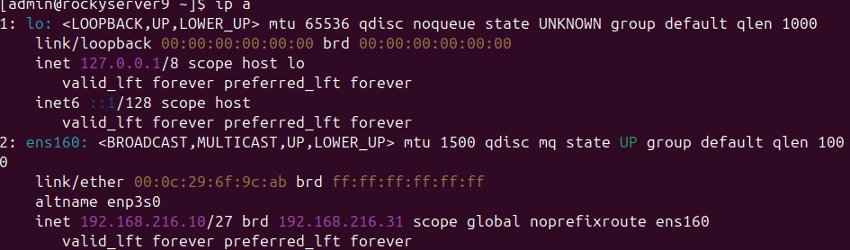

    - Verify internet connectivity.

   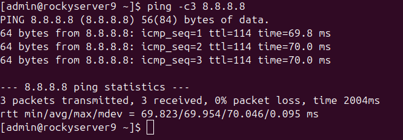

3. Add an interface from the _external_ network.

   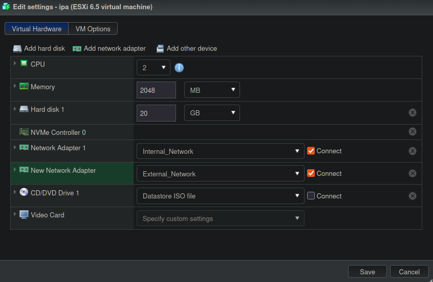

4. Assign an IP from the _external_ network to the _ipa_ VM.

   ```sh
   sudo nmtui
   ```

    - Assign IP `172.24.133.219`.

   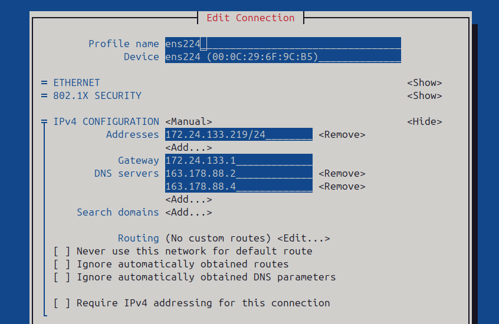

    - Verify with `ip address`.

   ```sh
   1: lo: <LOOPBACK,UP,LOWER_UP> mtu 65536 qdisc noqueue state UNKNOWN group default qlen 1000
       link/loopback 00:00:00:00:00:00 brd 00:00:00:00:00:00
       inet 127.0.0.1/8 scope host lo
       valid_lft forever preferred_lft forever
       inet6 ::1/128 scope host
       valid_lft forever preferred_lft forever
   2: ens160: <BROADCAST,MULTICAST,UP,LOWER_UP> mtu 1500 qdisc mq state UP group default qlen 1000
       link/ether 00:0c:29:6f:9c:ab brd ff:ff:ff:ff:ff:ff
       altname enp3s0
       inet 192.168.216.10/27 brd 192.168.216.31 scope global noprefixroute ens160
       valid_lft forever preferred_lft forever
   3: ens224: <BROADCAST,MULTICAST,UP,LOWER_UP> mtu 1500 qdisc mq state UP group default qlen 1000
       link/ether 00:0c:29:6f:9c:b5 brd ff:ff:ff:ff:ff:ff
       altname enp19s0
       inet 172.24.133.219/24 brd 172.24.133.255 scope global noprefixroute ens224
       valid_lft forever preferred_lft forever
   ```

    - Verify with `ip route`.

   ```sh
   default via 172.24.133.1 dev ens224 proto static metric 100
   172.24.133.0/24 dev ens224 proto kernel scope link src 172.24.133.219 metric 100
   192.168.216.0/27 dev ens160 proto kernel scope link src 192.168.216.10 metric 101
   ```

    - Verify connectivity from a remote machine.

   ```sh
   ping 172.24.133.219
   ```

    - Output.

   ```sh
   PING 172.24.133.219 (172.24.133.219) 56(84) bytes of data.
   64 bytes from 172.24.133.219: icmp_seq=1 ttl=62 time=7.81 ms
   64 bytes from 172.24.133.219: icmp_seq=2 ttl=62 time=7.47 ms
   64 bytes from 172.24.133.219: icmp_seq=3 ttl=62 time=7.62 ms
   64 bytes from 172.24.133.219: icmp_seq=4 ttl=62 time=7.84 ms
   ^C
   --- 172.24.133.219 ping statistics ---
   4 packets transmitted, 4 received, 0% packet loss, time 3004ms
   ```

#### Initial configuration of the _ipa_ server

1. Change the password of the new _ipa_ VM.

   ```sh
   passwd
   ```

2. Change the hostname.

   ```sh
   sudo hostnamectl set-hostname hostnamectl set-hostname ipa.infra.local
   ```

    - Verify the change.

   ```sh
   hostnamectl
   ```

    - Output.

   ```sh
   Static hostname: ipa.infra.local
   ```

3. Update the `/etc/hosts` file.

   ```sh
   sudo nano /etc/hosts
   ```

    - Add the line.

   ```sh
   192.168.216.10 ipa.infra.local ipa
   ```

    - Restart the _ipa_ VM.

4. Install `VMware Tools`.

   ```sh
   sudo dnf install open-vm-tools
   ```

    - Enable it with.

   ```sh
   sudo systemctl enable --now vmtoolsd
   ```

5. Transfer the public key from the _nat_ VM to the destination _ipa_ VM.

   ```sh
   ssh-copy-id admin@192.168.216.10
   ```

    - Create an alias for quick access.

   ```sh
   nano ~/.ssh/config
   ```

    - Add.

   ```sh
   Host ipa
       HostName 192.168.216.10
       User admin
       IdentityFile ~/.ssh/id_ed25519
   ```

    - Verify the connection.

   ```sh
   ssh ipa
   ```

6. Check whether SELinux is enforcing.

   ```sh
   getenforce
   ```

    - If the output is.

   ```sh
   Enforcing
   ```

    - Switch it to Permissive.

   ```sh
   sudo setenforce 0
   ```

---

#### Create the `ansible` user on the `ipa` VM

1. Run this on `ipa`.

   ```sh
   sudo groupadd ansible
   sudo useradd -m -s /bin/bash -g ansible ansible
   id ansible
   ```

    - Output.

   ```sh
   uid=1001(ansible) gid=1002(ansible) groups=1002(ansible)
   ```

    - Configure passwordless sudo ONLY for the `ansible` group.

   ```sh
   echo '%ansible ALL=(ALL) NOPASSWD: ALL' | sudo tee /etc/sudoers.d/ansible
   sudo chmod 440 /etc/sudoers.d/ansible
   sudo visudo -c
   ```

    - Output.

   ```sh
   /etc/sudoers: parsed OK
   /etc/sudoers.d/ansible: parsed OK
   ```

#### SSH and key configuration

1. Prepare SSH for the `ansible` user on each node.

   ```sh
   sudo install -d -m 700 -o ansible -g ansible /home/ansible/.ssh
   ```

    - **`sudo install -d -m 700 -o ansible -g ansible /home/ansible/.ssh`**: Uses the `install` utility to prepare the SSH environment atomically. The command creates the configuration directory (`-d`) while simultaneously enforcing restrictive permissions (`-m 700`), which is a strict SSH requirement to ignore unauthorized access. It also assigns ownership of the directory to the corresponding user (`-o ansible`) and group (`-g ansible`) in a single operation, removing the need to run separate `mkdir`, `chmod`, and `chown` commands.

2. From `nat`, copy the public key.

   ```sh
   cat ~/.ssh/ansible_id.pub
   ```

    - On each node (`proxy`, `pods`, `redis`).

   ```sh
   echo "<LLAVE_PUBLICA_VM_NAT>" | sudo tee /home/ansible/.ssh/authorized_keys > /dev/null

   sudo chown ansible:ansible /home/ansible/.ssh/authorized_keys
   sudo chmod 600 /home/ansible/.ssh/authorized_keys
   ```

3. Lock and remove password login for the `ansible` user.

   ```sh
   sudo passwd -d ansible && sudo passwd -l ansible
   ```

4. Apply SSH hardening on each node.

   ```sh
   sudo nano /etc/ssh/sshd_config
   ```

   - Edit.

   ```ini
   # AllowUsers admin ansible
   PasswordAuthentication no
   PermitRootLogin no
   PubkeyAuthentication yes
   ```

   - Apply

   ```sh
   sudo systemctl restart sshd
   ```

   - Verify with `sudo sshd -T | grep -E 'allowusers|passwordauthentication|permitrootlogin|pubkeyauthentication'`.

   ```sh
   permitrootlogin no
   pubkeyauthentication yes
   passwordauthentication no
   ```

    > **_NOTE_**: On all hosts, disable `AllowUsers` because that part of authentication is now handled by FreeIPA.

5. Configure SSH on the `nat` VM.

    ```sh
    nano ~/.ssh/config
    ```

    - Add

    ```sh
    Host ipa-ansible
        HostName 192.168.216.10
        User ansible
        IdentityFile ~/.ssh/ansible_id
    ```

6. Verify from the `nat` control node.

    ```sh
    ssh ipa-ansible "hostname && id && sudo whoami"
    ```

    - Output.

    ```sh
    uid=1001(ansible) gid=1002(ansible) groups=1002(ansible) context=unconfined_u:unconfined_r:unconfined_t:s0-s0:c0.c1023
    root
    ```

---

### Base Ansible configuration for `ipa`

#### Add the `ipa` host to the inventory

1. Modify the `inventory/hosts.yaml` file.

    ```sh
    nano ansible-project/inventory/hosts.yaml
    ```

    - Add: [inventory_hosts](../../ansible-project/inventory/hosts.yaml)

    ```sh
        ipa_servers:
        hosts:
            ipa:
            ansible_host: ipa-ansible
    ```

    - Verify connectivity with the inventory nodes.

    ```sh
    cd ansible-project
    ansible all -m ping --ask-vault-pass
    ```

    - Output.

    ```sh
    pods | SUCCESS => {
        "changed": false,
        "ping": "pong"
    }
    redis | SUCCESS => {
        "changed": false,
        "ping": "pong"
    }
    proxy | SUCCESS => {
        "changed": false,
        "ping": "pong"
    }
    ipa | SUCCESS => {
        "changed": false,
        "ping": "pong"
    }
    nat | SUCCESS => {
        "changed": false,
        "ping": "pong"
    }
    ```

#### Add the `ipa` host variables and passwords

```sh
ansible-project/
├── ansible.cfg
├── ansible.log
├── inventory/
│   ├── group_vars/
│   │   └── all/
│   │       ├── all.yaml
│   │       └── vault.yaml
│   ├── hosts.yaml
│   └── host_vars/
│       ├── nat.yaml
│       ├── proxy.yaml
│       ├── pods.yaml
│       ├── redis.yaml
│       └── ipa.yaml
├── playbooks/
└── roles/
```

1. Add the global FreeIPA variables to `all.yaml`.

    ```sh
    nano ansible-project/inventory/group_vars/all/all.yaml
    ```

    - Add: [group_vars_all](../../ansible-project/inventory/group_vars/all/all.yaml)

    ```sh
    ipa_domain: "infra.local"
    ipa_realm: "INFRA.LOCAL"
    ```

2. Add the FreeIPA variables to `vault.yaml`.

    ```sh
    ansible-vault edit ansible-project/inventory/group_vars/all/vault.yaml
    ```

    - Agregar.

    ```sh
    # FreeIPA passwords
    vault_ipa_admin_password: "<PASSWORD_ADMIN_IPA>"
    vault_ipa_ds_password: "<PASSWORD_DS_IPA>"

    # FreeIPA official role expected variables (mappings)
    ipadm_password: "{{ vault_ipa_admin_password }}"
    ipads_password: "{{ vault_ipa_ds_password }}"
    ```

    > **`vault_ipa_admin_password`**: password for the FreeIPA `admin` user (web UI access and `kinit admin`).  
    > **`vault_ipa_ds_password`**: password for the Directory Server (389-ds), used internally by FreeIPA during installation; different from the admin password.

    - Verify.

    ```sh
    ansible-vault view ansible-project/inventory/group_vars/all/vault.yaml --ask-vault-pass
    ```

3. Create `host_vars/ipa.yaml`.

    ```sh
    nano ansible-project/inventory/host_vars/ipa.yaml
    ```

    - Agregar: [host_vars_ipa](../../ansible-project/inventory/host_vars/ipa.yaml)

    > Since all VMs already have the `internal` zone with SSH allowed and internet access through NAT, traffic to `192.168.216.10` already passes. No additional ports need to be opened on the clients because they _initiate_ the connection to IPA, not the other way around. What must be opened is those ports in the firewall on the `ipa` VM.

4. Install the `freeipa.ansible_freeipa` collection.

    ```sh
    cd ansible-project
    ansible-galaxy collection install freeipa.ansible_freeipa
    ```

    - Verify installation:

    ```sh
    ansible-galaxy collection list | grep freeipa
    ```

    - Output.

    ```sh
    freeipa.ansible_freeipa       1.16.0
    ```

#### Syntax and variable verification for the `Common` role

1. Verify syntax.

    ```bash
    ansible-playbook playbooks/tests/test_common.yaml --syntax-check
    ```

    - Output.

    ```sh
    playbook: playbooks/tests/test_common.yaml
    ```

2. Verify that the variables load on the `ipa` node.

    ```sh
    ansible ipa -m debug -a "var=ipa_domain" --ask-vault-pass
    ansible ipa -m debug -a "var=ipa_fqdn" --ask-vault-pass
    ```

#### Dry run of the `Common` role after adding the new variables

1. Dry run on `ipa`.

    ```bash
    ansible-playbook playbooks/tests/test_common.yaml \
    --check --diff \
    --limit ipa \
    --ask-vault-pass
    ```

    - Output.

    ```sh
    ipa: ok=9 changed=5 unreachable=0 failed=0 skipped=12 rescued=0 ignored=0
    ```

2. Dry run on all nodes.

    ```bash
    ansible-playbook playbooks/tests/test_common.yaml \
    --check --diff \
    --ask-vault-pass
    ```

    - Output.

    ```sh
    ipa: ok=9 changed=5 unreachable=0 failed=0 skipped=9 rescued=0 ignored=0

    nat: ok=10 changed=1 unreachable=0 failed=0 skipped=7 rescued=0 ignored=0

    pods: ok=9 changed=1 unreachable=0 failed=0 skipped=9 rescued=0 ignored=0

    proxy: ok=10 changed=1 unreachable=0 failed=0 skipped=8 rescued=0 ignored=0

    redis: ok=9 changed=1 unreachable=0 failed=0 skipped=9 rescued=0 ignored=0
    ```

    > _Note_: The change observed on `nat`, `pods`, `proxy`, and `redis` is because the hosts for the rest of the VMs were added together with `_ipa_domain_` and `_ipa_fqdn_`.

#### Execution of the `Common` role

1. First real run on all nodes.

    ```bash
    ansible-playbook playbooks/tests/test_common.yaml \
    --ask-vault-pass
    ```

    - Output.

    ```sh
    ipa: ok=9 changed=5 unreachable=0 failed=0 skipped=9 rescued=0 ignored=0

    nat: ok=10 changed=1 unreachable=0 failed=0 skipped=7 rescued=0 ignored=0

    pods: ok=9 changed=1 unreachable=0 failed=0 skipped=9 rescued=0 ignored=0

    proxy: ok=10 changed=1 unreachable=0 failed=0 skipped=8 rescued=0 ignored=0

    redis: ok=9 changed=1 unreachable=0 failed=0 skipped=9 rescued=0 ignored=0
    ```

2. Second real run on all nodes.

    ```bash
    ansible-playbook playbooks/tests/test_common.yaml \
    --ask-vault-pass
    ```

    - Output.

    ```sh
    ipa: ok=8 changed=0 unreachable=0 failed=0 skipped=9 rescued=0 ignored=0

    nat: ok=10 changed=0 unreachable=0 failed=0 skipped=7 rescued=0 ignored=0

    pods: ok=8 changed=0 unreachable=0 failed=0 skipped=9 rescued=0 ignored=0

    proxy: ok=9 changed=0 unreachable=0 failed=0 skipped=8 rescued=0 ignored=0

    redis: ok=8 changed=0 unreachable=0 failed=0 skipped=9 rescued=0 ignored=0
    ```

---

### Creating the `Freeipa Server` role

Following the _How to install FreeIPA on Rocky Linux 9_ guide with the [video](https://www.youtube.com/watch?v=sGcrivSPvCk) and the [guide](https://centlinux.com/install-freeipa-on-rocky-linux/) written by [Ahmer M](https://centlinux.com/about/) on _centlinux.com_.

#### Creating the directory structure and files for the `Freeipa Server` role

```ini
ansible-project/
├── ansible.cfg
├── ansible.log
├── inventory/
├── playbooks/
└── roles/
    ├── common/
    ├── haproxy/
    ├── podman_base/
    ├── glpi_pod/
    ├── wikijs_pod/
    ├── redis/
    └── freeipa_server/
        ├── defaults/main.yaml
        ├── tasks/main.yaml
        └── handlers/main.yaml
```

1. Create the directory structure.

    ```sh
    mkdir -p ansible-project/roles/freeipa_server/{defaults,handlers,tasks}
    ```

2. Create `defaults/main.yaml`.

    ```sh
    nano ansible-project/roles/freeipa_server/defaults/main.yaml
    ```

    - Add: [freeipa_server_defaults_main](../../ansible-project/roles/freeipa_server/defaults/main.yaml)

3. Create `handlers/main.yaml`.

    ```sh
    nano ansible-project/roles/freeipa_server/handlers/main.yaml
    ```

    - Add: [freeipa_server_handlers_main](../../ansible-project/roles/freeipa_server/handlers/main.yaml)

4. Create `tasks/main.yaml`.

    ```sh
    nano ansible-project/roles/freeipa_server/tasks/main.yaml
    ```

    - Add: [freeipa_server_tasks_main](../../ansible-project/roles/freeipa_server/tasks/main.yaml)

---

#### Verification of the `Freeipa Server` role

##### Syntax verification for the `Freeipa Server` role

1. Create a test file.

    ```sh
    nano ansible-project/playbooks/tests/test_freeipa_server.yaml
    ```

    - Add

    ```ini
    ---
    - name: Test FreeIPA server Role
    hosts: ipa_hosts
    gather_facts: true
    roles:
        - freeipa_server
    ```

2. Verify syntax.

    ```bash
    ansible-playbook playbooks/tests/test_freeipa_server.yaml --syntax-check
    ```

    - Output.

    ```sh
    playbook: playbooks/tests/test_freeipa_server.yaml
    ```

---

##### Dry run of the `Freeipa Server` role

1. Dry run of the `Freeipa Server` role.

    ```bash
    ansible-playbook playbooks/tests/test_freeipa_server.yaml \
    --check --diff \
    --ask-vault-pass
    ```

    - Output.

    ```sh
    ipa: ok=16 changed=0 unreachable=0 failed=0 skipped=40 rescued=0 ignored=0
    ```

---

##### Execution of the `Freeipa Server` role

1. Real execution of the `Freeipa Server` role.

    ```bash
    ansible-playbook playbooks/tests/test_freeipa_server.yaml \
    --ask-vault-pass
    ```

    - First run.

    ```sh
    ipa: ok=17 changed=0 unreachable=0 failed=0 skipped=1 rescued=0 ignored=0
    ```

    - Second run.

    ```sh
    ipa: ok=17 changed=0 unreachable=0 failed=0 skipped=1 rescued=0 ignored=0
    ```

---

### Creating the `Freeipa Client` role

Following the _How to install FreeIPA on Rocky Linux 9_ guide with the [video](https://www.youtube.com/watch?v=sGcrivSPvCk) and the [guide](https://centlinux.com/install-freeipa-on-rocky-linux/) written by [Ahmer M](https://centlinux.com/about/) on _centlinux.com_. Also following _FreeIPA - Powerful User and Device Control through Identity, Permissions, and Auditing_ with the [video](https://www.youtube.com/watch?v=oYRdeHdErW0) and the [guide](https://www.digitalocean.com/community/tutorials/how-to-configure-a-freeipa-client-on-centos-7).

#### Creating the directory structure and files for the `Freeipa Client` role

```ini
ansible-project/
├── ansible.cfg
├── ansible.log
├── inventory/
├── playbooks/
└── roles/
    ├── common/
    ├── haproxy/
    ├── podman_base/
    ├── glpi_pod/
    ├── wikijs_pod/
    ├── redis/
    ├── freeipa_server/
    └── freeipa_client/
        ├── defaults/main.yaml
        ├── tasks/main.yaml
        └── handlers/main.yaml
```

1. Create the directory structure.

    ```sh
    mkdir -p ansible-project/roles/freeipa_client/{defaults,handlers,tasks}
    ```

2. Create `defaults/main.yaml`.

    ```sh
    nano ansible-project/roles/freeipa_client/defaults/main.yaml
    ```

    - Add: [freeipa_client_defaults_main](../../ansible-project/roles/freeipa_client/defaults/main.yaml)

3. Create `handlers/main.yaml`.

    ```sh
    nano ansible-project/roles/freeipa_client/handlers/main.yaml
    ```

    - Add: [freeipa_client_handlers_main](../../ansible-project/roles/freeipa_client/handlers/main.yaml)

4. Create `tasks/main.yaml`.

    ```sh
    nano ansible-project/roles/freeipa_client/tasks/main.yaml
    ```

    - Add: [freeipa_client_tasks_main](../../ansible-project/roles/freeipa_client/tasks/main.yaml)

---

#### Verification of the `Freeipa Client` role

##### Syntax verification for the `Freeipa Client` role

1. Create a test file.

    ```sh
    nano ansible-project/playbooks/tests/test_freeipa_client.yaml
    ```

    - Add

    ```ini
    ---
    - name: Test FreeIPA Client Role
    hosts:
        - control_hosts
        - proxy_hosts
        - container_hosts
        - cache_hosts
        - ipa_hosts
    gather_facts: true
    roles:
        - freeipa_client
    ```

2. Verify syntax.

    ```bash
    ansible-playbook playbooks/tests/test_freeipa_client.yaml --syntax-check
    ```

    - Output.

    ```sh
    playbook: playbooks/tests/test_freeipa_client.yaml
    ```

---

##### Dry run of the `Freeipa Client` role

1. Dry run of the `Freeipa Client` role.

    ```bash
    ansible-playbook playbooks/tests/test_freeipa_client.yaml \
    --check --diff \
    --ask-vault-pass
    ```

    - Output.

    ```sh
    ipa: ok=10 changed=2 unreachable=0 failed=0 skipped=6 rescued=0 ignored=0
    nat: ok=10 changed=4 unreachable=0 failed=0 skipped=6 rescued=0 ignored=0
    pods: ok=10 changed=4 unreachable=0 failed=0 skipped=6 rescued=0 ignored=0
    proxy: ok=10 changed=4 unreachable=0 failed=0 skipped=6 rescued=0 ignored=0
    ```

---

##### Execution of the `Freeipa Client` role

1. Real execution of the `Freeipa Client` role.

    ```bash
    ansible-playbook playbooks/tests/test_freeipa_client.yaml \
    --ask-vault-pass
    ```

    - Run.

    ```sh
    nat: ok=18 changed=0 unreachable=0 failed=0 skipped=4 rescued=0 ignored=0
    pods: ok=18 changed=0 unreachable=0 failed=0 skipped=4 rescued=0 ignored=0
    proxy: ok=18 changed=0 unreachable=0 failed=0 skipped=4 rescued=0 ignored=0
    redis: ok=18 changed=0 unreachable=0 failed=0 skipped=4 rescued=0 ignored=0
    ```

---

##### Verification of hosts inside `FreeIPA`

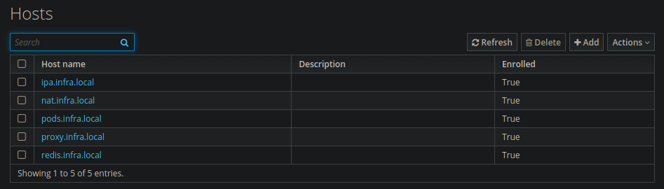

### Verification of the `site.yaml` playbook

#### Syntax verification for the `site.yaml` playbook

1. Verify syntax.

    ```bash
    ansible-playbook playbooks/site.yaml --syntax-check
    ```

    - Output.

    ```sh
    playbook: playbooks/site.yaml
    ```

---

#### Dry run of the `site.yaml` playbook

1. Dry run of the `site.yaml` playbook.

    ```bash
    ansible-playbook playbooks/site.yaml \
    --check --diff \
    --ask-vault-pass
    ```

    - Output.

    ```sh
    ipa: ok=28 changed=1 unreachable=0 failed=0 skipped=17 rescued=0 ignored=0
    nat: ok=25 changed=1 unreachable=0 failed=0 skipped=24 rescued=0 ignored=0
    pods: ok=46 changed=1 unreachable=0 failed=0 skipped=46 rescued=0 ignored=0
    proxy: ok=37 changed=2 unreachable=0 failed=0 skipped=25 rescued=0 ignored=0
    redis: ok=29 changed=1 unreachable=0 failed=0 skipped=32 rescued=0 ignored=0
    ```

---

#### Execution of the `site.yaml` playbook

1. Real execution of the `site.yaml` playbook.

    ```bash
    ansible-playbook playbooks/site.yaml \
    --ask-vault-pass
    ```

    - Output (first run).

    ```sh
    ipa: ok=31 changed=1 unreachable=0 failed=0 skipped=13 rescued=0 ignored=0
    nat: ok=34 changed=1 unreachable=0    failed=0    skipped=14   rescued=0    ignored=0
    pods: ok=68 changed=2 unreachable=0 failed=0 skipped=23 rescued=0 ignored=0
    proxy: ok=45 changed=1 unreachable=0 failed=0 skipped=16 rescued=0 ignored=0
    redis: ok=44 changed=2 unreachable=0 failed=0 skipped=16 rescued=0 ignored=0
    ```

    - Output (second run).

    ```sh
    ipa: ok=30 changed=0 unreachable=0 failed=0 skipped=13 rescued=0 ignored=0
    nat: ok=32 changed=0 unreachable=0 failed=0 skipped=14 rescued=0 ignored=0
    pods: ok=66 changed=0 unreachable=0 failed=0 skipped=23 rescued=0 ignored=0
    proxy: ok=43 changed=0 unreachable=0 failed=0 skipped=16 rescued=0 ignored=0
    redis: ok=42 changed=0 unreachable=0 failed=0 skipped=16 rescued=0 ignored=0
    ```

---

### Definition of users, groups, and permissions

#### User groups

| Group            | Description                    | Access                                                                     |
| ---------------- | ------------------------------ | -------------------------------------------------------------------------- |
| `infra-admins`   | Full administrators            | All VMs (including IPA) via SSH + sudo, and web services as admin          |
| `infra-core-ops` | Core operators (infra + apps)  | SSH access to `nat` plus `pods`, `proxy`, `redis` (from the internal net)  |
| `infra-app-ops`  | Application operators          | SSH access to `nat` plus `pods` only                                       |
| `infra-readonly` | Read-only (web services)       | No SSH; only login to GLPI/WikiJS as viewer                                |

---

##### Users

| User       | Group            | Purpose                                                        |
| ---------- | ---------------- | -------------------------------------------------------------- |
| `admin01`  | `infra-admins`   | Personal full administrator                                    |
| `coreops01`| `infra-core-ops` | Pods + proxy + redis operations                                |
| `appops01` | `infra-app-ops`  | Pods-only operations                                           |
| `viewer01` | `infra-readonly` | Read-only test user (web)                                      |
| `svc-ldap` | _(no group)_     | Read-only service account for GLPI and WikiJS LDAP binds       |

---

##### Host groups

| Group           | Hosts                          | Justification                                                  |
| --------------- | ------------------------------ | -------------------------------------------------------------- |
| `all-managed`   | nat, proxy, pods, redis, ipa01 | Base for global rules (entire managed inventory)               |
| `entry-servers` | nat                            | Only public SSH entry point from the Internet (bastion/jump)   |
| `app-servers`   | pods                           | Host where the apps run (Podman)                               |
| `infra-servers` | proxy, redis                   | Infrastructure components (reverse proxy and cache)            |
| `idm-servers`   | ipa                            | FreeIPA (IdM/DNS). Must be more restricted than the rest       |

---

##### HBAC matrix

| Rule                | Users            | Host(s) / Host groups (detail)                                    | Services (HBAC)                      | What does it allow exactly?                                                  |
| ------------------- | ---------------- | ----------------------------------------------------------------- | ------------------------------------ | ---------------------------------------------------------------------------- |
| `admins-all-access` | `infra-admins`   | `all-managed` = `nat`, `proxy`, `pods`, `redis`, `ipa01`          | `sshd`, `sudo`, `login` _(optional)_ | SSH and login to all hosts; sudo is handled through Sudo Rules (recommended) |
| `coreops-entry`     | `infra-core-ops` | `entry-servers` = `nat`                                           | `sshd`                               | Can SSH from the Internet to the bastion (`nat`)                             |
| `coreops-managed`   | `infra-core-ops` | `app-servers` = `pods` **and** `infra-servers` = `proxy`, `redis` | `sshd`                               | From the internal network (via `nat`), can SSH to `pods`, `proxy`, `redis`   |
| `appops-entry`      | `infra-app-ops`  | `entry-servers` = `nat`                                           | `sshd`                               | Can SSH from the Internet to the bastion (`nat`)                             |
| `appops-app-only`   | `infra-app-ops`  | `app-servers` = `pods`                                            | `sshd`                               | From the internal network (via `nat`), can SSH only to `pods`                |
| `readonly-web-only` | `infra-readonly` | _(no hosts; no HBAC rule is created for SSH)_                     | —                                    | No SSH. Only centralized authentication for GLPI/WikiJS (LDAP/Kerberos)      |
| ~~`allow_all`~~     | —                | —                                                                 | —                                    | Disable this so HBAC is “deny by default”                                    |

> `sudo` is not managed as an HBAC service but as a **Sudo Rule** in FreeIPA.

---

##### Integration with web services

| Service | Bind user  | Purpose                                                       |
| ------- | ---------- | ------------------------------------------------------------- |
| GLPI    | `svc-ldap` | LDAP queries for authentication and user synchronization      |
| WikiJS  | `svc-ldap` | LDAP queries for authentication                               |

> `svc-ldap` has read-only permissions on the directory — it can search users and verify credentials, but it cannot modify anything. As a service account, it does not belong to any infrastructure group, so HBAC blocks SSH to all hosts by default.

---

### Creating users in `FreeIPA`

#### Create user groups

1. In _Identity_ < _Groups_ < _User Groups_, create the following groups in order, clicking _Add_ for each one:

    | Group name       | Description                                  |
    | ---------------- | -------------------------------------------- |
    | `infra-admins`   | Full infrastructure administrators           |
    | `infra-core-ops` | Core operators (infra + apps)                |
    | `infra-app-ops`  | Application operators                        |
    | `infra-readonly` | Read-only web services                       |

    > For each one: enter the name < _Add and Edit_ < leave the rest as default < _Save_.

    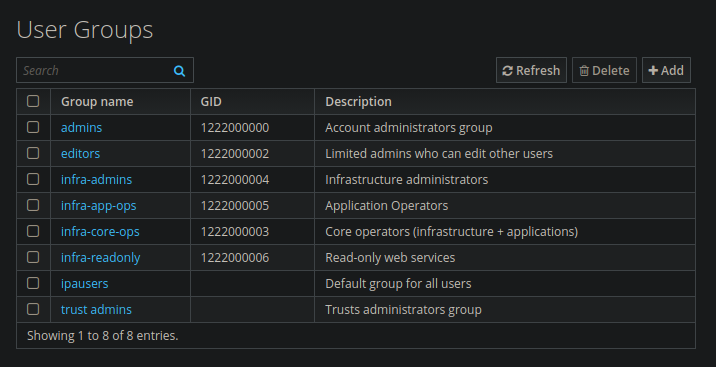

2. Create users in _Identity_ < _Users_ < _Active users_ < _Add_.

   - **`admin01`**
     - **First name:** Admin
     - **Last name:** 01
     - **User login:** admin01
        - Assign to the `infra-admins` group
   - **`coreops01`**
     - **First name:** CoreOps
     - **Last name:** 01
     - **User login:** coreops01
        - Assign to the `infra-core-ops` group.
   - **`appops01`**
     - **First name:** AppOps
     - **Last name:** 01
     - **User login:** appops01
        - Assign to the `infra-app-ops` group
   - **`viewer01`**
     - **First name:** Viewer
     - **Last name:** 01
     - **User login:** viewer01
        - Assign to the `infra-readonly` group

    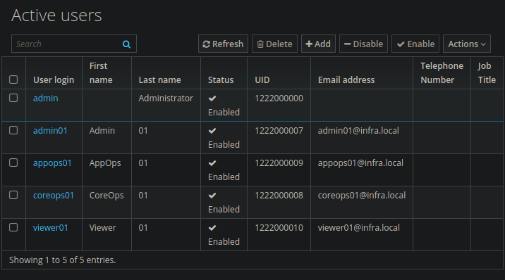

    > In FreeIPA, new users must change their password at first login. To avoid that in tests, from the server CLI:

    ```sh
    kinit admin
    ipa user-mod admin01 --password-expiration=20991231000000Z
    ```

3. Create host groups in _Identity_ < _Groups_ < _Host Groups_ < _Add_.

    | Host group      | Description                   | Hosts to add                 |
    | --------------- | ----------------------------- | ---------------------------- |
    | `all-managed`   | All managed hosts             | nat, proxy, pods, redis, ipa |
    | `entry-servers` | Public SSH bastion            | nat                          |
    | `app-servers`   | Application servers           | pods                         |
    | `infra-servers` | Internal infrastructure       | proxy, redis                 |
    | `idm-servers`   | Identity servers              | ipa                          |

    > Add _hosts_ to the _host group_. If the clients are enrolled correctly, the hosts appear in _Identity_ > _Hosts_.

    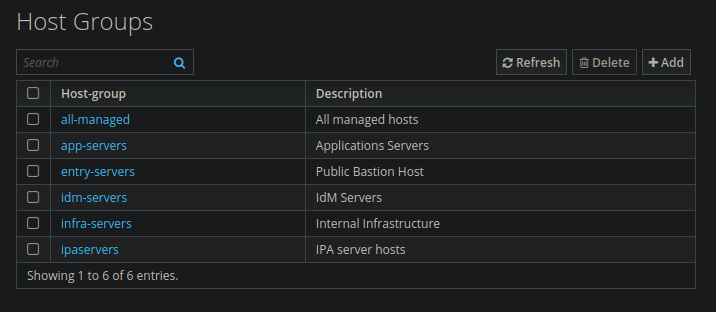

#### Creating the _HBAC Rules_

1. Disable `allow_all` in _Policy_ < _Host Based Access Control_ < _HBAC Rules_. Find `allow_all` < open it < uncheck _Enabled_ < _Save_. This enables “deny by default” mode. From this point on, only identities with an explicit rule can access the hosts.
   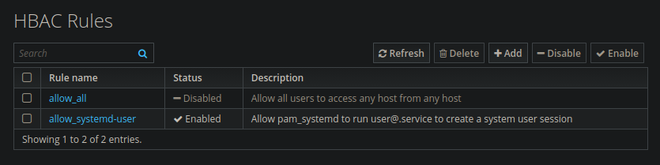

2. Create HBAC rules in _Policy_ < _Host Based Access Control_ < _HBAC Rules_.

   - **`admins-all-access`**
     - User Groups: `infra-admins`
     - Host Groups: `all-managed`
     - HBAC Services: `sshd`
   - **`coreops-entry`**
     - User Groups: `infra-core-ops`
     - Host Groups: `entry-servers`
     - HBAC Services: `sshd`
   - **`coreops-managed`**
     - User Groups: `infra-core-ops`
     - Host Groups: `app-servers` y `infra-servers`
     - HBAC Services: `sshd`
   - **`appops-entry`**
     - User Groups: `infra-app-ops`
     - Host Groups: `entry-servers`
     - HBAC Services: `sshd`
   - **`appops-app-only`**
     - User Groups: `infra-app-ops`
     - Host Groups: `app-servers`
     - HBAC Services: `sshd`

> `infra-readonly` has no HBAC rule because it is not allowed to SSH to any host by design.

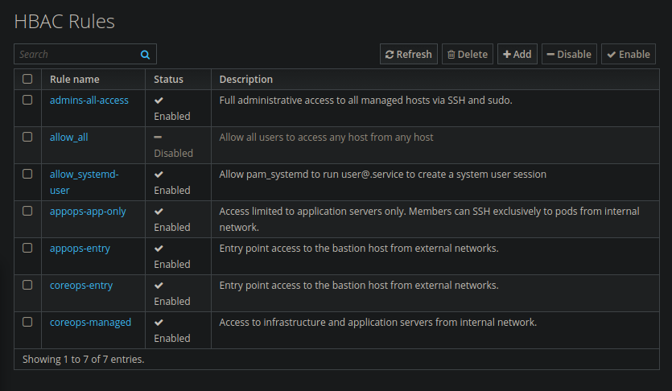

#### Creating the _Sudo Rules_

1. Create the sudo commands and sudo command groups in _Policy_ < _Sudo_ < _Sudo Commands / Sudo Command Group_. First add each command, then add them to the command group.

   - **`cmd-group-services`**
     - `/usr/bin/systemctl`
     - `/usr/bin/podman`
     - `/usr/bin/journalctl`
     - `/usr/bin/dnf`
   - **`cmd-group-readonly`**
     - `/usr/bin/journalctl`
     - `/usr/bin/systemctl status`
     - `/usr/bin/podman ps`
     - `/usr/bin/podman logs`

    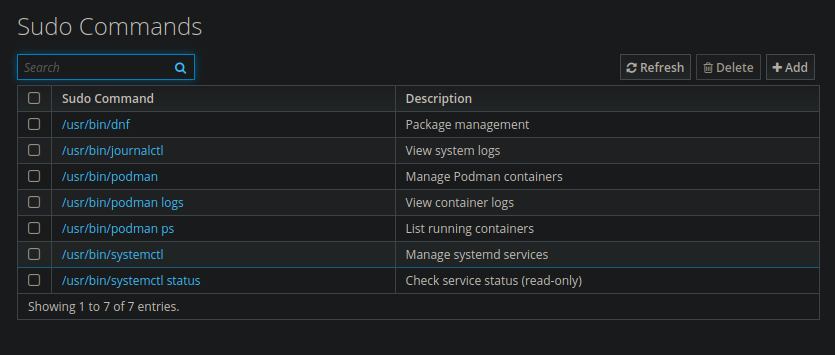
    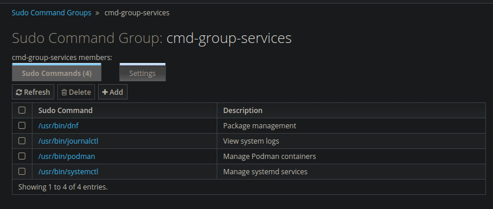
    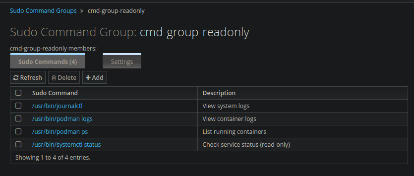

2. Create the sudo rules in _Policy_ < _Sudo_ < _Sudo Rules_.

   - **`sudo-admins-all`**
     - **Who** (User Groups): `infra-admins`
     - **Access this host** (Host Groups): `all-managed`
     - **Run Commands** (Command Groups): Command category the rule applies to: `Any Command`
     - **As Whom**: RunAs User category the rule applies to: `Anyone`
   - **`sudo-coreops-services`**
     - **Who** (User Groups): `infra-core-ops`
     - **Access this host** (Host Groups): `app-servers`, `infra-servers`
     - **Run Commands** (Command Groups): `cmd-group-services`
     - **As Whom**: RunAs User/Group category the rule applies to: `Anyone`
     - **Options:** `!authenticate`, no password is required for these commands
   - **`sudo-coreops-readonly-entry`**
     - **Who** (User Groups): `infra-core-ops`
     - **Access this host** (Host Groups): `entry-servers`
     - **Run Commands** (Command Groups): `cmd-group-readonly`
     - **As Whom**: RunAs User/Group category the rule applies to: `Anyone`
   - **`sudo-appops-services`**
     - **Who** (User Groups): `infra-app-ops`
     - **Access this host** (Host Groups): `app-servers`
     - **Run Commands** (Command Groups): `cmd-group-services`
     - **As Whom**: RunAs User/Group category the rule applies to: `Anyone`
   - **`sudo-appops-readonly-entry`**
     - **Who** (User Groups): `infra-app-ops`
     - **Access this host** (Host Groups): `entry-servers`
     - **Run Commands** (Command Groups): `cmd-group-readonly`
     - **As Whom**: RunAs User/Group category the rule applies to: `Anyone`

---

### Integrating GLPI with FreeIPA (LDAP)

1. Create an LDAP user for GLPI in FreeIPA. GLPI needs a read-only user to query the directory. Create it from the IPA server CLI.

    ```sh
    kinit admin
    ```

    - Create the user.

    ```sh
    ipa user-add glpi-ldap \
    --first=GLPI \
    --last=LDAP \
    --password
    ```

    - Output.

    ```sh
    ----------------------
    Added user "glpi-ldap"
    ----------------------
    User login: glpi-ldap
    First name: GLPI
    Last name: LDAP
    Full name: GLPI LDAP
    Display name: GLPI LDAP
    Initials: GL
    Home directory: /home/glpi-ldap
    GECOS: GLPI LDAP
    Login shell: /bin/sh
    Principal name: glpi-ldap@INFRA.LOCAL
    Principal alias: glpi-ldap@INFRA.LOCAL
    User password expiration: 20260608012107Z
    Email address: glpi-ldap@infra.local
    UID: 1222000011
    GID: 1222000011
    Password: True
    Member of groups: ipausers
    Kerberos keys available: True
    ```

    - Prevent the password from expiring.

    ```sh
    ipa user-mod glpi-ldap --password-expiration=20991231000000Z
    ```

    - Output.

    ```sh
    -------------------------
    Modified user "glpi-ldap"
    -------------------------
    User login: glpi-ldap
    First name: GLPI
    Last name: LDAP
    Home directory: /home/glpi-ldap
    Login shell: /bin/sh
    Principal name: glpi-ldap@INFRA.LOCAL
    Principal alias: glpi-ldap@INFRA.LOCAL
    User password expiration: 20991231000000Z
    Email address: glpi-ldap@infra.local
    UID: 1222000011
    GID: 1222000011
    Account disabled: False
    Password: True
    Member of groups: ipausers
    Kerberos keys available: True
    ```

    - Verify.

    ```sh
    ipa user-show glpi-ldap
    ```

    - Output.

    ```sh
    User login: glpi-ldap
    First name: GLPI
    Last name: LDAP
    Home directory: /home/glpi-ldap
    Login shell: /bin/sh
    Principal name: glpi-ldap@INFRA.LOCAL
    Principal alias: glpi-ldap@INFRA.LOCAL
    Email address: glpi-ldap@infra.local
    UID: 1222000011
    GID: 1222000011
    Account disabled: False
    Password: True
    Member of groups: ipausers
    Kerberos keys available: True
    ```

    > This user only needs read permissions. It must not be added to any administrative group.

2. Get the Base DN.

    ```sh
    ipa config-show
    ```

    - Output.

    ```sh
    Maximum username length: 32
    Maximum hostname length: 64
    Home directory base: /home
    Default shell: /bin/sh
    Default users group: ipausers
    Default e-mail domain: infra.local
    Search time limit: 2
    Search size limit: 100
    User search fields: uid,givenname,sn,telephonenumber,ou,title
    Group search fields: cn,description
    Enable migration mode: False
    Certificate Subject base: O=INFRA.LOCAL
    Password Expiration Notification (days): 4
    Password plugin features: AllowNThash, KDC:Disable Last Success
    SELinux user map order: guest_u:s0$xguest_u:s0$user_u:s0$staff_u:s0-s0:c0.c1023$sysadm_u:s0-s0:c0.c1023$unconfined_u:s0-s0:c0.c1023
    Default SELinux user: unconfined_u:s0-s0:c0.c1023
    Default PAC types: MS-PAC, nfs:NONE
    IPA masters: ipa.infra.local
    IPA master capable of PKINIT: ipa.infra.local
    IPA CA servers: ipa.infra.local
    IPA CA renewal master: ipa.infra.local
    IPA DNS servers: ipa.infra.local
    IPA Service key type:size: rsa:2048
    ```

3. Configure LDAP in GLPI. In _Setup_ < _Authentication_ < _LDAP directories_ < _Add_.

   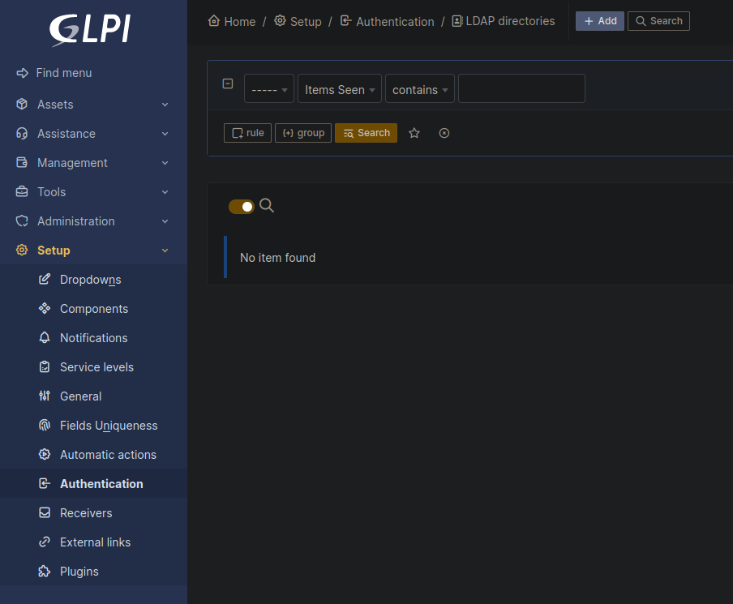

    - Main tab:

    ```txt
    Name:               FreeIPA
    Default:            Yes
    Active:             Yes
    Server:             192.168.216.10
    Port:               389
    BaseDN:             cn=users,cn=accounts,dc=infra,dc=local
    Connection filter:  (objectClass=person)
    RootDN:             uid=glpi-ldap,cn=users,cn=accounts,dc=infra,dc=local
    Password:           <PASSWORD_GLPI_LDAP>
    ```

    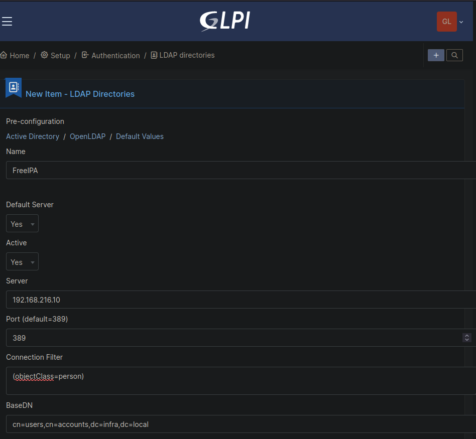

4. Test the connection. On the same _LDAP_ configuration screen, use the _Test_ button at the bottom.

   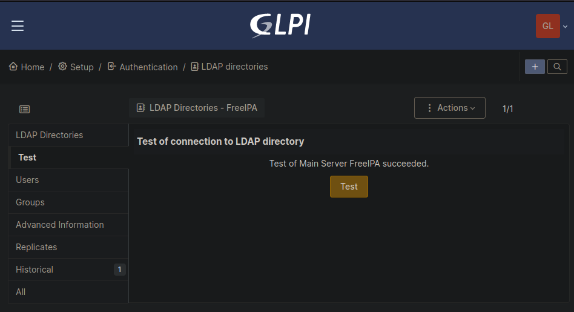

5. Map LDAP groups to GLPI profiles. Log in once with each user. Afterwards, a GLPI administrator assigns the correct permissions to the new users, which by default start with the lowest-privilege profile.

    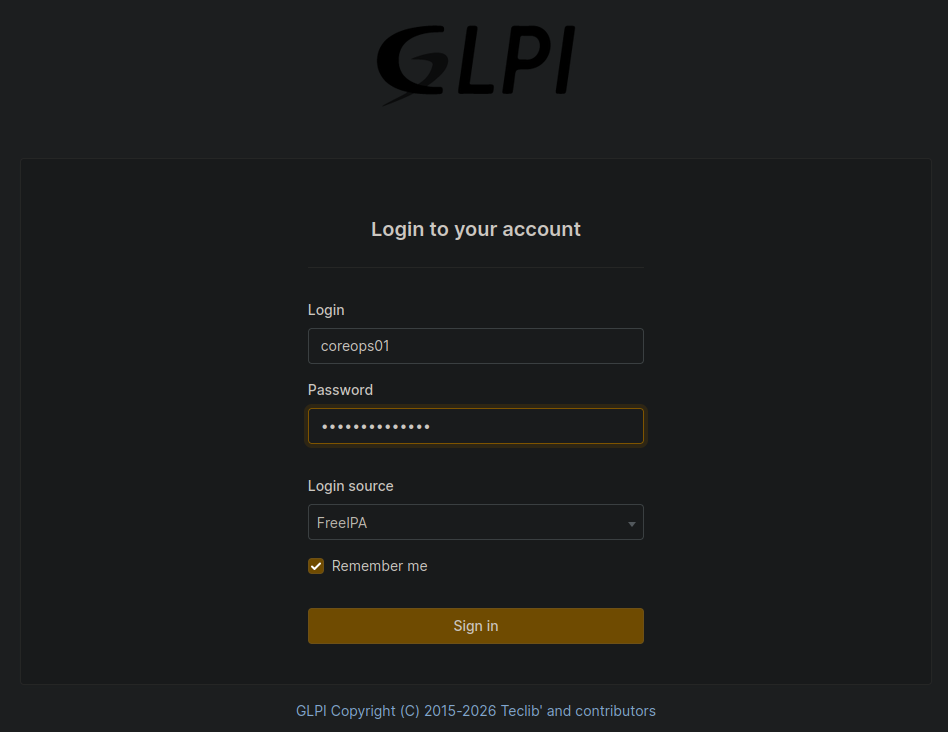

    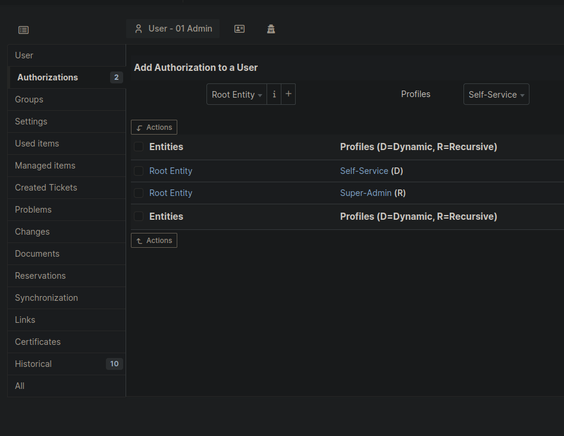

    | User      | GLPI Profile |
    | --------- | ------------ |
    | admin01   | Super-Admin  |
    | coreops01 | Admin        |
    | appops01  | Technician   |
    | viewer01  | Observer     |

---

### Integrating WikiJS with FreeIPA (LDAP)

1. Create an LDAP user for WikiJS in FreeIPA. WikiJS needs a read-only user to query the directory. Create it from the IPA server CLI.

    ```sh
    kinit admin
    ```

    - Create the user.

    ```sh
    ipa user-add wikijs-ldap \
    --first=WikiJS \
    --last=LDAP \
    --password
    ```

    - Output.

    ```sh
    ------------------------
    Added user "wikijs-ldap"
    ------------------------
    User login: wikijs-ldap
    First name: WikiJS
    Last name: LDAP
    Full name: WikiJS LDAP
    Display name: WikiJS LDAP
    Initials: WL
    Home directory: /home/wikijs-ldap
    GECOS: WikiJS LDAP
    Login shell: /bin/sh
    Principal name: wikijs-ldap@INFRA.LOCAL
    Principal alias: wikijs-ldap@INFRA.LOCAL
    User password expiration: 20260608024403Z
    Email address: wikijs-ldap@infra.local
    UID: 1222000012
    GID: 1222000012
    Password: True
    Member of groups: ipausers
    Kerberos keys available: True
    ```

    - Prevent the password from expiring.

    ```sh
    ipa user-mod wikijs-ldap --password-expiration=20991231000000Z
    ```

    - Output.

    ```sh
    ---------------------------
    Modified user "wikijs-ldap"
    ---------------------------
    User login: wikijs-ldap
    First name: WikiJS
    Last name: LDAP
    Home directory: /home/wikijs-ldap
    Login shell: /bin/sh
    Principal name: wikijs-ldap@INFRA.LOCAL
    Principal alias: wikijs-ldap@INFRA.LOCAL
    User password expiration: 20991231000000Z
    Email address: wikijs-ldap@infra.local
    UID: 1222000012
    GID: 1222000012
    Account disabled: False
    Password: True
    Member of groups: ipausers
    Kerberos keys available: True
    ```

    - Verify.

    ```sh
    ipa user-show wikijs-ldap
    ```

    - Output.

    ```sh
    User login: wikijs-ldap
    First name: WikiJS
    Last name: LDAP
    Home directory: /home/wikijs-ldap
    Login shell: /bin/sh
    Principal name: wikijs-ldap@INFRA.LOCAL
    Principal alias: wikijs-ldap@INFRA.LOCAL
    Email address: wikijs-ldap@infra.local
    UID: 1222000012
    GID: 1222000012
    Account disabled: False
    Password: True
    Member of groups: ipausers
    Kerberos keys available: True
    ```

    > This user only needs read permissions. It must not be added to any administrative group.

2. Configure LDAP in WikiJS. _Administration_ < _Authentication_ < _Add Strategy_ < _LDAP / Active Directory_.

   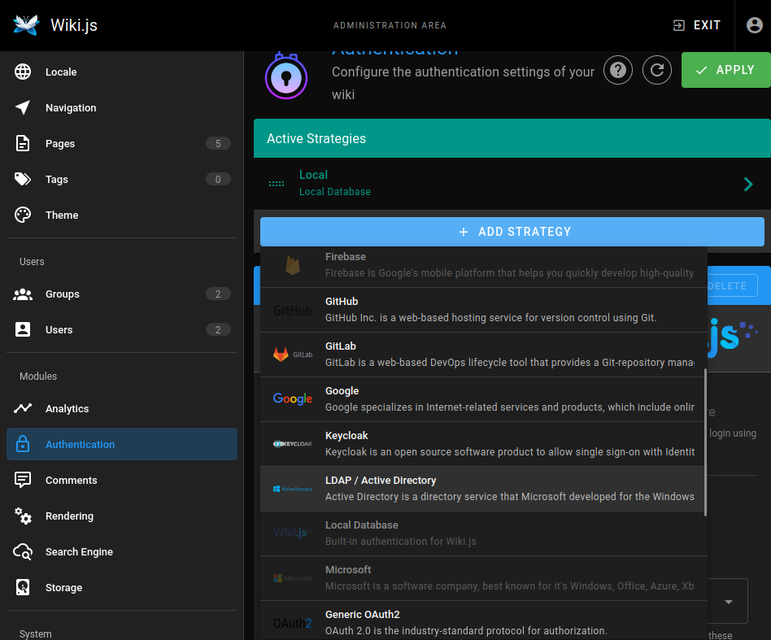

    - _Connection:_

    ```txt
    LDAP URL:           ldap://192.168.216.10:389
    Admin Bind DN:      uid=wikijs-ldap,cn=users,cn=accounts,dc=infra,dc=local
    Admin Bind Password: <password de wikijs-ldap>
    Search Base:        cn=users,cn=accounts,dc=infra,dc=local
    Search Filter:      (uid={{username}})
    ```

    - _Attribute Mapping:_

    ```txt
    Unique ID:          uid
    Email:              mail
    Display Name:       displayName
    Avatar picture:     (dejar vacío)
    ```

    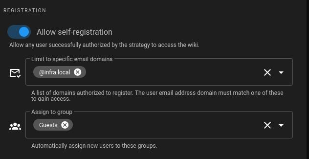
    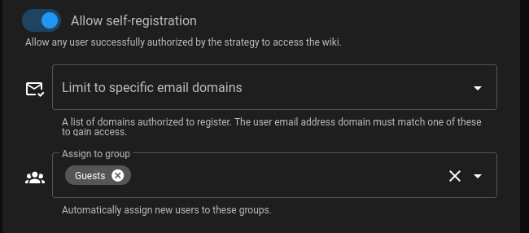

    - _Apply_.

3. Verify login in WikiJS.

   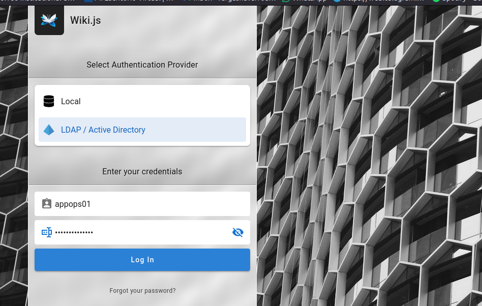
   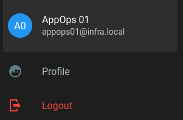

---
