# Project - Monitoring System

## Cover Page

### University of Costa Rica

**Design and Operation of Infrastructure CI-0144**
**Project, Part VII - Monitoring System**
**Professor:** Ariel Mora Jiménez
**Student:** Anderson Vargas Navarro - C28183
Semester II, 2026
Group: 002

---

## **Project - Monitoring System**

A monitoring system must be implemented for the infrastructure that allows both the monitoring of resources used and the generation of alerts for events that may compromise the continuity of the provided services.

The implemented system must allow:

- Creation of dashboards to monitor different aspects of the infrastructure
- Collection of computational resource usage metrics
- Collection of metrics related to provided services
- Log retrieval
- Generation of custom alerts
- Sending alerts via email and messaging applications
- User and profile administration

For the implementation, free, open-source, or trial-licensed tools covering the remaining time of the semester may be used. The decisions regarding the choice of tools must be justified.

For this project, the following additional aspects will be graded:

- Implementation decisions made
- Security measures applied

---

## Design

### Monitoring Stack Selection and Justification

#### Selected Stack (Prometheus + Loki + Grafana)

The monitoring stack selection was made by evaluating the specific requirements of the infrastructure, which consists of four virtual machines running Rocky Linux 9, services deployed as rootless Podman containers with Quadlet, HAProxy as a reverse proxy, Redis as cache, FreeIPA as an identity server, and the GLPI and WikiJS applications.

### Stack Components

#### Prometheus


**Role**: Metrics collection and storage engine.

Prometheus implements a **pull**-based collection model: it periodically contacts the exporters installed on each node and downloads the exposed metrics. Data is stored in its own time-series database (TSDB), integrated within the same process, optimized for timestamped data reads and writes. The native query language is PromQL, which allows calculating rates of change, moving averages, percentiles, and other time-series operations.

**Connection with other tools**: Prometheus is queried by Grafana to feed dashboards and metrics panels. It also evaluates defined alert rules and fires notifications when configured conditions are met, sending them directly to notification channels configured in Grafana Alerting.

#### Node Exporter

**Role**: OS metrics exposure agent.

Node Exporter is an independent Prometheus process installed on each node to be monitored. It reads Linux operating system information from the `/proc` and `/sys` pseudo-filesystems and exposes it in plain text format on port 9100 under the `/metrics` path. It does not store data or initiate communication; it simply responds to scrape requests made by Prometheus. It exposes per-core CPU metrics, RAM and swap memory, disk space per partition and mount point, network traffic per interface, disk I/O statistics, filesystem status, and system load.

**Connection with other tools**: Node Exporter is the data source that Prometheus queries periodically. It has no direct relationship with Grafana or Loki.

#### Service-specific Exporters

**Role**: Internal metrics exposure for specific services.

Following the same principle as Node Exporter, there are specialized exporters for each infrastructure service. Each one exposes its own service metrics on an HTTP endpoint that Prometheus consumes:

- **HAProxy Exporter**: exposes active backend metrics, active sessions, transferred bytes, and health check status for each backend server.
- **Redis Exporter**: exposes memory usage, cache hit and miss rate, commands per second, active connections, and latency.
- **cAdvisor**: exposes CPU, RAM, network, and disk usage metrics per running Podman container.
- **MySQLd Exporter**: exposes queries per second, active connections, slow queries, and MariaDB replication status.
- **Postgres Exporter**: exposes transactions per second, active locks, table sizes, and PostgreSQL connection status.

#### Loki


**Role**: Log storage and querying.

Loki is a log storage system designed with a different philosophy than Elasticsearch. Instead of indexing the full text content of each log line, Loki only indexes the **labels** associated with each log stream, such as the host name, service, severity level, or container name. The text content is stored compressed in non-indexed chunks. This drastically reduces disk and RAM usage compared to full-indexing systems, at the cost of slower free-text searches. The query language is LogQL, which uses the same label-based selection syntax as PromQL.

**Connection with other tools**: Loki receives logs sent by Fluent Bit. Grafana queries Loki to display logs in dashboards and to create alerts based on text patterns in the logs.

#### Fluent Bit


**Role**: Log collection and forwarding from each node.

Fluent Bit is a lightweight agent written in C that is installed on each node of the infrastructure. It reads logs from multiple sources (files in `/var/log/`, systemd journal, Podman container logs) and sends them to Loki via HTTP. It implements a **push** model: it does not wait for Loki to query it, but actively sends data. It supports parsing of common formats (JSON, regex, multiline for stack traces), enrichment with additional metadata, and can filter lines before sending them to reduce the volume of stored data.

**Connection with other tools**: Fluent Bit is the only component that interacts directly with Loki from the nodes. It has no relationship with Prometheus or Grafana.

#### Grafana


**Role**: Visualization, dashboards, and alert management.

Grafana is the unified interface of the entire stack. It acts as a query client for both Prometheus and Loki, allowing the combination of metrics and logs in the same dashboard. It offers dozens of visualization panel types and supports template variables to create parameterized reusable dashboards. Its built-in alerting system (Grafana Alerting) evaluates conditions on PromQL or LogQL queries and sends notifications to configured channels when conditions are met. It also manages users, teams, and dashboard access permissions, and can integrate with external identity providers like FreeIPA via LDAP.

**Connection with other tools**: Grafana queries Prometheus for metrics and Loki for logs. The Grafana alerting system replaces Alertmanager in this stack, sending notifications directly to email and Telegram without additional intermediate components.

### Communication Diagram

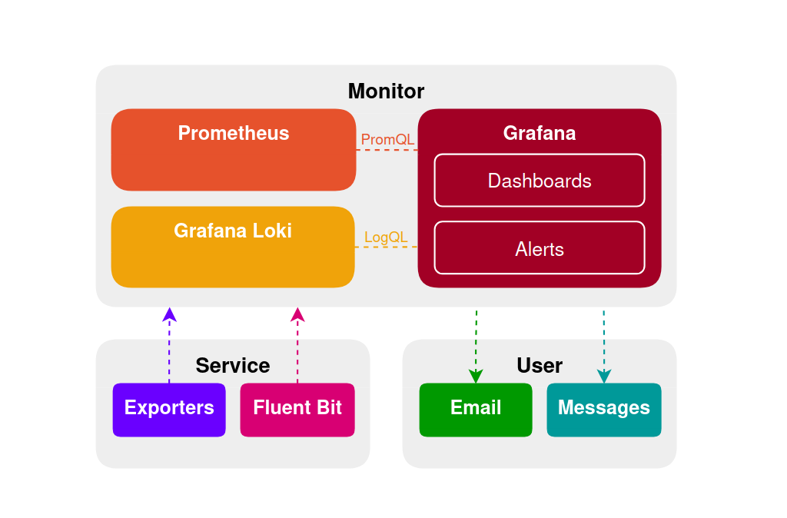

### Infrastructure Diagram

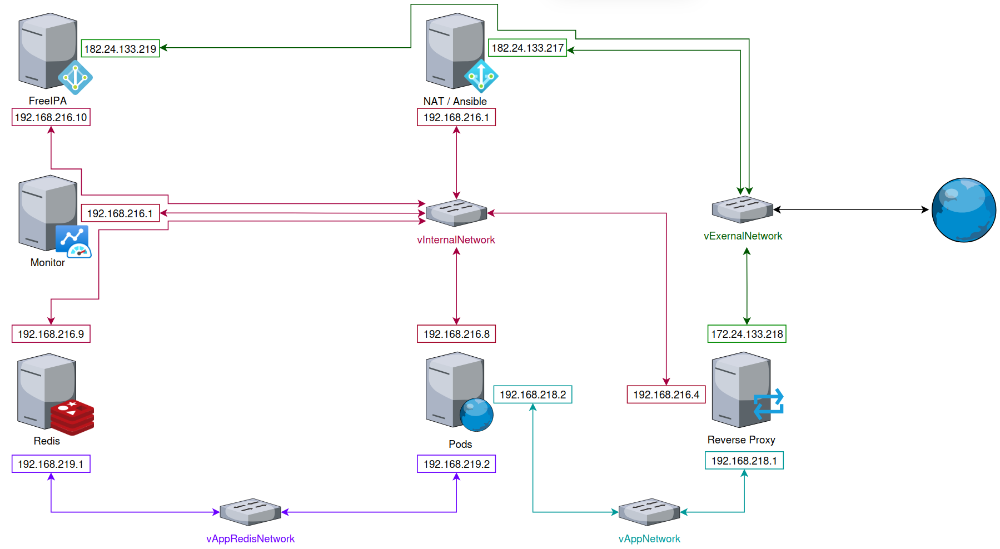

---

## Implementation

### Initial Creation and Configuration of the New _monitor_ Server

#### Creating the _monitor_ Server

1. Clone the golden image to create the new _monitor_ VM.

    ```sh
    ovftool \
    --skipManifestCheck \
    --lax \
    --noSSLVerify \
    --datastore="san_data" \
    --name="monitor" \
    --diskMode=thin \
    --net:"nat"="Internal_Network" \
    "golden_image/RockyServer9.ovf" \
    "vi://root@172.24.131.196/"
    ```

2. Assign the internal network IP to the _monitor_ VM.

    ```sh
    sudo nmtui
    ```

    - Assign the IP `192.168.216.11`, with the DNS of the _monitor_ VM's IP.
    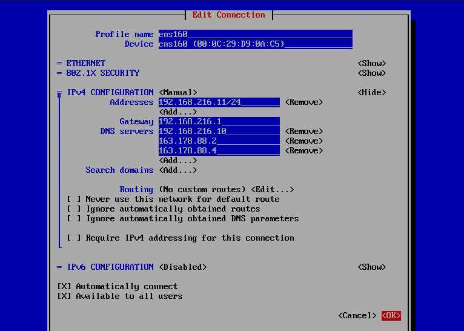
    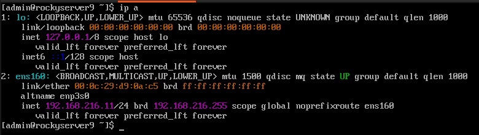
    - Verify internet connectivity.
    

#### Create and Assign the _MonitorProxyNetwork_ Network

1. Create the `vMonitorProxyNetwork` _vSwitch_.
   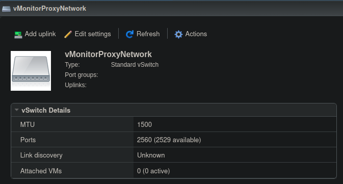

2. Create the `MonitorProxy_Network` _port group_.
   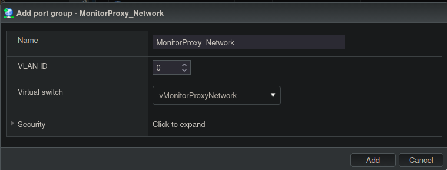

3. Add a `MonitorProxy_Network` network interface to the _monitor_ VM.
   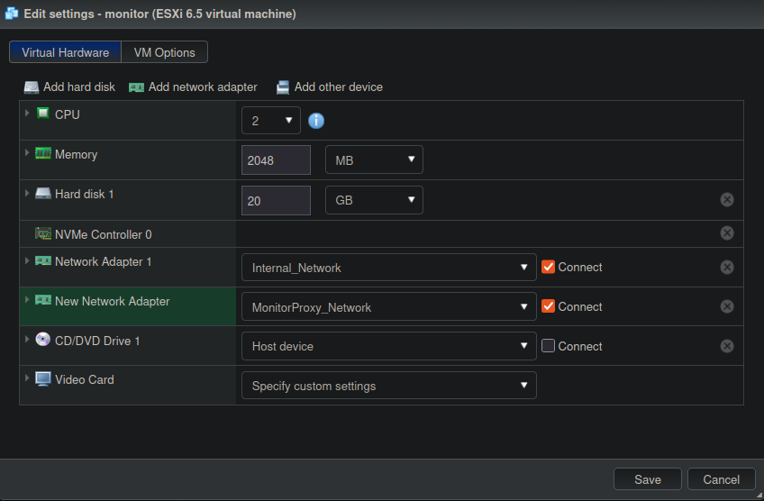

4. Assign the `MonitorProxy_Network` IP to the _monitor_ VM.

    ```sh
    sudo nmtui
    ```

    - Assign the IP `192.168.217.2`.
    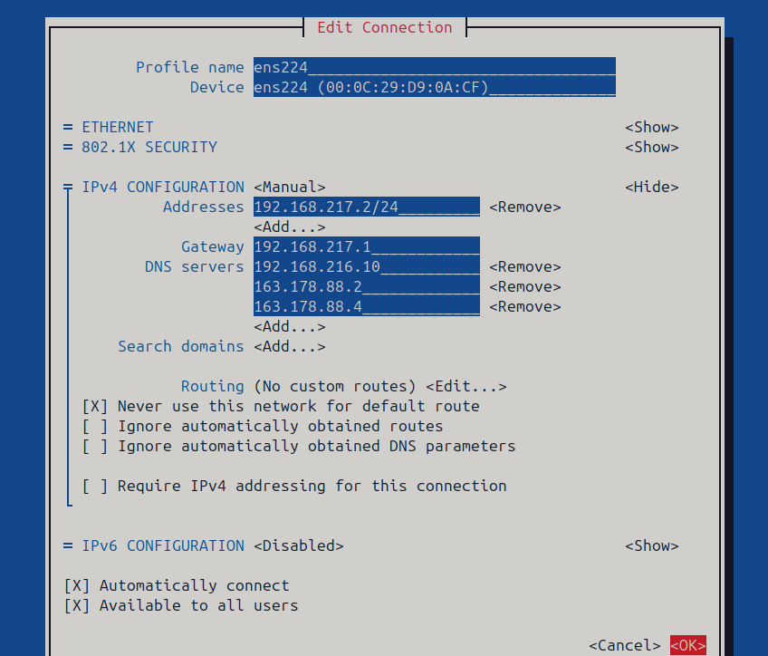
    - Verify with `ip address`.

    ```sh
    1: lo: <LOOPBACK,UP,LOWER_UP> mtu 65536 qdisc noqueue state UNKNOWN group default qlen 1000
        link/loopback 00:00:00:00:00:00 brd 00:00:00:00:00:00
        inet 127.0.0.1/8 scope host lo
        valid_lft forever preferred_lft forever
        inet6 ::1/128 scope host
        valid_lft forever preferred_lft forever
    2: ens160: <BROADCAST,MULTICAST,UP,LOWER_UP> mtu 1500 qdisc mq state UP group default qlen 1000
        link/ether 00:0c:29:d9:0a:c5 brd ff:ff:ff:ff:ff:ff
        altname enp3s0
        inet 192.168.216.11/24 brd 192.168.216.255 scope global noprefixroute ens160
        valid_lft forever preferred_lft forever
    3: ens224: <BROADCAST,MULTICAST,UP,LOWER_UP> mtu 1500 qdisc mq state UP group default qlen 1000
        link/ether 00:0c:29:d9:0a:cf brd ff:ff:ff:ff:ff:ff
        altname enp19s0
        inet 192.168.217.2/24 brd 192.168.217.255 scope global noprefixroute ens224
        valid_lft forever preferred_lft forever
    ```

    - Verify with `ip route`.

    ```sh
    default via 192.168.216.1 dev ens160 proto static metric 100
    192.168.216.0/24 dev ens160 proto kernel scope link src 192.168.216.11 metric 100
    192.168.217.0/24 dev ens224 proto kernel scope link src 192.168.217.2 metric 101
    ```

5. Add a `MonitorProxy_Network` network interface to the _proxy_ VM.
   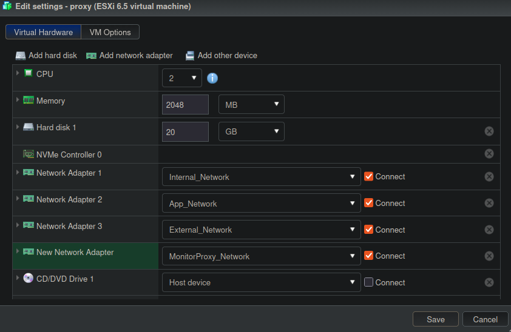

6. Assign the `MonitorProxy_Network` IP to the _proxy_ VM.

    ```sh
    sudo nmtui
    ```

    - Assign the IP `192.168.217.1`.
    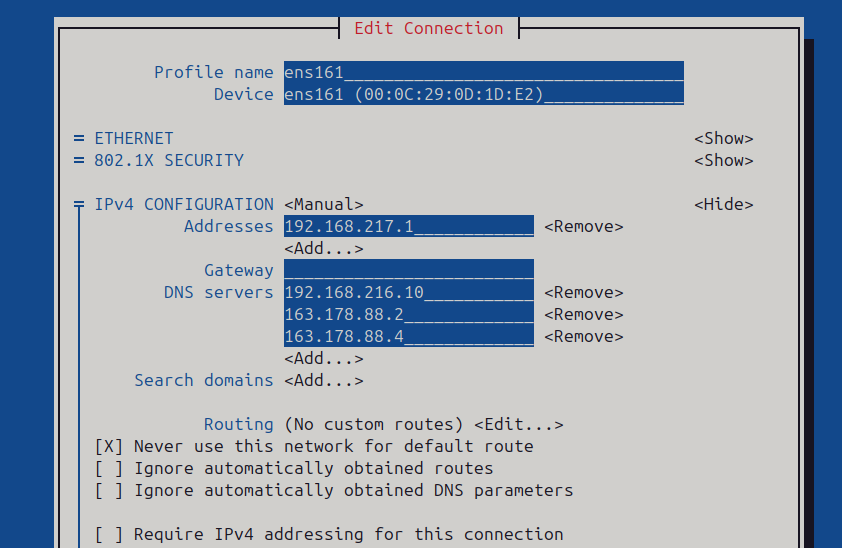
    - Verify with `ip address`.

    ```sh
    1: lo: <LOOPBACK,UP,LOWER_UP> mtu 65536 qdisc noqueue state UNKNOWN group default qlen 1000
        link/loopback 00:00:00:00:00:00 brd 00:00:00:00:00:00
        inet 127.0.0.1/8 scope host lo
        valid_lft forever preferred_lft forever
        inet6 ::1/128 scope host
        valid_lft forever preferred_lft forever
    2: ens160: <BROADCAST,MULTICAST,UP,LOWER_UP> mtu 1500 qdisc mq state UP group default qlen 1000
        link/ether 00:0c:29:0d:1d:c4 brd ff:ff:ff:ff:ff:ff
        altname enp3s0
        inet 192.168.216.4/24 brd 192.168.216.255 scope global noprefixroute ens160
        valid_lft forever preferred_lft forever
    3: ens161: <BROADCAST,MULTICAST,UP,LOWER_UP> mtu 1500 qdisc mq state UP group default qlen 1000
        link/ether 00:0c:29:0d:1d:e2 brd ff:ff:ff:ff:ff:ff
        altname enp4s0
        inet 192.168.217.1/24 brd 192.168.217.255 scope global noprefixroute ens161
        valid_lft forever preferred_lft forever
    4: ens224: <BROADCAST,MULTICAST,UP,LOWER_UP> mtu 1500 qdisc mq state UP group default qlen 1000
        link/ether 00:0c:29:0d:1d:ce brd ff:ff:ff:ff:ff:ff
        altname enp19s0
        inet 192.168.218.1/24 brd 192.168.218.255 scope global noprefixroute ens224
        valid_lft forever preferred_lft forever
    5: ens256: <BROADCAST,MULTICAST,UP,LOWER_UP> mtu 1500 qdisc mq state UP group default qlen 1000
        link/ether 00:0c:29:0d:1d:d8 brd ff:ff:ff:ff:ff:ff
        altname enp27s0
        inet 172.24.133.218/24 brd 172.24.133.255 scope global noprefixroute ens256
        valid_lft forever preferred_lft forever
    ```

    - Verify with `ip route`.

    ```sh
    default via 172.24.133.1 dev ens256 proto static metric 101
    172.24.133.0/24 dev ens256 proto kernel scope link src 172.24.133.218 metric 101
    192.168.216.0/24 dev ens160 proto kernel scope link src 192.168.216.4 metric 102
    192.168.217.0/24 dev ens161 proto kernel scope link src 192.168.217.1 metric 104
    192.168.218.0/24 dev ens224 proto kernel scope link src 192.168.218.1 metric 103
    ```

    - Verify connectivity to the _monitor_ VM.

    ```sh
    ping -c3 192.168.217.2
    ```

    - Output.

    ```sh
    PING 192.168.217.2 (192.168.217.2) 56(84) bytes of data.
    64 bytes from 192.168.217.2: icmp_seq=1 ttl=64 time=1.59 ms
    64 bytes from 192.168.217.2: icmp_seq=2 ttl=64 time=0.545 ms
    64 bytes from 192.168.217.2: icmp_seq=3 ttl=64 time=0.915 ms

    --- 192.168.217.2 ping statistics ---
    3 packets transmitted, 3 received, 0% packet loss, time 2004ms
    rtt min/avg/max/mdev = 0.545/1.017/1.592/0.433 ms
    ```

#### Initial Configuration of the _monitor_ Server

1. Change the password of the new _monitor_ VM.

    ```sh
    passwd
    ```

2. Change the Hostname.

    ```sh
    sudo hostnamectl set-hostname monitor.infra.local
    ```

    - Verify the change.

    ```sh
    hostnamectl
    ```

    - Output.

    ```sh
    Static hostname: monitor.infra.local
    ```

3. Update the `/etc/hosts` file.

    ```sh
    sudo nano /etc/hosts
    ```

    - Add the line.

    ```sh
    192.168.216.10 ipa.infra.local ipa
    ```

    - Restart the _ipa_ VM.

4. Install `VMware Tools`.

    ```sh
    sudo dnf install open-vm-tools
    ```

    - Enable it with.

    ```sh
    sudo systemctl enable --now vmtoolsd
    ```

5. Transfer the public key from the _nat_ VM to the destination _monitor_ VM.

    ```sh
    ssh-copy-id admin@192.168.216.11
    ```

    - Create an alias for quick access.

    ```sh
    nano ~/.ssh/config
    ```

    - Add.

    ```sh
    Host monitor
        HostName 192.168.216.11
        User admin
        IdentityFile ~/.ssh/id_ed25519
    ```

    - Verify the connection.

    ```sh
    ssh monitor
    ```

6. Check if SELinux is in enforcing mode.

    ```sh
    getenforce
    ```

    - If the output is.

    ```sh
    Enforcing
    ```

    - Switch it to Permissive.

    ```sh
    sudo setenforce 0
    ```

---

#### Create `ansible` User on the `monitor` VM

1. Run the following inside `ipa`.

    ```sh
    sudo groupadd ansible
    sudo useradd -m -s /bin/bash -g ansible ansible
    id ansible
    ```

    - Output.

    ```sh
    uid=1001(ansible) gid=1002(ansible) groups=1002(ansible)
    ```

    - Configure passwordless sudo ONLY for the `ansible` group.

    ```sh
    echo '%ansible ALL=(ALL) NOPASSWD: ALL' | sudo tee /etc/sudoers.d/ansible
    sudo chmod 440 /etc/sudoers.d/ansible
    sudo visudo -c
    ```

    - Output.

    ```sh
    /etc/sudoers: parsed OK
    /etc/sudoers.d/ansible: parsed OK
    ```

#### SSH and Key Configuration

1. Prepare SSH for the `ansible` user inside the _monitor_ VM.

    ```sh
    sudo install -d -m 700 -o ansible -g ansible /home/ansible/.ssh
    ```

    - **`sudo install -d -m 700 -o ansible -g ansible /home/ansible/.ssh`**: Uses the `install` utility for atomic SSH environment preparation. The command creates the configuration directory (`-d`) while simultaneously ensuring restrictive permissions (`-m 700`), which is a strict SSH requirement to prevent unauthorized access. It also assigns ownership of the directory to the corresponding user (`-o ansible`) and group (`-g ansible`) in a single operation, eliminating the need to run additional commands like `mkdir`, `chmod`, and `chown` separately.

2. From `nat`, copy the public key.

    ```sh
    cat ~/.ssh/ansible_id.pub
    ```

    - On each node (`proxy`, `pods`, `redis`).

    ```sh
    echo "<NAT_VM_PUBLIC_KEY>" | sudo tee /home/ansible/.ssh/authorized_keys > /dev/null

    sudo chown ansible:ansible /home/ansible/.ssh/authorized_keys
    sudo chmod 600 /home/ansible/.ssh/authorized_keys
    ```

3. Lock and delete password login for the `ansible` user.

    ```sh
    sudo passwd -d ansible && sudo passwd -l ansible
    ```

4. Perform SSH _hardening_ (on each node).

    ```sh
    sudo nano /etc/ssh/sshd_config
    ```

    - Edit.

    ```ini
    # AllowUsers admin ansible
    PasswordAuthentication no
    PermitRootLogin no
    PubkeyAuthentication yes
    ```

    - Apply.

    ```sh
    sudo systemctl restart sshd
    ```

    - Verify with `sudo sshd -T | grep -E 'allowusers|passwordauthentication|permitrootlogin|pubkeyauthentication'`.

    ```sh
    permitrootlogin no
    pubkeyauthentication yes
    passwordauthentication no
    ```

    > **_NOTE_**: Disable the `AllowUsers` option on all hosts since authentication is now handled by FreeIPA.

5. Configure SSH on the `nat` VM.

    ```sh
    nano ~/.ssh/config
    ```

    - Add.

    ```sh
    Host monitor-ansible
        HostName 192.168.216.11
        User ansible
        IdentityFile ~/.ssh/ansible_id
    ```

6. Verify from the `nat` control node.

    ```sh
    ssh monitor-ansible "hostname && id && sudo whoami"
    ```

    - Output.

    ```sh
    uid=1001(ansible) gid=1002(ansible) groups=1002(ansible) context=unconfined_u:unconfined_r:unconfined_t:s0-s0:c0.c1023
    root
    ```

7. Verify connectivity from ansible.

    ```sh
    ansible ansible-monitor -m ping
    ```

---

### Base Ansible Configuration for `monitor`

#### Add the `monitor` Host to the Inventory

1. Modify the `inventory/hosts.yaml` file.

    ```sh
    nano ansible-project/inventory/hosts.yaml
    ```

    - Add: [inventory_hosts](../../ansible-project/inventory/hosts.yaml)

    ```sh
        monitoring_hosts:
        hosts:
            monitor:
            ansible_host: monitor-ansible
    ```

    - Verify connectivity with inventory nodes.

    ```sh
    ansible all -m ping --ask-vault-pass
    ```

    - Output.

    ```sh
    pods | SUCCESS => {
        "changed": false,
        "ping": "pong"
    }
    proxy | SUCCESS => {
        "changed": false,
        "ping": "pong"
    }
    redis | SUCCESS => {
        "changed": false,
        "ping": "pong"
    }
    nat | SUCCESS => {
        "changed": false,
        "ping": "pong"
    }
    monitor | SUCCESS => {
        "changed": false,
        "ping": "pong"
    }
    ipa | SUCCESS => {
        "changed": false,
        "ping": "pong"
    }
    ```

#### Syntax Verification

1. Verify syntax.

    ```bash
    ansible-playbook playbooks/tests/test_common.yaml --syntax-check
    ```

    - Output.

    ```sh
    playbook: playbooks/tests/test_common.yaml
    ```

#### Dry Run of the `Common` Role After Adding New Variables

1. Dry run on `monitor`.

    ```bash
    ansible-playbook playbooks/tests/test_common.yaml \
    --check --diff \
    --limit monitor \
    --ask-vault-pass
    ```

    - Output.

    ```sh
    monitor: ok=13 changed=5 unreachable=0 failed=0 skipped=13 rescued=0 ignored=0
    ```

2. Dry run on all nodes.

    ```bash
    ansible-playbook playbooks/tests/test_common.yaml \
    --check --diff \
    --ask-vault-pass
    ```

    - Output.

    ```sh
    ipa: ok=8 changed=0 unreachable=0 failed=0 skipped=18 rescued=0 ignored=0
    monitor: ok=8 changed=0 unreachable=0 failed=0 skipped=18 rescued=0 ignored=0
    nat: ok=9 changed=0 unreachable=0 failed=0 skipped=17 rescued=0 ignored=0
    pods: ok=9 changed=0 unreachable=0 failed=0 skipped=19 rescued=0 ignored=0
    proxy: ok=11 changed=2 unreachable=0 failed=0 skipped=20 rescued=0 ignored=0
    redis: ok=8 changed=0 unreachable=0 failed=0 skipped=18 rescued=0 ignored=0
    ```

#### Execution of the `Common` Role

1. First real execution on all nodes.

    ```bash
    ansible-playbook playbooks/tests/test_common.yaml \
    --ask-vault-pass
    ```

    - Output.

    ```sh
    ipa: ok=13 changed=0 unreachable=0 failed=0 skipped=13 rescued=0 ignored=0

    monitor: ok=13 changed=0 unreachable=0 failed=0 skipped=13 rescued=0 ignored=0

    nat: ok=15 changed=0 unreachable=0 failed=0 skipped=11 rescued=0 ignored=0

    pods: ok=15 changed=2 unreachable=0 failed=0 skipped=14 rescued=0 ignored=0

    proxy: ok=17 changed=5 unreachable=0 failed=0 skipped=15 rescued=0 ignored=0

    redis: ok=14 changed=2 unreachable=0 failed=0 skipped=13 rescued=0 ignored=0
    ```

2. Second real execution on all nodes.

    ```bash
    ansible-playbook playbooks/tests/test_common.yaml \
    --ask-vault-pass
    ```

    - Output.

    ```sh
    ipa: ok=8 changed=0 unreachable=0 failed=0 skipped=9 rescued=0 ignored=0

    nat: ok=10 changed=0 unreachable=0 failed=0 skipped=7 rescued=0 ignored=0

    pods: ok=8 changed=0 unreachable=0 failed=0 skipped=9 rescued=0 ignored=0

    proxy: ok=9 changed=0 unreachable=0 failed=0 skipped=8 rescued=0 ignored=0

    redis: ok=8 changed=0 unreachable=0 failed=0 skipped=9 rescued=0 ignored=0
    ```

---

### Creating the `Prometheus` Role

Following the guide _Setting Up Prometheus and Grafana for System Monitoring_ with the [guide](https://www.linuxnaija.com/setting-up-prometheus-and-grafana-for-system-monitoring/).

#### Creating the `Prometheus` Role Structure and Files

```ini
roles/prometheus/
├── defaults/
│   └── main.yaml
├── tasks/
│   └── main.yaml
├── handlers/
│   └── main.yaml
└── templates/
    ├── prometheus.yml.j2
    └── prometheus.service.j2
```

1. Create the directory structure.

    ```sh
    mkdir -p ansible-project/roles/prometheus/{defaults,handlers,tasks,templates}
    ```

2. Create `defaults/main.yaml`.

    ```sh
    nano ansible-project/roles/prometheus/defaults/main.yaml
    ```

    - Add: [prometheus_defaults_main](../../ansible-project/roles/prometheus/defaults/main.yaml)

3. Create `handlers/main.yaml`.

    ```sh
    nano ansible-project/roles/prometheus/handlers/main.yaml
    ```

    - Add: [prometheus_handlers_main](../../ansible-project/roles/prometheus/handlers/main.yaml)

4. Create `tasks/main.yaml`.

    ```sh
    nano ansible-project/roles/prometheus/tasks/main.yaml
    ```

    - Add: [prometheus_tasks_main](../../ansible-project/roles/prometheus/tasks/main.yaml)

5. Create `templates/prometheus.yml.j2`.

    ```sh
    nano ansible-project/roles/prometheus/templates/prometheus.yml.j2
    ```

    - Add: [prometheus_templates_prometheus](../../ansible-project/roles/prometheus/templates/prometheus.yml.j2)

6. Create `templates/prometheus.service.j2`.

    ```sh
    nano ansible-project/roles/prometheus/templates/prometheus.service.j2
    ```

    - Add: [prometheus_templates_prometheus_service](../../ansible-project/roles/prometheus/templates/prometheus.service.j2)

---

#### Verification of the `Prometheus` Role

##### Syntax Verification of the `Prometheus` Role

1. Create a test file.

    ```sh
    nano ansible-project/playbooks/tests/test_prometheus.yaml
    ```

    - Add.

    ```ini
    ---
    - name: Test FreeIPA server Role
    hosts: monitoring_hosts
    gather_facts: true
    roles:
        - prometheus
    ```

2. Verify syntax.

    ```bash
    ansible-playbook playbooks/tests/test_prometheus.yaml --syntax-check
    ```

    - Output.

    ```sh
    playbook: playbooks/tests/test_prometheus.yaml
    ```

---

##### Dry Run of the `Prometheus` Role

1. Dry run of the `Prometheus` role.

    ```bash
    ansible-playbook playbooks/tests/test_prometheus.yaml \
    --check --diff \
    --ask-vault-pass
    ```

    - Output.

    ```sh
    monitor: ok=11 changed=4 unreachable=0 failed=0 skipped=7 rescued=0 ignored=0
    ```

---

##### Execution of the `Prometheus` Role

1. Real execution of the `Prometheus` role.

    ```bash
    ansible-playbook playbooks/tests/test_prometheus.yaml \
    --ask-vault-pass
    ```

    - First Execution.

    ```sh
    monitor: ok=19 changed=5 unreachable=0 failed=0 skipped=1 rescued=0 ignored=0
    ```

    - Second Execution.

    ```sh
    monitor: ok=14 changed=0 unreachable=0 failed=0 skipped=1 rescued=0 ignored=0
    ```

---

##### Manual Verification of the `Prometheus` Role

1. Verify that Prometheus is running.

    ```sh
    # On the monitor node
    sudo systemctl status prometheus
    ```

    - Output.

    ```sh
    Active: active (running) since Tue 2026-06-16 15:53:25 CST; 17s ago
    ```

2. Verify the port is listening.

    ```sh
    # Verify that port 9090 is listening
    sudo ss -tlnp | grep 9090
    ```

    - Output.

    ```sh
    LISTEN 0      4096   192.168.216.11:9090      0.0.0.0:*    users:(("prometheus",pid=38306,fd=6))
    ```

3. Test the health endpoint.

    ```sh
    curl -s http://localhost:9090/-/healthy
    ```

    - Output.

    ```sh
    Prometheus Server is Healthy.
    ```

### Creating the `Exporters` Role

#### Creating the `Exporters` Role Structure and Files for `Node Exporter`

```ini
roles/exporters/
├── defaults/
│   └── main.yaml
├── tasks/
│   ├── main.yaml
│   └── node_exporter.yaml
├── handlers/
│   └── main.yaml
└── templates/
    └── node_exporter.service.j2
```

1. Create the directory structure.

    ```sh
    mkdir -p ansible-project/roles/exporters/{defaults,handlers,tasks,templates}
    ```

2. Create `defaults/main.yaml`.

    ```sh
    nano ansible-project/roles/exporters/defaults/main.yaml
    ```

    - Add: [exporters_node_exporter_tasks](../../ansible-project/roles/exporters/tasks/main.yaml)

3. Create `handlers/main.yaml`.

    ```sh
    nano ansible-project/roles/exporters/handlers/main.yaml
    ```

    - Add: [exporters_handlers_main](../../ansible-project/roles/exporters/handlers/main.yaml)

4. Create `tasks/main.yaml`.

    ```sh
    nano ansible-project/roles/exporters/tasks/main.yaml
    ```

    - Add: [exporters_tasks_main](../../ansible-project/roles/exporters/tasks/main.yaml)

5. Create `tasks/node_exporter.yaml`.

    ```sh
    nano ansible-project/roles/exporters/tasks/node_exporter.yaml
    ```

    - Add: [exporters_defaults_main](../../ansible-project/roles/exporters/defaults/main.yaml)

6. Create `templates/node_exporter.service.j2`.

    ```sh
    nano ansible-project/roles/exporters/templates/node_exporter.service.j2
    ```

    - Add: [exporters_templates_node_exporter](../../ansible-project/roles/exporters/templates/exporter.service.j2)

---

#### Verification of the `Exporters` Role for `Node Exporter`

##### Syntax Verification of the `Exporters` Role for `Node Exporter`

1. Create a test file.

    ```sh
    nano ansible-project/playbooks/tests/test_exporters.yaml
    ```

    - Add.

    ```ini
    ---
    - name: Test Exporters Role
    hosts: all
    gather_facts: true
    roles:
        - exporters
    ```

2. Verify syntax.

    ```bash
    ansible-playbook playbooks/tests/test_exporters.yaml --syntax-check
    ```

    - Output.

    ```sh
    playbook: playbooks/tests/test_exporters.yaml
    ```

---

##### Dry Run of the `Exporters` Role for `Node Exporter`

1. Dry run of the `Exporters` role.

    ```bash
    ansible-playbook playbooks/tests/test_exporters.yaml \
    --check --diff \
    --ask-vault-pass
    ```

    - Output.

    ```sh
    ipa: ok=5 changed=3 unreachable=0 failed=0 skipped=7 rescued=0    ignored=0
    monitor: ok=5 changed=3 unreachable=0 failed=0 skipped=7 rescued=0 ignored=0
    nat: ok=5 changed=3 unreachable=0 failed=0 skipped=7 rescued=0 ignored=0
    pods: ok=5 changed=3 unreachable=0 failed=0 skipped=7 rescued=0 ignored=0
    proxy: ok=4 changed=3 unreachable=0 failed=0 skipped=7 rescued=0 ignored=0
    redis: ok=5 changed=3 unreachable=0 failed=0 skipped=7 rescued=0 ignored=0
    ```

---

##### Execution of the `Exporters` Role for `Node Exporter`

1. Real execution of the `Exporters` role.

    ```bash
    ansible-playbook playbooks/tests/test_exporters.yaml \
    --ask-vault-pass
    ```

    - First Execution.

    ```sh
    ipa: ok=12 changed=10 unreachable=0 failed=0 skipped=0 rescued=0 ignored=0
    monitor: ok=12 changed=10 unreachable=0 failed=0 skipped=0 rescued=0 ignored=0
    nat: ok=12 changed=10 unreachable=0 failed=0 skipped=0 rescued=0 ignored=0
    pods: ok=12 changed=10 unreachable=0 failed=0 skipped=0 rescued=0 ignored=0
    proxy: ok=12 changed=10 unreachable=0 failed=0 skipped=0 rescued=0 ignored=0
    redis: ok=12 changed=10 unreachable=0 failed=0 skipped=0    rescued=0 ignored=0
    ```

    - Second Execution.

    ```sh
    ipa: ok=7 changed=0 unreachable=0 failed=0 skipped=5 rescued=0 ignored=0
    monitor: ok=7 changed=0 unreachable=0 failed=0 skipped=5 rescued=0 ignored=0
    nat: ok=7 changed=0 unreachable=0 failed=0 skipped=5 rescued=0 ignored=0
    pods: ok=7 changed=0 unreachable=0 failed=0 skipped=5 rescued=0 ignored=0
    proxy: ok=7 changed=0 unreachable=0 failed=0 skipped=5 rescued=0 ignored=0
    redis: ok=7 changed=0 unreachable=0 failed=0 skipped=5 rescued=0 ignored=0
    ```

---

##### Manual Verification of the `Exporters` Role for `Node Exporter`

1. Verify the service is running.

    ```sh
    sudo systemctl status node_exporter
    ```

    - Output.

    ```sh
    Active: active (running) since Wed 2026-06-17 09:06:09 CST;
    ```

2. Verify the port is listening.

    ```sh
    sudo ss -tlnp | grep 9100
    ```

    - Output.

    ```sh
    LISTEN 0      4096   127.0.0.1:9100         0.0.0.0:*
    LISTEN 0      4096   192.168.216.1:9100     0.0.0.0:*
    LISTEN 0      4096   192.168.216.4:9100     0.0.0.0:*
    LISTEN 0      4096   192.168.216.8:9100     0.0.0.0:*
    LISTEN 0      4096   192.168.216.9:9100     0.0.0.0:*
    LISTEN 0      4096   192.168.216.10:9100    0.0.0.0:*
    ```

3. Test the metrics endpoint.

    ```sh
    curl -s http://localhost:9100/metrics | head -20
    ```

4. Verify that _Prometheus_ can recognize the nodes and they are up.

    ```sh
    curl -s http://localhost:9090/api/v1/targets | python3 -m json.tool
    ```

    - Output.

    ```sh
    # monitor
    "host": "monitor",
    "instance": "localhost:9100",
    "job": "node",
    "role": "monitor"
    "health": "up",

    # nat
    "host": "nat",
    "instance": "192.168.216.1:9100",
    "job": "node",
    "role": "gateway"
    "health": "up",

    # proxy
    "host": "proxy",
    "job": "node",
    "role": "reverse-proxy"
    "health": "up",

    # pods
    "host": "pods",
    "instance": "192.168.216.8:9100",
    "job": "node",
    "role": "application"
    "health": "up",

    # redis
    "host": "redis",
    "instance": "192.168.216.9:9100",
    "job": "node",
    "role": "cache"
    "health": "up",

    # ipa
    "host": "ipa",
    "instance": "192.168.216.10:9100",
    "job": "node",
    "role": "ipa"
    "health": "up",
    ```

---

#### Add `Redis Exporter` to the `Exporters` Role

##### Dry Run of the `Exporters` Role for `Redis Exporter`

1. Dry run of the `Exporters` role.

    ```bash
    ansible-playbook playbooks/tests/test_exporters.yaml \
    --check --diff \
    --ask-vault-pass
    ```

    - Output.

    ```sh
    redis: ok=3 changed=2 unreachable=0 failed=0 skipped=9 rescued=0 ignored=0
    ```

---

##### Execution of the `Exporters` Role for `Redis Exporter`

1. Real execution of the `Exporters` role.

    ```bash
    ansible-playbook playbooks/tests/test_exporters.yaml \
    --ask-vault-pass
    ```

    - First Execution.

    ```sh
    redis: ok=8 changed=3 unreachable=0 failed=0 skipped=5 rescued=0 ignored=0
    ```

    - Second Execution.

    ```sh
    redis: ok=7 changed=0 unreachable=0 failed=0 skipped=5 rescued=0 ignored=0
    ```

---

##### Manual Verification of the `Exporters` Role for `Redis Exporter`

1. Verify the service is running.

    ```sh
    sudo systemctl status redis_exporter
    ```

    - Output.

    ```sh
    Active: active (running) since Wed 2026-06-17 17:46:09 CST; >
    ```

2. Verify the port is listening.

    ```sh
    sudo ss -tlnp | grep 9121
    ```

    - Output.

    ```sh
    LISTEN 0      4096   192.168.216.9:9121      0.0.0.0:*    users:(("redis_exporter",pid=19142,fd=3))
    ```

3. Test the metrics endpoint.

    ```sh
    curl -s http://192.168.216.9:9121/metrics | head -20
    ```

4. Verify that _Prometheus_ can recognize the nodes and they are up.

    ```sh
    curl -s http://localhost:9090/api/v1/targets | python3 -m json.tool
    ```

    - Output.

    ```sh
    "host": "redis",
    "instance": "192.168.216.9:9121",
    "job": "redis"
    "health": "up",
    ```

---

#### Add `PostgresSQL Exporter` to the `Exporters` Role

1. Modify the _pods_ host vars and also change the pod template.

    ```sh
    wikijs_pod_publish_ports:
    - "3000:3000"
    - "127.0.0.1:5432:5432"
    ```

##### Dry Run of the `Exporters` Role for `PostgresSQL Exporter`

1. Dry run of the `Exporters` role.

    ```bash
    ansible-playbook playbooks/tests/test_exporters.yaml \
    --check --diff \
    --ask-vault-pass
    ```

    - Output.

    ```sh
    pods: ok=6 changed=3 unreachable=0 failed=0 skipped=7 rescued=0 ignored=0
    ```

---

##### Execution of the `Exporters` Role for `PostgresSQL Exporter`

1. Real execution of the `Exporters` role.

    ```bash
    ansible-playbook playbooks/tests/test_exporters.yaml \
    --ask-vault-pass
    ```

    - First Execution.

    ```sh
    pods: ok=8 changed=3 unreachable=0 failed=0 skipped=5 rescued=0 ignored=0
    ```

    - Second Execution.

    ```sh
    pods: ok=7 changed=0 unreachable=0 failed=0 skipped=5 rescued=0 ignored=0
    ```

---

##### Manual Verification of the `Exporters` Role for `PostgresSQL Exporter`

1. Verify the service is running.

    ```sh
    sudo systemctl status postgres_exporter
    ```

    - Output.

    ```sh
    Active: active (running) since Thu 2026-06-18 17:09:23 CST;
    ```

2. Verify the port is listening.

    ```sh
    sudo ss -tlnp | grep 9187
    ```

    - Output.

    ```sh
    LISTEN 0      4096   192.168.216.8:9187      0.0.0.0:*    users:(("postgres_export",pid=271974,fd=3))
    ```

3. Test the metrics endpoint.

    ```sh
    curl -s http://192.168.216.8:9187/metrics | head -20
    ```

4. Verify that _Prometheus_ can recognize the nodes and they are up.

    ```sh
    curl -s http://localhost:9090/api/v1/targets | python3 -m json.tool
    ```

    - Output.

    ```sh
    "host": "pods",
    "instance": "192.168.216.8:9187",
    "job": "postgres_exporter"
    "health": "up",
    ```

---

#### Add `MySQL Exporter` to the `Exporters` Role

1. Modify the _pods_ host vars and also change the pod template.

    ```sh
    glpi_pod_publish_ports:
    - "3000:3000"
    - "127.0.0.1:3306:3306"
    ```

##### Dry Run of the `Exporters` Role for `MySQL Exporter`

1. Dry run of the `Exporters` role.

    ```bash
    ansible-playbook playbooks/tests/test_exporters.yaml \
    --check --diff \
    --ask-vault-pass
    ```

    - Output.

    ```sh
    pods: ok=5 changed=3 unreachable=0 failed=0 skipped=7 rescued=0 ignored=0
    ```

---

##### Execution of the `Exporters` Role for `MySQL Exporter`

1. Real execution of the `Exporters` role.

    ```bash
    ansible-playbook playbooks/tests/test_exporters.yaml \
    --ask-vault-pass
    ```

    - First Execution.

    ```sh
    pods: ok=8 changed=3 unreachable=0 failed=0 skipped=5 rescued=0 ignored=0
    ```

    - Second Execution.

    ```sh
    pods: ok=7 changed=0 unreachable=0 failed=0 skipped=5 rescued=0 ignored=0
    ```

---

##### Manual Verification of the `Exporters` Role for `MySQL Exporter`

1. Verify the service is running.

    ```sh
    sudo systemctl status mysql_exporter
    ```

    - Output.

    ```sh
    Active: active (running) since Thu 2026-06-18 21:42:58 CST;
    ```

2. Verify the port is listening.

    ```sh
    sudo ss -tlnp | grep 9104
    ```

    - Output.

    ```sh
    LISTEN 0      4096   192.168.216.8:9104      0.0.0.0:*    users:(("mysqld_exporter",pid=333852,fd=3))
    ```

3. Test the metrics endpoint.

    ```sh
    curl -s http://192.168.216.8:9104/metrics | head -20
    ```

4. Verify that _Prometheus_ can recognize the nodes and they are up.

    ```sh
    curl -s http://localhost:9090/api/v1/targets | python3 -m json.tool
    ```

    - Output.

    ```sh
    "host": "pods",
    "instance": "192.168.216.8:9104",
    "job": "mysql_exporter"
    "health": "up",
    ```

---

#### Add `cAdvisor Exporter` to the `Exporters` Role

1. Given the nature of _cAdvisor_, the generic template used for the other exporters was not used; instead, a specific one was created. The `deploy_cadvisor` task and `cadvisor.service.j2` template were created, along with adding the necessary variables to the defaults and their call inside the `main.yaml` task.

2. Another relevant point was that since the checksum for the _cAdvisor_ download was not found in the official repository, it was calculated locally.

    ```sh
    systemctl --user enable --now podman.socket systemctl --user status podman.socket ls -la /run/user/1000/podman/podman.sock
    ```

##### Dry Run of the `Exporters` Role for `cAdvisor Exporter`

1. Dry run of the `Exporters` role.

    ```bash
    ansible-playbook playbooks/tests/test_exporters.yaml \
    --check --diff \
    --ask-vault-pass
    ```

    - Output.

    ```sh
    pods: ok=4 changed=2 unreachable=0 failed=0 skipped=5 rescued=0 ignored=0
    ```

---

##### Execution of the `Exporters` Role for `cAdvisor Exporter`

1. Real execution of the `Exporters` role.

    ```bash
    ansible-playbook playbooks/tests/test_exporters.yaml \
    --ask-vault-pass
    ```

    - First Execution.

    ```sh
    pods: ok=8 changed=3 unreachable=0 failed=0 skipped=5 rescued=0 ignored=0
    ```

    - Second Execution.

    ```sh
    pods: ok=7 changed=0 unreachable=0 failed=0 skipped=5 rescued=0 ignored=0
    ```

---

##### Manual Verification of the `Exporters` Role for `cAdvisor Exporter`

1. Verify the service is running.

    ```sh
    sudo systemctl status cadvisor
    ```

    - Output.

    ```sh
    Active: active (running) since Thu 2026-06-18 22:32:20>
    ```

2. Verify the port is listening.

    ```sh
    sudo ss -tlnp | grep 8081
    ```

    - Output.

    ```sh
    LISTEN 0      4096   192.168.216.8:8081      0.0.0.0:*    users:(("cadvisor",pid=343489,fd=12))
    ```

3. Test the metrics endpoint.

    ```sh
    curl -s http://192.168.216.8:8081/metrics | head -20
    ```

4. Verify that _Prometheus_ can recognize the nodes and they are up.

    ```sh
    curl -s http://localhost:9090/api/v1/targets | python3 -m json.tool
    ```

    - Output.

    ```sh
    "host": "pods",
    "instance": "192.168.216.8:8081",
    "job": "cadvisor"
    "health": "up",
    ```

---

#### Configuration for `HAProxy Exporter`

Historically, to collect metrics from an **HAProxy** load balancer and send them to **Prometheus**, it was mandatory to install and manage a community external binary called `haproxy_exporter`. This component acted as a third-party bridge that read the HAProxy statistics socket and translated the data into the HTTP format understood by Prometheus.

Starting with **HAProxy 2.0+** (included natively in modern systems like **Rocky Linux 9**), the HAProxy development team absorbed this functionality into the load balancer's source code. This means that **HAProxy now includes its own native exporter**, completely eliminating the need to download, compile, or manage additional Systemd services for the exporter.

1. Add to the _proxy_ host var the configuration to expose metrics to _Prometheus_. The final configuration of _haproxy.conf_ should be the following.

    ```sh
    frontend stats_prometheus
        bind 192.168.216.4:8405
        mode http
        no log
        http-request use-service prometheus-exporter if { path /metrics }
        http-request redirect location /metrics if !{ path /metrics }
    ```

2. Verify that from monitor, _Prometheus_ can see the _HAProxy_ metrics.

    ```sh
    curl -s http://localhost:9090/api/v1/targets | python3 -m json.tool
    ```

    - Output.

    ```sh
    "host": "proxy",
    "instance": "192.168.216.4:9101",
    "job": "haproxy",
    "role": "reverse-proxy"
    "health": "up",
    ```

---

### Creating the `Loki` Role

#### Creating the `Loki` Role Structure and Files

```ini
roles/loki/
├── defaults/
│   └── main.yaml
├── tasks/
│   └── main.yaml
├── handlers/
│   └── main.yaml
└── templates/
    └── loki.service.j2
```

1. Create the directory structure.

    ```sh
    mkdir -p ansible-project/roles/loki/{defaults,handlers,tasks,templates}
    ```

2. Create `defaults/main.yaml`.

    ```sh
    nano ansible-project/roles/loki/defaults/main.yaml
    ```

    - Add: [loki_defaults_main](../../ansible-project/roles/loki/defaults/main.yaml)

3. Create `handlers/main.yaml`.

    ```sh
    nano ansible-project/roles/loki/handlers/main.yaml
    ```

    - Add: [loki_handlers_main](../../ansible-project/roles/loki/handlers/main.yaml)

4. Create `tasks/main.yaml`.

    ```sh
    nano ansible-project/roles/loki/tasks/main.yaml
    ```

    - Add: [loki_tasks_main](../../ansible-project/roles/loki/tasks/main.yaml)

5. Create `templates/loki.service.j2`.

    ```sh
    nano ansible-project/roles/loki/templates/loki.service.j2
    ```

    - Add: [loki_templates_loki_service](../../ansible-project/roles/loki/templates/loki.service.j2)

---

#### Verification of the `Loki` Role

##### Syntax Verification of the `Loki` Role

1. Create a test file.

    ```sh
    nano ansible-project/playbooks/tests/test_prometheus.yaml
    ```

    - Add.

    ```ini
    ---
    - name: Test Loki Role
    hosts: monitoring_hosts
    gather_facts: true
    roles:
        - loki
    ```

2. Verify syntax.

    ```bash
    ansible-playbook playbooks/tests/test_loki.yaml --syntax-check
    ```

    - Output.

    ```sh
    playbook: playbooks/tests/test_loki.yaml
    ```

---

##### Dry Run of the `Loki` Role

1. Dry run of the `Loki` role.

    ```bash
    ansible-playbook playbooks/tests/test_loki.yaml \
    --check --diff \
    --ask-vault-pass
    ```

    - Output.

    ```sh
    monitor: ok=13 changed=5 unreachable=0 failed=0 skipped=8 rescued=0 ignored=0
    ```

---

##### Execution of the `Loki` Role

1. Real execution of the `Loki` role.

    ```bash
    ansible-playbook playbooks/tests/test_loki.yaml \
    --ask-vault-pass
    ```

    - First Execution.

    ```sh
    monitor: ok=13 changed=5 unreachable=0 failed=0 skipped=8 rescued=0 ignored=0
    ```

    - Second Execution.

    ```sh
    monitor: ok=15 changed=0 unreachable=0 failed=0 skipped=5 rescued=0 ignored=0
    ```

---

##### Manual Verification of the `Loki` Role

1. Verify that Loki is running.

    ```sh
    # On the monitor node
    sudo systemctl status loki
    ```

    - Output.

    ```sh
    Active: active (running) since Fri 2026-06-19 17:24:28 CST; >
    ```

2. Verify the port is listening.

    ```sh
    sudo ss -tlnp | grep 3100
    ```

    - Output.

    ```sh
    LISTEN 0  4096  *:3100  *:*  users:(("loki",pid=12352,fd=6))
    ```

3. Test the health endpoint.

    ```sh
    curl -s http://localhost:3100/ready
    ```

    - Output.

    ```sh
    ready
    ```

### Extending Storage on the _monitor_ VM

The original disk could not be expanded because the _/var_ partition was full and could not support all the services. The solution was to add a new disk from ESXi.

1. Add disk from ESXi.

    > From the ESXi interface, edit the VM and add a new hard disk with the desired size, in this case 16GB, in **thin allocation**; for this solution the VM must be powered off.

2. Verify the disk was detected.

    ```bash
    lsblk
    ```

    - Output.

    ```sh
    NAME                     MAJ:MIN RM  SIZE RO TYPE MOUNTPOINTS
    sda                        8:0    0    2G  0 disk
    sr0                       11:0    1 1024M  0 rom
    nvme0n1                  259:0    0   20G  0 disk
    ├─nvme0n1p1              259:1    0  512M  0 part /boot
    ├─nvme0n1p2              259:2    0 18.2G  0 part
    │ ├─rl-pool00_tmeta      253:0    0   16M  0 lvm
    │ │ └─rl-pool00-tpool    253:2    0 14.5G  0 lvm
    │ │   ├─rl-root          253:3    0    8G  0 lvm  /
    │ │   ├─rl-pool00        253:4    0 14.5G  1 lvm
    │ │   ├─rl-var_tmp       253:5    0    1G  0 lvm  /var/tmp
    │ │   ├─rl-tmp           253:6    0    1G  0 lvm  /tmp
    │ │   ├─rl-home          253:7    0    2G  0 lvm  /home
    │ │   ├─rl-var           253:8    0    1G  0 lvm  /var
    │ │   ├─rl-var_log       253:9    0    1G  0 lvm  /var/log
    │ │   └─rl-var_log_audit 253:10   0  520M  0 lvm  /var/log/audit
    │ └─rl-pool00_tdata      253:1    0 14.5G  0 lvm
    │   └─rl-pool00-tpool    253:2    0 14.5G  0 lvm
    │     ├─rl-root          253:3    0    8G  0 lvm  /
    │     ├─rl-pool00        253:4    0 14.5G  1 lvm
    │     ├─rl-var_tmp       253:5    0    1G  0 lvm  /var/tmp
    │     ├─rl-tmp           253:6    0    1G  0 lvm  /tmp
    │     ├─rl-home          253:7    0    2G  0 lvm  /home
    │     ├─rl-var           253:8    0    1G  0 lvm  /var
    │     ├─rl-var_log       253:9    0    1G  0 lvm  /var/log
    │     └─rl-var_log_audit 253:10   0  520M  0 lvm  /var/log/audit
    └─nvme0n1p3              259:3    0    1G  0 part [SWAP]

    ```

    > The new disk appears as `sda` (or similar) without partitions or mounts.

3. Add the disk to the VG (Volume Group).

    ```bash
    sudo pvcreate /dev/sda
    sudo vgextend rl /dev/sda
    sudo vgdisplay rl | grep Free
    ```

    - `sudo pvcreate /dev/sda`: This command initializes the physical disk `/dev/sda` so that LVM can use it; technically it converts it into a Physical Volume (PV), marking it as available space for the volume management system.
    - `sudo vgextend rl /dev/sda`: This command takes the disk you just prepared and adds it to the Volume Group (VG) named `rl` (which is the main group of your Rocky/AlmaLinux installation); it essentially "enlarges the bag" of total storage available to your server.
    - `sudo vgdisplay rl | grep Free`: This command queries the detailed information of the `rl` volume group and filters the output to show you only how much **Free** space you now have available to distribute among your partitions (such as `/boot`, `/var`, or `/`).

4. Extend the logical volume.

    ```bash
    sudo lvextend -r -L +2G /dev/rl/var
    ```

5. Extend the filesystem (ext4).

    ```bash
    sudo resize2fs /dev/rl/home
    ```

    - Verify.

    ```bash
    df -h /var
    ```

    - Output.

    ```sh
    Filesystem          Size  Used Avail Use% Mounted on
    /dev/mapper/rl-var  3.0G  946M  1.9G  34% /var
    ```

---

### Creating the `Fluent Bit` Role

#### Creating the `Fluent Bit` Role Structure and Files

```ini
roles/fluentbit/
├── defaults/
│   └── main.yaml
├── tasks/
│   └── main.yaml
├── handlers/
│   └── main.yaml
└── templates/
    └── fluent-bit.conf.j2
```

1. Create the directory structure.

    ```sh
    mkdir -p ansible-project/roles/fluentbit/{defaults,handlers,tasks,templates}
    ```

2. Create `defaults/main.yaml`.

    ```sh
    nano ansible-project/roles/fluentbit/defaults/main.yaml
    ```

    - Add: [fluentbit_defaults_main](../../ansible-project/roles/fluentbit/defaults/main.yaml)

3. Create `handlers/main.yaml`.

    ```sh
    nano ansible-project/roles/fluentbit/handlers/main.yaml
    ```

    - Add: [fluentbit_handlers_main](../../ansible-project/roles/fluentbit/handlers/main.yaml)

4. Create `tasks/main.yaml`.

    ```sh
    nano ansible-project/roles/fluentbit/tasks/main.yaml
    ```

    - Add: [fluentbit_tasks_main](../../ansible-project/roles/fluentbit/tasks/main.yaml)

5. Create `templates/fluent-bit.conf.j2`.

    ```sh
    nano ansible-project/roles/fluentbit/templates/fluent-bit.conf.j2
    ```

    - Add: [fluentbit_templates_fluent_bit_conf](../../ansible-project/roles/fluentbit/templates/fluent-bit.conf.j2)

---

#### Verification of the `fluentbit` Role

##### Syntax Verification of the `fluentbit` Role

1. Create a test file.

    ```sh
    nano ansible-project/playbooks/tests/test_fluentbit.yaml
    ```

    - Add.

    ```ini
    ---
    - name: Test Fluent Bit Role
    hosts: all
    gather_facts: true
    roles:
        - fluentbit
    ```

2. Verify syntax.

    ```bash
    ansible-playbook playbooks/tests/test_fluentbit.yaml --syntax-check
    ```

    - Output.

    ```sh
    playbook: playbooks/tests/test_fluentbit.yaml
    ```

---

##### Dry Run of the `Fluent Bit` Role

1. Dry run of the `Fluent Bit` role.

    ```bash
    ansible-playbook playbooks/tests/test_fluentbit.yaml \
    --check --diff \
    --ask-vault-pass
    ```

    - Output.

    ```sh
    ipa: ok=7 changed=3 unreachable=0 failed=0 skipped=5 rescued=0 ignored=0
    monitor: ok=7 changed=3 unreachable=0 failed=0 skipped=5 rescued=0 ignored=0
    nat: ok=8 changed=3 unreachable=0 failed=0 skipped=5 rescued=0 ignored=0
    pods: ok=7 changed=3 unreachable=0 failed=0 skipped=5 rescued=0 ignored=0
    proxy: ok=7 changed=3 unreachable=0 failed=0 skipped=5 rescued=0 ignored=0
    redis: ok=7 changed=3 unreachable=0 failed=0 skipped=5 rescued=0 ignored=0
    ```

---

##### Execution of the `Fluent Bit` Role

1. Real execution of the `Fluent Bit` role.

    ```bash
    ansible-playbook playbooks/tests/test_fluentbit.yaml \
    --ask-vault-pass
    ```

    - First Execution.

    ```sh
    ipa: ok=13 changed=0 unreachable=0 failed=0 skipped=0 rescued=0 ignored=0
    monitor: ok=13 changed=0 unreachable=0 failed=0 skipped=0 rescued=0 ignored=0
    nat: ok=13 changed=0 unreachable=0 failed=0 skipped=0 rescued=0 ignored=0
    pods: ok=13 changed=0 unreachable=0 failed=0 skipped=0 rescued=0 ignored=0
    proxy: ok=13 changed=0 unreachable=0 failed=0 skipped=0 rescued=0 ignored=0
    redis: ok=13 changed=0 unreachable=0 failed=0 skipped=0 rescued=0 ignored=0
    ```

    - Second Execution.

    ```sh
    ipa: ok=13 changed=0 unreachable=0 failed=0 skipped=0 rescued=0 ignored=0
    monitor: ok=13 changed=0 unreachable=0 failed=0 skipped=0 rescued=0 ignored=0
    nat: ok=13 changed=0 unreachable=0 failed=0 skipped=0 rescued=0 ignored=0
    pods: ok=13 changed=0 unreachable=0 failed=0 skipped=0 rescued=0 ignored=0
    proxy: ok=13 changed=0 unreachable=0 failed=0 skipped=0 rescued=0 ignored=0
    redis: ok=13 changed=0 unreachable=0 failed=0 skipped=0 rescued=0 ignored=0
    ```

---

##### Manual Verification of the `Fluent Bit` Role

1. Verify that Fluent Bit is running.

    ```sh
    # On the monitor node
    sudo systemctl status fluent-bit
    ```

    - Output.

    ```sh
    Active: active (running) since Sat 2026-06-20 10:47:27 CST;
    ```

2. View service logs.

    ```sh
    journalctl -u fluent-bit -f
    ```

---

### Creating the `Grafana` Role

Following the guide _Setting Up Prometheus and Grafana for System Monitoring_ with the [guide](https://www.linuxnaija.com/setting-up-prometheus-and-grafana-for-system-monitoring/).

#### Creating the `Grafana` Role Structure and Files

```ini
roles/grafana/
├── defaults/main.yaml
├── handlers/main.yaml
├── tasks/main.yaml
└── templates/
    ├── grafana.ini.j2
    ├── datasource-prometheus.yaml.j2
    ├── datasource-loki.yaml.j2
    ├── contact-points.yaml.j2
    ├── notification-policies.yaml.j2
    └── alert-rules.yaml.j2
```

1. Create the directory structure.

    ```sh
    mkdir -p ansible-project/roles/grafana/{defaults,handlers,tasks,templates}
    ```

2. Create `defaults/main.yaml`.

    ```sh
    nano ansible-project/roles/grafana/defaults/main.yaml
    ```

    - Add: [grafana_defaults_main](../../ansible-project/roles/grafana/defaults/main.yaml)

3. Create `handlers/main.yaml`.

    ```sh
    nano ansible-project/roles/grafana/handlers/main.yaml
    ```

    - Add: [grafana_handlers_main](../../ansible-project/roles/grafana/handlers/main.yaml)

4. Create `tasks/main.yaml`.

    ```sh
    nano ansible-project/roles/grafana/tasks/main.yaml
    ```

    - Add: [grafana_tasks_main](../../ansible-project/roles/grafana/tasks/main.yaml)

5. Create `templates/grafana.ini.j2`.

    ```sh
    nano ansible-project/roles/grafana/templates/grafana.ini.j2
    ```

    - Add: [grafana_templates_grafana_ini](../../ansible-project/roles/grafana/templates/grafana.ini.j2)

6. Create `templates/datasource-prometheus.yaml.j2`.

    ```sh
    nano ansible-project/roles/grafana/templates/datasource-prometheus.yaml.j2
    ```

    - Add: [grafana_templates_datasource_prometheus](../../ansible-project/roles/grafana/templates/datasource-prometheus.yaml.j2)

7. Create `templates/datasource-loki.yaml.j2`.

    ```sh
    nano ansible-project/roles/grafana/templates/datasource-loki.yaml.j2
    ```

    - Add: [grafana_templates_datasource_loki](../../ansible-project/roles/grafana/templates/datasource-loki.yaml.j2)

8. Create `templates/contact-points.yaml.j2`.

    ```sh
    nano ansible-project/roles/grafana/templates/contact-points.yaml.j2
    ```

    - Add: [grafana_templates_contact_points](../../ansible-project/roles/grafana/templates/contact-points.yaml.j2)

9. Create `templates/notification-policies.yaml.j2`.

    ```sh
    nano ansible-project/roles/grafana/templates/notification-policies.yaml.j2
    ```

    - Add: [grafana_templates_notification_policies](../../ansible-project/roles/grafana/templates/notification-policies.yaml.j2)

10. Create `templates/alert-rules.yaml.j2`.

    ```sh
    nano ansible-project/roles/grafana/templates/alert-rules.yaml.j2
    ```

    - Add: [grafana_templates_alert_rules](../../ansible-project/roles/grafana/templates/alert-rules.yaml.j2)

---

#### Grafana Integration with FreeIPA (LDAP)

1. Create an LDAP user for Grafana in FreeIPA. Grafana needs a read-only user to query the directory. Create it from the IPA server CLI.

    ```sh
    kinit admin
    ```

    - Create the user.

    ```sh
    ipa user-add grafana-ldap \
    --first=grafana \
    --last=LDAP \
    --password
    ```

    - Output.

    ```sh
    -------------------------
    Added user "grafana-ldap"
    -------------------------
    User login: grafana-ldap
    First name: grafana
    Last name: LDAP
    Full name: grafana LDAP
    Display name: grafana LDAP
    Initials: gL
    Home directory: /home/grafana-ldap
    GECOS: grafana LDAP
    Login shell: /bin/sh
    Principal name: grafana-ldap@INFRA.LOCAL
    Principal alias: grafana-ldap@INFRA.LOCAL
    User password expiration: 20260625031330Z
    Email address: grafana-ldap@infra.local
    UID: 1222000013
    GID: 1222000013
    Password: True
    Member of groups: ipausers
    Kerberos keys available: True
    ```

    - Prevent the password from expiring.

    ```sh
    ipa user-mod grafana-ldap --password-expiration=20991231000000Z
    ```

    - Output.

    ```sh
    ----------------------------
    Modified user "grafana-ldap"
    ----------------------------
    User login: grafana-ldap
    First name: grafana
    Last name: LDAP
    Home directory: /home/grafana-ldap
    Login shell: /bin/sh
    Principal name: grafana-ldap@INFRA.LOCAL
    Principal alias: grafana-ldap@INFRA.LOCAL
    User password expiration: 20991231000000Z
    Email address: grafana-ldap@infra.local
    UID: 1222000013
    GID: 1222000013
    Account disabled: False
    Password: True
    Member of groups: ipausers
    Kerberos keys available: True
    ```

    - Verify.

    ```sh
    ipa user-show grafana-ldap
    ```

    - Output.

    ```sh
    User login: grafana-ldap
    First name: grafana
    Last name: LDAP
    Home directory: /home/grafana-ldap
    Login shell: /bin/sh
    Principal name: grafana-ldap@INFRA.LOCAL
    Principal alias: grafana-ldap@INFRA.LOCAL
    Email address: grafana-ldap@infra.local
    UID: 1222000013
    GID: 1222000013
    Account disabled: False
    Password: True
    Member of groups: ipausers
    Kerberos keys available: True
    ```

##### Host Groups

| Group                | Hosts                          | Justification                                                      |
| -------------------- | ------------------------------ | ------------------------------------------------------------------ |
| `all-managed`        | nat, proxy, pods, redis, ipa01 | Base for global rules (total managed inventory)                    |
| `entry-servers`      | nat                            | Single point with public SSH from the Internet (bastion/jump host) |
| `app-servers`        | pods                           | Host where apps run (Podman)                                       |
| `infra-servers`      | proxy, redis                   | Infrastructure components (reverse proxy and cache)                |
| `idm-servers`        | ipa                            | FreeIPA (IdM/DNS). Must be more restricted than the rest           |
| `monitoring-servers` | monitor                        | Host monitoring the entire infrastructure, using Grafana.          |

---

##### HBAC Matrix

| Rule                | Users            | Host(s) / Hostgroups (detail)                                                              | Services (HBAC)                      | What does it allow exactly?                                                            |
| ------------------- | ---------------- | ------------------------------------------------------------------------------------------ | ------------------------------------ | -------------------------------------------------------------------------------------- |
| `admins-all-access` | `infra-admins`   | `all-managed` = `nat`, `proxy`, `pods`, `redis`, `ipa`, `monitor`                          | `sshd`, `sudo`, `login` _(optional)_ | SSH and login to all hosts; sudo is controlled via Sudo Rules (recommended)            |
| `coreops-entry`     | `infra-core-ops` | `entry-servers` = `nat`                                                                    | `sshd`                               | Can SSH in from the Internet to the bastion (`nat`)                                    |
| `coreops-managed`   | `infra-core-ops` | `app-servers` = `pods`, `infra-servers` = `proxy`, `redis`, `monitoring-servers`=`monitor` | `sshd`                               | From the internal network (via `nat`) can SSH to `pods`, `proxy`, `redis`, `monitor`   |
| `appops-entry`      | `infra-app-ops`  | `entry-servers` = `nat`                                                                    | `sshd`                               | Can SSH in from the Internet to the bastion (`nat`)                                    |
| `appops-app-only`   | `infra-app-ops`  | `app-servers` = `pods`                                                                     | `sshd`                               | From the internal network (via `nat`) can SSH only to `pods`                           |
| `readonly-web-only` | `infra-readonly` | _(no hosts; no HBAC rule for SSH is created)_                                              | —                                    | No SSH. Only central authentication for GLPI/WikiJS (LDAP/Kerberos)                    |
| ~~`allow_all`~~     | —                | —                                                                                          | —                                    | Disable so that HBAC remains "deny by default"                                         |

---

#### Creating the Telegram Bot

1. Search for `@BotFather` on Telegram.
2. Send the `/newbot` command.

    ```txt
    Alright, a new bot. How are we going to call it? Please choose a name for your bot.
    > infra_platform_bot

    Good. Now let's choose a username for your bot. It must end in `bot`. Like this, for example: TetrisBot or tetris_bot
    > infrastructure_platform_bot

    Done! Congratulations on your new bot.
    ```

3. Get the _chat_id_ with the bot.

---

#### Add Variables and Passwords to `vault.yaml`

1. Add FreeIPA variables to `vault.yaml`.

    ```sh
    ansible-vault edit ansible-project/inventory/group_vars/all/vault.yaml
    ```

    - Add.

    ```sh
    # Grafana
    vault_grafana_admin_password: "<PASSWORD_GRAFANA_ADMIN>"

    # SMTP
    vault_smtp_user: "<EMAIL_ADDRESS>"
    vault_smtp_password: "<PASSWORD_SMTP>"

    # Telegram
    vault_telegram_bot_token: "<TELEGRAM_BOT_TOKEN>"
    vault_telegram_chat_id: "<TELEGRAM_CHAT_ID>"
    ```

---

#### Verification of the `Grafana` Role

##### Syntax Verification of the `Grafana` Role

1. Create a test file.

    ```sh
    nano ansible-project/playbooks/tests/test_grafana.yaml
    ```

    - Add.

    ```ini
    ---
    - name: Test Grafana Role
    hosts: monitoring_hosts
    gather_facts: true
    roles:
        - grafana
    ```

2. Verify syntax.

    ```bash
    ansible-playbook playbooks/tests/test_grafana.yaml --syntax-check
    ```

    - Output.

    ```sh
    playbook: playbooks/tests/test_grafana.yaml
    ```

---

##### Dry Run of the `Grafana` Role

1. Dry run of the `Grafana` role.

    ```bash
    ansible-playbook playbooks/tests/test_grafana.yaml \
    --check --diff \
    --ask-vault-pass
    ```

    - Output.

    ```sh
    monitor: ok=11 changed=5 unreachable=0 failed=0 skipped=8 rescued=0 ignored=0
    ```

---

##### Execution of the `Grafana` Role

1. Real execution of the `Grafana` role.

    ```bash
    ansible-playbook playbooks/tests/test_grafana.yaml \
    --ask-vault-pass
    ```

    - First Execution.

    ```sh
    monitor: ok=20 changed=13 unreachable=0 failed=0 skipped=0    rescued=0 ignored=0
    ```

    - Second Execution.

    ```sh
    monitor: ok=19 changed=0 unreachable=0 failed=0 skipped=0 rescued=0 ignored=0
    ```

---

##### Manual Verification of the `Grafana` Role

1. Verify that Prometheus is running.

    ```sh
    # On the monitor node
    sudo systemctl status grafana-server
    ```

    - Output.

    ```sh
    Active: active (running) since Sat 2026-06-20 16:47:17 CST;
    ```

2. Verify the port is listening.

    ```sh
    # Verify that port 3000 is listening
    sudo ss -tlnp | grep 3000
    ```

    - Output.

    ```sh
    LISTEN 0      4096   192.168.216.11:3000      0.0.0.0:*    users:(("grafana",pid=12365,fd=21))
    ```

3. Test from the browser at `grafana.infra.local`.
   

---

### Verification of Alert Notifications

1. Verification of notifications via Institutional Email.

   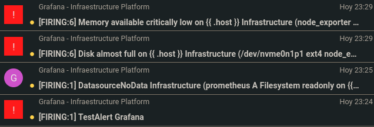

2. Verification of notifications via Telegram.

   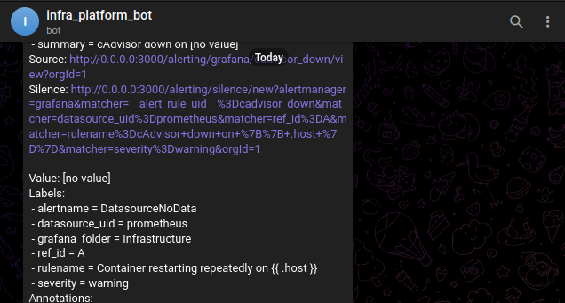

---

### Dashboard Creation

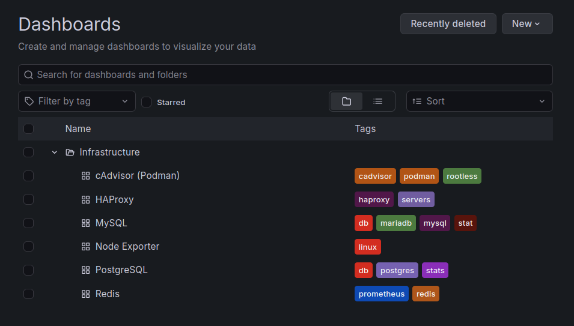

1. Import [Node Exporter Full](https://grafana.com/grafana/dashboards/1860-node-exporter-full/) `ID 1860` for _Node Exporter_.

   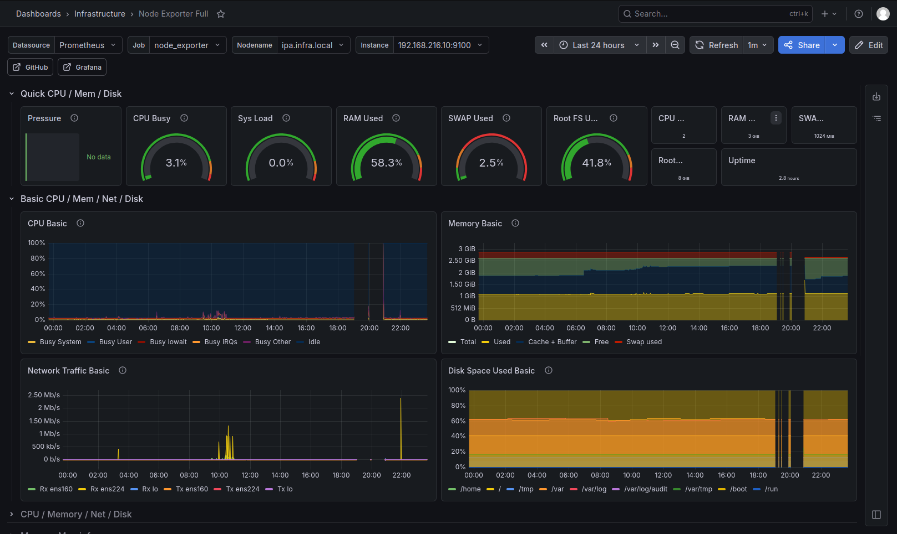

2. Import [HAProxy](https://grafana.com/grafana/dashboards/12693-haproxy/) `ID 12693` for _HAProxy_.

   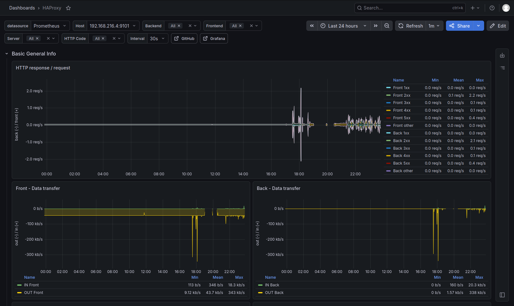

3. Import [Redis](https://grafana.com/grafana/dashboards/11835-redis-dashboard-for-prometheus-redis-exporter-helm-stable-redis-ha/) `ID 11835` for _Redis_.

   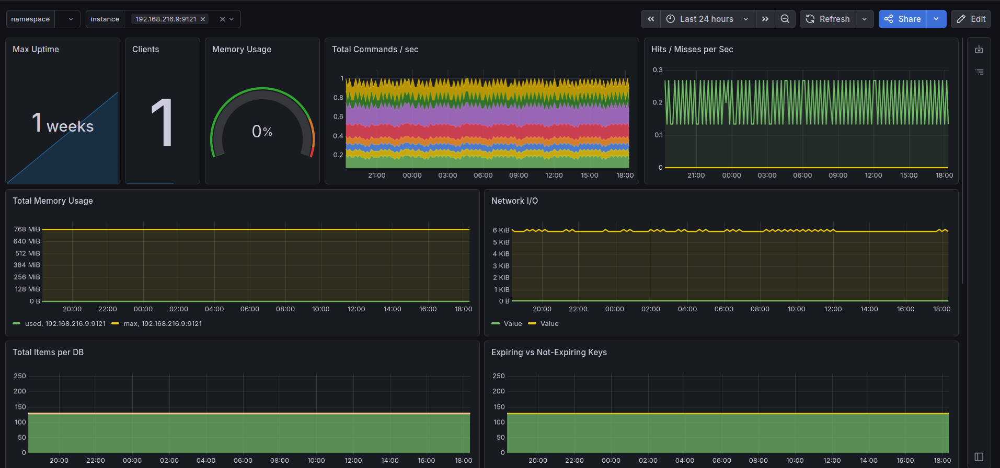

4. Import cAdvisor for _Podman Containers_.

   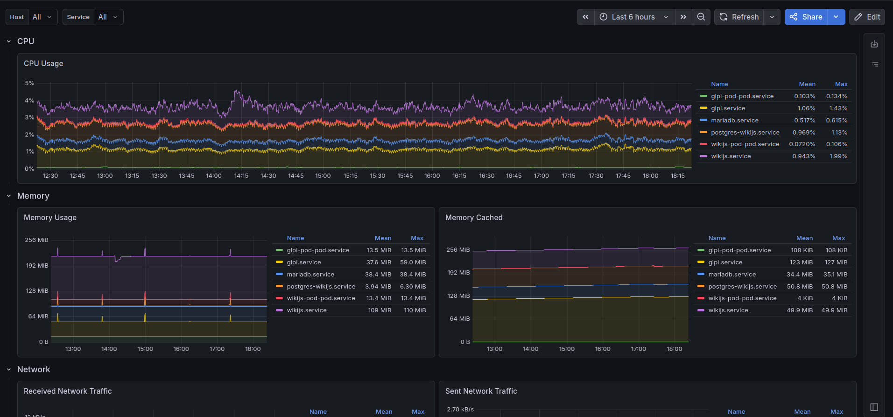

5. Import [PostgreSQL](https://grafana.com/grafana/dashboards/9628-postgresql-database/) `ID 9628` for _PostgresSQL_ from the containers on the _pods_ VM.

   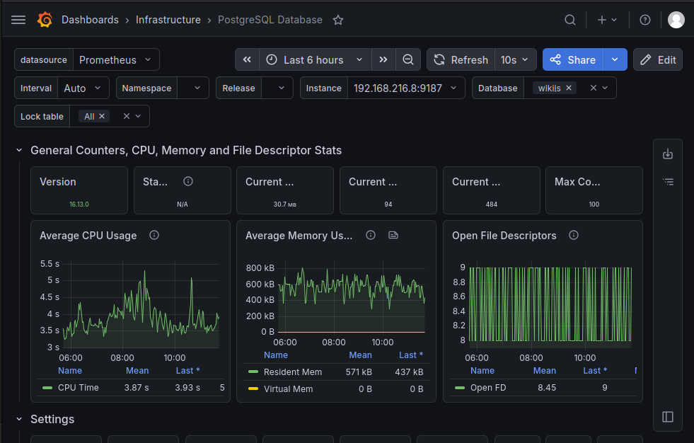

6. Import [MySQL](https://grafana.com/grafana/dashboards/14031-mysql-dashboard/) `ID 14031` for _MariaDB_.

   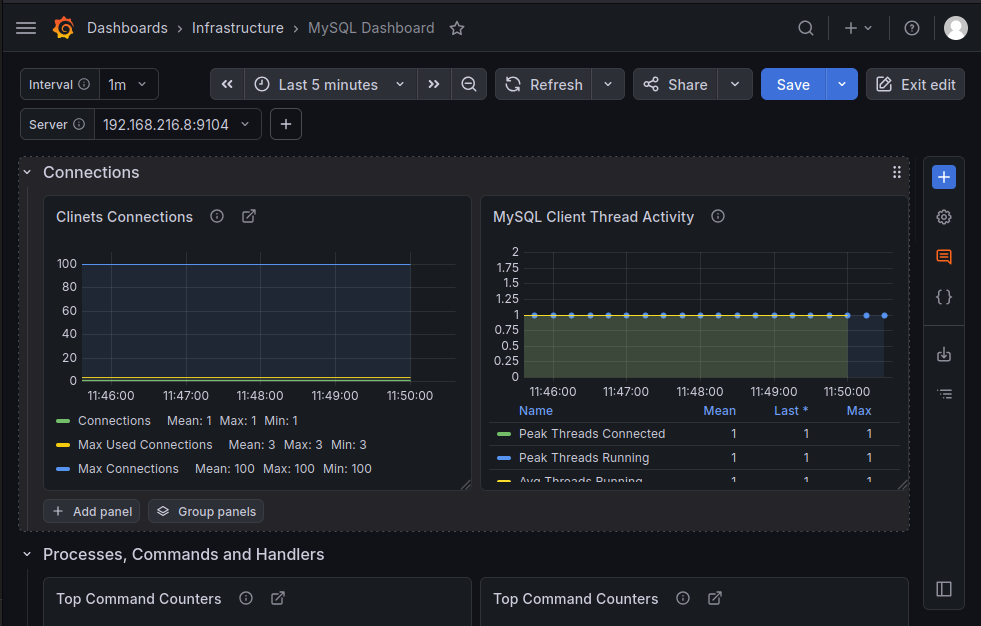

---
